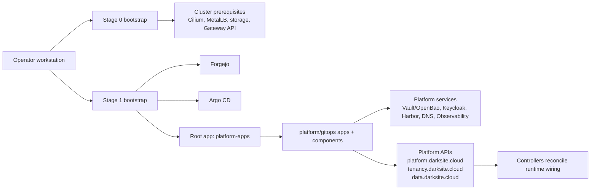

# DeployKube

DeployKube is a GitOps-first Kubernetes platform workspace aimed at the "private cloud where public cloud is not possible" problem: regulated, offline-friendly, operator-owned infrastructure with strong defaults, explicit contracts, and evidence-backed change management.

## Public Mirror Notice

This repository is a sanitized public mirror of a private working platform repo.

- It shows the platform architecture, GitOps operating model, controller code, validation discipline, and AI-assisted engineering workflow.
- It is not presented as a directly runnable deployment source.
- Some environment-specific inputs, secrets, operational details, and evidence were removed or replaced with placeholders.
- The `docs/evidence/` directory keeps a sanitized subset of genuine evidence notes from the private working repo.

The repo covers both sides of the platform:

- bootstrap automation for local development on macOS + OrbStack + kind and prod-like deployment on Proxmox + Talos
- the GitOps source of truth under `platform/gitops/` that Argo CD reconciles after bootstrap
- platform-owned APIs and controllers for deployment config, multitenancy, DNS, ingress, certificates, and internal data services

## What This Repo Shows

This is not a collection of random manifests. The interesting part is the operating model:

- Bootstrap is intentionally narrow: Stage 0 and Stage 1 only prepare the cluster and seed Forgejo + Argo CD.
- Steady-state changes ship through GitOps, not ad hoc `kubectl apply`.
- Secrets, identity, PKI, DNS, ingress, observability, and backups are treated as platform concerns with explicit contracts.
- The repo includes platform-owned Kubernetes APIs (`*.darksite.cloud`) and controllers instead of relying only on static YAML sprawl.
- Docs, issue trackers, and dated evidence notes are part of the normal change flow.

## Architecture At A Glance

## What This Repo Demonstrates

- GitOps platform delivery with Argo CD, Kustomize, and Helm
- Kubernetes platform engineering on Talos, Proxmox, kind, and OrbStack
- Service mesh, ingress, networking, and policy enforcement with Istio, Cilium, Gateway API, MetalLB, and Kyverno
- Secrets, PKI, and identity integration with OpenBao/Vault, External Secrets Operator, cert-manager, Step CA, and Keycloak
- Data and platform services including CloudNativePG/PostgreSQL, Valkey, Harbor, PowerDNS, and Garage
- Observability and security scanning with Grafana, Loki, Tempo, Mimir, Alloy, and Trivy
- Controller-based platform automation in Go using controller-runtime and Kubebuilder-style APIs
- AI-assisted engineering workflows with scoped component-assessment prompts, deterministic tracker promotion, and explicit learning/error loops

## Engineering Workflow

The repo exposes how engineering work is organized, not just the final manifests:

- `docs/ai/prompt-templates/component-assessment/` defines scoped prompts used to assess components consistently.
- `scripts/dev/component-assessment-*.sh` turns those prompts into per-component workpacks, Codex runs, and promoted tracker updates.
- `docs/component-issues/*.md` acts as the canonical backlog per component, including machine-readable findings blocks.
- `scripts/dev/self-improvement-*.sh` wraps error detection and learning capture so failures feed back into the workflow.
- `docs/evidence/` keeps a sanitized subset of dated implementation evidence from the private working repo.

## Start Here

If you want the fastest path through the repo rather than trying to operate it end to end, start here:

1. [Architecture overview](docs/design/architecture-overview.md) for the control-plane and reconciliation model.
2. [GitOps operating model](docs/design/gitops-operating-model.md) for repo boundaries and the deployment workflow.
3. [Target stack](target-stack.md) for the implemented platform baseline and component inventory.
4. [Bootstrap entrypoints](scripts/README.md) for the operator-facing surface.
5. [Evidence index](docs/evidence/2026-04-08-public-mirror-curated-evidence-index.md) for a sanitized subset of real implementation notes.
6. Representative components:
   - [Platform APIs and controller](platform/gitops/components/platform/apis/data/data.darksite.cloud/controller/README.md)
   - [Tenant provisioner](platform/gitops/components/platform/tenant-provisioner/README.md)
   - [Vault/OpenBao](platform/gitops/components/secrets/vault/README.md)
   - [Keycloak](platform/gitops/components/platform/keycloak/README.md)
   - [Observability](platform/gitops/components/platform/observability/README.md)

## Repo Layout

- `bootstrap/` host-side bootstrap inputs for kind/OrbStack and Proxmox/Talos
- `scripts/` operator entrypoints
- `shared/scripts/` Stage 0/Stage 1 implementations and helpers
- `platform/gitops/apps/` Argo CD applications and environment bundles
- `platform/gitops/components/` platform components, overlays, smoke tests, and READMEs
- `platform/gitops/deployments/` deployment-specific config contracts
- `tools/tenant-provisioner/` platform-owned controllers and API types
- `docs/design/`, `docs/guides/`, `docs/runbooks/`, `docs/toils/`, `docs/evidence/` design intent, operational docs, and evidence trail

## Local And Prod-Like Targets

- Dev: macOS + OrbStack + kind
- Prod-like: Proxmox + Talos

Bootstrap guidance:

- [Bootstrap a new cluster](docs/guides/bootstrap-new-cluster.md)
- [Bootstrap scripts](scripts/README.md)
- [Proxmox/Talos inputs](bootstrap/proxmox-talos/README.md)

## Long-Term Direction

DeployKube is evolving toward a modular private-cloud platform with:

- KRM-native platform APIs
- multitenant isolation with explicit access and policy contracts
- offline-friendly distribution and bootstrap
- marketplace-style deployment packages
- a UI that authors GitOps changes rather than bypassing them

Roadmap and idea notes:

- [Cloud productization roadmap](docs/design/cloud-productization-roadmap.md)
- [Ideas](docs/ideas/README.md)

## License

DeployKube is licensed under Apache-2.0. See `LICENSE` and `THIRD_PARTY_NOTICES.md`.
