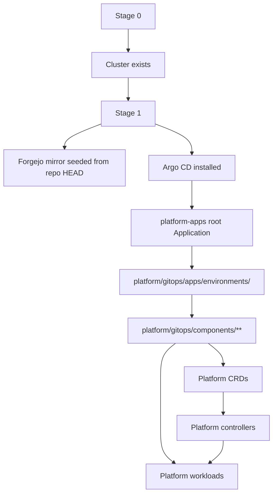

# Architecture Overview

This document is the quickest technical orientation for understanding DeployKube.

It is intentionally narrower than the full operating model: the goal is to explain what the platform is, where the important logic lives, and which repo slices are most representative of the engineering work.

## Tracking

- Canonical tracker: `docs/component-issues/gitops-operating-model.md`

## One-sentence summary

DeployKube is a GitOps-first Kubernetes platform where bootstrap only brings up the cluster and the GitOps control plane; after that, Argo CD reconciles the platform from `platform/gitops/`, while platform-owned controllers turn deployment and tenant intent into concrete runtime wiring.

## Control-plane model

The important boundary is:

- Stage 0 and Stage 1 are bootstrap only.
- Everything after bootstrap is expected to converge through GitOps.
- The Forgejo mirror is what Argo CD reads.

See also: `docs/design/gitops-operating-model.md`.

## Main engineering themes

### 1. GitOps as the runtime contract

The repo is structured so that desired state lives under `platform/gitops/`, and Argo CD owns reconciliation after bootstrap. That keeps "what the platform should be" separate from one-off workstation actions.

Representative paths:

- `platform/gitops/apps/`
- `platform/gitops/components/`
- `shared/scripts/bootstrap-*-stage1.sh`
- `shared/scripts/forgejo-seed-repo.sh`

### 2. Platform-owned APIs instead of only static YAML

DeployKube is moving toward a KRM-native platform API surface under `*.darksite.cloud`.

Representative API groups:

- `platform.darksite.cloud`
- `tenancy.darksite.cloud`
- `data.darksite.cloud`
- `dns.darksite.cloud`

Representative paths:

- `platform/gitops/components/platform/deployment-config-crd/`
- `platform/gitops/components/platform/apis/data/data.darksite.cloud/`
- `docs/apis/`
- `tools/tenant-provisioner/internal/api/`

### 3. Controllers that turn intent into concrete platform wiring

Some cross-cutting outputs are controller-owned rather than repo-rendered overlays. This keeps deployment-specific wiring inside reconcilers instead of generating YAML in flight.

Representative controller responsibilities:

- deployment config snapshots
- DNS wiring
- ingress-adjacent hostnames
- platform ingress certificates
- tenant egress proxy
- public and tenant gateways
- platform Postgres instances

Representative paths:

- `tools/tenant-provisioner/internal/controllers/`
- `platform/gitops/components/platform/tenant-provisioner/README.md`
- `scripts/README.md`

### 4. Full platform concerns, not just app deployment

The repo includes the operational substrate needed for a serious internal platform:

- secrets and PKI
- identity and access
- DNS and ingress
- storage and backups
- observability and validation
- policy enforcement and admission controls

Representative components:

- `platform/gitops/components/secrets/vault/`
- `platform/gitops/components/platform/keycloak/`
- `platform/gitops/components/dns/powerdns/`
- `platform/gitops/components/platform/observability/`
- `platform/gitops/components/shared/policy-kyverno/`

## Runtime flow

### Bootstrap

- Stage 0 creates or prepares the cluster and only the prerequisites needed for GitOps bootstrap.
- Stage 1 installs Forgejo and Argo CD, seeds the mirror, and applies the root app.

### Steady-state reconciliation

- Argo CD syncs the platform from `platform/gitops/`.
- Platform-owned controllers reconcile intent that should not be rendered by ad hoc scripts.
- Validation jobs and smoke tests provide runtime assurance.

## Fast path

If you only have 15 to 20 minutes, read these in order:

1. `README.md`
2. `target-stack.md`
3. `docs/design/gitops-operating-model.md`
4. `scripts/README.md`
5. `platform/gitops/components/platform/tenant-provisioner/README.md`
6. `tools/tenant-provisioner/internal/controllers/`
7. one or two representative components such as Vault, Keycloak, or Observability

## Public mirror note

If this repo is published as a sanitized public mirror, the most valuable material to keep visible is:

- the GitOps layout
- the bootstrap boundary
- the platform API and controller code
- representative components and their docs
- the validation and evidence discipline

Sensitive deployment identifiers, domains, IPs, and environment-specific custody details should be removed or replaced with examples.
