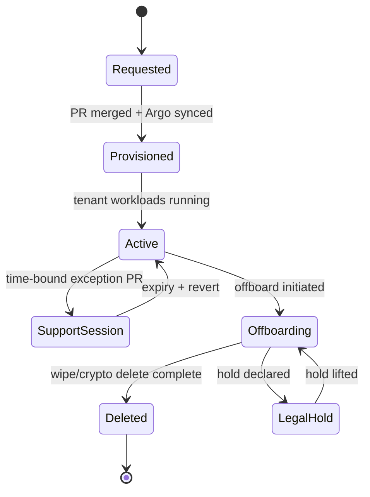

# Design: Multitenancy Lifecycle and Data Deletion (Onboarding/Offboarding + Support Sessions)

Last updated: 2026-01-06  
Status: **Design (Phase 0: foundations exist; Phase 1+: automation planned)**

This document defines DeployKube’s **tenant lifecycle** (onboarding → operations → offboarding) with an explicit, auditable definition of:
- what “tenant data” is,
- where it lives (Kubernetes, PVCs, S3, backups, Vault, observability),
- what “deletion” means (logical disable vs physical wipe vs cryptographic deletion),
- and how operators prove actions via **evidence** (`docs/evidence/**`).

This is deliberately compatible with:
- GitOps operating model: `docs/design/gitops-operating-model.md`
- Access contract + breakglass posture: `docs/design/cluster-access-contract.md`
- Policy engine + tenant baseline constraints: `docs/design/policy-engine-and-baseline-constraints.md`
- Multitenancy model (Org/Project/VPC): `docs/design/multitenancy.md`
- Multitenancy storage model: `docs/design/multitenancy-storage.md`
- DR/backups contract: `docs/design/disaster-recovery-and-backups.md`

## Tracking

- Canonical tracker: `docs/component-issues/multitenancy-lifecycle-and-data-deletion.md`

---

## Scope / ground truth

- Repo-grounded: this doc describes the contract we will implement under `platform/gitops/**` and the operational evidence loop we will use.
- Where the repo does not yet implement automation (e.g., tenant bucket provisioning, tenant-scoped backup repos), this doc defines the **intended contract** and the **interim manual runbook**.
- This doc does not claim live cluster state.

MVP scope reminder:
- Queue #11 implements **Tier S (shared-cluster)** lifecycle/offboarding and support-session contracts.
- Tier D/H (dedicated clusters and/or hardware separation) are out of scope for the MVP, but this lifecycle contract must remain portable:
  - use stable tenant identifiers (`orgId`/`projectId`) and treat “move to dedicated” as a supported future lifecycle event, not a rename-in-place.
  - keep deletion semantics honest: Tier S may not support strict deletion SLAs; dedicated tiers can, via per-tenant backup/encryption boundaries.

---

## 1) Goals

1. **Predictable lifecycle**  
   Tenant onboarding/offboarding is a repeatable, Git-driven workflow with clear roles, states, and approvals.

2. **Deletion is a product surface**  
   “Delete tenant” has an explicit meaning across all data surfaces (PVC/S3/backups/Vault/observability), with a proof trail.

3. **Shared-cluster honesty**  
   Shared-cluster tenancy (Tier S) must not over-promise data deletion guarantees that are infeasible without per-tenant encryption boundaries.

4. **Breakglass and support are first-class**  
   Support sessions are time-bound, reversible, and evidence-backed; breakglass exists but is tightly scoped and auditable.

---

## 2) Non-goals (explicit)

- A fully self-serve tenant API (CRDs/controllers) in v1.
- Rewriting Git history to “delete” anything (Git is append-only by policy; secrets must never be committed).
- Claiming side-channel-resistant isolation for shared clusters (see `docs/design/multitenancy.md`).

---

## 3) Definitions and invariants

### 3.1 Tenancy identifiers (contract)

- `orgId` is the stable tenant identifier and is already the label contract:
  - `darksite.cloud/tenant-id=<orgId>`
  - `observability.grafana.com/tenant=<orgId>` (must match `tenant-id`)
  - enforced by VAP: `platform/gitops/components/shared/policy-kyverno/vap/vap-tenant-namespace-label-contract.yaml`
- `projectId` is a required identity label for tenant namespaces:
  - `darksite.cloud/project-id=<projectId>`
  - enforced by VAP: `platform/gitops/components/shared/policy-kyverno/vap/vap-tenant-namespace-identity-contract.yaml`

**Rule:** tenant identity labels are treated as immutable after creation; set-once immutability for `darksite.cloud/{tenant-id,project-id,vpc-id}` is admission-enforced (see `docs/design/multitenancy.md#dk-mt-label-immutability`).

### 3.2 Deployment identity vs “environment” (contract)

This repo uses two different “environment-like” concepts:

- **`deploymentId`**: the cluster profile / deployment bundle (e.g. `mac-orbstack`, `proxmox-talos`), under `platform/gitops/deployments/<deploymentId>/...`.
- **`overlayMode`**: the GitOps overlay selector **`dev|prod`** used by `PlatformApps` (`platform-apps-controller`) to pick component overlays.

In this design, any folder placeholder named `<env>` refers to **`overlayMode` (`dev|prod`)**, not `deploymentId`.

### 3.3 GitOps invariants (non-negotiable)

- Tenant lifecycle is Git-driven: **create/modify/delete** tenant artifacts via PR under `platform/gitops/**`.
- Access-plane changes (RBAC/admission/CRDs/webhooks) are GitOps-only or breakglass-with-evidence (`docs/design/cluster-access-contract.md`).
- Evidence discipline is mandatory for lifecycle events: `docs/evidence/YYYY-MM-DD-<topic>.md`.

### 3.4 “Deletion” terminology

We separate three concepts:

1. **Logical disable**: revoke access and stop writes (tenant cannot mutate state anymore).
2. **Physical wipe**: remove data bytes from primary storage backends (PVC directories, S3 objects, backup target repos).
3. **Cryptographic deletion**: destroy the encryption keys required to read stored bytes (useful when physical wipe is slow or infeasible).

**Contract principle:** offboarding completes when:
- logical disable is done,
- and either physical wipe is complete **or** cryptographic deletion is complete (depending on the tenant’s agreed retention/deletion policy).

---

## 4) Data surfaces (what must be handled)

Tenant data is not “just PVCs”. The lifecycle must enumerate where data can exist.

| Surface | Examples | Where it lives | Deletion mechanism (contract) |
|---|---|---|---|
| Kubernetes objects | Deployments, Secrets, ConfigMaps, HTTPRoutes, Jobs | etcd | Namespace/app deletion via Argo prune; verify namespace termination |
| PVC contents (primary) | databases, app state, uploaded files | NFS (`shared-rwo`) or local-path (`shared-rwo` in single-node profile) | **Requires explicit wipe** because `shared-rwo` uses `reclaimPolicy: Retain` |
| S3 objects (primary) | tenant buckets / prefixes | Garage S3 today; future RGW | Delete objects + bucket/prefix; then revoke keys |
| Backups / DR artifacts | restic repos, S3 mirrors, tiered backup sets | off-cluster NFS backup target (prod) | Per-tenant repos/prefixes enable delete; without that, rely on retention or dedicated tenancy |
| Secrets (steady-state) | app credentials, S3 creds, tokens | Vault + ESO projection (see `docs/design/multitenancy-secrets-and-vault.md`) | Delete Vault paths + ESO objects after data wipe; preserve only if legal hold/retention requires |
| Observability | logs/metrics/traces | LGTM stack (S3 + compactors) | Default: retention-based expiry; optional explicit purge (planned) |
| DNS / certs | tenant hostnames | PowerDNS, cert-manager | Remove tenant routes/DNS + let certs expire; no secrets in Git |
| GitOps source | tenant manifests | Git history | **Not deletable**; ensure no sensitive data is ever committed |

**Important:** because Git history is immutable in practice, any “tenant deletion” promise must exclude “removing all references from Git”. Tenant identifiers will remain in commit history by design; avoid encoding PII in `orgId`/`projectId`.

---

## 5) Retention policy model (recommended)

We treat retention as an explicit tenant contract, chosen at onboarding.

### 5.1 Retention modes

1. **Immediate delete** (best effort + evidence)
   - delete primary PVC/S3 data as soon as offboarding starts
   - purge tenant-scoped backups if tenant-scoped repos exist
   - destroy tenant keys (cryptographic deletion) immediately after verification

2. **Grace period** (default for low-paranoia)
   - logical disable immediately (stop writes, revoke access)
   - retain data for `N` days (operator-controlled; documented)
   - after `N` days, run physical wipe + destroy keys

3. **Legal hold**
   - freeze tenant (no access; no writes)
   - preserve data and backups under restricted operator-only access
   - deletion is explicitly suspended until hold is lifted (tracked with evidence)

### 5.2 Shared-cluster reality check

For shared clusters (Tier S), “selective deletion” from **deployment-wide backups** is not credible unless we enforce per-tenant backup boundaries:
- per-tenant restic repos (or at least per-tenant encryption keys),
- per-tenant backup target directory layout,
- and explicit backup scoping labels.

If a tenant’s contract requires “hard deletion from backups” within a strict SLA, that tenant should be treated as Tier D (dedicated cluster) unless/until the per-tenant backup plane is implemented (`docs/design/multitenancy-storage.md`).

---

## 6) Lifecycle states (single model)



State transitions are evidence-backed and have an owner/approver.

---

## 7) Runbook: Onboarding (GitOps + evidence)

This section defines the operator workflow. It is split into:
- **Phase 0 (works today)**: minimal onboarding using the existing label/policy contracts.
- **Phase 1+ (planned)**: full “cloud feel” org/project folder contract with storage/backup automation.

### 7.1 Phase 0 onboarding (today; minimal)

Preflight (before PR):
1. Choose identifiers:
   - `orgId` (stable, non-PII, short)
   - `projectId` (required for tenant namespaces)
2. Choose retention mode (Immediate / Grace / Legal hold).
3. Decide tenancy offering:
   - Tier S (shared cluster) is acceptable only if deletion requirements align with shared-cluster constraints (see §5.2).

GitOps PR (create tenant namespace(s)):
1. Add namespace manifest(s) with required tenant labels:
   - `darksite.cloud/rbac-profile=tenant`
   - `darksite.cloud/tenant-id=<orgId>`
   - `observability.grafana.com/tenant=<orgId>`
   - `darksite.cloud/project-id=<projectId>`
2. If the tenant needs additional networking beyond the baseline deny-by-default posture:
   - add explicit, narrowly-scoped exception `NetworkPolicy` objects (PR-authored; do not edit baseline-generated policies).
3. If the tenant needs tenant-facing S3 (optional primitive; planned):
   - do **not** hand-create keys/buckets ad-hoc; track it as “planned” until the provisioning job pattern exists (`docs/design/multitenancy-storage.md`).

Post-merge verification:
- Argo shows tenant-related apps/resources `Synced/Healthy`.
- Namespace exists and contains baseline-generated resources (quota, default-deny netpols, etc.).

Evidence (required):
- Create `docs/evidence/YYYY-MM-DD-tenant-<orgId>-onboarding.md` and capture:
  - Git commit SHA
  - Argo status (root `platform-apps` + any tenant app-of-apps if present)
  - `kubectl get ns <namespace> -o yaml | yq '.metadata.labels'` (or equivalent) proving label contract
  - `kubectl -n <namespace> get networkpolicy,resourcequota,limitrange`

### 7.2 Phase 1+ onboarding (planned; target)

Repo reality:
- The tenant intent surface is now scaffolded under `platform/gitops/tenants/<orgId>/...` (required `metadata.yaml` + per-project namespace intent per `overlayMode` `dev|prod`).
- Full lifecycle automation (provisioning jobs, support sessions, offboarding toils) remains planned and is tracked in `docs/component-issues/multitenancy-lifecycle-and-data-deletion.md`.

Folder contract (direction; aligned to `docs/design/multitenancy.md` and `docs/design/multitenancy-storage.md`):

```
platform/gitops/tenants/<orgId>/
  metadata.yaml
  README.md
  projects/<projectId>/namespaces/<overlayMode>/<namespace>.yaml
  storage/                      # tenant buckets + credentials (optional)
  backup/                       # backup scope + retention overrides (future)
  support-sessions/             # time-bound access exceptions (see §9)
```

`metadata.yaml` is the canonical place to record the **tenant lifecycle contract** (reviewable, machine-checkable, non-PII):

```yaml
orgId: <orgId>
tier: <S|D>
retention:
  mode: <immediate|grace|legal-hold>
  gracePeriodDays: <N>   # required iff mode=grace
deletion:
  deleteFromBackups: <retention-only|tenant-scoped|strict-sla>
```

Automation (planned):
- Platform-owned Jobs provision:
  - tenant S3 bucket(s) and keys (Garage today; RGW later),
  - Vault paths for tenant credentials,
  - ESO `ExternalSecret` objects in tenant namespaces (tenants must not have RBAC to create these).

Evidence (same as Phase 0, plus):
- S3 smoke (write/read/list limited to tenant bucket only)
- proof that tenant cannot list platform buckets

---

## 8) Runbook: Offboarding (data deletion + evidence)

Offboarding is a **phased** process so we can stop writes first, then delete safely.

### 8.1 Phase A — Initiate offboarding (logical disable)

1. Create an evidence doc: `docs/evidence/YYYY-MM-DD-tenant-<orgId>-offboarding.md`.
2. Declare the offboarding intent and owner:
   - ticket/incident id
   - who requested and who approved
   - retention mode and effective dates
3. Stop writes and revoke access (as applicable):
   - remove tenant users from the relevant IdP groups (or disable the org in IdP if that is the model)
   - remove/expire any active support sessions (see §9)
   - disable ingress/routes for tenant services (remove HTTPRoutes / policies)
   - stop workloads (scale to 0 or delete apps) if “final export” or “clean wipe” requires quiescence

Evidence:
- show “access removed” (IdP change reference) and “workloads stopped” (pods scaled down/terminated).

### 8.2 Phase B — Final export / escrow (optional; retention-driven)

If the tenant contract requires a grace period or an export:
- take a final snapshot/export (workload-specific; documented in that workload’s component README)
- store export under a tenant-scoped path on the backup target (encrypted), or hand off out-of-band to the tenant under an agreed process
- document what was exported and where it is stored

Evidence:
- backup marker(s) or checksums proving the export exists
- who can access it (restricted operators only)

### 8.3 Phase C — Delete Kubernetes resources (Git-driven)

1. PR removes:
   - tenant `Application` objects (if present)
   - tenant namespace manifests
   - tenant-specific exception NetworkPolicies / HTTPRoutes / DNS sync hooks
2. Merge and let Argo prune.
3. Confirm namespaces terminate (and capture blockers if not).

Evidence:
- `kubectl get ns -l darksite.cloud/tenant-id=<orgId>` returns none
- Argo shows tenant apps pruned / removed

### 8.4 Phase D — Wipe PVC/PV data (required because reclaim is Retain)

**Repo reality:** `shared-rwo` uses `reclaimPolicy: Retain` (`platform/gitops/components/storage/shared-rwo-storageclass/storageclass-rwo.yaml`). Deleting a namespace/PVC does **not** guarantee the underlying data is deleted.

Contract (v1):
1. Enumerate PVs that belonged to tenant namespaces (before or during offboarding):
   - Record `pvName`, `claim`, `storageClass`, and backend path.
2. Wipe backend data using an operator-only path:
   - Standard profiles (NFS): delete the corresponding directory on the NFS server/export.
   - Single-node profile: wipe the corresponding directory under the local-path root on the node.
3. Delete PV objects after wipe (or keep, but then track as an explicit retained artifact).

Safety requirements:
- Only delete paths that match the expected allowlist/prefix:
  - NFS `shared-rwo` subdirs: `rwo/<namespace>-<pvc>` (from `shared-rwo` `pathPattern`).
  - local-path single-node: `${LOCAL_PATH_ROOT}/rwo/<namespace>-<pvc>` (default root: `/var/mnt/deploykube/local-path`).
- Never “rm -rf” a path you cannot prove is tenant-scoped.
- Capture evidence of the PV→path mapping and the wipe.

Evidence (minimum):
- `kubectl get pv <pv> -o yaml` excerpt proving the backend path
- host-side wipe command reference (or job logs if we implement a wipe Job)
- post-wipe: verify the path is gone and the PV is deleted (or marked retained)

### 8.5 Phase E — Delete tenant S3 data (buckets/objects/keys)

Contract (target; aligned to `docs/design/multitenancy-storage.md`):
- tenant S3 is per-tenant bucket(s) and per-tenant keys.
- platform operators retain an admin capability to delete buckets even after tenant keys are revoked.

Recommended teardown order (S3):
1. Stop tenant writes:
   - remove/disable the in-namespace Secret that holds S3 creds (or revoke keys) and wait for workloads to stop.
2. Delete objects (admin path) and delete bucket:
   - delete all objects and then delete the bucket.
3. Revoke and delete tenant S3 keys:
   - remove keys from the S3 provider and delete Vault paths.
4. Confirm backup mirror convergence (if enabled):
   - for mirror-by-sync, deletions should propagate; otherwise, explicitly wipe mirror paths on the backup target.

Evidence:
- before/after bucket listing (empty or not found)
- proof that tenant key no longer works (expected auth failure)

### 8.6 Phase F — Delete tenant backup artifacts (PVC backups + S3 mirrors)

**Target contract:** tenant backups are tenant-scoped by construction:
- per-tenant restic repos (or per-tenant encryption keys), and
- per-tenant backup target layout (`/backup/<deploymentId>/tenants/<orgId>/...`). (`docs/design/multitenancy-storage.md`)

Deletion options:
- **Physical delete**: delete the tenant subtree on the backup target.
- **Cryptographic delete**: destroy the tenant backup encryption key(s) so data is unreadable even if bytes persist.

Shared-cluster warning:
- If backups are not tenant-scoped yet, treat “deleting tenant data from backups” as **not implementable** without collateral damage; rely on retention or use dedicated tenancy for strict requirements (§5.2).

Evidence:
- directory listing before/after on backup target (or job logs)
- key destruction proof (Vault deletion record, rotation evidence)

### 8.7 Phase G — Vault/identity teardown (keys, secrets, groups)

After data surfaces are deleted (or cryptographically deleted), remove the access scaffolding:
- Vault paths for tenant apps and tenant S3 creds (and any per-tenant backup keys)
- Keycloak groups for tenant personas (admins/developers/viewers/support)
- Argo AppProjects / RBAC bindings that referenced the tenant
- Forgejo org/teams/repos if the tenant is being fully removed

Evidence:
- list of deleted Vault paths (names only; no secrets)
- list of removed IdP groups (or org disable record)

---

## 9) Support sessions (“breakglass hooks” without breaking GitOps)

Support sessions are the preferred mechanism for “temporary access for troubleshooting” without turning breakglass into day-to-day ops.

### 9.1 Principles

- Git-authored and reviewed (PR), like all access changes.
- Time-bound and **enforced**, not just documented.
- Narrow scope: org/project/namespace(s) only; least-privilege roles.
- Evidence-backed: every session has an evidence entry and a clear revert.

### 9.2 Support session object model (planned)

We do not require a new CRD in v1. A “support session” is a Git folder with:
- a metadata file (owner, expiry, reason, approvers, evidence ref),
- and a Kustomize overlay that applies the minimal RBAC/policy exceptions.

Suggested path:

```
platform/gitops/tenants/<orgId>/support-sessions/<sessionId>/
  metadata.yaml
  kustomization.yaml
  rbac/rolebinding-support.yaml
  netpol/allow-debug-egress.yaml           # only if needed
  ingress/temporary-httproute.yaml         # only if needed
```

### 9.3 TTL enforcement (required before we productize)

Enforcement must exist in two places:

1. **Pre-merge (CI) gate**: reject support sessions that are expired or exceed max TTL.
2. **Git-driven cleanup + drift detection**:
   - **Cleanup must change Git**. If expired session resources are deleted only in-cluster, Argo CD will eventually re-apply them from Git.
   - Recommended v1: a scheduled Forgejo Action/CI job opens (or auto-merges) a PR that removes expired `support-sessions/<sessionId>/` folders; Argo then prunes.
   - Optional: an in-cluster CronJob/controller **alerts** if any expired support session is still applied (defense in depth).

Evidence:
- support session evidence includes expiry timestamp and the removal commit.

### 9.4 Support session levels (recommended)

Define bounded “levels” so we don’t invent custom privileges each time:
- **L1 Read-only triage**: read workloads/events/logs (no exec, no port-forward).
- **L2 Debug**: includes `pods/exec`, `pods/portforward` in tenant namespaces.
- **L3 Data export**: controlled, audited access to tenant S3 bucket or backup export (rare; requires security approval).

---

## 10) Breakglass integration (when GitOps cannot proceed)

Breakglass exists to restore the normal workflow (OIDC + GitOps + guardrails), not to operate normally.

Reference: private emergency access procedure intentionally omitted from this public mirror.

Breakglass usage must:
- start an evidence entry immediately,
- be scoped to the minimum fix,
- and be followed by a GitOps commit that restores the desired state and removes any temporary bindings.

---

## 11) Evidence templates (copy/paste)

### 11.1 Onboarding evidence skeleton

- Tenant: `<orgId>` / `<projectId>` (if applicable)
- Change: onboarding
- Git commit: `<sha>`
- Approvals: `<reviewers>`
- Argo:
  - `kubectl -n argocd get application platform-apps -o jsonpath='{.status.sync.status} {.status.health.status}{"\n"}'`
- Namespace labels:
  - `kubectl get ns <namespace> -o json | jq '.metadata.labels | with_entries(select(.key|test(\"darksite.cloud/|observability.grafana.com/\")))'`
- Baseline resources:
  - `kubectl -n <namespace> get networkpolicy,resourcequota,limitrange`

### 11.2 Offboarding evidence skeleton

- Tenant: `<orgId>`
- Change: offboarding
- Ticket/incident: `<id>`
- Retention mode: `<Immediate|Grace|LegalHold>` (with dates)
- Git commits: `<sha(s)>`
- Argo prune confirmation:
  - `kubectl -n argocd get application platform-apps -o jsonpath='{.status.sync.status} {.status.health.status}{"\n"}'`
- Namespace deletion confirmation:
  - `kubectl get ns -l darksite.cloud/tenant-id=<orgId>`
- PVC/PV wipe inventory:
  - list of PVs and backend paths (captured before wipe)
- S3 deletion confirmation:
  - bucket listing before/after + expected auth failure for tenant key
- Backup deletion confirmation:
  - tenant subtree removed (or key destroyed) + marker evidence
- Vault/IdP cleanup confirmation:
  - list of removed Vault paths and IdP groups (names only)

---

## 12) Decisions (recommended defaults)

- **`<env>` placeholder meaning**: `<env>` means `overlayMode` (`dev|prod`), not `deploymentId` (`mac-orbstack`, `proxmox-talos`, …).
- **Tenant lifecycle contract in Git**: `platform/gitops/tenants/<orgId>/metadata.yaml` is required and records tier + retention + backup-deletion semantics.
- **Tenant “status surface” (no new CRD)**: model tenant onboarding/offboarding via Argo CD `Application` objects (one per tenant project recommended), labelled with `darksite.cloud/tenant-id=<orgId>` for kubectl queries.
- **Support sessions TTL enforcement**: enforce expiry at review time (CI gate) and remove expired sessions via a scheduled Git cleanup PR; in-cluster loop is alert-only unless Git is also updated.
- **PV/PVC wipe safety**: standardize wipe scope on the `rwo/<namespace>-<pvc>` directory contract and require allowlist/prefix validation + `--dry-run` before destructive wipes.
- **Tenant-facing S3**: per-tenant buckets + per-tenant keys; revoke keys and delete buckets via platform-owned automation; never hand-create ad-hoc.
- **Backups “delete tenant” semantics**:
  - Tier S: only claim “delete from backups” once backups are tenant-scoped (per-tenant repo/key + `/backup/<deploymentId>/tenants/<orgId>/...` layout).
  - Strict deletion SLA: require Tier D unless/until tenant-scoped backup boundaries are implemented and budgeted.
- **Restic granularity (default)**: one restic repo per tenant org per cluster by default; split per project only if “project is a hard delete boundary” becomes a requirement.
