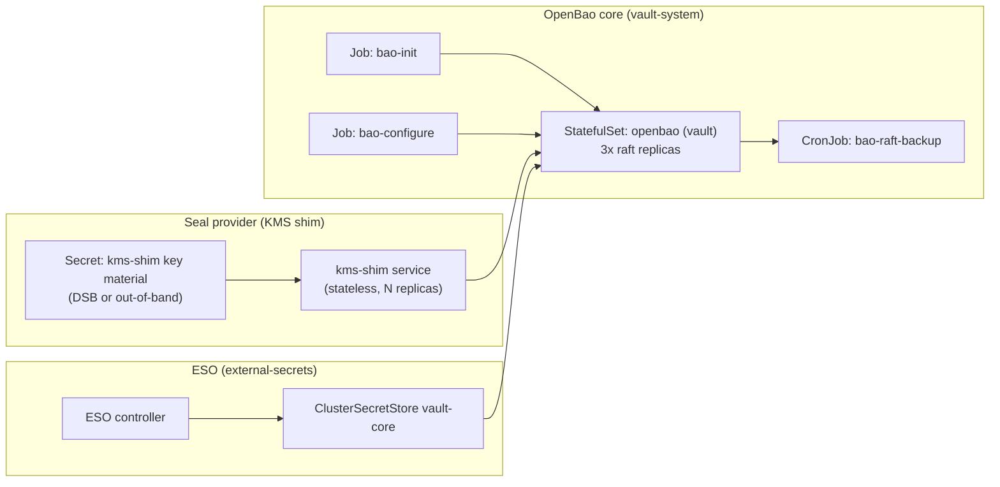

# Design: OpenBao Secret Plane + KMS Shim (Seal Provider)

Last updated: 2026-01-31  
Status: Implemented (new clusters)

## Tracking

- Canonical tracker: `docs/component-issues/vault.md`

Related trackers:
- `docs/component-issues/external-secrets.md`

Idea precursor (promoted):
- `docs/ideas/2026-01-08-vault-secret-plane-rearchitecture.md`

## Purpose

Refactor DeployKube’s secrets plane to:

1) Replace HashiCorp Vault (BSL) with **OpenBao** (license-safe direction).
2) Eliminate the fragile “Vault core depends on a full second Vault cluster” coupling by replacing `vault-transit` with a **KMS shim (seal provider)**.
3) Make the “root of trust” explicit and **deployment-selectable** (in-cluster vs external), while keeping a clean future path to **PKCS#11-backed hardware** (out of scope for v1).
4) Ensure a safe “new cluster” transition story that does **not lose the Minecraft world**, by treating the Minecraft restore path as a first-class migration constraint.

## Scope / ground truth

Repo-grounded scope:
- GitOps manifests: `platform/gitops/**`
- Bootstrap/scripts: `shared/scripts/**`, `scripts/**`, `bootstrap/**`
- Docs: `docs/**`, `target-stack.md`

Lifecycle scope for v1:
- **New clusters only**. In-place migration of an existing running cluster is out of scope for this design (tracked as future work).

## Problem statement

Current repo reality (Jan 2026; implemented for new clusters):
- `vault-system`: OpenBao core Raft HA (3 replicas) using a transit-compatible seal stanza pointing at the **KMS shim** for auto-unseal.
- `vault-transit`: retired (removed in 2026-01-31 retirement).
- ESO projects secrets from Vault into Kubernetes.
- DSB provides bootstrap secrets via SOPS to `secrets-bootstrap` (kms-shim key + token + vault init).

Pain points:
- Bootstrap/cold-boot coupling: transit must be healthy first; token readiness and ordering issues can wedge the platform early.
- Operational toil: wipes/rebuilds involve multiple stateful components and secrets-of-record drift.
- Licensing: HashiCorp Vault is BSL; we should avoid depending on it long-term.

## Goals

Reliability / operability:
- Cold boot of the cluster converges deterministically (no “manual nudge” loops).
- Remove the second Raft dependency for auto-unseal (retire `vault-transit`).
- Day-2 operations (restart, upgrade) are explicit and testable.

DR / backups:
- Restore is possible without “hidden dependencies” (especially around root-of-trust).
- Tier-0 backup and restore story remains coherent with `docs/design/disaster-recovery-and-backups.md`.

Security / flexibility:
- Support multiple root-of-trust postures selected per deployment:
  - **C3c (in-cluster, low assurance)**: acceptable for customers who don’t require hardware custody.
  - **C3a (external endpoint)**: decouple from the Kubernetes failure domain; still software-backed in v1.
- Keep an explicit future path for **PKCS#11 hardware-backed** seal provider backends (out of scope v1).

Compatibility:
- Preserve Vault KV path conventions used across the repo (e.g., `secret/apps/minecraft-monifactory/backup`).
- Keep ESO as the default projection mechanism.

Minecraft safety:
- “No world loss” is treated as an acceptance criterion for the transition (see “Migration safety: Minecraft”).

## Non-goals

- Implementing a PKCS#11 hardware backend (YubiHSM-class / enterprise HSM). Tracked but out of scope v1.
- Replacing ESO (Vault/ESO remains the steady-state secret distribution pattern).
- Completing tenancy-scoped stores/policies (must remain compatible with `docs/design/multitenancy-secrets-and-vault.md`, but not solved here).
- Providing a full in-place migration tool from a running HashiVault cluster to OpenBao.

## Proposed architecture

### High-level

We split the secrets plane into:

1) **Seal provider (KMS shim)**: a small service that provides encrypt/decrypt operations used only for auto-unseal.
2) **OpenBao core**: the operational secrets store (Raft HA) that uses the seal provider for auto-unseal.
3) **ESO**: projections from OpenBao → Kubernetes.



Key design intent:
- OpenBao stays the **system-of-record for secret values**.
- The seal provider is **not** a second Vault/OpenBao cluster; it is a narrow “envelope encryption” service.
- The root-of-trust posture (in-cluster vs external) is explicitly chosen per deployment.

### Component-level details (v1 target)

#### 1) Seal provider (KMS shim)

GitOps component (proposed):
- `platform/gitops/components/secrets/kms-shim/`

Runtime shape:
- A stateless `Deployment` with `N>=2` replicas in its own namespace (e.g., `vault-seal-system`).
- No PVCs.
- A single logical key name (e.g., `autounseal`) and simple auth (pre-shared token).

Inputs:
- `Secret/<namespace>/<name>` containing:
  - a seal key (software custody in v1), and
  - an auth token that OpenBao will present.

Outputs:
- An HTTP API reachable by OpenBao pods.

Desired reliability properties:
- Can restart independently; OpenBao only needs it to be reachable (no state to recover other than its key material).
- Can be scaled without coordination.

Future (out of scope v1):
- Swap the internal “software key” for PKCS#11-backed keys without changing OpenBao config.

#### 2) OpenBao core (“Vault core replacement”)

GitOps component (proposed):
- Keep the existing layout and compatibility names to reduce blast radius:
  - `platform/gitops/components/secrets/vault/` becomes “OpenBao core” implementation-wise, but retains:
    - namespace `vault-system`,
    - service name `vault`,
    - KV mount/path conventions.

Rationale:
- ESO and many consumers currently reference `vault.vault-system.svc:8200` and `secret/<...>` paths.
- Renaming everything adds churn and increases risk without functional benefit.

Runtime shape:
- 3-replica Raft cluster (StatefulSet, `shared-rwo` PVCs).
- Auto-unseal via the seal provider (kms-shim).
- Existing bootstrap/config Jobs remain, but are updated to use OpenBao CLI/API.

#### 3) ESO

ESO remains the projection mechanism:
- `ClusterSecretStore/vault-core` continues to exist.
- The store’s server URL remains stable (still `http://vault.vault-system.svc:8200` in v1; TLS is a separate hardening item).

### Seal provider API choice (v1)

To keep v1 implementable and compatible with Vault/OpenBao expectations, the KMS shim will emulate a seal backend that OpenBao supports **without modifying OpenBao**.

Design constraint:
- We must pick a seal backend interface that (a) OpenBao supports, and (b) is realistically implementable as a shim.

**Decision (v1 design target):** implement the shim as a minimal “transit-like” API compatible with the existing `seal "transit"` configuration pattern, so OpenBao can auto-unseal via `seal "transit"` pointing at the shim.

Notes:
- Exact endpoint compatibility requirements are an implementation detail, but the intent is:
  - encrypt/decrypt operations for one key name (e.g., `autounseal`),
  - simple token authentication (pre-shared token as bootstrap material),
  - no dependency on OpenBao/Vault to operate.
- Future: add PKCS#11-backed encryption keys behind the shim without changing OpenBao config (shim internals change only).

### Root-of-trust modes

The design supports two v1 modes, plus one future mode:

- **Mode C3c: in-cluster seal provider (“low assurance”)**
  - The shim runs in Kubernetes.
  - Key material and auth token are delivered via DSB (SOPS ciphertext → `secrets-bootstrap` → Kubernetes Secret).
  - This is operationally convenient but explicitly “low assurance” because cluster admins effectively control the root-of-trust.

- **Mode C3a: external seal provider endpoint (“separate failure domain”)**
  - OpenBao talks to an endpoint outside the Kubernetes cluster.
  - In v1, the backend is still software custody (no hardware), but the blast radius is reduced vs in-cluster.
  - The endpoint and trust (TLS) are deployment concerns; v1 documents how to wire, but provisioning the external service is treated as a deployment-specific ops task.

- **Mode C3a+PKCS#11 (future; out of scope v1)**
  - The external shim uses a PKCS#11-backed key boundary (YubiHSM-class device or enterprise HSM).
  - Requires explicit custody/runbooks and device lifecycle management.

## DeploymentConfig contract extension (proposal)

We should make the root-of-trust choice explicit in the per-deployment config:
- `platform/gitops/deployments/<deploymentId>/config.yaml`

This remains **non-secret**. It only selects posture and wiring; keys/tokens are still in DSB (or out-of-band for external deployments).

Illustrative shape (draft; exact schema to be finalized during implementation):

```yaml
spec:
  secrets:
    rootOfTrust:
      mode: inCluster   # inCluster | external
      provider: kmsShim
      assurance: low    # low | external-soft | external-pkcs11 (future)
      acknowledgeLowAssurance: true  # required when assurance=low AND environmentId=prod
      external:
        # Required when provider=kmsShim AND mode=external.
        address: https://kms-shim.example.com:8200
```

**What “opt-in low assurance” means:**
- For `environmentId: prod`, we should *not* silently default to in-cluster custody.
- If a customer wants in-cluster root-of-trust in prod, they must explicitly set:
  - `assurance: low`, and
  - `acknowledgeLowAssurance: true`
so the posture is an intentional, reviewable choice.

## Bootstrap material changes (DSB)

Previously, the deployment secrets bundle included transit-specific secrets (`vault-transit-init`, `vault-transit-token`). These were removed when `vault-transit` was retired (2026-01-31).

For this design we expect to:
- Remove the transit secrets for new clusters.
- Introduce kms-shim bootstrap secrets (names illustrative):
  - `deployments/<deploymentId>/secrets/kms-shim-key.secret.sops.yaml`
  - `deployments/<deploymentId>/secrets/kms-shim-token.secret.sops.yaml`

The existing `vault-init.secret.sops.yaml` continues to exist (root token + recovery key material for OpenBao core).

Custody note:
- In-cluster (low assurance) mode: kms-shim key/token may live in DSB (SOPS ciphertext in Git, encrypted to the deployment Age key).
- External mode: kms-shim key custody can be out-of-band (recommended), but we still need a reproducible way to inject the OpenBao → kms-shim auth credential (token or mTLS).

Clarification: DSB vs “hardware root of trust”

- The **DSB** is a *delivery mechanism* for bootstrap material (ciphertext in Git) and is protected by the **deployment Age private key**.
- “HSM / YubiHSM” typically applies to the **seal provider key boundary** (the key that ultimately protects OpenBao’s barrier), not to “storing the DSB in hardware”.
- In a future **PKCS#11-backed** kms-shim mode, we should *not* keep `kms-shim-key.secret.sops.yaml` at all:
  - the master key should be generated/stored inside the HSM and referenced by key ID/handle,
  - and bootstrap material should shrink to *configuration + client identity/auth* (not the master key).

Also note: if we ever want “hardware custody for DSB decryption” (i.e., avoid loading an Age private key into the cluster as `argocd/argocd-sops-age`), that is a separate design decision and would change the current `secrets-bootstrap` mechanism.

## Bootstrap and day-2 flows

### Day 0 (new cluster) bootstrap flow

1) Stage 0/1 brings up cluster + Forgejo + Argo and applies root app.
2) Deployment secrets bundle app applies ciphertext bundle (`deployment-secrets-bundle`).
3) `secrets-bootstrap` decrypts and applies required bootstrap Secrets.
4) Seal provider (kms-shim) starts first and becomes ready.
5) OpenBao core starts and can auto-unseal via the seal provider.
6) `bao-init` initializes OpenBao on first boot (or no-ops if already initialized).
7) `bao-configure` enables auth methods, creates ESO role/policies, and seeds baseline secrets.
8) ESO `ClusterSecretStore/vault-core` becomes Ready and consumers can reconcile.

### Bootstrap contract (v1; make the implicit explicit)

This section defines the “bootstrap handshake” so operators can diagnose issues quickly.

#### Preconditions (Stage 1 boundary)

Stage 1 must already have:
- installed Argo CD + Forgejo and seeded the repo, and
- created `argocd/argocd-sops-age` (Age identities file) so in-cluster Jobs can decrypt the Deployment Secrets Bundle (DSB).

This design does **not** move secrets generation into Stage 0/1. The “secret plane” still comes up via GitOps + DSB.

#### Required bootstrap inputs (DSB → secrets-bootstrap)

The DSB is published into `argocd/deploykube-deployment-secrets` (ciphertext). For the secrets plane to start, the bundle must include and `secrets-bootstrap` must apply:

| DSB file (ciphertext) | Becomes (in cluster) | Used by | Required |
|---|---|---:|:---:|
| `vault-init.secret.sops.yaml` | `Secret/vault-system/vault-init` | OpenBao bootstrap/config jobs | yes |
| `kms-shim-key.secret.sops.yaml` | `Secret/<kms-ns>/kms-shim-key` | kms-shim runtime | yes (kmsShim mode) |
| `kms-shim-token.secret.sops.yaml` | `Secret/vault-system/kms-shim-token` (or similar) | OpenBao seal stanza auth | yes (kmsShim mode) |
| `minecraft-monifactory-seed.secret.sops.yaml` | `Secret/vault-system/minecraft-monifactory-seed` | optional Minecraft CF rotation seed | optional |

Notes:
- The exact Secret names/namespaces for kms-shim are part of the implementation, but the contract should remain stable once chosen.
- `step-ca-vault-seed.secret.sops.yaml` is consumed by the Step CA seed Job directly (it decrypts the file and writes into OpenBao); it is not applied as a Kubernetes Secret by `secrets-bootstrap` today.

#### Argo ordering (proposed; enforced via sync waves)

We must ensure:
- the DSB ConfigMap exists before any decrypt/apply Jobs run, and
- kms-shim is ready before OpenBao tries to unseal.

Proposed ordering:
1) `deployment-secrets-bundle` Application (already `-10` in existing env bundles).
2) `secrets-bootstrap` (already `-6` today; remains early).
3) `secrets-kms-shim` (new; should be earlier than OpenBao core).
4) `secrets-vault-*` (OpenBao core, bootstrap, config).
5) `secrets-external-secrets-*` (ESO + ClusterSecretStore).
6) Consumers (apps, Step CA seed job, etc.).

#### “What do I run?” operator flow (new cluster)

Target operator experience for a new cluster:

1) Run Stage 0/1.
2) Populate deployment DSB secrets (ciphertext in Git) for the new deploymentId:
   - generate/refresh `vault-init.secret.sops.yaml`,
   - generate/refresh `kms-shim-key.secret.sops.yaml` + `kms-shim-token.secret.sops.yaml`,
   - commit + reseed Forgejo mirror.
3) Let Argo reconcile until:
   - OpenBao is unsealed + HA active,
   - ESO `ClusterSecretStore/vault-core` is Ready,
   - smokes pass.

Implementation note:
- This repo currently has a canonical helper for the existing Vault/transit flow: `shared/scripts/init-vault-secrets.sh`.
- v1 implementation must either refactor it or replace it with a new canonical helper that produces the **kms-shim** bootstrap secrets as well.

### Cold boot expectation

The cold-boot invariant we want:
- Seal provider comes up **independently** of OpenBao (no circular dependency).
- OpenBao can always unseal once seal provider is reachable and credentials are present.

This is the primary reason to remove `vault-transit` (a second Raft cluster with its own init/unseal lifecycle).

### Upgrades

Upgrade sequencing guideline:
1) Upgrade seal provider first (stateless, should be safe to roll).
2) Upgrade OpenBao core.
3) Upgrade `bao-configure` and smokes.

Each upgrade should be accompanied by a smoke that checks:
- OpenBao is unsealed and HA active.
- `ClusterSecretStore/vault-core` is Ready.
- A representative consumer secret can be read (e.g., `default/vault-smoke`).

## High availability expectations

OpenBao core:
- 3 replicas (Raft HA).
- Add PDB + anti-affinity (existing tracker items) to avoid a single-node drain/outage taking quorum.

Seal provider (kms-shim):
- Stateless, N replicas (>=2 recommended).
- If in-cluster: use PDB + anti-affinity and keep it out of Istio injection to reduce coupling.
- If external: run at least 2 instances and front them with a stable endpoint (VIP/LB/DNS) appropriate to the deployment.

## Disaster recovery expectations

Hard requirement: a restore must not be blocked by “lost root-of-trust”.

For v1 we explicitly require:
- A documented escrow path for the seal provider key material (even if the default is “DSB + deployment Age key”).
- Tier-0 backups for OpenBao Raft snapshots remain on the off-cluster backup target in prod (same doctrine as today).
- Restore procedure must include both:
  - rehydrating the seal provider, and
  - restoring OpenBao data.

## Backup/DR model (must stay honest)

### What we must be able to restore

For a functional restore we need:

1) OpenBao data (Raft snapshot).
2) Seal provider key boundary (or a way to recreate it) **compatible with the encrypted OpenBao barrier**.

This is why “TPM-only” is dangerous:
- If the only copy of the seal key is bound to a single TPM and that host is lost, the Raft snapshot becomes unrecoverable.

### v1 DR posture

For v1, we require that **a restore path exists without hardware**:
- In-cluster mode: seal provider key material is in DSB (SOPS ciphertext in Git) → restore is possible as long as the deployment Age key exists.
- External mode: key custody is out-of-band; the design must define an escrow procedure (e.g., stored in a password manager or split into Shamir shares).

We continue the Tier-0 practice:
- OpenBao Raft snapshot artifacts + `LATEST.json` markers on the backup target.
- S3 mirror remains the source of truth for app backups (including Minecraft restic repo).

## Migration safety: Minecraft (do not lose the world)

This design is “new clusters only”, so the safe transition is:
- prove the world is backed up,
- tear down/recreate the platform,
- restore the world from backups on the new cluster.

### Invariants to protect

Minecraft backup/restore depends on:
- The **restic repository contents** (objects in the S3 bucket) and
- The **restic password** (`RESTIC_PASSWORD`) used to encrypt the repo.

Repo reality:
- Minecraft backups are stored via restic to S3 (Garage) and the platform mirrors S3 to the off-cluster backup target. (`docs/guides/backups-and-dr.md`)
- The restic credentials and repo URL are sourced from Vault via ESO:
  - Vault path: `secret/apps/minecraft-monifactory/backup`
  - ESO: `platform/gitops/components/apps/minecraft-monifactory/base/externalsecret-backup.yaml`

### Safe transition checklist (operator runbook direction)

Before tearing down the old cluster:

1) Verify off-cluster backup freshness on prod:
   - `backup-system` smokes are green (`storage-smoke-backups-freshness`).
2) Verify Minecraft restore drill passes (non-destructive):
   - `minecraft-restore-drill` job restores `latest` into scratch.
3) Capture (out-of-band) the **restic password** for the Minecraft repo:
   - Read it from Vault (`secret/apps/minecraft-monifactory/backup`) or from the projected Kubernetes Secret (`minecraft-monifactory-backup`).
   - Store it out-of-band for the migration (do not commit it to Git).

On the new cluster:

1) Restore S3 mirror data into the new S3 backend if required (or otherwise make the old backup bucket accessible).
2) Seed `secret/apps/minecraft-monifactory/backup` in OpenBao with the preserved `RESTIC_PASSWORD` (and consistent repo settings).
3) Deploy the Minecraft app and run the restore drill before declaring success.

Important: do **not** rotate `RESTIC_PASSWORD` during the transition; rotation can happen only after:
- a successful restore on the new cluster is proven, and
- a new backup is produced and verified.

## Evidence expectations (when implemented)

When we implement this design, capture evidence for:
- A clean bootstrap of a new cluster reaching `platform-apps` Synced/Healthy with:
  - OpenBao unsealed and HA active,
  - ESO store Ready,
  - at least one consumer ExternalSecret synced.
- Minecraft: restore drill success on the new cluster from the pre-existing backup set.

## Risks and validation checklist

Key risks:
- **Seal backend compatibility risk:** the kms-shim must match what OpenBao expects from its chosen seal backend (request/response shapes, error handling, health checks).
- **“Security-critical service” risk:** a bug in the shim can brick unseal or weaken confidentiality; keep the API surface minimal and add aggressive smoke tests.
- **Restore trap risk:** if the seal provider key boundary is not recoverable, Raft snapshots become unrecoverable.

Validation checklist before implementation is considered “done”:
- OpenBao can run with Raft HA in our environment with the same operational features we rely on today:
  - KV v2 mount usage (`secret/`), Kubernetes auth (`auth/kubernetes`), JWT/OIDC auth for automation (optional), Raft snapshots.
- KMS shim:
  - supports cold boot (OpenBao unseals after a full cluster restart),
  - supports restart/upgrade of the shim without bricking OpenBao,
  - has a documented escrow story for its key material (even if that story is “DSB + deployment Age key” for low assurance).
- ESO:
  - `ClusterSecretStore/vault-core` Ready and a sample ExternalSecret sync works post-boot.
- Minecraft:
  - restore drill passes on the new cluster using the pre-existing backup set and preserved restic password.

## Implementation plan (detailed; current repo → new clusters)

This plan was written against the **Dec 2025 baseline** (Vault core + `vault-transit` + ESO + DSB) and produces a new-cluster-ready implementation of:
- OpenBao core (replacing HashiVault), and
- a KMS shim seal provider (replacing `vault-transit` for auto-unseal),
while explicitly protecting the Minecraft world restore path.

### Phase 0 — Change management (don’t brick the existing cluster)

Because Argo CD reconciles from `platform/gitops/**` on `main`, implementing this refactor “in place” on the existing prod deployment risks breaking the running cluster.

Recommended v1 workflow:
- Implement and validate on **dev** first (`mac-orbstack*`).
- For prod, treat the transition as a **new cluster** bootstrap + restore:
  - either use a new deploymentId (safest: doesn’t touch the running cluster), or
  - explicitly pause/disable prod Argo auto-sync before merging changes that would otherwise reconcile into the current cluster.

### Phase 1 — Extend DeploymentConfig contract (root-of-trust selector)

1) Extend the DeploymentConfig schema to include the `spec.secrets.rootOfTrust` selector described above.
2) Update deployment-config validation so “low assurance prod” is explicit:
   - require `acknowledgeLowAssurance: true` when `environmentId=prod` and `assurance=low`.
3) Define v1 supported values:
   - `provider: kmsShim` (transit removed; no legacy fallback)
   - `mode: inCluster | external` (external is “endpoint exists out-of-cluster”)
   - `assurance: low | external-soft` (PKCS#11 is future)
4) Make the DeploymentConfig readable to in-cluster Jobs that need to branch on it:
   - publish a stable `ConfigMap/argocd/deploykube-deployment-config` snapshot from the singleton `DeploymentConfig` CR (deployment-config-controller).

Deliverables:
- Updated `platform/gitops/deployments/<deploymentId>/config.yaml` examples.
- Updated contract docs: `docs/design/deployment-config-contract.md` (follow-up).
- Updated validator: `tests/scripts/validate-deployment-config.sh`.

### Phase 2 — Add the seal provider component (kms-shim)

1) Add a new GitOps component:
   - `platform/gitops/components/secrets/kms-shim/`
2) Define two v1 deployment modes:
   - **C3c**: in-cluster `Deployment` + `Service` (stateless; >=2 replicas).
   - **C3a (external)**: *no in-cluster Deployment*; provide only:
     - the OpenBao seal config values (endpoint + CA),
     - and an auth credential injection mechanism (token or mTLS identity).
3) Add smokes for the seal provider:
   - liveness/ready checks and an explicit “encrypt/decrypt round-trip” Job (not using OpenBao).

Deliverables:
- New Argo Applications in `platform/gitops/apps/base/` (or environment overlays) to install `kms-shim` before OpenBao.
- Component README describing:
  - API surface (minimal),
  - auth,
  - HA expectations,
  - and escrow expectations (even in low assurance mode).

### Phase 3 — DSB / secrets-bootstrap adjustments (bootstrap material reshaping)

Goal: stop requiring `vault-transit-*` bootstrap secrets for new clusters and add kms-shim bootstrap secrets.

1) Add new DSB secret files (names illustrative):
   - `platform/gitops/deployments/<deploymentId>/secrets/kms-shim-key.secret.sops.yaml`
   - `platform/gitops/deployments/<deploymentId>/secrets/kms-shim-token.secret.sops.yaml`
2) Update the deployment bundle kustomizations:
   - `platform/gitops/deployments/<deploymentId>/kustomization.yaml`
3) Update `secrets-bootstrap` to apply kms-shim bootstrap secrets and do **not** require `vault-transit`.
4) Update the bootstrap helper workflow so operators can reliably stamp required secrets for new clusters:
   - either refactor `shared/scripts/init-vault-secrets.sh` to support OpenBao+kms-shim, or
   - introduce a new canonical helper (e.g., `shared/scripts/init-openbao-secrets.sh`) and document it.

Deliverables:
- Updated `platform/gitops/components/secrets/bootstrap/scripts/bootstrap.sh`.
- Updated DSB validation to ensure required files exist for the selected provider.
- Updated DSB tooling:
  - `scripts/deployments/bundle-sync.sh` (if file list changes),
  - `tests/scripts/validate-deployment-secrets-bundle.sh`.

### Phase 4 — Replace HashiVault with OpenBao (keep stable service/path contracts)

Goal: keep compatibility names and paths stable to avoid churn:
- namespace: `vault-system`
- service name: `vault`
- KV mount and paths: `secret/...`

Steps:

1) Decide packaging:
   - either keep the existing Helm chart wrapper and swap the server image to OpenBao, or
   - replace the chart with an OpenBao-native chart while preserving service naming/labels expected by the repo.
2) Update the seal configuration:
   - point the seal stanza at the kms-shim (in-cluster service or external endpoint), and
   - inject the auth token from the bootstrap secret.
3) Update bootstrap/config Jobs to be OpenBao-compatible:
   - init job (`bao-init`) should initialize only when uninitialized,
   - configure job (`bao-configure`) should continue to provision:
     - KV v2 mount at `secret/`,
     - Kubernetes auth roles for ESO,
     - and baseline secrets seeding.
4) Keep Raft snapshot backups working:
   - keep the existing tier-0 snapshot CronJob pattern and validate artifacts are written.

Deliverables:
- Updated `platform/gitops/components/secrets/vault/**` implementation and README to reflect OpenBao.
- Updated `target-stack.md` secrets section (OpenBao versions, charts/images).

### Phase 5 — Retire `vault-transit` (completed)

`vault-transit` has been removed from:
- GitOps apps, secrets bundle, and bootstrap scripts
- backup docs/expectations (no transit tier-0 artifacts)

### Phase 6 — Smokes, guardrails, and evidence

Smokes to add (v1 minimum):
- Seal provider smoke (round-trip crypto).
- OpenBao smoke:
  - unsealed,
  - HA mode active,
  - Raft snapshot job succeeds.
- ESO smoke:
  - `ClusterSecretStore/vault-core` Ready,
  - a smoke `ExternalSecret` sync produces a Kubernetes Secret with expected key.

Evidence to capture:
- clean dev bootstrap (Stage 0/1 + GitOps convergence) showing the above smokes passing.
- one full “cold boot” rehearsal (restart nodes) showing the platform comes back without manual unseal steps.

Repo doctrine reminder:
- Any new smoke Jobs should follow `docs/design/validation-jobs-doctrine.md` and pass `./tests/scripts/validate-validation-jobs.sh`.

### Phase 7 — Prod transition runbook (protect Minecraft world)

This refactor is “new clusters only”, so the safe prod transition is: **prove backups → rebuild → restore**.

Pre-cutover (old cluster):
1) Confirm backup-plane freshness is green on prod (`storage-smoke-backups-freshness`).
2) Run the Minecraft restore drill (non-destructive) on the old cluster.
3) Export and store out-of-band:
   - `RESTIC_PASSWORD` and `RESTIC_REPOSITORY` from `secret/apps/minecraft-monifactory/backup`.
4) Confirm the S3 mirror contains the Minecraft restic repo data (it should, if it mirrors all Garage buckets).

Cutover (new cluster):
1) Bootstrap the new cluster with the new secrets plane (OpenBao + kms-shim).
2) Restore the S3 mirror set into the new S3 backend (Garage) or otherwise make the old bucket accessible.
3) Seed OpenBao with the preserved Minecraft backup config:
   - write `secret/apps/minecraft-monifactory/backup` with the preserved restic password and matching repo settings.
4) Deploy the Minecraft app and run the restore drill on the new cluster.

Post-cutover:
- Only rotate restic credentials after a restore on the new cluster is proven and new backups are green.

## Out of scope (explicit)

- PKCS#11-backed backends for the seal provider (YubiHSM-class / enterprise HSM). Track under:
  - `docs/component-issues/vault.md` (V-015).
- In-place migration from existing HashiVault clusters.

## Future direction (not in v1): Tenant-facing “cloud-like KMS”

We can offer tenants a KMS-like capability, but it should **not** be implemented by expanding the seal provider (kms-shim):
- The seal provider is a platform-critical dependency for OpenBao unseal; keep its API surface minimal.
- Mixing tenant-facing crypto workloads into the unseal path increases outage and security risk.

Recommended direction:

- Use **OpenBao’s transit secrets engine** as the tenant-facing KMS primitive:
  - per-tenant/per-project transit keys,
  - tenant-scoped policies (Keycloak groups → OpenBao policies),
  - operations like encrypt/decrypt, generate data keys, sign/verify, rotate, and key destruction (cryptographic erasure semantics).
- Optionally add a separate “KMS gateway” later if we need **API compatibility** with a specific cloud KMS (e.g., AWS KMS-style clients).

This ties directly into the tenancy secrets model and its “cryptographic deletion” future note:
- `docs/design/multitenancy-secrets-and-vault.md` (see the note about per-tenant transit keys + key destruction).
