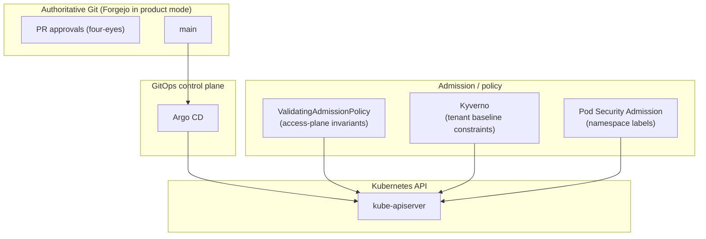

# Policy Engine + Baseline Constraints (Kyverno)

Last updated: 2026-01-16  
Status: Implemented (Phase 0/1); Planned (Phase 2+)

This document defines the DeployKube **policy engine** and the initial **baseline constraints** required by `docs/design/cloud-productization-roadmap.md` (“Policy engine + tenant baseline constraints”).

## Tracking

- Canonical tracker: `docs/component-issues/policy-kyverno.md`

Scope / ground truth:
- Repo-first: how we implement this in `platform/gitops/**` and how we validate it via Jobs/CronJobs.
- This doc does **not** claim live cluster state.

Related:
- Access plane guardrails (already in-progress): `docs/design/cluster-access-contract.md`
- Validation doctrine: `docs/design/validation-jobs-doctrine.md`
- Multitenancy contracts (tenant namespaces, baseline constraints, guardrails): `docs/design/multitenancy.md`
- Multi-tenancy / cloud vision: `docs/ideas/2025-12-25-managed-private-cloud-multitenant-hardware.md`

---

## Decision (frozen)

DeployKube adopts:

1) **Kubernetes ValidatingAdmissionPolicy (VAP)** for **tier‑0 access-plane invariants** (RBAC/admission/CRDs protection).  
   Rationale: built-in, minimal dependencies, should remain the smallest and most reliable guardrail layer.

2) **Kyverno** as the **single policy engine** for baseline tenant/workload constraints that go beyond what VAP/PSA can reasonably express.  
   Rationale: Kubernetes-native policy authoring, good GitOps ergonomics, strong fit for future “support session” exceptions, and a pragmatic path to multi-tenant constraints.
   - We still prefer VAP for small, cluster-scoped invariants when that materially reduces blast radius (e.g., namespace label contracts; see Constraint A1).

3) **Pod Security Admission (PSA)** used where feasible, but not treated as the only enforcement mechanism (Istio init/CNI realities vary).  
   Rationale: PSA is valuable, but we must be able to enforce restricted posture even when PSA must be `privileged` for some namespaces.

We explicitly do **not** adopt Gatekeeper/OPA in this phase to avoid running multiple policy engines.

---

## Goals

1) **Baseline tenant constraints are enforceable** (not “best-effort docs”):
   - namespace/tenant labeling requirements
   - default-deny networking posture (with explicit, controlled exceptions)
   - resource quotas/limits + forbidden workload patterns

2) **Single architecture / single workflow**:
   - PR → review → merge → Argo reconcile
   - policies apply consistently across dev/prod and scale to multi-cluster
   - exceptions are first-class objects (no “hand edits”)

3) **Test-driven**:
   - every baseline constraint is proven by a scheduled smoke check in prod
   - if a constraint is not tested, it is treated as “not implemented”

4) **Multi-tenancy ready** (single cluster first):
   - constraints apply by **namespace class** (platform vs tenant)
   - tenant isolation does not rely on “people doing the right thing”

---

## Non-goals (this design)

- Full fleet/multi-cluster management plane (roadmap Phase 2+).
- Full supply-chain verification (signatures, SBOM policy) beyond the roadmap’s baseline constraints (tracked separately in the roadmap “Supply-chain and artifact discipline”).
- A full “Tenant API” (`Tenant` CRD) or “SupportSession” CRD (this design stays compatible with adding them later).

---

## The single architecture (standardized components)

### Responsibility split (to keep complexity low)

- **VAP**: protect the access plane (RBAC objects, admission objects, CRDs, webhook configs). This stays tiny and stable.
- **Kyverno**: protect tenant/workload safety properties (netpol posture, forbidden pod patterns, basic resource hygiene).
- **PSA**: harden pods when compatible; where PSA cannot be `restricted`, Kyverno policies enforce the equivalent constraints.

---

## Kyverno configuration (product posture)

Kyverno is an admission dependency. To avoid turning “policy” into an availability risk, we standardize:

- **High availability** (prod):
  - `kyverno-admission-controller`: >= 2 replicas + PDB + anti-affinity.
  - Background/cleanup/report controllers: 1 replica is acceptable initially, but should have clear resource requests/limits.
- **Failure mode**:
  - For tenant baseline constraints we run **fail-closed** (`failurePolicy: Fail`) so “policy not running” does not silently become “policy not enforced”.
  - To reduce blast radius, we scope policies to **tenant namespaces only** in Phase 0.
- **Webhook scope (critical)**:
  - Configure Kyverno **resource admission** webhooks with a `namespaceSelector` so they only match **tenant namespaces** (label-driven), and explicitly do **not** match `kube-system` or platform namespaces.
  - This is the key safety property: a Kyverno outage must not prevent the platform control plane from starting or recovering.
  - Canonical selector (Phase 0): `darksite.cloud/rbac-profile=tenant`.
    - For namespaced resources, Kyverno should only intercept admission when the target namespace has that label.
    - For cluster-scoped resources, do not rely on Kyverno in Phase 0 unless the blast radius is explicitly acceptable.
- **Cluster-scoped constraints**:
  - Avoid making Kyverno responsible for cluster-scoped constraints in Phase 0 if it forces the webhook to match cluster-scoped resources with `failurePolicy: Fail`.
  - Prefer VAP for simple cluster-scoped validation (e.g., namespace label contracts), keeping Kyverno focused on namespaced tenant workloads.
- **How webhook scoping is configured (implementation detail)**:
  - Preferred: set the Kyverno Helm chart values so the rendered `ValidatingWebhookConfiguration`/`MutatingWebhookConfiguration` include the `namespaceSelector`.
  - Fallback: apply a Kustomize patch in `policy-kyverno` that enforces the selector on the webhook resources.
- Either way, the smoke suite treats “Kyverno **resource** webhook scope is tenant-only” as an invariant (it reads the `kyverno-resource-{validating,mutating}-webhook-cfg` configs and fails if the selector is missing/mismatched). This ensures upgrades don’t silently widen blast radius.
- **Observability**:
  - Emit metrics (Prometheus scrape) and logs; policy failures should be queryable in Loki.
  - Continuous assurance comes from the smoke CronJob, not from dashboards alone.
  - Minimum “it’s working” signals (Phase 0):
    - Kyverno admission path is functional (proven by smoke allow/deny tests).
    - Kyverno metrics endpoint is reachable in-cluster and serves Kyverno metrics (proven by smoke suite).
    - Policy violation events are visible via Kubernetes Events and/or logs (smoke suite prints relevant events on failure).

---

## Namespace taxonomy (the contract we enforce)

We need a small set of namespace labels that every policy can key off. This is the core scaling lever from single tenant → multi-tenant.

### Namespace classes

1) **Platform namespaces**
- Purpose: run cluster/platform controllers and tier‑0 services.
- Constraints: allow necessary privileges (Istio, CNPG, etc.) but still follow “no nonsense” defaults where possible.

2) **Tenant namespaces**
- Purpose: tenant/customer workloads and their supporting resources.
- Constraints: strict baseline; no privileged patterns; no “free networking”; quotas/limits present.

### Labels (minimum contract)

For **tenant namespaces** we require (Phase 0, implemented):
- `darksite.cloud/tenant-id: <tenantId>` (string, immutable in practice)
- `observability.grafana.com/tenant: <tenantId>` (used by the LGTM stack for multi-tenancy)
- `darksite.cloud/rbac-profile: tenant` (ties policy + RBAC scoping to the same “profile” key)

Phase 1 (implemented; admission contract):
- `darksite.cloud/project-id: <projectId>` as an identity label, with immutability and value constraints.

For **platform namespaces** we recommend (not enforced by Kyverno in Phase 0):
- `observability.grafana.com/tenant: platform`

Rationale:
- `tenant-id` is the stable, cross-system key (Vault paths, Argo projects, DNS, quotas).
- `observability.grafana.com/tenant` already exists in the stack and needs a deterministic value.
- `rbac-profile` is the right place to unify “policy applies” and “RBAC generator applies” over time.

Namespace classification for the policy stack:
- `policy-system` is a **platform namespace** (Kyverno and its validation workloads run there). It is intentionally **out of scope** for tenant baseline policies.
  - The namespace is created by the `policy-kyverno` component (not by bootstrap), with Istio injection disabled and labeled as a platform namespace for observability purposes.

Namespace classification and “unlabeled namespaces” (Phase 0 clarification):
- In Phase 0, tenant personas must **not** be able to create namespaces (RBAC: no `create` on `namespaces` for tenant roles).
- Tenant baseline constraints are intentionally **opt-in via labels** (`darksite.cloud/rbac-profile=tenant`).
- This means an unlabeled namespace can exist without tenant constraints, but it is a **platform responsibility** (not tenant-controlled). Phase 1 (tenant contract) tightens this by:
  - removing reliance on `CreateNamespace=true` for app/tenant namespaces (declare namespaces explicitly with labels), and
  - enforcing “all non-system namespaces must be classified” via admission.

---

## Baseline constraints (Phase 0 set, test-driven)

This section defines the **exact** baseline constraints we claim in Phase 0. Every item below must have a smoke test (see “Smoke jobs”).

### A) Namespace/tenant labeling requirements (VAP)

**Constraint A1 — Tenant namespaces must be correctly labeled (VAP)**
- Enforced via Kubernetes **ValidatingAdmissionPolicy** (not Kyverno) to keep Kyverno webhooks safely scoped to tenant namespaces.
- Applies to: `Namespace` resources where `metadata.labels["darksite.cloud/rbac-profile"] == "tenant"`.
- Enforce:
  - must set `darksite.cloud/tenant-id`
  - must set `observability.grafana.com/tenant`
  - must set `observability.grafana.com/tenant == darksite.cloud/tenant-id`

Why: all downstream scoping depends on these labels; missing/incorrect labels are a multi-tenant footgun.

Intended flow (chicken-and-egg clarification):
- If a namespace creation request is missing required tenant labels, **VAP denies it** and the namespace is never persisted.
- Kyverno generate rules only act on **persisted** resources (and via background processing), so there is no “half-created tenant namespace” state to reconcile.
- We intentionally do not rely on “which admission runs first”; we rely on the invariant “denied ⇒ not created”.

**Constraint A2 — Tenant namespace identity labels are complete + immutable (implemented; VAP)**
- Applies to: `Namespace` resources where `darksite.cloud/rbac-profile == "tenant"`.
- Enforce (Phase 1):
  - require `darksite.cloud/project-id`,
  - validate `tenant-id` / `project-id` / `vpc-id` values are DNS-label-safe (length + regex),
  - enforce “set once” immutability for identity labels on UPDATE using `oldObject` (deny changes and removals).
  - implementation: `platform/gitops/components/shared/policy-kyverno/vap/vap-tenant-namespace-identity-contract.yaml`

Why: project and VPC are boundary keys for Argo/RBAC/firewall/Vault; without admission-enforced immutability, a single label edit can silently re-home a namespace into the wrong tenant identity.

### B) Default-deny networking posture (baseline K8s resources + validated)

We standardize on **Kubernetes NetworkPolicy** (not Cilium-specific CRDs) to keep portability.

**Constraint B1 — Tenant namespaces are default-deny**
- Applies to: all pods in tenant namespaces.
- Enforcement mechanism: Kyverno **generate** policies create and continuously reconcile baseline NetworkPolicies in tenant namespaces.
  - `synchronize: true` is required (baseline must be drift-resistant).
  - `generateExisting: true` is required (baseline applies even if Kyverno is installed after namespaces exist).
  - Generation trigger (Phase 0): a ClusterPolicy matches `Namespace` objects with `darksite.cloud/rbac-profile=tenant` and generates baseline resources into the matching namespace. This keeps the “baseline exists before pods” property without requiring per-app templating.
- Baseline resources:
  - `NetworkPolicy tenant-default-deny` (deny all ingress + egress by default)
  - `NetworkPolicy tenant-allow-dns-egress` (allow DNS to CoreDNS)
  - `NetworkPolicy tenant-allow-same-namespace` (allow intra-namespace communication)
  - No cross-namespace egress is allowed by default (other than DNS). Cross-namespace calls must be explicit exceptions (B2).

**Constraint B2 — Controlled egress exceptions**
- If a tenant needs egress beyond the baseline, it must be explicit and reviewable.
- Mechanism (Phase 0):
  - additional `NetworkPolicy` objects committed in Git for that tenant namespace
  - no “magical” implied allow rules

Why: “default allow” networking does not scale to multi-tenant safely; exceptions must be explicit for auditability.

Ownership model (drift semantics clarification):
- Baseline NetworkPolicies are **Kyverno-owned** (generated with `synchronize: true`) and must be treated as **immutable**.
- Egress/ingress exceptions are expressed as **additional** NetworkPolicies (different names), never as edits to the baseline.
  - This is compatible with Kubernetes NetworkPolicy semantics (allowed traffic is the union of rules across policies selecting a pod).
- In product mode, tenants do not “kubectl edit” these resources; exceptions are added by PR (same workflow as everything else).

Ingress path note (default-deny + platform ingress):
- Because baseline ingress is deny-by-default, exposing a tenant service via the platform ingress requires an explicit allow NetworkPolicy selecting only the target pods and allowing ingress from the ingress gateway namespace/pods.
  - For Gateway API tenant gateways, allow from `istio-system` gateway pods labeled `gateway.networking.k8s.io/gateway-name=tenant-<tenantId>-gateway`.
  - For legacy ingress gateway routing, allow from `istio-system` pods labeled `istio=ingressgateway`.
- In this repo’s current Istio posture (STRICT mTLS + explicit exceptions), out-of-mesh backends may additionally require a narrow `DestinationRule tls.mode: DISABLE` for the service host. Treat this as part of the standard “out-of-mesh dependency” exception pattern (see `components/networking/istio/mesh-security`).

Future option (not Phase 0):
- If we later decide “tenants may egress to *some* platform services by default”, we must:
  - introduce a dedicated namespace label for *egress targets* (do not reuse the observability tenant label), and
  - add a smoke check that audits the allow-list label and proves non-labeled namespaces remain unreachable.

### C) Resource quotas/limits (baseline K8s resources + validated)

**Constraint C1 — Tenant namespaces have a minimum quota/limit posture**
- Enforcement mechanism: Kyverno **generate** policies create and continuously reconcile the baseline objects in tenant namespaces.
- Requirements:
  - `synchronize: true` is required (baseline must be drift-resistant).
  - `generateExisting: true` is required (baseline applies even if Kyverno is installed after namespaces exist).
  - Generation trigger (Phase 0): same as B1 (generated off tenant Namespace events).
- Baseline resources:
  - `LimitRange tenant-default-limits` (defaults + max limits)
  - `ResourceQuota tenant-quota` (pods, cpu/mem totals, PVC count, service count at minimum)

Notes:
- Exact quota values are deployment/tenant sizing decisions; Phase 0 uses conservative defaults owned in one place (the Kyverno generate template) and changed by PR.
- For smoke-test determinism, the baseline must include **at least one quota that fails at admission** when exceeded (e.g., `count/pods`, or `requests.cpu`).

Canonical intent for `LimitRange tenant-default-limits` (Phase 0):
- Provides **default** CPU/memory requests and a memory limit when omitted (so tenants don’t accidentally run “unbounded” pods).
- Provides a **max** memory per container to prevent accidental huge requests.

CPU limits are intentionally **not** defaulted or required: they are hard caps (CFS quota) and can cause throttling/latency even when nodes are idle.

Concrete baseline shape (Phase 0 defaults; values may be tuned by PR):

| Resource | Default request | Default limit | Max (per container) | Quota (per namespace) |
| --- | --- | --- | --- | --- |
| CPU | `100m` | — | — | `requests.cpu=2` |
| Memory | `128Mi` | `512Mi` | `4Gi` | `requests.memory=4Gi`, `limits.memory=8Gi` |
| Storage | N/A | N/A | N/A | `requests.storage=10Gi`, `persistentvolumeclaims=20` |
| Pods | N/A | N/A | N/A | `pods=20` |
| Services | N/A | N/A | N/A | `services=20` |

Deterministic smoke expectations derived from this table:
- A single pod exceeding the per-container max memory is denied (LimitRange).
- Creating 3 pods with `requests.cpu=1` in the same namespace: first 2 succeed, 3rd is denied (ResourceQuota).
- Creating a PVC with `requests.storage=11Gi` is denied (ResourceQuota).

Why: without quotas/limits, a single tenant can exhaust a small cluster and create noisy-neighbor incidents.

**Constraint C2 — Resource defaults and maxima are enforced at admission**
- This is enforced by Kubernetes admission (`LimitRanger`, `ResourceQuota`) and proven by smoke tests:
  - creating a pod without resources results in defaulted requests/limits
  - creating a pod exceeding max/quota is denied at admission

### D) Forbidden workload patterns (Kyverno)

Applies to tenant namespaces; platform namespaces are excluded unless explicitly opted in.

**Constraint D1 — No privileged / host access**
- Deny Pods (and controllers creating pods) that use:
  - `securityContext.privileged: true`
  - `hostNetwork: true`, `hostPID: true`, `hostIPC: true`
  - `hostPath` volumes
  - `hostPort`
  - `allowPrivilegeEscalation: true`

**Constraint D2 — Required baseline pod security context**
- Require:
  - `runAsNonRoot: true`
  - `seccompProfile.type: RuntimeDefault`
  - drop all Linux capabilities (unless an exception is granted)

Why: these are the core “don’t let tenants root the node / break isolation” constraints and are straightforward to test.

Implementation guidance (to avoid surprising breaks):
- Validate pod templates for common controllers (`Deployment`, `StatefulSet`, `DaemonSet`, `Job`, `CronJob`) not only raw `Pod`.
- Be explicit about whether checks include `initContainers` and `ephemeralContainers`.

Istio interaction (security note):
- Phase 0 assumes tenant namespaces are **not** Istio-injected by default. This keeps the baseline simple and avoids holes created by “special” injected init containers.
- If we enable Istio injection for tenant namespaces later:
  - do **not** exclude containers based on name alone (tenants can pick names),
  - only exempt injected containers when the pod is actually injected (e.g., based on the injector’s marker annotations) and the exemption is narrowly scoped,
  - prefer Istio CNI/ambient to remove privileged init containers entirely (cleanest path to PSA `restricted` for tenants).

Controller coverage (implementation choice):
- We must enforce D1/D2 on controllers, not just on raw Pods.
- Implementation may use Kyverno autogen or explicit `match.resources.kinds` rules.
- The smoke suite must include at least one **Deployment**-based deny/allow test to prove controller coverage regardless of implementation choice.

### E) “Surface area reduction” constraints (Kyverno)

**Constraint E1 — Tenants may not create `Service` type `LoadBalancer` or `NodePort`**
- Tenants publish externally via the platform ingress (Gateway API) and explicitly reviewed routes.
- Service types allowed by default: `ClusterIP`.

Why: in multi-tenant, “tenant creates a LB” is a direct blast-radius risk.

Cluster-scoped resources note:
- Preventing tenants from creating cluster-scoped resources is primarily an **RBAC** property (tenant roles do not get cluster-scoped verbs).
- We intentionally avoid making Kyverno police cluster-scoped resources in Phase 0 because it widens the webhook blast radius.

**Constraint E2 — Tenant Gateway API guardrails (route hijack prevention)**
- Tenants must not be able to:
  - create `Gateway` resources (Gateways are platform-managed; tenants publish via `HTTPRoute` only)
  - create `ReferenceGrant` objects (keep the cross-namespace backend escape hatch closed by default)
  - attach `HTTPRoute`s to the platform `Gateway/public-gateway`
  - attach `HTTPRoute`s to a non-tenant Gateway (tenant routes attach only to `Gateway/istio-system/tenant-<tenantId>-gateway`)
  - use cross-namespace `HTTPRoute.backendRefs` by default
- Tenants must declare owned hostnames for `HTTPRoute`s (v1: hostname includes the namespace’s `darksite.cloud/tenant-id` as a DNS label; tighten once the tenant DNS contract is finalized).
- Tenants must declare owned hostnames for `HTTPRoute`s (Tier S contract): hostnames must be under `<app>.<tenantId>.workloads.<baseDomain>` (see `docs/design/multitenancy-networking.md#dk-mtn-ingress`).

Why: this closes the most direct “route hijack” and cross-namespace escape paths for tenant ingress claims, and makes the remaining ingress work primarily about defining a safe tenant DNS/TLS model.

---

## Exception handling (standardized, GitOps-managed)

Exceptions are inevitable, but they must not become ad-hoc.

### Mechanism: Kyverno PolicyException

We use `PolicyException` for **time-bound** or **case-specific** exceptions. Rules:
- Exceptions are Git-managed (PR + review), not hand-applied.
- Exceptions must include:
  - ticket/incident reference
  - reason
  - target scope (namespace + selector)
  - expiry (`deploykube.gitops/expires-at`, Phase 0: required + detected by smoke suite; future: bot PR removal or SupportSession controller)

This design is future-proof for “one button support”:
- the “button press” creates a PR that adds a PolicyException (and, separately, network access if needed).

Expiry and GitOps lifecycle (Phase 0 requirement):
- PolicyExceptions must carry `deploykube.gitops/expires-at: <rfc3339>` (required for breakglass-style exceptions).
- PolicyExceptions are **desired state** when present in Git. Therefore:
  - we do **not** delete them in-cluster via CronJob in Phase 0 (Argo would recreate them), and
  - expiry is enforced by process + detection: expired PolicyExceptions are treated as a policy incident and must be removed via PR.
- The smoke suite must assert “no expired PolicyExceptions exist” to make expiry drift detectable.
- Future (Phase 1+): automate expiry removal by a bot that opens a PR removing expired PolicyExceptions (or a `SupportSession` controller that mints/cleans ephemeral exceptions from a Git-managed request object).

---

## Rollout and change management (avoid policy drama)

Policy changes can easily break workloads if rolled out casually. To keep this predictable:

1) **All policy changes are PR-reviewed** (four-eyes), just like RBAC-critical changes.
2) **Add policies in “audit first” when scope is broad**:
   - Phase 0 scoping is tenant-only, so we can often go straight to `Enforce`.
   - When expanding scope (e.g., later moving policies onto more namespaces), use an audit window.
3) **Every policy change must update smoke tests**:
   - new constraint → new deny/allow checks
   - policy removed/relaxed → remove or adjust checks
4) **Version pinning**:
   - Kyverno chart/app version is pinned and recorded in `target-stack.md` once implemented.

Definition of done for any policy PR:
- `./tests/scripts/validate-validation-jobs.sh` passes
- dev smoke CronJob run is successful (evidence captured)
- promotion to prod includes a successful prod run (evidence captured)

---

## GitOps layout (proposed repo structure)

We keep this as one cross-cutting component to avoid duplicating policy glue in every tenant/app.

**Kyverno engine**
- `platform/gitops/components/shared/policy-kyverno/`
  - `base/` (Helm/Kustomize install, pinned version, HA/PDB)
  - `policies/` (ClusterPolicies and Policies)
  - `overlays/<deploymentId>/` (deployment-specific tuning; smoke schedule, etc.)

**Policy smoke tests**
- `platform/gitops/components/shared/policy-kyverno/smoke-tests/`
  - `base/` (namespaces + RBAC + CronJobs/Jobs)
  - `overlays/<deploymentId>/` (deployment-specific tuning)

Argo ownership:
- Each bundle must be owned by a dedicated Argo `Application` (avoid SharedResourceWarnings).

---

## Smoke jobs (required: “if not tested, not working”)

We treat smoke tests as part of the product contract. This is not optional.

### Doctrine alignment

All smoke tests must follow `docs/design/validation-jobs-doctrine.md`:
- deterministic, idempotent
- strict timeouts (`activeDeadlineSeconds`)
- clear failure diagnostics
- avoid Istio injection unless explicitly testing mesh behavior

### Test strategy (keep it simple and comprehensive)

We run one **suite-style** CronJob per environment:
- `policy-kyverno-smoke-baseline` (namespace: `policy-system`)

It executes multiple subtests and fails fast with actionable output. This reduces operational complexity (one signal) while still providing broad coverage.

### Required smoke coverage matrix

Every constraint above maps to at least one “deny” and one “allow” check:

| ID | What is proven | Deny test (expected fail) | Allow test (expected pass) |
| --- | --- | --- | --- |
| A1 | tenant namespace labels enforced | `Namespace` missing `tenant-id` / wrong `observability.grafana.com/tenant` | correctly labeled tenant namespace |
| Kyverno scope | Kyverno webhooks are tenant-scoped and cluster-safe | webhook matches cluster-scoped core resources beyond `Namespace` | webhooks match only: (a) namespaced resources in tenant namespaces, (b) tenant Namespaces (webhook `matchConditions` gate on the tenant label) for generate |
| B1 | default-deny netpol works | cross-namespace `curl` to a tenant service fails | same-namespace `curl` to a tenant service succeeds |
| B1 | DNS egress is allowed | N/A (baseline always includes DNS allow) | DNS lookup works from tenant pod |
| B2 | egress exceptions are explicit | cross-namespace `curl` fails without an allow `NetworkPolicy` | cross-namespace `curl` succeeds after an explicit allow `NetworkPolicy` is applied |
| C1 | quota/limit posture enforced | 3rd pod denied once `requests.cpu` quota is exceeded | within quota succeeds |
| D1 | privileged/host patterns denied | pod with `hostNetwork:true` or `hostPath` denied | compliant pod admitted |
| D2 | baseline security context required | pod missing `runAsNonRoot` denied | pod with required context admitted |
| C2 | defaults/max enforced at admission | pod exceeding max denied | pod without resources is defaulted and admitted |
| E1 | service type restrictions enforced | `Service` type `LoadBalancer` denied | `Service` type `ClusterIP` allowed |
| Exceptions | exception mechanism works | privileged pod denied without exception | same pod allowed with a `PolicyException`, then denied again after removal |

### Implementation pattern (for the smoke suite job)

The suite job should:
0) Verify Kyverno **resource admission** webhooks are cluster-safe and tenant-scoped:
   - `kyverno-resource-{validating,mutating}-webhook-cfg` webhooks must have `namespaceSelector` matching `darksite.cloud/rbac-profile=tenant` for namespaced rules, and
   - webhooks must not match arbitrary cluster-scoped core resources; if `Namespace` is matched (for generate triggers), it must be gated by Kubernetes webhook `matchConditions` on the tenant label.
1) Create two **ephemeral** tenant-labeled namespaces per run (e.g., `policy-smoke-a-<runId>`, `policy-smoke-b-<runId>`).
   - `<runId>` must be derived from the Job identity (e.g., pod name + timestamp), and must not collide across parallel runs.
   - If a namespace already exists (previous run failed), the job must delete it first (bounded wait) and fail if it can’t get a clean slate.
2) Wait (with a hard timeout) for Kyverno-generated baseline resources (NetworkPolicies, Quotas, LimitRanges) to appear in both namespaces.
3) Run subtests using `kubectl apply` and checking admission outcomes.
4) Run connectivity checks with a tiny server pod + `curl` client pod.
5) Assert no expired PolicyExceptions exist cluster-wide (`deploykube.gitops/expires-at` in the past).
6) Probe Kyverno metrics endpoint from inside the cluster (simple `curl` + assert:
   - the response contains at least one metric with the `kyverno_` prefix, and
   - at least one stable metric family exists (e.g., `kyverno_build_info`).
   This avoids “non-empty but broken” false positives).
7) Delete the namespaces and wait for deletion completion (bounded wait, e.g., 120s per namespace).
   - If deletion is stuck, the job must fail and print diagnostics (namespace finalizers and events). A smoke suite that cannot clean up is a bug.

DNS egress (canonical check):
- The baseline `tenant-allow-dns-egress` must allow UDP/TCP 53 to CoreDNS in `kube-system` (selector-based, not IP-based).
- Canonical selector (Phase 0):
  - `namespaceSelector.matchLabels["kubernetes.io/metadata.name"] == "kube-system"`
  - `podSelector.matchLabels["k8s-app"] == "kube-dns"`
  - `ports`: UDP/53 and TCP/53 (intentional: avoid surprising failures on TCP fallback for large responses / DNSSEC).
- If we ever enable NodeLocal DNSCache, the baseline and smoke suite must be updated to also permit the node-local `ipBlock` (and explicitly test it).

### Continuous assurance

- **Prod**: the suite runs as a `CronJob` (e.g., every 6 hours).
- **Dev**: runs more frequently (e.g., hourly) for faster feedback.

If the CronJob fails, DeployKube must treat the baseline constraint set as “not met” until fixed (and we capture evidence).

---

## Interaction with the access-plane guardrails (VAP)

We already run VAP guardrails that restrict who may mutate:
- CRDs
- admission policies/bindings
- mutating/validating webhook configurations

Kyverno introduces:
- Kyverno CRDs (`*.kyverno.io`)
- Kyverno webhook configurations

Design requirement:
- Kyverno must not require manual “kubectl apply” or manual patching of webhook CA bundles to keep functioning.

Implementation decision (explicit):
- Phase 0 uses **Kyverno self-managed webhook certificates** (Kyverno’s cert controller patches the Kyverno webhook `caBundle`).
- Therefore, the VAP self-protection allow-list must permit the **Kyverno** controller ServiceAccount(s) to `UPDATE` Kyverno webhook configurations (scoped by webhook name prefix).
- If we later switch to cert-manager CA injection for Kyverno webhooks, then `cert-manager-cainjector` must be allowed instead (same narrow scoping).

This is a real, unavoidable integration point and must be tested as part of “Kyverno install works”.

---

## Istio / PSA interaction (keeping future mesh compatibility)

Reality in this repo today:
- Many platform namespaces are PSA `privileged` to accommodate Istio init/container requirements.
- Tenant workloads may be in-mesh or out-of-mesh depending on how namespaces are labeled and injected.

Phase 0 principle:
- Tenant baseline constraints must not depend on “Istio happens to be configured a certain way”.

Practical guidance:
- Scope Kyverno policies to tenant namespaces and **exclude** known mesh-sidecar mechanics where needed (e.g., avoid blocking injected sidecars by matching only application containers, or rely on Istio CNI later to remove privileged init).
- Treat “tenant namespaces can run with PSA `restricted`” as a **separate hardening milestone** (likely requires Istio CNI or ambient mode). When we claim that milestone, we add a dedicated smoke test proving tenant namespaces admit PSA-restricted workloads with Istio enabled.
  - Track this as an open item in `docs/component-issues/policy-kyverno.md`.

PSA Phase 0 posture (explicit):
- Tenant namespaces should default to:
  - `pod-security.kubernetes.io/enforce: restricted`
  - `pod-security.kubernetes.io/audit: restricted`
  - `pod-security.kubernetes.io/warn: restricted`
  - `*-version: latest`
- Platform namespaces may remain `privileged` where required by current Istio init-container mechanics.

---

## Backup and restore considerations

Policy state is primarily Git-managed:
- Kyverno installation manifests and policies are restored by Argo on resync.
- The only runtime “state” is Kyverno internal caches and reports; these are not required for restore correctness.

What matters for restore:
- Git repo + Argo reconciliation works (core GitOps recovery).
- Access-plane guardrails (VAP) remain in place to prevent “restore-time bypass”.

---

## Multi-cluster / future roadmap alignment

This design stays stable as we move to roadmap Phase 2+:
- Every cluster runs the same Kyverno baseline policy set (cluster-local enforcement).
- Tenant labels (`tenant-id`) and policy scoping remain identical across clusters.
- A future management plane can replicate the same component into each workload cluster (Argo multi-cluster destinations) without changing the policy model.

Future additions (compatible, not required now):
- `Tenant` CRD/controller that authors namespaces + baseline resources.
- `SupportSession` CRD/controller that authors PolicyExceptions + temporary network access.
- Supply-chain policies (signed images, digests) once artifact mirroring is in place.

---

## Implementation plan (Phase 0)

1) Add `shared/policy-kyverno` component:
   - Kyverno chart pinned in-repo (version in `target-stack.md` once implemented)
   - HA posture (replicas + PDB) appropriate for prod
   - ensure compatibility with the existing access-plane VAP self-protection allow-list (Kyverno webhooks must be able to function without manual intervention)
   - create `policy-system` namespace (platform) and ensure sync ordering is safe (namespace first, Kyverno second)

2) Add baseline policy set (Kyverno):
   - start with tenant scoping only (avoid breaking platform namespaces)
   - enforce D/E (forbidden patterns + surface area reduction)
   - implement B/C via generate rules (baseline NetworkPolicies + Quota/LimitRange)

3) Add the namespace label contract (VAP):
   - implement A1 as a ValidatingAdmissionPolicy (cluster-scoped, low blast radius)

4) Add smoke suite CronJob:
   - implement the coverage matrix above
   - lint with `./tests/scripts/validate-validation-jobs.sh`
   - capture evidence under `docs/evidence/YYYY-MM-DD-policy-baseline.md`

5) Promote dev → prod:
   - same commit seeded to prod and validated with the prod schedule + one manual run

6) Create and maintain issue tracking:
   - add `docs/component-issues/policy-kyverno.md` and track follow-ups (PSA restricted milestone, NodeLocal DNS support if adopted, any discovered policy breaks).
