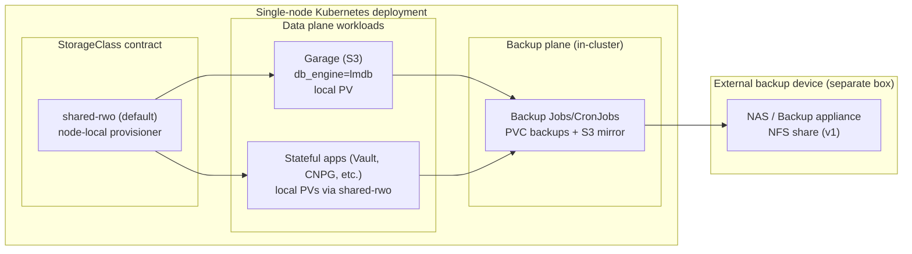
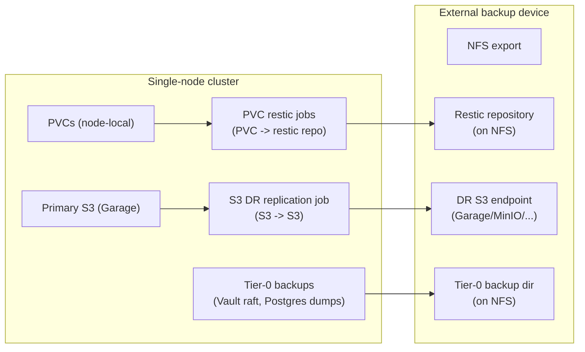

# Design: Single-Node Storage Strategy (Long-Term)

Last updated: 2026-01-09  
Status: Implemented (v1 single-node profile); Draft (Ceph + multi-node HA)

## Tracking

- Canonical tracker: `docs/component-issues/storage-single-node.md`

This document defines the **long-term storage strategy for single-node DeployKube deployments** (a “cloud-in-a-box” footprint). It also documents the implemented v1 changes that fixed the historical Garage SQLite wedge/backpressure issue, and sets up a clean, low-toil path to later adopt **Ceph** for single-node → multi-node expansions.

For the future multi-node design, see: [Design: Multi-Node HA Storage (TBD)](storage-multi-node-ha.md).

## Scope / Ground Truth

Repo reality today (relevant highlights):
- **PVC storage contract** stays stable: workloads reference `shared-rwo` (default) and (multi-node only) `shared-rwx`.
  - Standard profiles (`mac-orbstack`, `proxmox-talos`): `shared-rwo` is backed by `nfs-subdir-external-provisioner` against an out-of-cluster NFS export. Component docs: `platform/gitops/components/storage/shared-rwo-storageclass/README.md`.
  - Single-node profile v1 (`mac-orbstack-single`): `shared-rwo` is backed by a node-local `local-path-provisioner` at `/var/mnt/deploykube/local-path` and `storage-nfs-provisioner` is not installed (see `docs/design/storage-single-node.md` and `platform/gitops/components/storage/local-path-provisioner/README.md`).
- Garage is deployed as **single-node** (`replicas: 1`) and uses **LMDB** as metadata DB (`db_engine = "lmdb"`, `lmdb_map_size = "64G"`). SQLite is treated as a historical/dev-only option. Manifests: `platform/gitops/components/storage/garage/**`.
- S3 tail latency is continuously validated via `CronJob/storage-smoke-s3-latency` (`platform/gitops/components/storage/garage/smoke-tests/**`).
- Several workloads use Garage S3 as a backup target (restic sidecars), which creates write-heavy, latency-sensitive traffic patterns.

This design includes both implemented v1 components and planned follow-ups. Evidence for the v1 implementation lives under `docs/evidence/` (see the storage-single-node entries dated 2026-01-01).

## Implemented v1 (repo reality)

This section describes the **implemented v1 single-node storage profile** and the repo-grounded operational model that exists today.

## Problem Statement

### 1) Garage is not behaving as a reliable S3 backend in prod

We observed severe S3 tail latency and request failures (clients timing out/disconnecting) while Garage logs showed SQLite backpressure (e.g. `Sqlite: timed out waiting for connection`) and internal timeouts.

Even if the underlying storage sometimes looks “fast enough on average”, **SQLite-in-the-hot-path + network filesystem semantics + many concurrent small metadata ops** is a known sharp edge and is inconsistent with “object store as a platform primitive”.

### 2) Single-node deployments need a high-performance default that does not depend on NFS

For the single-node footprint, the storage baseline should:
- Prefer **node-local** I/O paths for latency-sensitive workloads (databases, object storage metadata).
- Avoid introducing a network hop and NFS semantics for the common case.
- Still provide an **off-cluster backup/DR story** that works with common NAS devices.

### 3) We must not block future product goals (especially multi-tenancy and expansions to HA)

Storage choices become hard-to-undo “platform gravity”. The single-node strategy must:
- Preserve stable interfaces (StorageClass names, S3 env var contracts).
- Provide a deterministic migration story to later Ceph-based storage (single-node → multi-node).
- Support future tenancy scoping and backup separation.

## Goals

1. **Fix Garage wedge/backpressure** in a principled way (not “raise timeouts”).
2. Establish **node-local PVCs as the performance default** for single-node deployments.
3. Keep the **workload contracts stable**:
   - Stable StorageClass names for PVCs.
   - Stable S3 environment variables/credentials contract for workloads.
4. Make it **easy to choose** (on a fresh deployment) between:
   - “Single-node local + Garage S3”, and
   - “Ceph-backed” (future) without rewriting application manifests.
5. Provide an **off-cluster backup + disaster recovery** strategy that can back up *all* state (PVCs + object storage) to a separate device (e.g. Synology NAS) and restore an entire deployment.
6. Do not block multi-tenancy goals in `docs/design/cloud-productization-roadmap.md` (tenant isolation, per-tenant storage scoping, future fleet operations).

## Non-goals

- Designing/implementing the multi-node HA storage stack (that is a separate design). Link: [storage-multi-node-ha.md](storage-multi-node-ha.md).
- Achieving node-level HA in the single-node footprint (single-node failure still implies downtime; the goal is fast restore).
- In-place, zero-downtime migration of existing PVCs between storage backends (we will rely on backup/restore as the migration mechanism).
- Preserving existing dev/prod cluster state during the initial rollout: for v1 implementation we are explicitly OK with **destructive cutover + clean rebootstrap**.

## Storage Contract (What Workloads Rely On)

### 1) PVC contract (StorageClasses)

**We keep stable StorageClass names across backends** so application manifests do not churn:

- `shared-rwo` (default): the platform’s “standard” RWO class.
- `shared-rwx` (multi-node only): optional, only for workloads that truly require RWX semantics.

Backend implementations vary by deployment profile (see next sections), but the StorageClass *names* remain stable.

> Why keep the existing names?  
> Because the repo already assumes `shared-rwo` is default. The simplest long-term compatibility story is “same name, different provisioner per deployment profile”.

#### Cutover semantics (what happens to existing PVCs)

- **Already-bound PVCs are not retroactively “migrated”** when the `shared-rwo` StorageClass implementation changes.
  - The PV contains the real backend details (NFS path, local path, CSI volume handle, etc.).
  - Changing/deleting the StorageClass affects only **new provisioning** and some expansion behavior; it does not rewrite existing PVs.
- **Supported migration model** (long-term): do not attempt in-place backend swaps. Use **“rebuild + restore”** (see DR section) to move from one storage profile to another (Garage → Ceph, NFS → local, etc.).

### 2) S3 contract

Workloads continue to use the existing S3 env var contract:
- `S3_ENDPOINT`, `S3_REGION`
- `S3_ACCESS_KEY`, `S3_SECRET_KEY`
- bucket names (`BUCKET_*` or workload-specific bucket variables)

This is the key enabler for switching from Garage → Ceph RGW later without rewriting workloads.

## Proposed Single-Node Storage Profile (v1): Local-First

### Summary

For single-node deployments, the default storage profile is:

- **Primary PVC storage**: node-local dynamic provisioning for `shared-rwo` (high performance).
- **Object storage**: Garage S3 (single-node), fixed to avoid SQLite wedge.
- **Backup/DR**: off-cluster, device-backed backups for *all* state (PVC + S3), with a restore playbook that rebuilds the cluster via GitOps and then restores data.

### Where this profile applies (environments)

This storage profile applies to:

- **Dev** (`mac-orbstack` / OrbStack + kind): dev is explicitly **disposable**. We accept that cluster recreation/rebootstrap will wipe data.
- **Single-node prod** (“cloud-in-a-box”, e.g. Proxmox/Talos single-node): there is a persistent local disk dedicated to Kubernetes workload data, and we treat backup/restore as the availability strategy.

Why unify dev + single-node prod:
- Fewer “dev vs prod” storage permutations to reason about.
- Better perf/latency parity while we stabilize Garage and the backup plane.

If we later want a “dev persistent across cluster recreation” mode again, we can add a separate **dev-persistent** storage profile backed by NFS, but it is explicitly out of scope for v1.

#### “Single-node” meaning (explicit)

In this design, **single-node refers to the failure domain / physical box**, not “exactly one Kubernetes node object”.

Compatible shapes include:
- **Dev (kind):** kind runs “nodes” as containers. A typical dev cluster has 1 control-plane + 1 worker; the control-plane is usually tainted `NoSchedule`, so workloads (and local PVs) effectively land on the single worker node.
- **Prod (Talos/Proxmox):**
  - **1 Talos node** that is both control-plane + worker (true single-node Kubernetes).
  - **2+ Talos nodes on the same hypervisor** (e.g., 1 control-plane VM + 1 worker VM) is still “single-node” for this design because the hypervisor is the single failure domain. This is operationally fine, but it is *not* HA.

Storage implication:
- Node-local volumes (`shared-rwo` via local-path) are **node-affined**. In a “control-plane + worker” shape, ensure the worker is the **storage node** (has the dedicated data disk/mount) and keep the control-plane tainted so stateful workloads don’t accidentally land there.

### Architecture (conceptual)

### Primary PVC storage: node-local `shared-rwo`

We introduce a **node-local dynamic provisioner** for single-node deployments and make it the backing implementation for `shared-rwo`:

- The provisioner allocates a directory (or a local PV) on the node’s dedicated storage path.
- PVC data never traverses NFS in the steady-state data plane.
- This becomes the long-term “fast default” for single-node.

Implementation details (to be implemented in GitOps later):
- Install a node-local provisioner in `storage-system`.
- Provide a `StorageClass/shared-rwo` pointing at that provisioner and marked as default.

#### Provisioner choice (v1 decision)

For the single-node profile v1, we standardize on **Rancher’s `local-path-provisioner`**:
- Low operational complexity.
- Works well for “single box” deployments.
- Produces PVs with node affinity (important for scheduling backup Jobs that mount local volumes).

Trade-off: it is not CSI, so VolumeSnapshot-based backups are not available by default. This design therefore uses file-level backups (restic) + application-native snapshots for tier-0 services.

#### Local-path operational specifics (v1)

To make this reliable and predictable:
- **On-node path**: standardize on a dedicated mount (e.g. `/var/mnt/deploykube/local-path`) backed by a persistent disk/partition.
  - For Talos: wire this as a machine config mount (so it survives reboots and does not share space with the OS).
  - For “single-node on Proxmox”: attach a dedicated virtual disk and mount it at that path.
- **Reclaim policy intent**:
  - `shared-rwo` should remain `Retain` by default (consistent with today’s NFS-backed class), so deleting a PVC does not silently delete data.
  - Operators should explicitly wipe data directories when intended.
- **Disk replacement**:
  - Replacing the local disk is treated as a DR event (restore from external backups).

Important constraints:
- Because this is single-node, RWO is sufficient for most workloads (multiple pods on the same node can mount an RWO PVC).
- We must **eliminate unnecessary RWX PVC usage** from platform components (example: cache workloads requesting RWX without a strict need) so the single-node profile does not need `shared-rwx` at all.
  - This is a **hard prerequisite** before we can roll out the single-node profile as designed (where `shared-rwx` is not installed): existing RWX consumers must be refactored to use `shared-rwo` (RWO) or the dedicated backup-plane NFS mount.
  - Repo reality (as of 2026-01-01): platform workloads no longer request `ReadWriteMany` via a `shared-rwx` StorageClass; Valkey and the `postgres-backup` PVC use `shared-rwo` (`ReadWriteOnce`).

#### RWX policy in single-node profile (decision)

In the single-node profile:
- `shared-rwx` is **not installed**.
- Any **workload** PVC requesting `ReadWriteMany` should be treated as a **deployment bug** (and ideally fail CI / a validation job).
  - Exception: the **backup plane** may mount an external NFS share via a dedicated static PV/PVC (RWX) in `backup-system` (e.g. `PVC/backup-target`). This is not a general-purpose RWX StorageClass and must not be used for normal workload state.

Rationale: node-local provisioners typically cannot provide RWX semantics, and RWX often indicates an architecture smell (shared filesystem used as coordination) rather than a strict requirement. On a single node, “multiple pods, one node” is compatible with `ReadWriteOnce` for most storage backends.

### Fixing Garage: eliminate SQLite wedge and NFS sensitivity

#### Root issue
Historically (pre-2026-01-01), Garage used:
- `db_engine = "sqlite"`
- metadata and data on the same NFS-backed PVC (`shared-rwo`)

This is a bad match for:
- high concurrency metadata writes,
- tail-latency-sensitive clients (LGTM, backups),
- and predictable platform operations.

#### Single-node strategy (required)

1) **Switch Garage metadata DB away from SQLite**
- Use `db_engine = "lmdb"` for single-node (and likely for multi-node as well; this is a first-class option in Garage’s config reference).
- Treat SQLite as a dev-only option.

2) **Put Garage `metadata_dir` and `data_dir` on node-local storage**
- Garage must use the node-local `shared-rwo` backend in the single-node profile.
- This removes “SQLite on network FS” and reduces tail latency.

3) **Tune Garage for predictable durability vs performance**
Garage exposes explicit knobs in its config (see upstream config reference: https://garagehq.deuxfleurs.fr/documentation/reference-manual/configuration/) such as:
- `metadata_fsync` (durability vs latency for metadata commits)
- `data_fsync` (durability vs latency for block writes)
- `metadata_auto_snapshot_interval` / `metadata_snapshots_dir` (for recoverability)
- `lmdb_map_size` (must be sized to avoid LMDB exhaustion)

Single-node defaults should prefer **predictable tail latency** with clear durability semantics (and rely on off-cluster backups for disaster recovery), rather than “accidentally durable but unpredictably slow”.

#### LMDB sizing and monitoring (v1 defaults)

- **Default `lmdb_map_size`** (v1): set to a “large enough” value that avoids surprise exhaustion for typical single-node usage (example starting point: `64G`).
  - LMDB map size is virtual address space; on 64-bit systems it can be large without reserving physical RAM.
- **Sizing rule of thumb**: `lmdb_map_size >= 4 * (current metadata DB size)` with a floor of `8G` and a recommended starting point of `64G` for “platform storage”.
- **Adjustability**: increasing `lmdb_map_size` should be treated as an online operation that requires at most a Garage restart (it is a “ceiling”); shrinking is not part of normal operations.
- **Monitoring** (required): add a recurring check (metric or file-size based) that alerts when metadata usage exceeds a threshold (e.g., >70% of map size).

4) **Reduce background load on Garage**
- Do not use the production Garage as the backup target for other stateful apps. Backups must go to the external backup device (next section).
- This reduces contention and keeps Garage focused on platform object storage.

##### Garage backups bucket (clarification)

`BUCKET_BACKUPS` remains part of the **S3 contract** because the repo already uses it (and the bootstrap Job creates it), but in the single-node profile it is **not** the primary target for platform/tier-0 backups.

Policy for single-node:
- Platform tier-0 backups go **off-cluster** to the external backup target.
- Application-level backups may still use S3 (bucket/prefix-scoped) if they accept the trade-offs, but we should prefer off-cluster backups for anything we cannot easily regenerate.

5) **Add an automated S3 latency smoke**
- Add a CronJob smoke (GitOps) that measures p50/p95/p99 for PUT/GET/HEAD/LIST against the in-cluster S3 endpoint.
- Fail fast and alert when tail latency exceeds thresholds.
- This is essential evidence to prevent regressions.

See **Storage smoke suite (v1)** below for the locked v1 CronJob spec (schedules, timeouts, thresholds, and failure behavior).

> Data migration note  
> If existing data is irrelevant (as stated), we can treat the Garage DB-engine/storage move as destructive and re-bootstrap buckets/keys.  
> Long-term, the migration mechanism is “new backend + S3-level copy + cutover”, not “flip a flag in-place”.

#### Bucket/key bootstrap contract (what must exist)

Garage’s bootstrap is currently implemented as a PostSync hook Job (`Job/garage-bootstrap-http`) that:
- Uses credentials projected from Vault (via ESO `ExternalSecret/garage-credentials` and `ExternalSecret/garage-s3`).
- Uses Garage’s **admin API** to deterministically:
  - ensure the single-node layout has a storage role assigned (if empty),
  - import the deterministic S3 access key (if missing),
  - create required buckets (as global aliases),
  - grant the S3 key read/write/owner permissions on those buckets.
- Validates the result by performing a signed **S3 list-buckets** request and asserting the required buckets are present.

The minimum “platform S3” contract today is:
- credentials: `S3_ACCESS_KEY`, `S3_SECRET_KEY`, `S3_REGION`, `S3_ENDPOINT`
- buckets: `BUCKET_LOGS`, `BUCKET_TRACES`, `BUCKET_METRICS`, `BUCKET_BACKUPS`

As new components adopt S3, they must either:
- use one of the existing buckets with a unique prefix, or
- add new bucket names to the Vault secret and extend the bootstrap Job to create them.

### Off-cluster backup + Disaster Recovery (DR)

Single-node ignores node HA, so **backup/restore is the availability strategy**.

For the cross-cutting backup/restore design note, see: `docs/design/disaster-recovery-and-backups.md`.

#### Backup target contract (external device)

#### v1 decision: external target is NFS

For v1, the external backup target is **an NFS export** (the lowest common denominator across NAS devices).

The design goal is “bring your own NAS”:
- Synology/QNAP: provide NFS.
- A DeployKube-provided “backup box” can also expose NFS in v1.

Deployment-scoped configuration:
- The backup target endpoint is declared in `platform/gitops/deployments/<deploymentId>/config.yaml` under `spec.backup.*` (see `docs/design/deployment-config-contract.md`).

Future (v2+): optionally support an S3-compatible external backup endpoint (e.g. MinIO on the NAS) for better remote semantics, but do not make it a v1 requirement.

#### How the external NFS is mounted in-cluster (without `shared-rwx`)

In the single-node profile we do **not** install `shared-rwx`, but we still need to mount the external backup NFS share.

v1 approach (recommended):
- Create a **static NFS PV + PVC** in a dedicated namespace (e.g. `backup-system`).
- All backup Jobs mount that PVC.

This avoids:
- depending on a dynamic NFS provisioner,
- introducing a “backup-only StorageClass”, and
- leaking RWX semantics into the general workload storage contract.

Operational note:
- The backup PV/PVC may use `ReadWriteMany` (because NFS is RWX-capable), but this is **scoped to the backup plane** only.
- Existing jobs that currently write to in-cluster “backup artifacts” PVCs (example: `postgres-backup` via `PVC/postgres-backup`) should be refactored to write into the dedicated backup PVC instead.

#### Backup flow (conceptual)

#### What must be backed up (“ALL data”)

1) **S3 objects (Garage buckets)**
- Back up at the **S3 API level** (not by copying Garage’s on-disk layout).
- Mechanism: periodic replication job (`rclone sync` / object-native replication) from primary S3 → DR S3 endpoint (preferred) or legacy filesystem mirror.
- Reason: this stays valid when we later switch Garage → Ceph RGW.

2) **PVC data**
- For single-node local PVs, we back up PVC contents to the external target.
- Mechanism (v1): restic-based backup jobs that mount PVCs and push snapshots to a restic repo on the external NFS export.
- For data services that already implement native backups (e.g. Vault raft snapshot), still back up their outputs to the external target.

##### How PVC backup Jobs mount node-local volumes

- Node-local PVs are bound to a node (PV node affinity).
- A backup Job that mounts the PVC will be scheduled onto the correct node by the Kubernetes scheduler.
- `volumeBindingMode: WaitForFirstConsumer` does not block this, because the PVC is already bound; the Job is a consumer.

Notes:
- File-level backups are **crash-consistent**, not necessarily application-consistent. Tier-0 services must use their application-consistent mechanisms (Vault raft snapshots; Postgres logical dumps in v1) and then copy those artifacts off-cluster.
- This is the default for non-tier-0 PVCs: **crash-consistent + restore drill evidence**. We explicitly do *not* default the whole platform to “scale-to-zero backups”, because that would introduce avoidable downtime and operational complexity for the common case.
- For workloads that cannot tolerate “live file copy”, prefer:
  - an in-pod backup sidecar (same mount, no extra attachment), or
  - a quiesce/scale-to-zero + backup + scale-up procedure (documented per component).

##### Postgres (CNPG) backup semantics in v1 (NFS-only clarification)

CNPG’s strongest backup story is WAL + basebackups to object storage, but v1 deliberately standardizes on an **NFS-only external target**.

Therefore, in v1:
- “native” backup for Postgres means **logical backups** (database-only `pg_dump`) written to the external NFS share.
- This is consistent with what we already ship today in `platform/gitops/components/data/postgres/base/backup-cronjob.yaml`.
- RPO is bounded by the dump schedule and dump duration; treat the v1 RPO targets as best-effort and adjust based on evidence.

Future (v2+):
- Move Postgres backups to an object-store target (Ceph RGW or external S3) to enable WAL archiving and better RPO/RTO.

3) **Cluster restore prerequisites (out-of-band)**
Some items are intentionally not “in cluster” backups and must be stored out-of-band:
- Breakglass kubeconfig (prod): `tmp/kubeconfig-prod` custody process already exists.
- SOPS Age keys and custody evidence (per deployment).
- GitOps repo state is in Git (Forgejo mirror + GitHub), but treat it as part of DR: restore the Git source first.

#### Restore approach (whole deployment)

DR is a controlled, deterministic procedure, but there is a critical operational hazard to avoid:

- **The init race**: if GitOps sync (especially bootstrap Jobs) runs before you restore tier-0 data, components may initialize “fresh” state on empty PVCs (or generate new credentials), which can complicate or break a restore.

Therefore, the restore flow must ensure **GitOps is bootstrapped, but not auto-syncing** until tier-0 restore is complete.

DR is a controlled, deterministic procedure:

1. Recreate the cluster (Stage 0) and bootstrap GitOps (Stage 1).
2. Ensure Argo is **not auto-syncing** before any data-bearing apps run:
   - Preferred: bootstrap Stage 1 in “restore mode” (apply `platform-apps`, but disable auto-sync and do not wait for initial sync).
   - Fallback: immediately disable auto-sync on the root Application (`platform-apps`) and any already-created child Applications, then proceed.
3. Restore tier-0 data in the right order:
   - Vault (so ESO secrets projection works),
   - Postgres (CNPG clusters),
   - Object storage (restore S3 buckets/objects),
   - Remaining PVC-backed state.
4. Re-enable Argo and run smoke suites (policy + access + S3 latency).
5. Capture restore evidence (commands + outputs) under `docs/evidence/`.

This restore plan is also the **migration mechanism** for single-node → multi-node expansions.

#### Proposed RPO/RTO defaults (v1)

These are initial targets for “single-node prod” and should be tuned with evidence:

- **RPO** (data loss window):
  - Tier-0 (Vault, Postgres): 1 hour
  - S3 mirror: 1–6 hours (depending on cost/volume; start at 1h for platform buckets)
  - Remaining PVCs: 6 hours (or tighter if required)
- **RTO** (time to restore service): 2–8 hours depending on bandwidth and data volume.

The intent is not “instant failover”, but “repeatable restore within a maintenance window”.

#### DR checklist (runbook-shaped)

1. Confirm external backup device is reachable (NFS mount works from a debug pod).
2. Stage 0: rebuild the cluster.
3. Stage 1: bootstrap Forgejo + Argo CD **without allowing auto-sync**:
   - Proxmox/Talos: set `PLATFORM_APPS_AUTOSYNC=false` and `WAIT_FOR_PLATFORM_APPS=false` when running Stage 1.
   - Dev: same flags when running Stage 1.
   - If you accidentally ran Stage 1 without this: immediately remove `spec.syncPolicy.automated` from `Application/platform-apps` before proceeding.
     - Example: `kubectl -n argocd patch application platform-apps --type='json' -p='[{"op":"remove","path":"/spec/syncPolicy/automated"}]'`
4. Restore tier-0 (do not start dependent apps yet):
   - Vault: restore raft snapshot (or re-init + restore, per runbook).
   - Postgres: restore from SQL dumps (v1) / CNPG backups (v2+).
5. Restore S3:
   - Recreate buckets/credentials if needed.
   - Sync S3 mirror contents back into primary S3.
6. Restore remaining PVCs (restic restore into the correct PVCs).
7. Re-enable Argo auto-sync and trigger sync once restores are complete:
   - Re-enable auto-sync on `platform-apps`.
   - Force a refresh/sync (or use the Argo CLI) and verify applications converge.
     - Example: `kubectl -n argocd patch application platform-apps --type merge -p '{"spec":{"syncPolicy":{"automated":{"prune":true,"selfHeal":true}}}}'`
     - Then: `kubectl -n argocd annotate application platform-apps argocd.argoproj.io/refresh=hard --overwrite`
8. Run smoke suites:
   - access-guardrails smoke
   - kyverno baseline smoke
   - storage smoke suite:
     - `storage-smoke-s3-latency`
     - `storage-smoke-garage-lmdb-headroom` (single-node prod only)
     - `storage-smoke-backup-target-write`
     - `storage-smoke-backups-freshness`
9. Capture evidence under `docs/evidence/` (commands + short outputs).

## Storage smoke suite (v1)

The single-node storage profile relies on **continuous validation** to catch “slow wedge/backpressure” problems early and to keep the DR story honest.

The v1 storage smoke suite is intentionally small and focuses on three things:
- **S3 responsiveness** (tail latency / timeouts): detects the Garage wedge symptom early.
- **Garage metadata headroom** (LMDB): detects impending LMDB map exhaustion before it becomes an outage.
- **Backup plane correctness**: detects “backups are missing/stale” and “external NFS is not writable”.

All smokes are implemented as `CronJob`s (prod at minimum) and must follow `docs/design/validation-jobs-doctrine.md` (safety fields, determinism, diagnostics, least-privilege, Istio job behavior).

### CronJobs (v1 locked)

| CronJob | Namespace | Schedule (dev) | Schedule (single-node prod) | Purpose |
|--------|-----------|----------------|------------------------------|---------|
| `storage-smoke-s3-latency` | `garage` | `*/10 * * * *` | `*/15 * * * *` | Measure p50/p95/p99/max for small S3 ops and fail on tail latency wedges |
| `storage-smoke-garage-lmdb-headroom` | `garage` | Not installed | `0 */6 * * *` | Fail when LMDB metadata usage approaches `lmdb_map_size` ceiling |
| `storage-smoke-shared-rwo-io` | `storage-system` | `0 */6 * * *` | `0 */6 * * *` | Mount a `shared-rwo` PVC and fail on extreme fsync latency |
| `storage-smoke-backup-target-write` | `backup-system` | `11 * * * *` | `11 * * * *` | Prove external backup NFS PVC is writable end-to-end |
| `storage-smoke-backups-freshness` | `backup-system` | `29,59 * * * *` | `29,59 * * * *` | Fail if tier-0 backup artifacts (and S3 mirror) are missing or stale |

Notes:
- `backup-system` is implemented in-repo and is enabled in prod-class deployments (disabled by default in dev).
- The Garage headroom smoke is only enabled once Garage runs with `db_engine = "lmdb"` (single-node prod profile).

### `storage-smoke-s3-latency` (required)

**Goal:** detect tail-latency wedges (60–120s stalls and client disconnects) quickly with a deterministic, low-cost probe.

Implementation contract (v1):
- **Runs in:** `garage` namespace **with Istio sidecar enabled** (native sidecar pattern) to exercise the same mesh path as real in-cluster clients.
- **Image:** `registry.example.internal/deploykube/bootstrap-tools:1.4` (must include `python3`).
- **Credentials:** load from `Secret/garage-s3` (`S3_ACCESS_KEY`, `S3_SECRET_KEY`, `S3_REGION`, `S3_ENDPOINT`, `BUCKET_BACKUPS`) and use them directly in-script (SigV4 signing).
- **Probe shape:**
  - Object size: **32KiB**
  - Bucket: `BUCKET_BACKUPS`
  - Key prefix: `smoke/storage-s3-latency/` (single fixed object key is OK; overwrite per run)
  - Samples per op: **30** each for `HEAD`, `GET`, `PUT`; **10** for `LIST` (prefix-scoped list)
  - Per-request timeouts: connect/read timeout ≤ **15s** (hard fail on timeout/errors)
  - Percentiles: compute p50/p95/p99 from measured wall-clock durations (nearest-rank)
- **Assertions:** fail the job if any op violates the v1 thresholds (next section), or if any request times out/errors.
- **Cleanup:** best-effort delete the smoke object key on exit (do not attempt to delete the bucket).

#### S3 smoke thresholds (v1 defaults, locked)

The smoke uses **small objects** (32KiB) to measure responsiveness, not throughput.

- `HEAD`: p99 < 1s, max < 5s
- `GET` (32KiB): p99 < 1s, max < 5s
- `LIST` (prefix): p99 < 2s, max < 10s
- `PUT` (32KiB): p99 < 2s, max < 10s

### `storage-smoke-garage-lmdb-headroom` (required in single-node prod)

**Goal:** alert before Garage hits LMDB map exhaustion (which becomes an outage / emergency resize).

Implementation contract (v1):
- **Runs in:** `garage` namespace with `sidecar.istio.io/inject: "false"` (no mesh needed).
- **Image:** `registry.example.internal/deploykube/bootstrap-tools:1.4`
- **Inputs:**
  - Mount `PVC/data-garage-0` read-only at `/var/lib/garage` (same mount as the Garage pod).
  - Mount `ConfigMap/garage-config-template` and parse the rendered config template for:
    - `db_engine` (must be `lmdb` in the single-node prod profile)
    - `lmdb_map_size` (must be explicitly set; v1 default is `64G`)
- **Measurement:**
  - Compute metadata usage from on-disk allocation (`du`) under `/var/lib/garage/meta`.
  - Convert `lmdb_map_size` into bytes (support `K/M/G/T` suffixes).
  - Compute ratio: `metadata_used_bytes / lmdb_map_size_bytes`.
- **Assertions (v1):**
  - Fail if `ratio >= 0.70`.
  - Warn (log) if `ratio >= 0.60` (still exit 0).

Operational note: the `du`-based approach is deliberately simple; it is intended to catch “we are close to the ceiling” rather than to be a perfectly precise LMDB accounting tool.

### `storage-smoke-backup-target-write` (required)

**Goal:** prove the external backup device (v1: NFS export) is writable from inside the cluster.

Implementation contract (v1):
- **Runs in:** `backup-system` with `sidecar.istio.io/inject: "false"`.
- **Mount:** `PVC/backup-target` at `/backup` (static NFS PV/PVC as described in the backup section above).
- **Probe:**
  - Create a unique temp file under `/backup/tenants/platform/smoke/` (include a run id).
  - Write a small payload, `sync`/fsync it, read it back, compare, then delete.
- **Assertions:** fail on any error or if basic write/read does not complete within the job’s `activeDeadlineSeconds`.

### `storage-smoke-backups-freshness` (required)

**Goal:** fail loudly when the DR story is broken (backups missing, stale, or not landing off-cluster).

Implementation contract (v1):
- **Runs in:** `backup-system` with `sidecar.istio.io/inject: "false"`.
- **Mount:** `PVC/backup-target` at `/backup`.
- **Marker contract (required):** every backup-producing Job/CronJob must write a `LATEST.json` marker (overwrite on success) next to its artifacts containing at minimum:
  - `timestamp` (RFC3339 UTC)
  - `artifacts` (list of relative file paths that exist)
  - `source` (string identifier, e.g. `vault-core`, `postgres-keycloak`, `s3-mirror`)
  - `status` (must be `ok`)
- **v1 expected marker paths (repo reality, 2026-01-09+):**
  - Base path: `/backup/<deploymentId>/...` (where `<deploymentId>` comes from the DeploymentConfig).
  - Tier-0:
    - `/backup/<deploymentId>/tier0/vault-core/LATEST.json` (max age: 2h)
    - `/backup/<deploymentId>/tier0/postgres/keycloak/LATEST.json` (max age: 2h)
    - `/backup/<deploymentId>/tier0/postgres/powerdns/LATEST.json` (max age: 2h)
    - `/backup/<deploymentId>/tier0/postgres/forgejo/LATEST.json` (max age: 2h)
  - S3 mirror:
    - `/backup/<deploymentId>/s3-mirror/LATEST.json` (max age: 6h)
- **Assertions:** fail if any marker is missing, malformed, references missing artifacts, or is older than its max-age threshold.

Alerting (v1):
- A failing CronJob run is the primary signal.
- Wiring CronJob failure/staleness into Alertmanager is tracked as follow-up work (observability integration).

## Stateful inventory, tiering, and backup labels (v1)

### Definitions

- **Tier-0 state**: state where a raw filesystem copy is not an acceptable backup (or is undefined), and we require application-consistent backups.
- **Tier-0 backup artifact**: the output of a tier-0 backup (Vault raft snapshot file, SQL dump, S3 mirror contents).
- **Off-cluster** (for DR): a physically separate device from the Kubernetes node (e.g. a NAS export). The Proxmox host/NFS-on-Proxmox is *not* off-cluster in this sense.

### Exhaustive tier-0 inventory (repo-derived)

This table is intended to be exhaustive for **platform-owned** tier-0 state in today’s repo.

Rule: **every tier-0 backup artifact must land off-cluster** (write directly to the external NFS mount, or copy as part of the same Job/CronJob) so that “node loss” is survivable.

| Component | Tier-0 state surface | Tier-0 backup artifact (v1) | Off-cluster location (v1) | Notes |
|----------|-----------------------|-----------------------------|---------------------------|-------|
| Vault core | Raft data PVC (`vault` StatefulSet claim template) | Encrypted raft snapshot files (`vault-core-<ts>.snap.age`) | External backup NFS (mounted in-cluster) | Current repo writes snapshots to `vault-raft-backup` PVC (`platform/gitops/components/secrets/vault/config/backup.yaml`); single-node profile must ensure this PVC is backed by the external NFS mount or migrate the job to write directly to the external mount. |
| Postgres (CNPG) — Keycloak | CNPG storage + WAL PVCs | Encrypted logical dumps (`<ts>-dump.sql.gz.age`) | External backup NFS (mounted in-cluster) | Current repo writes dumps to `PVC/postgres-backup-v2` (`platform/gitops/components/data/postgres/keycloak/base/patch-cronjob.yaml`); single-node profile must ensure this PVC is backed by the external NFS mount or migrate the job to write directly to the external mount. |
| Postgres (CNPG) — PowerDNS | CNPG storage + WAL PVCs | Encrypted logical dumps (`<ts>-dump.sql.gz.age`) | External backup NFS (mounted in-cluster) | Current repo writes dumps to `PVC/postgres-backup-v2` (`platform/gitops/components/data/postgres/powerdns/base/patch-cronjob.yaml`); same “must be external” rule applies. |
| Postgres (CNPG) — Forgejo | CNPG storage + WAL PVCs | Encrypted logical dumps (`<ts>-dump.sql.gz.age`) | External backup NFS (mounted in-cluster) | Current repo writes dumps to `PVC/postgres-backup-v2` (`platform/gitops/components/platform/forgejo/postgres/base/patch-cronjob.yaml`); same “must be external” rule applies. |
| S3 primary (Garage) | Garage data PVC (`garage` StatefulSet claim template) | S3 mirror contents (bucket/object copies) | External backup NFS (mounted in-cluster) | Garage is not backed up at PVC/file level; it is backed up via an S3 mirror job (Garage → external NFS). |

### Other platform stateful surfaces (non-tier-0)

These are still persistent and should be classified via the PVC label contract, but they do not drive the tier-0 restore order:

- Forgejo shared storage (`gitea-shared-storage` PVC): file-level backup (`restic`) is reasonable if Forgejo is expected to retain user-generated content.
- Grafana PVC: optional; can be `skip` if dashboards are fully Git-provisioned, or `restic` if we treat it as user state.
- Step CA database PVC: not tier-0 if CA keys live in Vault, but still stateful; default to `restic` unless proven safe to skip.
- Valkey PVCs: `skip` (cache/derivable).
- Opt-in example apps (Minecraft/Factorio): default `skip` in platform core; opt-in to `restic` if/when we treat them as real workloads.

### PVC backup labeling contract (enforced)

We use explicit labels on PVC objects (and PVC templates) so backups are intentional and reviewable:

- `darksite.cloud/backup=restic`  
  File-level restic backup of the PVC contents to the external backup target.

- `darksite.cloud/backup=native`  
  PVC is covered by a component-native backup mechanism, and the platform guarantees the backup artifacts are copied off-cluster. No file-level PVC backup is performed.

- `darksite.cloud/backup=skip` + `darksite.cloud/backup-skip-reason=<text>`  
  PVC is explicitly excluded (cache/derivable/test/backup-artifact output).

Where this label must appear:
- `kind: PersistentVolumeClaim` resources.
- `kind: StatefulSet` `spec.volumeClaimTemplates[*].metadata.labels`.
- `kind: Cluster` (CloudNativePG) `spec.inheritedMetadata.labels` (CNPG does not expose PVC metadata directly via `storage.pvcTemplate`, so we label via inherited metadata to ensure generated PVCs are labeled).

Enforcement:
- Repo lint script: `tests/scripts/validate-pvc-backup-labels.sh` (fails if any platform PVC/template lacks a valid label, or `skip` has no reason).

## Future / planned (Ceph + profile selection)

This section describes planned follow-ups and future profiles. It is **not** implemented by default today.

### “Fresh deployment” selection: Garage vs Ceph (future)

We want new deployments to select their storage backend without editing dozens of manifests.

### Proposed knob (future): DeploymentConfig storage profile

Extend the DeploymentConfig contract (`docs/design/deployment-config-contract.md`) with:

- `spec.storage.profile: local-single-node | ceph` (names bikesheddable)
- `spec.backup.target:...` (NFS or S3 endpoint details)

Then have environment app-of-apps bundles select the correct storage apps:
- `local-single-node` installs:
  - node-local provisioner + `shared-rwo` SC
  - Garage (LMDB, local PV)
- `ceph` installs:
  - Ceph (RBD/CephFS) + `shared-rwo/shared-rwx` SCs
  - Ceph RGW (S3) in place of Garage

Workloads do not change: they still reference `shared-rwo` and the S3 env vars contract.

### Migration to Ceph (later): “Rebuild + Restore” is the supported path

We explicitly choose a low-toil, high-confidence migration story:

- Stand up the new Ceph-backed deployment (single-node or multi-node).
- Restore from the external backup target:
  - restore PVC snapshots,
  - restore S3 buckets/objects,
  - restore Vault and databases.
- Cut over DNS / VIPs to the new deployment identity if needed.

This aligns with the productization roadmap: expansions are deterministic operations with evidence, not risky in-place surgery.

### Multi-tenancy and future features (do not block)

This single-node storage strategy must remain compatible with:

- **Tenant scoping**: label-driven tenant namespaces (Kyverno baseline) and future tenant clusters.
- **Per-tenant S3 isolation**:
  - separate buckets per tenant and workload,
  - separate credentials projected from Vault,
  - optional per-tenant quotas (enforced at the platform layer, later).
- **Backup separation**:
  - per-tenant backup prefixes / repos / buckets,
  - encryption keys and credentials stored in Vault,
  - clear “operator vs tenant” responsibility boundaries in future marketplace mode.

Node-local storage does not prevent these; the key is keeping contracts stable and backups external.

See also: `docs/design/multitenancy-storage.md` (multi-tenant storage contract and implementation plan).

### Multi-tenancy compatibility statement (what this design does / does not guarantee)

This design is structured to **not block** the multi-tenancy roadmap in `docs/design/cloud-productization-roadmap.md`, because it keeps the key workload interfaces stable:
- **PVC interface** remains `shared-rwo` (single-node local now; Ceph later).
- **Object storage interface** remains the S3 env var contract (`S3_ENDPOINT`, credentials, buckets/prefixes).

However, “not blocking” is not the same as “multi-tenancy is solved”:
- The single-node profile is not intended to be a hard multi-customer isolation boundary. For Phase 3 (“hosted multi-customer with hard isolation”), we expect to rely on **dedicated nodes/hardware** and/or a Ceph-based profile, not local-path alone.
- The v1 backup plane uses a shared external NFS target and must be expanded to enforce **per-tenant backup isolation** (separate repos/prefixes + access control) once a concrete multi-tenancy strategy is chosen.

### Expansion path (when we decide on a multi-tenancy strategy)

The intended evolution path is:
1. Phase 1 (single cluster tenant contract): per-tenant buckets/prefixes + per-tenant S3 credentials from Vault, and per-tenant backup repo/prefix separation.
2. Phase 2/3 (multi-cluster / hosted isolation): move tenant workloads to dedicated clusters/nodes and adopt the Ceph profile for `shared-rwo` and S3 (RGW), keeping workload contracts unchanged.

The core reason this remains “easy to expand into” is that the design pushes variability into:
- the storage **profile** (local vs Ceph), and
- credential/bucket scoping (Vault + ESO),
instead of embedding backend details into application manifests.

### Implementation Plan (GitOps follow-ups)

Gating prerequisite for the single-node profile:
- Remove **all workload RWX PVCs** from the platform bundle (completed as of 2026-01-01: Valkey and `postgres-backup` artifacts PVCs now use `shared-rwo` / `ReadWriteOnce`).
- The only allowed RWX in single-node is the **backup plane** static NFS PV/PVC (`backup-system`), not a general-purpose `shared-rwx` StorageClass.

1. **Introduce node-local `shared-rwo` for single-node profile**
   - Add a new storage component (node-local provisioner) and wire `shared-rwo` to it.
   - Ensure no other default StorageClass exists in that deployment.

2. **Fix Garage**
   - Switch `db_engine` to LMDB.
   - Move Garage PVC to node-local `shared-rwo`.
   - Add S3 latency smoke CronJob.
   - Update Garage docs and issue log with the incident and the fix rationale.

3. **Backups to external device**
   - Add a platform `backup-system` component.
   - Implement:
     - S3 mirror job (Garage → backup target),
     - PVC backup jobs (restic) for tier-0 state and then “all PVCs” coverage.
   - Document restore runbook and do a restore drill with evidence.

4. **Reduce RWX dependence**
   - Audit and remove unnecessary RWX PVC requests (e.g., Valkey data PVC).
   - Prefer RWO everywhere unless a real RWX need is proven.

5. **Add future knobs**
   - Extend DeploymentConfig with `spec.storage.profile` and `spec.backup.target` (separate change).

### Decisions and Open Items

| # | Topic | Decision (v1) | Notes |
|---:|------|----------------|-------|
| 1 | Existing NFS-backed `shared-rwo` PVCs | No in-place migration | Existing PVs continue to work. Changing the StorageClass affects only new provisioning. Supported migrations are “rebuild + restore”. |
| 2 | `shared-rwx` in single-node profile | Not installed (hard error if needed) | Any `ReadWriteMany` PVC in single-node is a bug; fix the workload to use RWO or redesign. |
| 3 | PVC backup mechanism for node-local PVs | File-level restic for “most PVCs” + tier-0 app-consistent backups | Scheduler places backup pods on the correct node via PV node affinity; tier-0 uses Vault raft snapshots and Postgres logical dumps in v1. |
| 4 | v1 external backup target | NFS export required | S3-capable external targets are a v2+ option. |
| 5 | Garage metadata DB | LMDB | SQLite treated as dev-only. |
| 6 | LMDB map sizing | Default `64G` map | Increase as needed; add monitoring when usage approaches the ceiling. |
| 7 | Proposed single-node RPO/RTO | RPO 1h (tier-0), RTO 2–8h | Defaults; tune with evidence. |
| 8 | S3 latency smoke thresholds | Defined (p99/max per op) | Tune based on evidence; must catch “wedge” quickly. |
| 9 | Garage bucket/key bootstrap | Via `Job/garage-bootstrap-http` + Vault secrets | Bucket list is part of the platform S3 contract and must remain documented. |
| 10 | Node-local provisioner | `local-path-provisioner` | CSI snapshots are deferred; choose a CSI local PV driver later if snapshots become a v1 requirement. |

### Evidence (placeholder)

This section will be populated once the implementation lands, with links to:
- Argo app status (`Synced/Healthy`) for storage + backup components
- S3 latency smoke outputs (p50/p99)
- Backup and restore drill outputs (at least one full DR rehearsal in dev)
