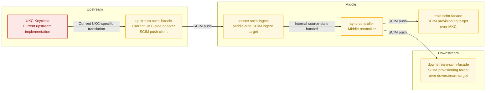
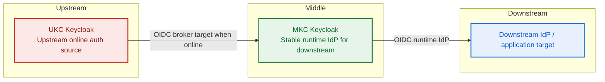

# Identity Lab Offline Identity PoC

Status: experimental, Proxmox-focused, implementation-backed, strict SCIM push-to-push live E2E revalidated on 2026-03-11.

## What this PoC is trying to prove

This proof of concept models a common enterprise IAM pattern:

- one authoritative upstream identity system for users, groups, and memberships
- one middle identity provider that is the only runtime IdP seen by downstream applications
- one downstream target that needs both runtime authentication and provisioning
- one offline fallback mode in which the middle layer can keep authenticating users and, in an extended mode, accept temporary local writes

In this repo:

- `UKC` is the upstream identity source
- `MKC` is the "Middle Keycloak"
- the downstream side is represented by a generic SCIM-capable target model, currently implemented with a repo-local stand-in

The PoC is not claiming a product-specific downstream integration. It is a repo-contained lab that proves the control points, failure modes, and convergence model that a real middle-IdP architecture would need.

## Core idea

At a high level, the Middle Keycloak plays three roles:

- it is the runtime identity provider used by the downstream application
- it brokers online authentication to the upstream IdP
- it holds a locally usable copy of identity state so offline authentication and controlled offline writes become possible

The authoritative source for identity data remains upstream. The middle layer is authoritative only for:

- runtime tokens and claims issued to downstream consumers
- local offline credentials
- temporary offline-only state while the system is intentionally operating in offline-write mode

## Scope of the current proof

The current PoC now proves the stricter middle-IdP shape:

- `upstream SCIM push into a stateful middle layer`
- `OIDC runtime brokering and offline auth in the middle layer`
- `downstream SCIM push out of the middle layer`

In other words, the validated topology is now `upstream SCIM push -> middle SCIM ingest -> downstream SCIM push`.
The middle layer remains stateful because it still owns local credentials, failover state, overrides, and deterministic reconvergence logic.

## Diagram guide

Read the diagrams with three rules in mind:

- `upstream-scim-facade` is an adapter for the current UKC implementation, not an inherent part of MKC
- the intended source-side contract is still `any upstream IdP that can push the required SCIM Users/Groups/membership state into the middle layer`
- SCIM is used for push-style provisioning on both identity boundaries, while OIDC is used only for runtime login
- the only non-SCIM handoff on the source path is internal to the middle layer: `source-scim-ingest -> Postgres -> sync-controller`

## Current repo-true implementation

```mermaid
flowchart LR
  classDef upstream fill:#FCE8E6,stroke:#C5221F,color:#8A1C1A,stroke-width:2px;
  classDef middle fill:#E6F4EA,stroke:#137333,color:#0D652D,stroke-width:2px;
  classDef down fill:#E8F0FE,stroke:#1A73E8,color:#0B57D0,stroke-width:2px;
  classDef svc fill:#FFF8E1,stroke:#F9AB00,color:#8D6E00,stroke-width:1.5px;
  classDef store fill:#F3E8FD,stroke:#9334E6,color:#6A1B9A,stroke-width:1.5px;

  subgraph UP["Upstream"]
    direction TB
    UKC["UKC Keycloak<br/>Authoritative upstream users/groups/memberships<br/>Online auth source"]:::upstream
    USCIM["upstream-scim-facade<br/>UKC-side SCIM push adapter<br/>Current Keycloak translator"]:::svc
  end

  subgraph MID["Middle"]
    direction TB
    INGEST["source-scim-ingest<br/>SCIM ingest target<br/>for upstream push"]:::svc
    MKC["MKC Keycloak<br/>Runtime IdP for downstream<br/>Local credentials for offline auth"]:::middle
    SYNC["sync-controller<br/>Middle reconciler<br/>Consumes pushed source state<br/>Owns convergence"]:::svc
    MSCIM["mkc-scim-facade<br/>SCIM provisioning target over MKC<br/>Internal broker-link endpoint"]:::svc
    DB["Postgres state store<br/>Source snapshots, mappings,<br/>overrides, controller state"]:::store
  end

  subgraph DOWN["Downstream"]
    direction TB
    DSCIM["downstream-scim-facade<br/>SCIM provisioning target<br/>over downstream stand-in"]:::svc
    DIDP["Downstream IdP stand-in<br/>Runtime target model"]:::down
  end

  UKC -->|"OIDC broker target"| MKC
  UKC -->|"Admin-backed source data"| USCIM
  USCIM -->|"SCIM push"| INGEST
  INGEST -->|"Persist pushed source state"| DB
  DB -->|"Source snapshot, mappings,<br/>failover state, overrides"| SYNC
  SYNC -->|"SCIM provisioning push"| MSCIM
  SYNC -->|"Internal federated-link call"| MSCIM
  MSCIM -->|"Keycloak Admin API"| MKC
  SYNC -->|"SCIM provisioning push"| DSCIM
  DSCIM -->|"Keycloak Admin API"| DIDP
  MKC -->|"OIDC runtime IdP"| DIDP
```

## SCIM push-to-push view

## OIDC-only view

## Interface model

The current implementation separates contracts by concern.

### 1. Upstream-to-middle provisioning contract

The upstream boundary is now a real SCIM ingest boundary in the middle layer.
`source-scim-ingest` accepts pushed SCIM users, groups, and memberships.

- protocol: `SCIM`
- caller: current PoC path is `upstream-scim-facade` acting as a UKC-side SCIM push adapter
- ingest target: `source-scim-ingest`
- model: `full-state SCIM push into the middle layer`
- portability intent: if the upstream IdP already supports the required SCIM push contract directly, `upstream-scim-facade` drops out and the upstream pushes straight into `source-scim-ingest`

### 2. Middle-internal source-state consumption

After the source-side SCIM push lands, `source-scim-ingest` normalizes it into middle-layer state.
`sync-controller` consumes that persisted source snapshot internally from Postgres; it no longer polls the upstream over SCIM.

This is the stateful part of the architecture that enables:

- explicit failover modes
- local offline credentials
- controlled offline-write divergence
- deterministic reconvergence back to upstream truth

### 3. Provisioning into MKC

MKC is provisioned through `mkc-scim-facade`.

- protocol: `SCIM`
- caller: `sync-controller`
- provisioning target: `mkc-scim-facade`
- scope: users, groups, memberships
- model: `push-only provisioning from sync-controller`

### 4. Provisioning into the downstream target

The downstream side is modeled through `downstream-scim-facade`.

- protocol: `SCIM`
- caller: `sync-controller`
- provisioning target: `downstream-scim-facade`
- model: `push-only provisioning from sync-controller`
- current implementation detail: the repo uses a Keycloak-based stand-in behind that SCIM server, but the contract being proven is generic downstream SCIM-server behavior

Taken together, the current PoC shape is therefore `upstream SCIM push -> stateful middle -> downstream SCIM push`.

### Consistency model

The validated consistency model is `eventual convergence to the last successfully ingested authoritative upstream snapshot`.

That means:

- after a successful upstream push and middle reconcile, MKC and the downstream SCIM target converge to the same canonical identity state as the authoritative upstream
- the middle layer is stateful, so this is not a transactional "always identical at every instant" model
- temporary divergence is still expected during propagation windows, during offline-write operation, or while the middle layer is intentionally holding the last-good snapshot during upstream outage
- after reconnection or normal online reconcile, the controller must deterministically converge both downstream views back to upstream-authoritative state

### 5. Runtime authentication

At runtime, downstream logins go through MKC.

- protocol: `OIDC`
- direction: `downstream runtime -> MKC`
- online mode: MKC brokers to UKC
- offline mode: MKC authenticates against locally available credentials

This is the core middle-IdP principle the PoC is validating: downstream systems see one stable runtime IdP even when the upstream system is unavailable.

### One deliberate non-SCIM exception

There is one remaining Keycloak-specific exception on the MKC side: broker link creation for MKC users.
SCIM does not define a standard resource for Keycloak federated identities, so that step remains an internal authenticated endpoint on the same service rather than part of the SCIM provisioning contract itself.

## Offline model

The PoC currently supports three controller failover modes:

- `manual`
- `automatic`
- `automatic-manual-return`

These modes are owned by `sync-controller`, not by hidden Keycloak behavior.

In practice:

- online mode means MKC runtime auth is brokered to UKC
- offline mode means MKC disables the UKC broker path and relies on local credentials
- the controller keeps the effective failover state in Postgres and exposes/administers it explicitly

## Read-only offline versus offline-write

The PoC distinguishes two offline behaviors.

### Read-only offline

In read-only offline mode:

- the last successfully synchronized users, groups, and memberships stay available
- upstream changes do not propagate while upstream is unavailable or while sync is intentionally paused
- runtime authentication can continue for users who have a local offline credential

### Offline-write

In offline-write mode:

- the controller layers local override objects on top of the last good upstream snapshot
- local users, groups, and memberships can exist temporarily
- when the system returns to online mode, those local-only objects are pruned so MKC and the downstream target converge back to upstream-authoritative state

This is not a merge strategy for long-term dual authority. It is a controlled temporary divergence model with explicit convergence back to upstream truth.

## Important implementation details that matter architecturally

These points are easy to miss, but they are essential to understanding the current behavior.

### Broker login must remain enabled

The Keycloak IdP-level `linkOnly=true` switch is not the correct way to implement the required "link-only" behavior.
In this PoC it blocks broker login entirely.

Instead, MKC and the downstream runtime target keep broker login enabled and tighten first-broker-login behavior so:

- `Create User If Unique` is disabled
- `Handle Existing Account` is required

That is how the negative proofs validate "existing account only" behavior without allowing side-effect user creation.

### Downstream login depends on a federated identity link

For downstream runtime login to work, the downstream-side user must already have the correct federated identity link to the MKC user.
The provisioning path owns that link creation.

So the downstream runtime story is not only "user exists downstream"; it is also "linkage is correct for brokered runtime login."

### Offline credential enrollment is only partially product-like

The PoC proves that:

- provisioning does not set local passwords
- local offline credentials can be present and used
- offline auth works once the credential exists

But the current proof flow is not yet a polished end-user self-service credential-enrollment product flow.
The proof uses runtime evidence plus admin-side verification of the resulting MKC password credential.

## What the proof suite actually validates

The current proof jobs are designed to validate behavior, not just deploy manifests.

The live proof surface includes:

- strict `SCIM push -> stateful middle -> SCIM push` behavior with a persisted middle ingest boundary
- provisioning snapshot equivalence across upstream, middle, and downstream views
- runtime online auth through the broker chain
- offline credential enrollment evidence
- manual failover
- automatic failover
- automatic enter with manual return
- offline-write for users, groups, and memberships
- convergence back to upstream-authoritative state
- negative "link-only" proofs that must fail without side-effect provisioning

## Latest live E2E validation

Date: `2026-03-11`

Environment:

- Proxmox cluster
- command: `KUBECONFIG=tmp/kubeconfig-prod bash./tests/scripts/e2e-idlab-poc.sh --mode existing --cleanup no --timeout 1800`

Result:

- full proof sequence completed with `PASS: idlab IdP PoC E2E completed`
- the strict push-to-push topology was live on cluster with:
  - `upstream-scim-facade` running as the UKC-side SCIM push adapter
  - `source-scim-ingest` running as the middle-side SCIM ingest target
  - `sync-controller`, `mkc-scim-facade`, and `downstream-scim-facade` all running on image digest `sha256:89823556734990632dd73143eb083fef669a42d8fbac1f880b5e708d8b91d81b`
- a fresh namespace reset also validated clean startup ordering:
  - `upstream-scim-facade` came up first and stayed healthy while logging bootstrap-wait conditions
  - Keycloaks came up next
  - `source-scim-ingest`, `mkc-scim-facade`, `downstream-scim-facade`, and `sync-controller` followed only after their dependencies were ready
- provisioning parity passed with identical canonical hashes across upstream, middle, and downstream views:
  - all three canonical snapshots converged to `1d8d142ac969fcb8569a5117466900bfa3bc067637f457be2ffaf9e7d58eef38`
- runtime logs showed repeated successful upstream push summaries into `source-scim-ingest`, with stable source snapshot `cd174bdba930fd4f81ad62418081080f96f1f93def48bb8ceae8b05f1d48589b` after UKC seeding and config
- the fresh-reset bootstrap path no longer falsely marks the source unavailable during expected UKC startup:
  - `upstream-scim-facade` logs `waiting for upstream bootstrap`
  - `sync-controller` logs `waiting for first upstream push`
- MKC SCIM guardrail rejected password-bearing user creation with `HTTP 400` and `credential fields are forbidden`
- online steady-state consistency is therefore stronger than the earlier simple-ingest model:
  - MKC and the downstream target now reconcile from the same persisted pushed source snapshot in the middle layer
  - the model is still eventual consistency, not instantaneous lockstep
- online auth produced the expected downstream runtime token payload for `alice` with group claim `grp_dd010d20-ff23-4a51-a3ce-c40e7e8a69da`
- offline enrollment proved that MKC local password credentials are created only after explicit enrollment, not by provisioning
- offline-write proved local-only `carol` plus `local-ops` membership in both MKC and the downstream target, and convergence later pruned temporary divergence back to upstream truth
- automatic failover and automatic-manual-return both toggled broker state and reconciled back online as designed
- negative link-only proofs passed with `callback_url: null`, `classified_failure_reason: "invalid username or password"`, and zero side-effect user creation in MKC or the downstream target

## What this PoC is not

This PoC is not:

- a production-ready HA IAM deployment
- a claim that the current stand-in is a finished downstream product integration
- a generic Keycloak product architecture
- proof that all operational requirements such as HA, full audit, alerting, and hard multi-tenant isolation are already solved

It is a focused architecture-and-behavior lab that proves the central middle-IdP idea:

- upstream remains authoritative for identity data
- the middle Keycloak is the single runtime IdP for downstream systems
- provisioning and runtime authentication are separate concerns
- offline runtime can be controlled explicitly
- temporary offline divergence can be brought back to upstream truth deterministically

## Repo locations

- Runtime stack: `platform/gitops/components/proof-of-concepts/idlab`
- Proof jobs: `platform/gitops/components/proof-of-concepts/idlab/tests`
- Combined stack: `platform/gitops/components/proof-of-concepts/idlab/stack`
- Opt-in app: `platform/gitops/apps/opt-in/idlab-poc/applications/idlab-poc-prod.yaml`
- Service implementation: `tools/idlab-poc`

## Evidence
Private runtime evidence for the offline identity lab is intentionally omitted from the public mirror.
