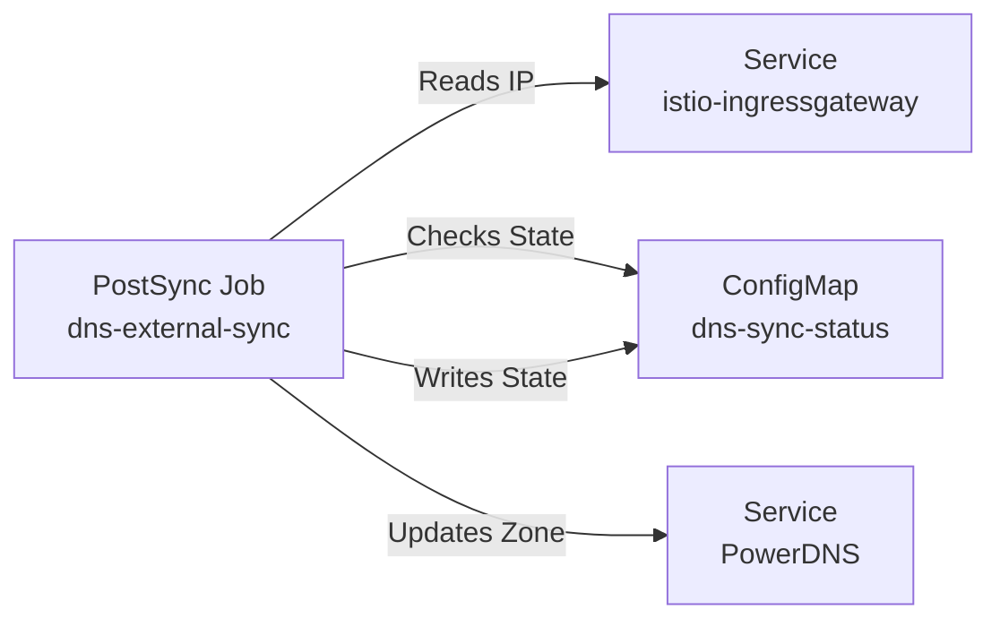

# Introduction

The `dns/external-sync` component is a **PostSync Job + periodic CronJob** that bridges the gap between the internal Ingress Gateway (MetalLB IP) and the internal DNS Authority (PowerDNS).

Unlike `ExternalDNS` (which manages `HTTPRoute` hostnames), this component manages the **infrastructure glue records**:
- The **Zone Root** (`@`) and `SOA`/`NS` records.
- The **Wildcard** (`*.dev...`).
- Static infrastructure pointers (`forgejo`, `vault`, etc.) that need to exist before Ingress resources are fully reconciled.
- Tier S tenant DNS glue: `*.<orgId>.workloads.<baseDomain>` wildcard records pointing at each tenant gateway VIP (tenant IDs are auto-discovered from the `tenancy.darksite.cloud` Tenant API by default).

It ensures that as soon as the Gateway gets an IP, DNS is updated to point to it, preventing circular dependencies during bootstrap.

For open/resolved issues, see [docs/component-issues/external-sync.md](../../../../docs/component-issues/external-sync.md).

---

## Architecture



**Workflow**:
1. **Wait**: Polls `public-gateway-istio` Service for a LoadBalancer IP.
2. **Check**: Compares desired inputs against `dns-sync-status` and verifies the expected authoritative records are still present in PowerDNS before taking the idempotent fast path.
3. **Sync**: If changed, sends HTTP PATCH to PowerDNS API (`/api/v1/servers/localhost/zones/...`).
4. **Persist**: Updates `dns-sync-status` with new IP and timestamp.

Deployment-derived inputs (`DNS_DOMAIN`, `DNS_SYNC_HOSTS`, `DNS_AUTH_NS_HOSTS`, `DNS_AUTH_NS_IP`) are sourced from `ConfigMap/dns-system/deploykube-dns-wiring` (created/updated by `components/platform/tenant-provisioner`).

---

## Subfolders

| File | Purpose |
|------|---------|
| `job-dns-sync.yaml` | The Kubernetes Job definition. |
| `cronjob-dns-sync.yaml` | Periodic convergence (no Argo sync needed when tenants change). |
| `scripts/dns-sync.sh` | Bash/Python script performing the logic. |
| `rbac.yaml` | Permissions to read Services and manage the status ConfigMap. |

---

## Container Images / Artefacts

| Artefact | Version | Source |
|----------|---------|--------|
| Bootstrap Tools | `1.3` | `registry.example.internal/deploykube/bootstrap-tools` |

Contains `kubectl`, `curl`, `python3`, `jq`.

---

## Dependencies

| Dependency | Purpose |
|------------|---------|
| `networking-istio` | Source of the LoadBalancer IP (`public-gateway-istio`). |
| `networking-dns-powerdns` | Destination API for DNS records. |
| `secrets-external-secrets` | Projects the `powerdns-api` Secret (API Key). |

---

## Communications With Other Services

### Kubernetes Service → Service Calls

- **Job → PowerDNS**: Connects to `http://powerdns.dns-system.svc.cluster.local:8081/api/v1`.
- **Job → Kubernetes API**:
    - Reads `Service` (Istio Ingress).
    - Reads/Writes `ConfigMap` (Status).

### External Dependencies

- **None**: All interaction is in-cluster.

### Mesh-level Concerns

- **Sidecar Injection**: Explicitly disabled (`sidecar.istio.io/inject: "false"`). This job must not depend on mesh correctness to publish DNS (DNS is a transitive dependency for almost everything).
- **Traffic**: Uses standard ClusterIP DNS resolution to find PowerDNS.

---

## Initialization / Hydration

- **Hook**: Runs as `PostSync` on the `networking-dns-external-sync` Application.
- **Periodic**: `CronJob/dns-external-sync-periodic` also runs continuously to pick up tenant additions without a manual Argo sync.
- **Idempotency**: `dns-sync-status` is a shortcut, not the source of truth. If the last published inputs still match, the script verifies the expected authoritative `A`/`NS`/wildcard records in PowerDNS before it exits early; if the zone drifted (for example after record loss), it republishes.

---

## Argo CD / Sync Order

| Application | Sync Wave | Notes |
|-------------|-----------|-------|
| `networking-dns-external-sync` | `12` | Runs late in the bootstrap sequence, after PowerDNS and Istio are healthy. |

- **Hook**: `PostSync`
- **Delete Policy**: `HookSucceeded` (Job is cleaned up after success).

---

## Operations (Toils, Runbooks)

### Force Re-Sync
If DNS records are stale or valid but missing (e.g., PowerDNS storage was wiped):
1. Delete the status ConfigMap:
   ```bash
   kubectl -n dns-system delete cm dns-sync-status
   ```
2. Resync the app:
   ```bash
   argocd app sync networking-dns-external-sync
   ```

The normal periodic/PostSync path should now also republish automatically if `dns-sync-status` still matches but the authoritative zone has drifted.

### Check Logs
```bash
# As the job deletes on success, you might need to catch it running or check Argo logs
kubectl -n dns-system logs -l job-name=dns-external-sync
```

---

## Customisation Knobs

Configured via Environment Variables in `job-dns-sync.yaml`.

| Knob | Default | Purpose |
|------|---------|---------|
| `DNS_DOMAIN` | DeploymentConfig `.spec.dns.baseDomain` (rendered) | Target DNS zone. |
| `DNS_SYNC_HOSTS` | `@ forgejo...` | List of platform `A` records to create pointing to the Ingress. |
| `DNS_AUTH_NS_HOSTS` | `ns1.<baseDomain>` | Authoritative nameserver hostnames used for zone `SOA/NS` and nameserver `A` records. |
| `DNS_AUTH_NS_IP` | `<powerdnsIP>` | IP used for nameserver `A` records (authoritative DNS endpoint), separate from Ingress target IP. |
| `DNS_SYNC_ENABLE_WILDCARD` | `true` | Whether to create `*.domain`. |
| `DNS_SYNC_TENANT_WILDCARDS` | `auto` | `auto` (default) discovers org IDs from `tenancy.darksite.cloud/v1alpha1 Tenant`; otherwise space-separated org IDs. Set to `none` to disable tenant wildcard records. |
| `DNS_SYNC_TENANT_WILDCARD_SUFFIX` | `workloads` | Subdomain suffix inserted between orgId and baseDomain (`*.<orgId>.<suffix>.<domain>`). |
| `POWERDNS_API` | `http://...:8081...` | PowerDNS API endpoint. |

---

## Oddities / Quirks

1. **Bootstrap Tooling**: Logic is embedded in `scripts/dns-sync.sh` (ConfigMap) but relies on Python logic injected into the container via the script.

---

## TLS, Access & Credentials

| Concern | Details |
|---------|---------|
| TLS | **None**. HTTP to PowerDNS API. |
| Credentials | Uses `powerdns-api` Secret (API Key) injected via env `POWERDNS_API_KEY`. |
| RBAC | Limited to `ConfigMap` (RW in `dns-system`) and `Service` (RO Cluster-wide). |

---

## Dev → Prod

| Aspect | mac-orbstack (`overlays/mac-orbstack`) | proxmox-talos (`overlays/proxmox-talos`) |
|--------|-----------------------------------------|-------------------------------------------|
| Domain | `dev.internal.example.com` | `prod.internal.example.com` |
| Render source | DeploymentConfig | DeploymentConfig |

---

## Smoke Jobs / Test Coverage

### Current State

| Job | Status |
|-----|--------|
| Logic Check | ✅ Implicit (Script checks API return code) |
| Resolution Check | ✅ `dns-verify` (PostSync) |

### DNS Verify Job (PostSync)

A `PostSync` Job verifies that the published records resolve via **cluster DNS (CoreDNS)** and match the current ingress IP.

Note: PowerDNS DNS ingress is intentionally restricted (only CoreDNS is allowed) via `NetworkPolicy/powerdns-allow-coredns`, so the verification must use CoreDNS rather than querying PowerDNS directly.

Manual run:

```bash
# Rerun the hook jobs (dns-external-sync then dns-verify) by resyncing the app
argocd app sync networking-dns-external-sync

# Or watch in-cluster (while the hooks are running)
kubectl -n dns-system get jobs -w
```

---

## HA Posture

### Analysis

| Aspect | Status | Details |
|--------|--------|---------|
| **Redundancy** | N/A | Component is a one-shot Job. |
| **Resilience** | ✅ High | K8s Job Controller handles retries (`restartPolicy: OnFailure`). |
| **Recovery** | ✅ High | Logic is idempotent; safe to re-run anytime. |

**Conclusion**: HA is not applicable to the execution, but the *outcome* (DNS records) depends on PowerDNS HA.

---

## Security

### Current Controls

| Layer | Control | Status |
|-------|---------|--------|
| **RBAC** | Role/ClusterRole | ✅ Minimized (ConfigMap RW, Service RO). |
| **Secrets** | Projection | ✅ Uses `env.valueFrom` (no vol mounts of secrets). |
| **Network** | Mesh | ⚠️ **Gap**: Mesh disabled (`inject: false`). Traffic is unencrypted/unauthenticated inside the cluster (though trusted). |

### Security Analysis

1. **Privilege Escalation**: The Job cannot modify other resources. Safe.
2. **Secret Leakage**: `powerdns-api` key is an env var. Leaks in `kubectl describe pod` depending on permissions, but acceptable for this context.
3. **Traffic**: Calls PowerDNS via ClusterIP. If the mesh enforcement becomes strict (`STRICT` mTLS), this job will fail until it's injected.

---

## Backup and Restore

### Analysis

| Aspect | Status |
|--------|--------|
| **State** | **Stateless** |
| **Recovery** | Re-run Job |

**Strategy**:
- **Backup**: None required.
- **Restore**: Simply trigger the `networking-dns-external-sync` Application sync. It will rebuild the DNS records based on the current implementation and live Gateway IP.
