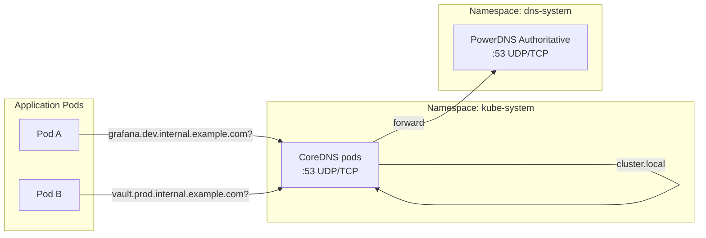

# Introduction

CoreDNS Forwarding seeds a **marker-delimited stub-domain block** in `ConfigMap/kube-system/coredns` so in-cluster workloads can resolve platform hostnames via the authoritative PowerDNS service. The committed GitOps manifest keeps a placeholder block in Git; `components/platform/tenant-provisioner` reconciles the live stub domain and forward target from deployment-derived inputs and publishes helper values in `ConfigMap/kube-system/deploykube-dns-wiring` for the repair/smoke Jobs.

**Why needed?**

- Pod DNS resolvers (CoreDNS) have no inherent knowledge of the platform-internal zones (`*.internal.example.com`).
- Without this forwarding, pods cannot resolve hostnames like `grafana.dev.internal.example.com` or `vault.prod.internal.example.com`.
- This component provides the GitOps base plus hook Jobs that keep the live CoreDNS stub block normalized and validated.

For open/resolved issues, see [docs/component-issues/coredns.md](../../../../../docs/component-issues/coredns.md).

---

## Architecture



**Flow**:

1. Pod issues DNS query for a platform hostname (for example `grafana.<baseDomain>`)
2. CoreDNS matches the live stub-domain server block in `ConfigMap/kube-system/coredns`
3. `tenant-provisioner` keeps that marked block aligned to `DeploymentConfig.spec.dns.baseDomain` and `DeploymentConfig.spec.network.vip.powerdnsIP`
4. CoreDNS forwards the query to PowerDNS at the reconciled IP
5. PowerDNS returns the authoritative answer
6. CoreDNS caches and returns the response to the pod

For standard Kubernetes services (`*.cluster.local`), the default server block handles resolution as usual.

---

## Subfolders

| Path | Purpose |
|------|---------|
| `base/` | CoreDNS ConfigMap with marker block, repair Job, smoke Job, and RBAC for the repair path. |

---

## Container Images / Artefacts

This component does not manage any long-running Deployments or StatefulSets, but it does ship hook Jobs alongside the CoreDNS ConfigMap contract.

| Artefact | Version | Notes |
|----------|---------|-------|
| Kustomize manifests | N/A | Base CoreDNS ConfigMap skeleton plus repair/smoke hooks |
| `busybox` | `1.36@sha256:b9598f8c98e24d0ad42c1742c32516772c3aa2151011ebaf639089bd18c605b8` | `PostSync` smoke Job image (`coredns-smoke`); curated in `platform/gitops/artifacts/runtime-artifact-index.yaml` as `coredns-busybox` |
| Bootstrap tools | `1.4@sha256:e7be47a69e3a11bc58c857f2d690a71246ada91ac3a60bdfb0a547f091f6485a` | `Sync` repair Job image (`coredns-corefile-repair`); curated in `platform/gitops/artifacts/package-index.yaml` as `bootstrap-tools` |

---

## Dependencies

| Dependency | Purpose |
|------------|---------|
| CoreDNS (Kubernetes-managed) | The DNS pods in `kube-system` that consume the ConfigMap |
| Tenant provisioner | Reconciles deployment-derived stub-domain values into the live CoreDNS Corefile and helper ConfigMaps |
| PowerDNS | Target for forwarded queries; must be reachable at configured IP |
| NetworkPolicy (`powerdns-allow-coredns`) | PowerDNS overlay includes policy allowing ingress from CoreDNS pods |

---

## Communications With Other Services

### Kubernetes Service → Service Calls

| Caller | Target | Port | Protocol | Purpose |
|--------|--------|------|----------|---------|
| CoreDNS pods | PowerDNS | 53 | UDP/TCP | DNS query forwarding for platform domain |

### External Dependencies (Vault, Keycloak, PowerDNS)

- **PowerDNS**: This component depends on PowerDNS being deployed and reachable at the deployment’s PowerDNS VIP.
  The forward target is sourced from DeploymentConfig (`.spec.network.vip.powerdnsIP`) and reconciled by `components/platform/tenant-provisioner` into both `ConfigMap/kube-system/deploykube-dns-wiring` and the marker-delimited stub block in `ConfigMap/kube-system/coredns`.

### Mesh-level Concerns (DestinationRules, mTLS Exceptions)

- **Not applicable**: CoreDNS runs in `kube-system` which is typically not Istio-injected.
- DNS traffic (UDP/TCP 53) is excluded from mesh handling by default.

---

## Initialization / Hydration

1. **CoreDNS is pre-existing**: Kubernetes/Talos deploys CoreDNS in `kube-system` during cluster bootstrap.
2. **GitOps seeds the base Corefile**: This component replaces the `coredns` ConfigMap with a marker-delimited placeholder stub block.
3. **Tenant provisioner reconciles live values**: `tenant-provisioner` reads deployment config, writes `ConfigMap/kube-system/deploykube-dns-wiring`, and patches the marked CoreDNS stub block to the live `baseDomain -> powerdnsIP` mapping.
4. **Repair hook normalizes legacy drift**: `Job/coredns-corefile-repair` removes duplicate unmanaged stub blocks and ensures the managed block stays ahead of the root (`.:53`) block.
5. **Smoke hook validates behavior**: `Job/coredns-smoke` proves both `cluster.local` and forwarded platform-hostname resolution after sync.
6. **Upgrade drift guard validates the root block**: `./tests/scripts/validate-coredns-upstream-corefile-contract.sh` compares the committed non-managed `.:53` Corefile block against `upstream-corefile-baseline.yaml`, making Kubernetes/Talos CoreDNS skeleton changes an explicit review point.

---

## Argo CD / Sync Order

| Property | Value |
|----------|-------|
| Sync wave | `9` |
| Pre/PostSync hooks | `Sync Job/coredns-corefile-repair`, `PostSync Job/coredns-smoke` |
| Sync dependencies | PowerDNS must be healthy (wave 2) for forwarding to work; tenant-provisioner must also be reconciling deployment-derived DNS inputs |

**Sync note**: This component syncs late (wave 9) to ensure PowerDNS and NetworkPolicies are in place before stub-domain forwarding is activated. The committed Corefile remains a placeholder until `tenant-provisioner` patches the live stub block.

---

## Operations (Toils, Runbooks)

### Verify CoreDNS ConfigMap

```bash
kubectl -n kube-system get configmap coredns -o yaml
```

### Verify DNS Wiring Inputs

```bash
kubectl -n kube-system get configmap deploykube-dns-wiring -o yaml
```

### Test DNS Resolution from a Pod

```bash
base_domain="$(kubectl get deploymentconfig platform -o jsonpath='{.spec.dns.baseDomain}')"
kubectl run dns-test --rm -it --image=busybox:1.36 --restart=Never -- \
  nslookup "forgejo.${base_domain}"
```

### Debug DNS Forwarding Issues

1. Check CoreDNS logs for errors:
   ```bash
   kubectl -n kube-system logs -l k8s-app=kube-dns --tail=100
   ```

2. Verify the reconciled forward target is reachable from `kube-system`:
   ```bash
   stub_target="$(kubectl -n kube-system get configmap deploykube-dns-wiring -o jsonpath='{.data.STUB_FORWARD_TARGET}')"
   kubectl run dns-test --rm -it --image=busybox:1.36 --restart=Never -- \
     nslookup kubernetes.default.svc.cluster.local "${stub_target}"
   ```

3. Check NetworkPolicy allows CoreDNS → PowerDNS:
   ```bash
   kubectl -n dns-system get networkpolicy powerdns-allow-coredns -o yaml
   ```

### Related Documentation

- [PowerDNS README](../../dns/powerdns/README.md)

---

## Customisation Knobs

| Knob | Location | Default |
|------|----------|---------|
| Stub domain zone | `platform/gitops/deployments/<deploymentId>/config.yaml` | `.spec.dns.baseDomain` (reconciled into the live CoreDNS marker block) |
| Forward target IP | `platform/gitops/deployments/<deploymentId>/config.yaml` | `.spec.network.vip.powerdnsIP` (reconciled into the live CoreDNS marker block) |
| Smoke FQDNs | `DeploymentConfig.spec.dns.hostnames.*` via tenant-provisioner | `PRIMARY_FQDN` / `SECONDARY_FQDN` in `ConfigMap/kube-system/deploykube-dns-wiring` |
| Cache TTL | `platform/gitops/components/networking/coredns/base/coredns-configmap.yaml` | `30` seconds |
| Prometheus metrics port | `platform/gitops/components/networking/coredns/base/coredns-configmap.yaml` | `:9153` |

---

## Oddities / Quirks

1. **ConfigMap replacement plus controller patching**: GitOps still replaces the full `coredns` ConfigMap skeleton, but only the marker-delimited stub block is rewritten at runtime by `tenant-provisioner`. Upstream Corefile deltas still need review during Kubernetes upgrades.

2. **IP forwarding**: The forwarding target is an IP (not a service name) to avoid circular DNS dependencies; the IP is sourced from DeploymentConfig and reconciled per deployment.

3. **Late sync wave**: Wave 9 ensures all dependencies are up, but if PowerDNS is unhealthy, platform DNS resolution will fail even though CoreDNS is configured.

4. **Prometheus plugin enabled**: CoreDNS exposes metrics on `:9153` for observability integration.

5. **Hook scheduling baseline**: The repair and smoke Jobs tolerate the standard `node-role.kubernetes.io/control-plane` / `node-role.kubernetes.io/master` `NoSchedule` taints so they remain schedulable in kube-system-heavy or single-node style clusters without forcing execution onto control-plane nodes.

6. **Phased ownership path**: Phase 1 keeps full ConfigMap replacement but enforces `./tests/scripts/validate-coredns-upstream-corefile-contract.sh` against `platform/gitops/components/networking/coredns/upstream-corefile-baseline.yaml`; phase 2 now starts with `ConfigMap/kube-system/coredns` marked `Prune=false` so Argo can later stop owning the object without deleting the live DNS config. The longer-term target is still Git ownership of only the marker-delimited stub block.

---

## TLS, Access & Credentials

| Concern | Details |
|---------|---------|
| Transport | Plain DNS (UDP/TCP 53) - no TLS |
| Authentication | None - DNS is unauthenticated |
| Credentials | None required |

> [!NOTE]
> DNS-over-TLS (DoT) or DNS-over-HTTPS (DoH) are not implemented. Internal cluster DNS is considered trusted.

---

## Dev → Prod

This component has no deployment-specific overlay. Environment differences come from deployment config and the live `tenant-provisioner` reconcile:

| Aspect | Source of truth |
|--------|-----------------|
| Stub domain | `DeploymentConfig.spec.dns.baseDomain` |
| Forward target | `DeploymentConfig.spec.network.vip.powerdnsIP` |
| Smoke FQDNs | `DeploymentConfig.spec.dns.hostnames.*` (projected into `ConfigMap/kube-system/deploykube-dns-wiring`) |

---

## Smoke Jobs / Test Coverage

### Current State

| Job | Status |
|-----|--------|
| DNS resolution smoke job | ✅ `PostSync Job/coredns-smoke` |

`coredns-smoke` runs as a `PostSync` hook in the `networking-coredns` Argo CD Application and proves:
1. `cluster.local` resolution works (baseline K8s DNS).
2. Stub-domain forwarding works by resolving known platform hostnames (e.g. `forgejo`/`argocd`) via CoreDNS and asserting they resolve to the same A record (the current ingress IP).
3. Wildcard forwarding works by resolving a random `wild-*.<baseDomain>` name and asserting it resolves to the same A record as `forgejo` (helps avoid CoreDNS cache masking a dead PowerDNS).

Repo-side upgrade drift coverage:
- `./tests/scripts/validate-coredns-upstream-corefile-contract.sh` compares the committed `.:53` block in `base/coredns-configmap.yaml` to `upstream-corefile-baseline.yaml`.
- When Kubernetes/Talos updates change the distro-managed CoreDNS skeleton, update the baseline and committed root block together in the same review.

### Manual Run

Resync the Argo CD Application to rerun the `PostSync` hook Job:

```bash
argocd app sync networking-coredns
```

---

## HA Posture

### Current Implementation

| Aspect | Status | Details |
|--------|--------|---------|
| Deployment type | ✅ Kubernetes-managed | CoreDNS is deployed by Kubernetes/Talos, typically as a Deployment with 2 replicas |
| Replica count | ✅ Multi-replica | Default Kubernetes CoreDNS deployment runs 2+ replicas |
| PodDisruptionBudget | ✅ Kubernetes-managed | Standard CoreDNS PDB is created during cluster bootstrap |
| Anti-affinity | ✅ Kubernetes-managed | CoreDNS pods are spread across nodes by default |
| This component's role | ⚠️ ConfigMap only | Only patches configuration; does not manage replicas or HA |

### Analysis

CoreDNS HA is **managed by Kubernetes itself**, not by this component. This component only provides configuration (the Corefile ConfigMap).

**What this component affects**:
- The ConfigMap is applied to all CoreDNS replicas automatically
- CoreDNS's `reload` plugin ensures configuration changes are picked up without pod restart
- No additional HA concerns for the ConfigMap itself

**What could fail**:
- If PowerDNS is unavailable, stub domain resolution fails (but `cluster.local` continues working)
- If the ConfigMap is invalid, CoreDNS may fail to reload (errors visible in CoreDNS logs)

### Recommendations

No HA gaps for this component. CoreDNS HA is the responsibility of the Kubernetes distribution (Talos/kind).

---

## Security

### Current Controls

| Layer | Control | Status |
|-------|---------|--------|
| **Network (egress)** | CoreDNS → PowerDNS | ✅ NetworkPolicy `powerdns-allow-coredns` allows DNS traffic |
| **Network (ingress)** | Pods → CoreDNS | ✅ Kubernetes-managed; all pods route DNS via CoreDNS |
| **Hook Jobs** | Hardened securityContext + resource requests | ✅ Repair/smoke Jobs run as non-root with least-privilege pod settings |
| **Transport** | Plain DNS (UDP/TCP 53) | ⚠️ No encryption (standard DNS) |
| **Authentication** | None | ⚠️ DNS is inherently unauthenticated |
| **Mesh** | Not applicable | ✅ `kube-system` is not Istio-injected |
| **Credentials** | None | ✅ No secrets required |

### NetworkPolicy Coverage

| Policy | Namespace | Direction | Purpose |
|--------|-----------|-----------|---------|
| `powerdns-allow-coredns` | dns-system | Ingress | Allow CoreDNS pods to query PowerDNS on port 53 |

### Security Analysis

**Acceptable risks**:
1. **Plain DNS transport**: Internal cluster DNS does not require encryption. All traffic stays within the cluster network.
2. **No authentication**: Standard for DNS; mitigation is NetworkPolicy enforcement.

**Not applicable**:
- DNS-over-TLS (DoT) or DNS-over-HTTPS (DoH) are overkill for internal cluster DNS.
- Istio mTLS is not applicable since `kube-system` is outside the mesh.

### Gaps

None identified. The security posture is appropriate for an internal DNS configuration component.

---

## Backup and Restore

### Current State

| Aspect | Status |
|--------|--------|
| Persistent data | **None** |
| Configuration | GitOps-managed (Kustomize manifests) |
| Secrets | **None** |

### Analysis

CoreDNS (this component) is **stateless, with phased ownership handoff in progress**:
- Git currently defines the CoreDNS ConfigMap skeleton, hook Jobs, and repair RBAC
- `tenant-provisioner` rehydrates the live stub block and helper ConfigMaps from DeploymentConfig
- No persistent volumes, no secrets, no durable runtime state
- `ConfigMap/kube-system/coredns` is marked `Prune=false` so the later handoff away from full ConfigMap ownership cannot delete the live object during Argo prune
- Full restore = Argo CD sync plus controller reconcile

### Disaster Recovery

| Scenario | Recovery |
|----------|----------|
| ConfigMap deleted | Argo CD sync restores it; CoreDNS reloads automatically |
| Cluster rebuild | Bootstrap + Argo sync restores configuration |
| Bad config deployed | Revert Git commit; Argo sync restores previous config |

**No backup mechanism needed.** The source of truth is the Git repository.
