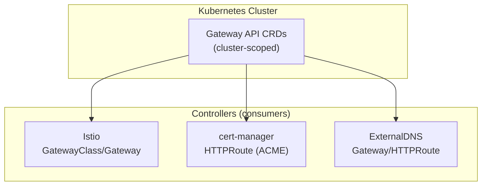

# Introduction

Gateway API CRDs provides the upstream **standard channel** Custom Resource Definitions (v1.4.0) from the Kubernetes Gateway API project. This component installs cluster-scoped CRDs that enable Istio, cert-manager, and other Gateway API controllers to reconcile their Gateway, HTTPRoute, and related resources.

**Why needed?**

- Gateway API defines a portable, standardized way to configure ingress/egress traffic routing.
- These CRDs must exist before any controller (Istio, cert-manager) can create or reconcile Gateway API resources.
- Shipping as a standalone Argo CD Application ensures CRDs land early (sync wave `-2`) before dependent components.

For open/resolved issues, see [docs/component-issues/gateway-api.md](../../../../../docs/component-issues/gateway-api.md).

---

## Architecture



**Flow**:

1. Argo CD applies the CRDs in sync wave `-2` (before any other component)
2. Controllers (Istio, cert-manager, ExternalDNS) can now create and reconcile Gateway API resources
3. No runtime pods or services are deployed by this component

**CRDs included** (standard channel):
- `GatewayClass` – Defines a class of Gateways (e.g., Istio)
- `Gateway` – Represents an ingress/egress point
- `HTTPRoute` – HTTP routing rules
- `GRPCRoute` – gRPC routing rules
- `ReferenceGrant` – Cross-namespace reference permissions
- `BackendTLSPolicy` – Backend TLS configuration

---

## Subfolders

This component has no subfolders—all files are in the base directory.

| File | Purpose |
|------|---------|
| `README.md` | This documentation |
| `kustomization.yaml` | Kustomize wrapper referencing the upstream manifest |
| `standard-install.yaml` | Verbatim upstream manifest pinned to Gateway API v1.4.0 (~12k lines, ~695KB) |

---

## Container Images / Artefacts

This component does **not** deploy any container images—it only installs cluster-scoped CRDs.

| Artefact | Version | Source |
|----------|---------|--------|
| Gateway API standard-install.yaml | `v1.4.0` | [kubernetes-sigs/gateway-api](https://github.com/kubernetes-sigs/gateway-api/releases/download/v1.4.0/standard-install.yaml) |

---

## Dependencies

| Dependency | Purpose |
|------------|---------|
| None | CRDs are cluster-scoped and have no runtime dependencies |

**Note**: This component is a dependency *for* other components (Istio, cert-manager), not the other way around.

---

## Communications With Other Services

### Kubernetes Service → Service Calls

None. This component only defines CRDs; it has no runtime services.

### External Dependencies (Vault, Keycloak, PowerDNS)

None.

### Mesh-level Concerns (DestinationRules, mTLS Exceptions)

Not applicable—no pods are deployed.

---

## Initialization / Hydration

1. **Argo CD applies the kustomization** which references `standard-install.yaml`
2. **CRDs are registered** in the Kubernetes API server
3. **No secrets, Jobs, or hydration required**—pure CRD installation

The `gateway-system` namespace is created by Argo CD (`CreateNamespace=true`) as a placeholder for future admission webhooks, though the CRDs themselves are cluster-scoped.

---

## Argo CD / Sync Order

| Property | Value |
|----------|-------|
| Sync wave | `-2` (very early) |
| Pre/PostSync hooks | None |
| Sync dependencies | None—this is one of the first components to sync |

**Sync policy**:
- Automated with `prune: true` and `selfHeal: true`
- `PrunePropagationPolicy: foreground` ensures CRD deletion blocks until dependents are removed

---

## Operations (Toils, Runbooks)

### Verify CRDs are Installed

```bash
kubectl get crd | grep gateway.networking.k8s.io
kubectl wait --for=condition=Established --timeout=120s crd/gateways.gateway.networking.k8s.io
```

### Check CRD Version

```bash
kubectl get crd gateways.gateway.networking.k8s.io -o jsonpath='{.metadata.annotations.gateway\.networking\.k8s\.io/bundle-version}'
```

### Upgrade Gateway API Version

```bash
# Download new version (example: v1.5.0)
curl -L -o platform/gitops/components/networking/gateway-api/standard-install.yaml \
  https://github.com/kubernetes-sigs/gateway-api/releases/download/v1.5.0/standard-install.yaml

# Commit and sync
git add platform/gitops/components/networking/gateway-api/standard-install.yaml
git commit -m "chore: bump Gateway API to v1.5.0"
```

### Troubleshooting

- **Diff noise in Argo**: Confirm no other operator is mutating the CRDs.
- **Slow deletion**: Prune propagation is `foreground`; deletion blocks until workloads release Gateway resources.

---

## Customisation Knobs

| Knob | Location | Notes |
|------|----------|-------|
| Gateway API version | `standard-install.yaml` | Replace entire file with new upstream release |
| CRD patches | `kustomization.yaml` | Add `patches` entries if customization needed (rare) |

> [!TIP]
> To add experimental routes (TCP/UDP/TLS), switch to `experimental-install.yaml` from upstream.

---

## Oddities / Quirks

1. **Large manifest (~12k lines)**: Avoid trimming or reformatting; Argo diffs cleanly when the file stays untouched from upstream.

2. **Cluster-scoped CRDs**: Argo syncs them even if the destination namespace is missing; the namespace is only a placeholder.

3. **No upstream change alerts**: There is no automatic notification when upstream ships breaking changes. Check Gateway API release notes when bumping versions and record findings in `docs/component-issues/gateway-api.md` (and optionally `docs/evidence/` for upgrade notes).

4. **Foreground deletion**: Deleting the Argo app blocks until all Gateways/Routes are removed from the cluster.

---

## TLS, Access & Credentials

| Concern | Details |
|---------|---------|
| TLS endpoints | None—CRDs only |
| Authentication | None required |
| Credentials | None required |

---

## Dev → Prod

| Aspect | Dev | Prod |
|--------|-----|------|
| CRD version | `v1.4.0` (same) | `v1.4.0` (same) |
| Namespace | `gateway-system` (placeholder) | `gateway-system` (placeholder) |
| Configuration | Identical | Identical |

**Promotion**: This component uses the same manifest across all environments. No overlay or environment-specific configuration exists.

---

## Smoke Jobs / Test Coverage

### Current State

| Job | Status |
|-----|--------|
| CRD existence smoke job | ✅ Implemented (`Job/gateway-api-smoke`, PostSync hook) |

This component ships a PostSync hook Job that proves the API server has registered the core Gateway API CRDs:

1. `GatewayClass` (`gatewayclasses.gateway.networking.k8s.io`)
2. `Gateway` (`gateways.gateway.networking.k8s.io`)
3. `HTTPRoute` (`httproutes.gateway.networking.k8s.io`)

Implementation:
- `tests/job-gateway-api-smoke.yaml`
- `tests/rbac.yaml`

Manual check (kubectl-only):

```bash
kubectl wait --for=condition=Established --timeout=120s \
  crd/gatewayclasses.gateway.networking.k8s.io \
  crd/gateways.gateway.networking.k8s.io \
  crd/httproutes.gateway.networking.k8s.io
```

Inspect the hook Job:

```bash
kubectl -n gateway-system get jobs | rg -n "gateway-api-smoke"
kubectl -n gateway-system logs -l job-name=gateway-api-smoke --tail=200
```

---

## HA Posture

### Analysis

| Aspect | Status | Details |
|--------|--------|---------|
| Runtime pods | ❌ N/A | No pods deployed—CRDs only |
| Replication | ❌ N/A | CRDs are cluster-scoped API objects stored in etcd |
| Failover | ❌ N/A | CRDs do not fail over; etcd HA handles durability |
| PodDisruptionBudget | ❌ N/A | No pods to disrupt |

### Conclusion

**HA is not applicable** for this component. CRDs are stored in the Kubernetes API server's etcd, which inherits the control plane's HA characteristics. The component itself has no runtime surface.

---

## Security

### Current Controls

| Layer | Control | Status |
|-------|---------|--------|
| **RBAC** | CRD creation requires cluster-admin | ✅ Argo CD has sufficient privileges |
| **Namespace** | `gateway-system` placeholder | ✅ Created but not security-sensitive |
| **Mesh** | Not applicable | ✅ No pods to inject |
| **NetworkPolicy** | Not applicable | ✅ No network traffic |
| **Credentials** | None required | ✅ N/A |

### Security Analysis

**This component has minimal security surface**:
- CRDs are cluster-scoped API extensions; they define schema, not runtime behaviour
- The security of *using* Gateway API depends on controllers (Istio) and proper RBAC for creating `Gateway`/`HTTPRoute` objects
- No secrets, no network endpoints, no pod execution

### Gaps

None. Security posture is appropriate for a CRD-only component.

---

## Backup and Restore

### Current State

| Aspect | Status |
|--------|--------|
| Persistent data | **None** (CRDs stored in etcd) |
| Configuration | GitOps-managed (`standard-install.yaml`) |
| Secrets | **None** |

### Analysis

Gateway API CRDs are **fully stateless and GitOps-managed**:
- The CRDs are defined in Git and applied by Argo CD
- etcd stores the CRD definitions, which are reconstructible from Git
- No user data or runtime state

### Disaster Recovery

| Scenario | Recovery |
|----------|----------|
| CRD deleted | Argo CD sync restores it |
| Cluster rebuild | Bootstrap + Argo sync restores CRDs |
| Version rollback | Revert Git commit; Argo sync applies previous version |

**No backup mechanism needed.** The source of truth is the Git repository.
