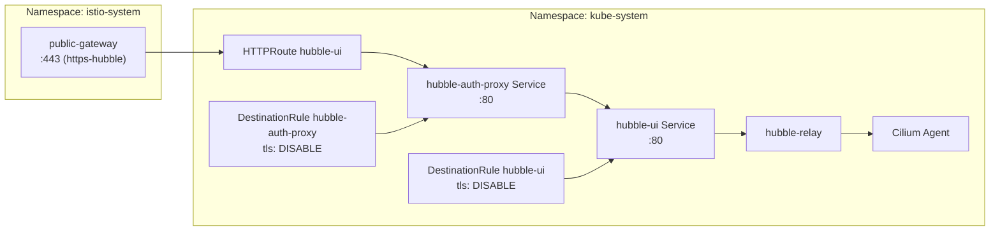

# Introduction

Hubble UI Exposure provides **ingress routing** to the Cilium Hubble UI dashboard through the shared Istio Gateway and protects it with a Keycloak-backed OIDC auth proxy (oauth2-proxy).

This component does not deploy Hubble itself (that's part of Cilium in Stage 0); it deploys the **auth proxy** and routes traffic through it to the existing `hubble-ui` service.

**Access URLs**:
- Dev: `https://hubble.dev.internal.example.com`
- Prod (overlays/prod): `https://hubble.prod.internal.example.com`

For open/resolved issues, see [docs/component-issues/hubble.md](../../../../../docs/component-issues/hubble.md).

---

## Architecture



**Flow**:

1. External request arrives at Istio ingress gateway on the `https-hubble` listener
2. HTTPRoute matches the hostname and forwards to `hubble-auth-proxy` service
3. oauth2-proxy enforces Keycloak OIDC and proxies authenticated requests to `hubble-ui`
4. DestinationRules disable mTLS for these backends (Hubble + proxy are not Istio-proxied)
5. Hubble UI connects to `hubble-relay` which aggregates flow data from Cilium agents

---

## Subfolders

| Path | Purpose |
|------|---------|
| `kustomization.yaml` | Base kustomization including HTTPRoute and DestinationRule |
| `httproute.yaml` | Routes `hubble.<env>.internal.example.com` to `hubble-auth-proxy:80` |
| `destinationrule.yaml` | Disables mTLS for `hubble-ui` backend communication |
| `overlays/prod/` | Prod overlay with `hubble.prod.internal.example.com` hostname |
| `overlays/*/oauth2-proxy-*.yaml` | oauth2-proxy Deployment/Service (OIDC auth proxy) |

---

## Container Images / Artefacts

This component deploys oauth2-proxy (auth proxy) and creates routing resources. Hubble UI/Relay are deployed by Cilium in Stage 0.

| Artefact | Version | Notes |
|----------|---------|-------|
| oauth2-proxy image | `v7.6.0` | `quay.io/oauth2-proxy/oauth2-proxy` |
| Kustomize manifests | N/A | oauth2-proxy + HTTPRoute + DestinationRules |

> [!NOTE]
> Hubble UI container image version is controlled by Cilium Stage 0 values, not this component.

---

## Dependencies

| Dependency | Purpose |
|------------|---------|
| Cilium | Must be deployed with Hubble UI/Relay enabled (Stage 0) |
| `hubble-ui` Service | Must exist in `kube-system` |
| Istio Gateway (`public-gateway`) | Parent for the HTTPRoute |
| Gateway listener `https-hubble` | TLS listener with `hubble-tls` certificate |
| Mesh security (PERMISSIVE) | `kube-system` must allow plaintext for non-injected Hubble pods |

---

## Communications With Other Services

### Kubernetes Service → Service Calls

| Caller | Target | Port | Protocol | Purpose |
|--------|--------|------|----------|---------|
| Istio ingress gateway | `hubble-auth-proxy.kube-system.svc` | 80 | HTTP (mTLS disabled) | Dashboard traffic (authenticated) |
| oauth2-proxy | `hubble-ui.kube-system.svc` | 80 | HTTP | Upstream UI |
| Hubble UI | `hubble-relay.kube-system.svc` | 4245 | gRPC | Flow data aggregation |
| Hubble Relay | Cilium agents | 4244 | gRPC | Per-node flow collection |

### External Dependencies (Vault, Keycloak, PowerDNS)

- **PowerDNS**: DNS record for `hubble.{dev,prod}.internal.example.com` must resolve to Istio ingress gateway IP.
- **cert-manager**: TLS certificate `hubble-tls` in `istio-system` for HTTPS termination.
- **Keycloak**: OIDC issuer at `https://keycloak.<env>.internal.example.com/realms/deploykube-admin`.
- **Vault + ESO**: oauth2-proxy client secret (`secret/keycloak/hubble-client`) and cookie secret (`secret/networking/hubble/oauth2-proxy`) are projected into `Secret/kube-system/hubble-oauth2-proxy`.

### Mesh-level Concerns (DestinationRules, mTLS Exceptions)

- **DestinationRule `hubble-ui`**: Sets `tls.mode: DISABLE` because Hubble pods are not Istio-injected.
- **Namespace mTLS**: `kube-system` is set to `PERMISSIVE` by `mesh-security` component to allow plaintext.

---

## Initialization / Hydration

1. **Cilium + Hubble deployed** in Stage 0 with UI/Relay enabled
2. **Istio + Gateway deployed** with `https-hubble` listener configured
3. **Vault seeds secrets**: `secret/keycloak/hubble-client` + `secret/networking/hubble/oauth2-proxy`
4. **ESO projections**: `Secret/kube-system/hubble-oauth2-proxy` materializes oauth2-proxy config (client/cookie/CA)
5. **This component syncs**: Creates oauth2-proxy Deployment/Service + HTTPRoute + DestinationRules
6. **ExternalDNS updates PowerDNS** with hostname → ingress IP mapping
7. **cert-manager issues certificate** for `hubble-tls`

---

## Argo CD / Sync Order

| Property | Value |
|----------|-------|
| Sync wave | `2` |
| Pre/PostSync hooks | None |
| Sync dependencies | Cilium (Stage 0), Istio Gateway (wave 1), mesh-security (wave 1) |

---

## Operations (Toils, Runbooks)

### Verify Hubble UI is Reachable

```bash
# Check service exists
kubectl -n kube-system get svc hubble-ui

# Check HTTPRoute
kubectl -n kube-system get httproute hubble-ui -o yaml

# DNS-bypass reachability check (prod example; expect 302 to Keycloak)
vip="$(kubectl -n istio-system get svc public-gateway-istio -o jsonpath='{.status.loadBalancer.ingress[0].ip}')"
curl -skI --resolve hubble.prod.internal.example.com:443:${vip} https://hubble.prod.internal.example.com/ | head -n 20

# Open in browser (requires Step CA trust)
open https://hubble.dev.internal.example.com
```

### Debug Connection Issues

1. Verify Hubble pods are running:
   ```bash
   kubectl -n kube-system get pods -l k8s-app=hubble-ui
   kubectl -n kube-system get pods -l k8s-app=hubble-relay
   ```

2. Check DestinationRule is applied:
   ```bash
   kubectl -n kube-system get destinationrule hubble-ui -o yaml
   ```

3. Verify Gateway listener exists:
   ```bash
   kubectl -n istio-system get gateway public-gateway -o yaml | grep -A5 https-hubble
   ```

4. Check certificate status:
   ```bash
   kubectl -n istio-system get certificate hubble-tls
   ```

---

## Customisation Knobs

| Knob | Location | Default |
|------|----------|---------|
| Hostname (dev) | `httproute.yaml` | `hubble.dev.internal.example.com` |
| Hostname (prod) | `overlays/prod/httproute.yaml` | `hubble.prod.internal.example.com` |
| Parent gateway | `httproute.yaml` | `public-gateway` in `istio-system` |
| Listener name | `httproute.yaml` | `https-hubble` |

---

## Oddities / Quirks

1. **mTLS disabled for backend**: The DestinationRule disables mTLS because Hubble UI pods in `kube-system` are not Istio-proxied. This is intentional design to avoid complexity in the CNI layer.

2. **Stage 0 dependency**: Hubble UI/Relay are deployed by Cilium helm values in Stage 0, not by this component. If Cilium is installed without Hubble, this routing will fail.

3. **Service exposure posture**: Stage 0 may have installed `kube-system/svc/hubble-ui` as `NodePort`. This component enforces `ClusterIP` via `Job/hubble-ui-service-posture` so the only supported exposure path is the Istio Gateway.

4. **Lowmem environment patch**: In `environments/mac-orbstack/`, a patch deletes this Argo app entirely to conserve resources.

5. **Keycloak CA trust**: oauth2-proxy uses the Step CA root published into Vault (`keycloak/oidc-ca`) and mounts it as `ca.crt` to validate the Keycloak issuer TLS chain.
6. **PKCE + auto-redirect**: oauth2-proxy is configured with `--code-challenge-method=S256` and `--skip-provider-button=true` to harden the auth flow and remove the extra provider-selection step.

---

## TLS, Access & Credentials

| Concern | Details |
|---------|---------|
| Transport (external) | HTTPS with `hubble-tls` certificate from Step CA |
| Transport (internal) | HTTP (mTLS disabled via DestinationRule) |
| Authentication | Keycloak OIDC via oauth2-proxy |
| Credentials | Vault-managed: `secret/keycloak/hubble-client`, `secret/networking/hubble/oauth2-proxy` |

---

## Dev → Prod

| Aspect | Dev (overlays/dev) | Prod (overlays/prod) |
|--------|------------|----------------|
| Hostname | `hubble.dev.internal.example.com` | `hubble.prod.internal.example.com` |
| Gateway listener | `https-hubble` (same) | `https-hubble` (same) |
| mTLS | Disabled (same) | Disabled (same) |
| oauth2-proxy replicas | 1 | 2 |

**Promotion**: Use `overlays/prod/` for prod hostname and HA posture (2 replicas + PDB).

---

## Smoke Jobs / Test Coverage

### Current State

| Job | Status |
|-----|--------|
| Ingress substrate reachability | ✅ `CronJob/ingress-smoke-substrate` (global) |

With OIDC enabled, the ingress substrate smoke typically observes `302` (redirect to login) rather than `200`.

---

## HA Posture

### Analysis

| Aspect | Status | Details |
|--------|--------|---------|
| oauth2-proxy | ✅ | Dev: 1 replica. Prod: 2 replicas + PDB (`minAvailable: 1`). |
| Hubble UI pods | ⚠️ Single replica | Deployed by Cilium (Stage 0); not HA by default |
| Hubble Relay | ⚠️ Single replica | Deployed by Cilium (Stage 0); not HA by default |
| Istio ingress | ✅ HA | Ingress gateway is typically multi-replica |

### Conclusion

**This component is HA-sensitive** because oauth2-proxy sits on the request path. Prod runs 2 replicas + a PDB to tolerate a single pod disruption. HA for Hubble UI/Relay is still the responsibility of Cilium Stage 0 configuration.

**Potential improvement**: If HA is desired, increase `hubble.ui.replicas` and `hubble.relay.replicas` in Cilium helm values (Stage 0).

---

## Security

### Current Controls

| Layer | Control | Status |
|-------|---------|--------|
| **Transport (external)** | HTTPS via Step CA cert | ✅ Implemented |
| **Transport (internal)** | mTLS disabled | ⚠️ Intentional—Hubble not Istio-proxied |
| **Authentication** | Keycloak OIDC via oauth2-proxy | ✅ Implemented |
| **NetworkPolicy** | None specific to Hubble UI | ⚠️ Relies on namespace defaults |
| **Mesh** | Not injected | ✅ `kube-system` excluded from mesh |

### Security Analysis

**Remaining gaps / follow-ups**:

1. **mTLS disabled for backend**: DestinationRule disables mTLS because Hubble pods are not Istio-proxied. This is acceptable within `kube-system` but means traffic is plaintext between ingress and Hubble UI.

2. **No NetworkPolicy**: While `kube-system` has default policies, there's no specific policy limiting who can access `hubble-ui` backend.

### Recommendations

1. **Restrict ingress access** via NetworkPolicy allowing only expected source IPs/namespaces (defense-in-depth).
2. **Consider internal-only access** for production environments if flow metadata is too sensitive.

---

## Backup and Restore

### Current State

| Aspect | Status |
|--------|--------|
| Persistent data | **None** |
| Configuration | GitOps-managed (HTTPRoute + DestinationRule) |
| Secrets | Vault-managed (ESO projections) |

### Analysis

This component is **stateless and GitOps-managed**:
- HTTPRoute, DestinationRules, oauth2-proxy Deployment/Service are Kubernetes API objects with no persistent state
- Hubble flow data is ephemeral (stored in memory by Cilium agents)
- Secrets are sourced from Vault and projected via ESO

### Disaster Recovery

| Scenario | Recovery |
|----------|----------|
| Routing deleted | Argo CD sync restores HTTPRoute/DestinationRule |
| Hubble data lost | N/A—flow data is ephemeral by design |
| Cluster rebuild | Bootstrap (Cilium) + Argo sync restores all |

**No backup mechanism needed.** The source of truth is the Git repository.
