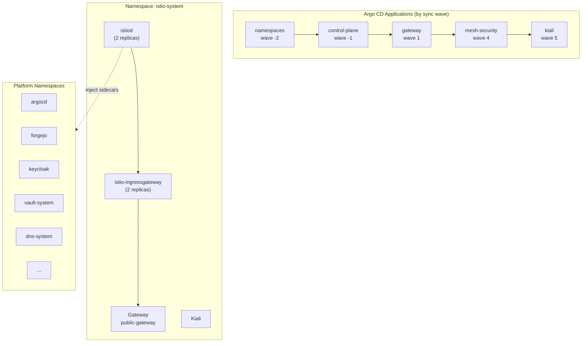

# Introduction

Istio provides the **service mesh** and **ingress gateway** for the DeployKube platform. This component is split into 5 Argo CD applications that sync in a specific order to bootstrap the mesh safely with STRICT mTLS enforcement.

**Key capabilities**:
- Ingress gateway with Gateway API (HTTPRoutes for all platform services)
- STRICT mTLS mesh with PERMISSIVE exceptions for `kube-system` and ingress
- Kiali dashboard for traffic visualization
- Automatic sidecar injection for platform namespaces

For open/resolved issues, see [docs/component-issues/istio.md](../../../../../docs/component-issues/istio.md).

---

## Architecture



**Sync order rationale**:
1. **namespaces** (wave -2): Creates platform namespaces with `istio-injection=enabled` label
2. **control-plane** (wave -1): Installs istiod + ingress gateway via IstioOperator
3. **gateway** (wave 1): Defines GatewayClass + Gateway with HTTPS listeners
4. **mesh-security** (wave 4): Enforces STRICT mTLS after all workloads are injected
5. **kiali** (wave 5): Installs visualization dashboard after mesh is stable

---

## Subfolders

| Subfolder | Purpose | Sync Wave |
|-----------|---------|-----------|
| `namespaces/` | Platform namespace definitions with injection labels + PSA | `-2` |
| `control-plane/` | IstioOperator CR, CRDs, operator deployment | `-1` |
| `gateway/` | GatewayClass + public-gateway with HTTPS listeners | `1` |
| `mesh-security/` | PeerAuthentication, DestinationRules, verifier Job | `4` |
| `kiali/` | Kiali Helm chart + HTTPRoute | `5` |

Each subfolder has its own README with detailed documentation.

---

## Container Images / Artefacts

| Artefact | Version | Notes |
|----------|---------|-------|
| Istio | `1.23` | Via IstioOperator; pinned in `control-plane/istio-operator.yaml` |
| Istio CRDs | bundled | `control-plane/crds.yaml` (~696KB) |
| Kiali Helm chart | (chart default) | Deployed via kustomize helmCharts |
| Kiali container | (chart default) | `quay.io/kiali/kiali` |

---

## Dependencies

| Dependency | Purpose |
|------------|---------|
| Gateway API CRDs | Required for GatewayClass/Gateway resources |
| MetalLB / ingress substrate | Provides and validates routable VIPs for gateway-facing Services |
| cert-manager + Step CA | Issues TLS certificates for Gateway listeners |
| Platform namespaces | Must exist before control-plane syncs |

---

## Communications With Other Services

### Kubernetes Service → Service Calls

| Caller | Target | Port | Protocol | Purpose |
|--------|--------|------|----------|---------|
| All mesh pods | istiod | 15012 | gRPC | xDS configuration |
| External clients | `public-gateway-istio` / `tenant-*-gateway-istio` | 443 | HTTPS | Platform and tenant ingress |
| Istio-managed gateway Services | Backend services | various | HTTP(S) | Routed traffic |
| Kiali | istiod | 8080 | HTTP | Config queries |
| Kiali | Prometheus | 9090 | HTTP | Metrics (when available) |

### External Dependencies (Vault, Keycloak, PowerDNS)

- **PowerDNS**: DNS records for all Gateway hostnames resolve to ingress IP
- **cert-manager**: Issues `*-tls` Secrets for Gateway listeners
- **Keycloak**: Future—Kiali OIDC authentication

### Mesh-level Concerns (DestinationRules, mTLS Exceptions)

- **Default mTLS**: `ISTIO_MUTUAL` for all `*.local` hosts
- **kube-apiserver exception**: mTLS disabled for `kubernetes.default.svc`
- **kube-system exception**: `PERMISSIVE` PeerAuthentication
- **ingress gateway exception**: `PERMISSIVE` for external TLS termination
- **PowerDNS API exception**: mTLS disabled for `powerdns.dns-system:8081`

---

## Initialization / Hydration

1. **namespaces sync** (wave -2): Creates platform namespaces with injection labels
2. **control-plane sync** (wave -1): Installs istiod, ingress gateway, CRDs
3. **gateway sync** (wave 1): Creates GatewayClass + Gateway with listeners
4. **mesh-security sync** (wave 4):
   - PreSync Job `mesh-security-verifier` validates all namespaces have ready sidecars
   - PeerAuthentication (STRICT) + DestinationRules applied
5. **kiali sync** (wave 5): Deploys Kiali with HTTPRoute

No secrets or Vault integration required for core Istio. Kiali uses anonymous auth currently.

---

## Argo CD / Sync Order

| Application | Sync Wave | PreSync Hooks | Notes |
|-------------|-----------|---------------|-------|
| `networking-istio-namespaces` | `-2` | None | Must sync before control-plane |
| `networking-istio-control-plane` | `-1` | None | Installs istiod + ingress |
| `networking-istio-gateway` | `1` | None | After control-plane, before workloads |
| `networking-istio-mesh-security` | `4` | `mesh-security-verifier` Job | Blocks if sidecars not ready |
| `networking-istio-kiali` | `5` | None | After mesh is stable |

---

## Operations (Toils, Runbooks)

### Check Istio Health

```bash
# Control plane
kubectl -n istio-system get deploy istiod istio-ingressgateway
kubectl -n istio-system get pods -l istio

# Gateway
kubectl -n istio-system get gateway public-gateway -o yaml
kubectl -n istio-system get svc istio-ingressgateway -o wide

# mTLS policies
kubectl -n istio-system get peerauthentication
kubectl -n istio-system get destinationrule
```

### Verify Sidecar Injection

```bash
# Check namespace labels
kubectl get ns --show-labels | grep istio-injection

# Check pod has sidecar
kubectl -n <namespace> get pods -o jsonpath='{.items[*].spec.containers[*].name}' | tr ' ' '\n' | grep -c istio-proxy
```

### Debug mTLS Issues

```bash
# Check mesh-security verifier logs
kubectl -n istio-system logs job/mesh-security-verifier

# View PeerAuthentication for namespace
kubectl -n <namespace> get peerauthentication -o yaml

# Check DestinationRule exceptions
kubectl -n istio-system get destinationrule -o yaml
```

### Related Documentation

- [Istio component issues](../../../../../docs/component-issues/istio.md)

---

## Customisation Knobs

| Knob | Location | Default |
|------|----------|---------|
| Istio version | `control-plane/istio-operator.yaml` | `1.23` |
| Ingress replicas | `control-plane/istio-operator.yaml` | `2` |
| istiod replicas | `control-plane/istio-operator.yaml` | `2` |
| Ingress LB IP | `control-plane/istio-operator.yaml` | MetalLB annotation |
| Gateway hostnames | `gateway/gateway.yaml` | Per-environment overlays |
| mTLS mode | `mesh-security/peer-authentication-*.yaml` | `STRICT` (with exceptions) |
| Kiali auth | `kiali/values.yaml` | `anonymous` |

---

## Oddities / Quirks

1. **Operator-based installation**: Uses IstioOperator CR rather than istioctl or Helm. Changes require editing the operator manifest.

2. **PERMISSIVE for kube-system**: `kube-system` workloads (CoreDNS, Hubble) are not injected. A namespace-level PERMISSIVE override allows mesh pods to reach them.

3. **PSA privileged mode**: All mesh namespaces require `pod-security.kubernetes.io/enforce=privileged` for Istio init containers.

4. **mesh-security-verifier PreSync**: The Job validates sidecar readiness before applying STRICT policies. Failed workloads can block sync.

5. **Large CRD file**: `control-plane/crds.yaml` is ~696KB. Avoid editing manually; update by regenerating from upstream.

6. **Kiali anonymous auth**: Currently no authentication—traffic protected by TLS + mesh. Switch to OIDC when Keycloak client is registered.

---

## TLS, Access & Credentials

| Concern | Details |
|---------|---------|
| Ingress TLS | HTTPS via Step CA certs (`*-tls` Secrets) |
| Mesh mTLS | STRICT with PERMISSIVE exceptions |
| Kiali auth | Anonymous (no credentials) |
| Admin access | kubectl + Argo CD; no web admin for Istio |

---

## Dev → Prod

| Aspect | Dev (overlays/dev) | Prod (overlays/prod) |
|--------|------------|----------------|
| Ingress LB IP | MetalLB pool (OrbStack) | MetalLB pool (Proxmox) |
| Gateway hostnames | `*.dev.internal.example.com` | `*.prod.internal.example.com` |
| Kiali hostname | `kiali.dev.internal.example.com` | `kiali.prod.internal.example.com` |
| mTLS | STRICT (same) | STRICT (same) |
| Replicas | 2 (same) | 2 (same) |

**Promotion**: Each subfolder has its own `overlays/prod/` for prod-specific values. Key changes:
- Gateway hostnames (prod domain)
- MetalLB IP annotations
- Kiali `server.web_fqdn`

---

## Smoke Jobs / Test Coverage

### Strategy

Smoke tests are implemented at the **subcomponent level**:
- `mesh-security`: PreSync verifier Job checks sidecar readiness.
- `kiali`: Proposed PostSync Job checks dashboard reachability.
- `control-plane`: Proposed PostSync Job checks istiod/ingress readiness.

**Parent-level smoke test**: None. The health of the component is the aggregate health of its subcomponents.

---

## HA Posture

### Analysis

| Subcomponent | Reliability | Status |
|--------------|-------------|--------|
| `control-plane` | High | 2 replicas for istiod & ingress; anti-affinity enabled |
| `mesh-security` | High | Distributed enforcement (Envoy sidecars) |
| `namespaces` | High | Etcd-backed state |
| `gateway` | High | Config only; runtime is `control-plane` ingress |
| `kiali` | **Low** | 1 replica; no PDB; stateless but prone to downtime |

**Conclusion**: The data plane and control plane are HA. The visualization plane (Kiali) is not HA but is not critical for traffic flow.

---

## Security

### Current Controls

| Layer | Control | Status |
|-------|---------|--------|
| **Mesh Traffic** | mTLS | ✅ **STRICT** mesh-wide (with exceptions) |
| **Ingress** | TLS | ✅ Terminated at Gateway with Step CA certs |
| **Visualization** | Auth | ❌ **Anonymous** (Kiali) |
| **Control Plane** | Access | ⚠️ istiod accessible to all mesh pods |

**Critical Gap**: Kiali anonymous authentication allows anyone with ingress access to view the mesh topology and potentially modify config. This is tracked in `docs/component-issues/istio.md`.

---

## Backup and Restore

### Current State

| Aspect | Status |
|--------|--------|
| Persistent data | **None** |
| Configuration | GitOps (5x Argo Apps) |
| Secrets | External (Vault/Cert-manager) |

**Recovery Strategy**:
1. Restore `istio-system` namespace.
2. Sync `networking-istio-namespaces` (wave -2).
3. Sync `networking-istio-control-plane` (wave -1).
4. Sync remaining apps.
