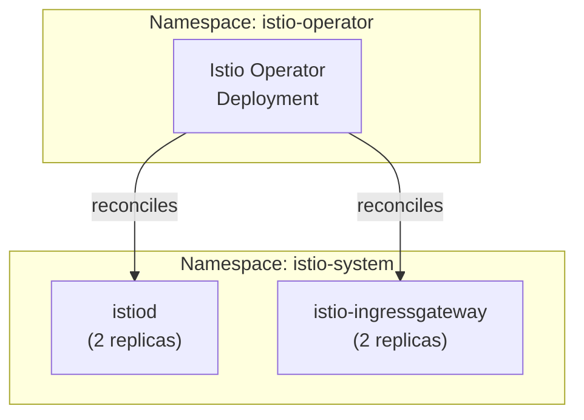

# Introduction

Istio Control Plane installs **istiod** (the Istio control plane) and the **ingress gateway** via the upstream `IstioOperator` API. This component deploys the core mesh infrastructure that enables sidecar injection, traffic management, and mTLS for all platform namespaces.

For open/resolved issues, see [docs/component-issues/istio.md](../../../../../../docs/component-issues/istio.md).

---

## Architecture



**Flow**:

1. Istio Operator watches for `IstioOperator` CRs
2. Operator deploys/manages istiod and ingress gateway
3. istiod configures sidecars via xDS protocol
4. Gateway API and ingress substrate components validate the routable VIP path separately

---

## Subfolders

| File | Purpose |
|------|---------|
| `kustomization.yaml` | Bundles all resources for Argo CD |
| `operator-namespace.yaml` | Creates `istio-operator` namespace |
| `crds.yaml` | Istio CRDs (~696KB, bundled from upstream) |
| `istio-operator-crd.yaml` | IstioOperator CRD for the operator itself |
| `operator-rendered.yaml` | Istio Operator Deployment + RBAC |
| `istio-operator.yaml` | IstioOperator CR with cluster-specific config |
| `overlays/` | Environment-specific patches (proxmox-talos) |

---

## Container Images / Artefacts

| Artefact | Version | Notes |
|----------|---------|-------|
| Istio | `1.23` (default profile) | Via IstioOperator CR |
| Istio CRDs | bundled | `crds.yaml` from Istio 1.23 release |
| Istio Operator | (matches Istio version) | `operator-rendered.yaml` |

---

## Dependencies

| Dependency | Purpose |
|------------|---------|
| MetalLB / ingress substrate | Provides and validates routable VIPs for gateway-facing Services |
| Gateway API CRDs | Required for Gateway/HTTPRoute resources |
| `istio-system` namespace | Created by this component |

---

## Communications With Other Services

### Kubernetes Service → Service Calls

| Caller | Target | Port | Protocol | Purpose |
|--------|--------|------|----------|---------|
| Sidecars | istiod | 15012 | gRPC (mTLS) | xDS configuration |
| Gateway API managed Services | `public-gateway-istio`, `tenant-*-gateway-istio` | 80, 443 | HTTP/HTTPS | Routable ingress substrate |
| istiod | kube-apiserver | 443 | HTTPS | Watch resources |

### External Dependencies (Vault, Keycloak, PowerDNS)

None for control plane itself. Ingress gateway is used by services that depend on PowerDNS for DNS.

### Mesh-level Concerns (DestinationRules, mTLS Exceptions)

- Control plane is the source of mesh configuration
- Ingress gateway requires PERMISSIVE PeerAuthentication for external TLS (configured in `mesh-security`)

---

## Initialization / Hydration

1. **Namespace created**: `istio-operator` and `istio-system`
2. **CRDs applied**: Istio CRDs + IstioOperator CRD
3. **Operator deployed**: Watches for IstioOperator CRs
4. **IstioOperator CR applied**: Triggers istiod + ingress deployment
5. **Pods become ready**: 2x istiod, 2x ingress gateway
6. **Gateway layer materializes routable Services**: VIP assignment and reachability are validated by the MetalLB and ingress substrate smoke components

No secrets or Vault integration required.

---

## Argo CD / Sync Order

| Property | Value |
|----------|-------|
| Sync wave | `-1` |
| Pre/PostSync hooks | None |
| Sync dependencies | Gateway API CRDs (wave `-2`), namespaces (wave `-2`) |

---

## Operations (Toils, Runbooks)

### Check Control Plane Health

```bash
kubectl -n istio-system get deploy istiod istio-ingressgateway
kubectl -n istio-system get pods -l istio
kubectl -n istio-system get svc istio-ingressgateway -o wide
```

### Check Operator Status

```bash
kubectl -n istio-operator get deploy
kubectl -n istio-operator logs deploy/istio-operator --tail=50
```

### Upgrade Istio Version

1. Update `istio-operator.yaml` with new version
2. Replace `crds.yaml` with new version's CRDs
3. Update `operator-rendered.yaml` if operator image changed
4. Capture evidence in `docs/evidence/` and update `docs/component-issues/istio.md` if any new follow-up work is discovered
5. Sync via Argo CD

---

## Customisation Knobs

| Knob | Location | Default |
|------|----------|---------|
| Istio profile | `base/istio-operator.yaml` | `default` |
| istiod replicas | `base/istio-operator.yaml` | `2` (mac-orbstack), `1` (mac-orbstack-single overlay) |
| Ingress replicas | `base/istio-operator.yaml` | `2` (mac-orbstack), `1` (mac-orbstack-single overlay) |
| Ingress VIP validation | `components/networking/metallb` + `components/networking/ingress/smoke-tests` | Cross-component |
| MetalLB pool | `base/istio-operator.yaml` | `orbstack-pool` |
| Access logging | `base/istio-operator.yaml` | `/dev/stdout` (mac-orbstack), disabled in mac-orbstack-single overlay |
| Proxy log level | `base/istio-operator.yaml` | `warning` |

Per-deployment overlays:
- `overlays/mac-orbstack/` (defaults)
- `overlays/mac-orbstack-single/` (low-footprint patch: replicas=1, access logs disabled)
- `overlays/proxmox-talos/` (prod-specific components)

---

## Oddities / Quirks

1. **Operator-based installation**: Uses IstioOperator CR rather than istioctl or Helm. The operator reconciles changes automatically.

2. **Large CRD file**: `crds.yaml` is ~696KB. Do not edit manually; regenerate from upstream releases.

3. **Anti-affinity configured**: Both istiod and ingress pods prefer different nodes via `podAntiAffinity`.

4. **Autoscale disabled**: `pilot.autoscaleEnabled: false` to keep replica count predictable.

---

## TLS, Access & Credentials

| Concern | Details |
|---------|---------|
| Ingress TLS | Terminated at ingress gateway; certs from Gateway listeners |
| Control plane TLS | istiod uses self-signed certs for xDS |
| Admin access | kubectl only; no web UI for istiod |

---

## Dev → Prod

| Aspect | Dev (mac-orbstack) | Prod (proxmox-talos) |
|--------|------------|----------------|
| Ingress VIPs | Gateway API managed services | Different IPs per environment |
| MetalLB pool | `orbstack-pool` | `proxmox-pool` |
| Replicas | 2 | 2 |

**Promotion**: Use `overlays/proxmox-talos/` to override MetalLB annotations for prod cluster.

---

## Smoke Jobs / Test Coverage

### Current State

| Job | Status |
|-----|--------|
| Control-plane readiness | ✅ Implemented (`Job/istio-control-plane-smoke`, PostSync hook) |
| Ingress VIP check | Covered by MetalLB + ingress substrate smokes |

This component ships a PostSync hook Job that proves:
1. `deploy/istiod` is rolled out
2. `deploy/istio-ingressgateway` is rolled out
3. `svc/istio-ingressgateway` exists
4. `svc/istio-ingressgateway` has ready backend endpoints

VIP assignment and ingress reachability are intentionally validated outside this component:
- `components/networking/metallb`
- `components/networking/ingress/smoke-tests`

Implementation:
- `tests/job-control-plane-smoke.yaml`
- `tests/rbac.yaml`

Inspect the hook Job:

```bash
kubectl -n istio-system get jobs | rg -n "istio-control-plane-smoke"
kubectl -n istio-system logs -l job-name=istio-control-plane-smoke --tail=200
```

---

## HA Posture

### Analysis

| Component | Replicas | HA Strategy |
|-----------|----------|-------------|
| **istiod** | 2 | `podAntiAffinity` ensures node spread |
| **ingress** | 2 | `podAntiAffinity` ensures node spread |
| **operator** | 1 | Operator failure does not affect data plane |

**PDBs**: Not explicitly defined in manifests (relies on default Istio behavior or missing).

**Gap**: If PDBs are missing, drain operations might violate availability. Check `kubectl get pdb -n istio-system`.

---

## Security

### Current Controls

| Layer | Control | Status |
|-------|---------|--------|
| **Control Plane** | xDS mTLS | ✅ Secured by internal root CA |
| **Ingress** | Privileged ports | ⚠️ Binds 80/443 (NetLB handles routing) |
| **RBAC** | Operator permissions | ✅ Scoped to known resources |
| **NetworkPolicy** | None | ⚠️ istiod accessible internally |

**Risk**: istiod debug interface (port 15014) and xDS (15012) are open to mesh.

---

## Backup and Restore

### Current State

| Aspect | Status |
|--------|--------|
| Persistent data | **None** (istiod is stateless) |
| Configuration | GitOps (IstioOperator CR) |

### Disaster Recovery

1. **Reinstall**: Re-applying `networking-istio-control-plane` restores components.
2. **CRD Warning**: If CRDs are deleted, the operator might stall. Re-apply `crds.yaml` first.

**Pivot**: If the operator fails to reconcile, use `istioctl install -f istio-operator.yaml` as a break-glass measure.
