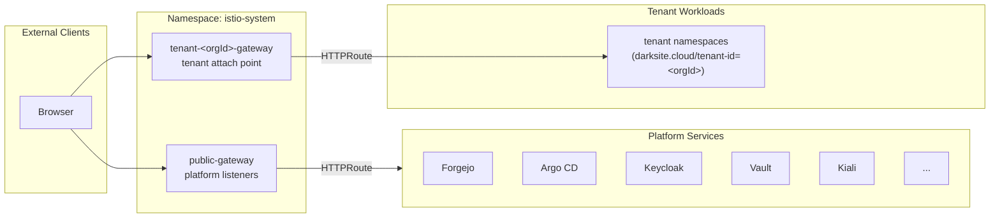

# Introduction

This component defines the **GatewayClass** and GitOps plumbing around Istio Gateway API ingress.

The **Gateway** objects themselves (`public-gateway` + `tenant-<orgId>-gateway`) are **controller-owned** and reconciled by the tenant provisioner controller:
- Sources: `tenancy.darksite.cloud/v1alpha1 Tenant` + `DeploymentConfig` (via `ConfigMap/argocd/deploykube-deployment-config`)
- Reconciler: `components/platform/tenant-provisioner`

For open/resolved issues, see [docs/component-issues/istio.md](../../../../../../docs/component-issues/istio.md).

---

## Architecture



**Flow**:

1. External client connects to the Istio-managed gateway service created for the `Gateway` (e.g., `public-gateway-istio`).
2. Gateway matches hostname/listener (e.g., `https-forgejo` on `public-gateway`).
3. TLS terminated using certificate from Secret (e.g., `forgejo-tls`) on HTTPS listeners.
4. Traffic forwarded to backend service via attached `HTTPRoute`.

---

## Subfolders

| File | Purpose |
|------|---------|
| `kustomization.yaml` | Component root (entrypoint) |
| `base/` | Shared resources: `GatewayClass`, namespace label patches, smoke job RBAC, PostSync smoke job |

---

## Container Images / Artefacts

This component does **not** deploy any container images—it only creates Gateway API resources.

| Artefact | Version | Notes |
|----------|---------|-------|
| Gateway API resources | v1 | GatewayClass (Gateways are controller-owned) |

---

## Dependencies

| Dependency | Purpose |
|------------|---------|
| Gateway API CRDs | Required for Gateway/GatewayClass resources |
| Istio control plane | Provides the `istio.io/gateway-controller` |
| cert-manager + Step CA | Issues TLS certificates for listeners |
| TLS Secrets | `*-tls` Secrets must exist in `istio-system` |

---

## Communications With Other Services

### Kubernetes Service → Service Calls

| Caller | Target | Port | Protocol | Purpose |
|--------|--------|------|----------|---------|
| istio-ingressgateway | Backend services | various | HTTP | Routed via HTTPRoutes |

### External Dependencies (Vault, Keycloak, PowerDNS)

- **PowerDNS**: All hostnames must resolve to ingress gateway IP
- **cert-manager**: Issues certificates mounted as Secrets

### Mesh-level Concerns (DestinationRules, mTLS Exceptions)

- Gateway uses TLS Secrets from `istio-system` namespace
- Backend routing follows HTTPRoute → Service mapping

---

## Initialization / Hydration

1. **GatewayClass created**: Binds Gateway API to Istio controller
2. **Tenant provisioner reconciles Gateways**:
   - `public-gateway`: defines 9 HTTPS listeners + 1 HTTP listener (platform services), derived from DeploymentConfig.
   - `tenant-<orgId>-gateway`: per-org tenant ingress attach point with `allowedRoutes` restricted to namespaces labeled `darksite.cloud/tenant-id=<orgId>`, and `http`/`https` listeners scoped to `*.<orgId>.workloads.<baseDomain>`, derived from `Tenant.spec.orgId` + DeploymentConfig.
3. **Istio reconciles Gateways**: Gateway API controller materializes `*-istio` gateway Deployments/Services.
4. **TLS Secrets mounted**: Certificates from cert-manager (public gateway HTTPS listeners + per-tenant wildcard certs for tenant gateways).
5. **HTTPRoutes attach**: Platform and tenant `HTTPRoute`s attach to the appropriate Gateway (enforced for tenants by admission guardrails).

---

## Argo CD / Sync Order

| Property | Value |
|----------|-------|
| Sync wave | `1` |
| Pre/PostSync hooks | `Job/istio-gateway-smoke` (PostSync) |
| Sync dependencies | Gateway API CRDs (wave `-2`), control-plane (wave `-1`), TLS certificates |

---

## Operations (Toils, Runbooks)

### Check Gateway Status

```bash
kubectl -n istio-system get gateway public-gateway -o yaml
kubectl -n istio-system get gateway tenant-<orgId>-gateway -o yaml
kubectl -n istio-system get gatewayclass istio
kubectl -n istio-system get gateway | rg -n '^tenant-'
```

### List Listeners

```bash
kubectl -n istio-system get gateway public-gateway \
  -o jsonpath='{range.spec.listeners[*]}{.name}{"\t"}{.hostname}{"\n"}{end}'
```

### Verify TLS Certificates

```bash
# Check all TLS secrets exist
for cert in forgejo argocd keycloak vault kiali hubble garage grafana; do
  kubectl -n istio-system get secret ${cert}-tls
done

# Tenant wildcard certs live in istio-system and follow:
#   tenant-<orgId>-workloads-wildcard-tls
```

---

## Customisation Knobs

| Knob | Location | Default |
|------|----------|---------|
| Hostnames | `platform/gitops/deployments/<deploymentId>/config.yaml` (`spec.dns.hostnames.*`) | Deployment-specific |
| Certificate Secrets | tenant provisioner controller | `*-tls` per listener |
| Allowed namespaces | tenant provisioner controller + `base/namespaces-public-gateway-allowedroutes.yaml` | `public-gateway`: `Selector` (`deploykube.gitops/public-gateway=allowed`); `tenant-<orgId>-gateway`: `Selector` (`darksite.cloud/tenant-id=<orgId>`) |
| Tenant gateways | `platform/gitops/apps/tenant-api/base/tenant-<orgId>.yaml` (`Tenant`) | One `tenant-<orgId>-gateway` per Tenant |
| Tenant workloads DNS/TLS | `components/dns/external-sync` + `components/platform/tenant-provisioner` | `*.<orgId>.workloads.<baseDomain>` (per-tenant wildcard) |

Validate:

```bash./tests/scripts/validate-istio-gateway.sh
```

---

## Oddities / Quirks

1. **Per-hostname listeners**: Each service gets its own HTTPS listener rather than wildcard. This allows independent TLS cert management and HTTPRoute sequencing.

2. **HTTP listener for ACME**: Port 80 listener (`http`) exists for HTTP-01 ACME challenges and redirects.

3. **Platform-only route attachment**: `allowedRoutes.namespaces.from: Selector` restricts `Gateway/public-gateway` attachments to namespaces labeled `deploykube.gitops/public-gateway=allowed`.

4. **Per-tenant Gateway blast radius**: each `tenant-<orgId>-gateway` materializes its own Istio-managed gateway Deployment/Service (`tenant-<orgId>-gateway-istio`) and consumes a LoadBalancer IP. Treat MetalLB pool sizing and gateway replica budgets as a product readiness gate.

---

## TLS, Access & Credentials

| Concern | Details |
|---------|---------|
| TLS mode | `Terminate` at Gateway |
| Certificates | Step CA via cert-manager |
| Secrets namespace | `istio-system` |

**HTTPS Listeners** (derived from DeploymentConfig; names and `*-tls` secrets are stable):

| Listener | Hostname | Certificate Secret |
|----------|----------|-------------------|
| `https-forgejo` | `spec.dns.hostnames.forgejo` | `forgejo-tls` |
| `https-argocd` | `spec.dns.hostnames.argocd` | `argocd-tls` |
| `https-keycloak` | `spec.dns.hostnames.keycloak` | `keycloak-tls` |
| `https-vault` | `spec.dns.hostnames.vault` | `vault-tls` |
| `https-kiali` | `spec.dns.hostnames.kiali` | `kiali-tls` |
| `https-hubble` | `spec.dns.hostnames.hubble` | `hubble-tls` |
| `https-garage` | `spec.dns.hostnames.garage` | `garage-tls` |
| `https-grafana` | `spec.dns.hostnames.grafana` | `grafana-tls` |

**Tenant gateway listeners** (derived from `Tenant` + DeploymentConfig):
- Listener hostname contract: `*.<orgId>.workloads.<baseDomain>`
- Certificate Secret: `tenant-<orgId>-workloads-wildcard-tls` (wildcard `Certificate` is reconciled by `components/platform/tenant-provisioner`)

---

## Dev → Prod

| Aspect | Dev | Prod |
|--------|-----|------|
| Hostnames | from `DeploymentConfig` | from `DeploymentConfig` |
| Gateway LB IP | unset (default) | optional pinned IP via `spec.network.vip.publicGatewayIP` |

**Promotion**: update `platform/gitops/deployments/<deploymentId>/config.yaml` and let the controller reconcile (no rendered overlays).

---

## Smoke Jobs / Test Coverage

### Current State

| Job | Status |
|-----|--------|
| Gateway status check | ✅ Implemented (`Job/istio-gateway-smoke`, PostSync hook) |
| Listener verification | ✅ Implemented (`Job/istio-gateway-smoke`, PostSync hook) |

This component ships a PostSync hook Job that proves:
1. `Gateway/public-gateway` is `Accepted=True`
2. `Gateway/public-gateway` is `Programmed=True`
3. The expected listener names exist (`http`, `https-*`)

Note: tenant gateway pattern enforcement (tenant `HTTPRoute` parentRefs + `allowedRoutes` selectors) is proven by the Kyverno smoke suite (`CronJob/policy-kyverno-smoke-baseline`).

Implementation (in `base/`):
- `rbac.yaml`
- `job-gateway-smoke.yaml`

Inspect the hook Job:

```bash
kubectl -n istio-system get jobs | rg -n "istio-gateway-smoke"
kubectl -n istio-system logs -l job-name=istio-gateway-smoke --tail=200
```

---

## HA Posture

### Analysis

| Aspect | Status | Details |
|--------|--------|---------|
| Component | ⚪ N/A | Definition only (GatewayClass + Gateway) |
| Runtime | ✅ HA | Depends on Istio-managed gateway Deployments created from the `Gateway` objects (e.g., `public-gateway-istio`, `tenant-*-gateway-istio`). |

**Conclusion**: This component defines the desired state. Runtime availability depends on the gateway Deployments/Services that the Istio Gateway API controller reconciles from these `Gateway` objects.

---

## Security

### Current Controls

| Layer | Control | Status |
|-------|---------|--------|
| **TLS** | Terminate | ✅ Decrypts at edge, re-encrypts if needed |
| **Certs** | Step CA | ✅ Automated issuance via cert-manager |
| **Listener** | Isolation | ✅ Dedicated listener per hostname |

### Security Analysis

**TLS Termination**:
- **Pros**: Centralized certificate management; WAF/policy injection point.
- **Cons**: Traffic is plaintext inside the pod before entering the mesh (though `loopback` interface limits exposure).

**Gap**: HTTP port 80 is open for ACME. Ensure HTTP->HTTPS redirect is enforced by HTTPRoutes attached to it.

---

## Backup and Restore

### Current State

| Aspect | Status |
|--------|--------|
| Persistent data | **None** |
| Configuration | GitOps (Gateway manifest) |

**No backup mechanism needed.** Re-applying the manifest restores the Gateway configuration.
