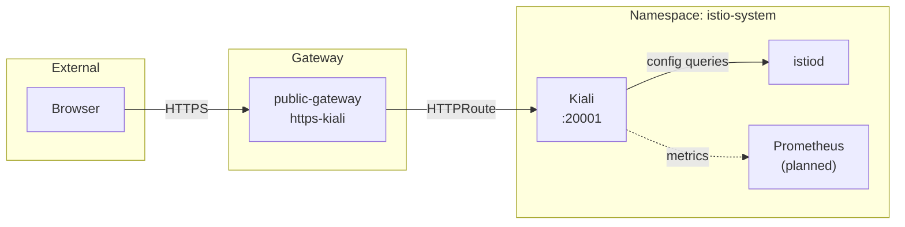

# Introduction

Kiali provides a **visualization dashboard** for Istio traffic and configuration. This component deploys Kiali via Helm chart and exposes it through the shared public Gateway with a Step CA certificate.

For open/resolved issues, see [docs/component-issues/istio.md](../../../../../../docs/component-issues/istio.md).

---

## Architecture



**Flow**:

1. User accesses `https://kiali.dev.internal.example.com`
2. Traffic terminates at Gateway with `kiali-tls` certificate
3. HTTPRoute forwards to Kiali service on port 20001
4. Kiali queries istiod for mesh configuration
5. Kiali queries Prometheus for metrics (when available)

---

## Subfolders

| File | Purpose |
|------|---------|
| `kustomization.yaml` | Helm chart reference + resources |
| `values.yaml` | Kiali Helm chart values |
| `charts/kiali-server/` | Vendored Kiali Helm chart content used by `helmGlobals.chartHome` |
| `httproute.yaml` | Routes traffic from Gateway to Kiali |
| `destinationrule.yaml` | mTLS configuration for Kiali backend |
| `overlays/` | Environment-specific values (hostnames) |

---

## Container Images / Artefacts

| Artefact | Version | Notes |
|----------|---------|-------|
| Kiali Helm chart | `2.15.0` | Vendored at `platform/gitops/components/networking/istio/kiali/charts/kiali-server` (upstream source: `https://kiali.org/helm-charts`) |
| Kiali container | (chart default) | `quay.io/kiali/kiali` |

---

## Dependencies

| Dependency | Purpose |
|------------|---------|
| Istio control plane | Kiali queries istiod for configuration |
| Gateway (`public-gateway`) | Parent for HTTPRoute |
| `kiali-tls` certificate | TLS for HTTPS listener |
| Prometheus (optional) | Metrics for traffic graphs |

---

## Communications With Other Services

### Kubernetes Service → Service Calls

| Caller | Target | Port | Protocol | Purpose |
|--------|--------|------|----------|---------|
| Gateway | kiali | 20001 | HTTP | Dashboard traffic |
| Kiali | istiod | 8080 | HTTP | Config queries |
| Kiali | prometheus | 9090 | HTTP | Metrics (when available) |

### External Dependencies (Vault, Keycloak, PowerDNS)

- **PowerDNS**: DNS record for `kiali.{env}.internal.example.com`
- **Keycloak**: Future OIDC integration (not yet configured)

### Mesh-level Concerns (DestinationRules, mTLS Exceptions)

- Kiali pod has sidecar injected (`sidecar.istio.io/inject: "true"`)
- Participates in mesh-wide STRICT mTLS

---

## Initialization / Hydration

1. **Helm chart deployed**: Kiali Deployment + Service
2. **HTTPRoute created**: Binds to Gateway listener
3. **Pod starts with sidecar**: Mesh-injected
4. **Dashboard accessible**: Via `https://kiali.{env}.internal.example.com`

No secrets or Vault integration required—uses anonymous auth.

---

## Argo CD / Sync Order

| Property | Value |
|----------|-------|
| Sync wave | `5` |
| Pre/PostSync hooks | None |
| Sync dependencies | control-plane, gateway, mesh-security |

---

## Operations (Toils, Runbooks)

### Access Kiali Dashboard

```bash
# Via ingress (requires Step CA trust)
open https://kiali.dev.internal.example.com

# Via port-forward
kubectl -n istio-system port-forward svc/kiali 20001:20001
open http://localhost:20001
```

### Check Kiali Health

```bash
kubectl -n istio-system get pods -l app.kubernetes.io/name=kiali
kubectl -n istio-system logs deploy/kiali --tail=50
```

---

## Customisation Knobs

| Knob | Location | Default |
|------|----------|---------|
| Auth strategy | `values.yaml` | `openid` |
| Sidecar injection | `values.yaml` | `true` |
| Service type | `values.yaml` | `ClusterIP` |
| Web FQDN | `values.yaml` | `kiali.dev.internal.example.com` |
| Prometheus URL | `values.yaml` | `http://prometheus.istio-system:9090` |

---

## Oddities / Quirks

1. **OIDC TLS trust (temporary)**: Keycloak is served with a Step CA certificate. Kiali currently sets `auth.openid.insecure_skip_verify_tls: true` until we ship a proper CA bundle into the Kiali container trust store (preferably via the `kiali-cabundle` mount).

2. **Prometheus not deployed**: Kiali expects Prometheus at `prometheus.istio-system:9090` which doesn't exist yet. Graphs will be empty until observability stack lands.

3. **Built-in ingress disabled**: Uses shared Gateway via HTTPRoute rather than Kiali's built-in ingress.

4. **View-only mode enabled**: Kiali is configured as view-only (`deployment.view_only_mode: true`) to reduce blast radius while tenancy boundaries are still being tightened.

---

## TLS, Access & Credentials

| Concern | Details |
|---------|---------|
| External TLS | HTTPS via `kiali-tls` cert from Step CA |
| Internal TLS | mTLS via Istio sidecar |
| Authentication | Keycloak OIDC (`deploykube-admin` realm) |
| Admin access | Keycloak-gated; Kiali itself is in view-only mode |

---

## Dev → Prod

| Aspect | Dev (overlays/dev) | Prod (overlays/prod) |
|--------|------------|----------------|
| Hostname | `kiali.dev.internal.example.com` | `kiali.prod.internal.example.com` |
| Auth | Keycloak OIDC | Keycloak OIDC |

**Promotion**: Use `overlays/prod/` to override hostname (and keep OIDC config aligned with the environment’s Keycloak host).

---

## Smoke Jobs / Test Coverage

### Current State

| Job | Status |
|-----|--------|
| Auth configuration + secret projection | ✅ `Job/kiali-oidc-smoke` (PostSync) |
| Ingress substrate reachability (all hosts) | ✅ `CronJob/ingress-smoke-substrate` (in `components/networking/ingress/smoke-tests/`) |

---

## HA Posture

### Analysis

| Aspect | Status | Details |
|--------|--------|---------|
| Replicas | ✅ 2 | `deployment.replicas: 2` in overlays |
| PDBs | ✅ Present | `PodDisruptionBudget/kiali` with `minAvailable: 1` |
| State | ✅ Minimal | Fetches live from istiod/prom; no DB |

**Conclusion**: Kiali now tolerates a single pod disruption, but still depends on the rest of the mesh/control-plane for correctness.

---

## Security

### Current Controls

| Layer | Control | Status |
|-------|---------|--------|
| **Auth** | Anonymous | ❌ **Critical Gap**: Full admin access to anyone |
| **Transport** | TLS | ✅ HTTPS (ingress) + mTLS (mesh) |
| **Permissions** | ServiceAccount | ⚠️ Reads all config; limited write |

### Security Analysis

**Anonymous Authentication**:
- **Why**: Low friction for initial bootstrap.
- **Risk**: Any user who can reach the ingress (requires Step CA cert to trust) gets full view of the mesh topology and config. View-only mode reduces write blast radius but does not solve the exposure issue.

**Recommendation**: Switch `auth.strategy` to `openid` (Keycloak) immediately for any shared environment.

---

## Backup and Restore

### Current State

| Aspect | Status |
|--------|--------|
| Persistent data | **None** |
| Configuration | GitOps (Values/Chart) |

**No backup mechanism needed.** Kiali is a stateless visualizer.
