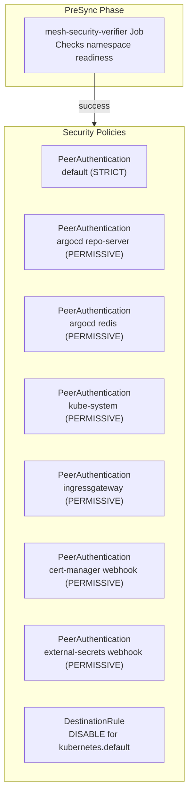

# Introduction

Istio Mesh Security enforces **STRICT mutual TLS** across the service mesh once all platform namespaces have injected sidecars. This component deploys PeerAuthentication policies, DestinationRules, and a PreSync verifier Job that blocks STRICT enforcement when prerequisites are missing.

For open/resolved issues, see [docs/component-issues/istio.md](../../../../../../docs/component-issues/istio.md).

---

## Architecture



**Flow**:

1. PreSync Job validates all mesh namespaces have ready sidecars
2. If validation passes, Argo applies security policies
3. STRICT mTLS enforced mesh-wide with explicit exceptions
4. kube-system and ingress gateway remain PERMISSIVE

---

## Subfolders

| File | Purpose |
|------|---------|
| `kustomization.yaml` | Bundles all policies and verifier Job |
| `peer-authentication-default.yaml` | Mesh-wide STRICT mTLS |
| `peer-authentication-argocd-repo-server.yaml` | PERMISSIVE for Argo CD repo-server |
| `peer-authentication-argocd-redis.yaml` | PERMISSIVE for Argo CD redis |
| `peer-authentication-argocd-redis-ha.yaml` | PERMISSIVE for Argo CD redis-ha servers |
| `peer-authentication-argocd-redis-ha-haproxy.yaml` | PERMISSIVE for Argo CD redis-ha haproxy |
| `peer-authentication-kube-system.yaml` | PERMISSIVE for kube-system namespace |
| `peer-authentication-ingressgateway.yaml` | PERMISSIVE for external TLS termination |
| `peer-authentication-cert-manager-webhook.yaml` | PERMISSIVE for cert-manager admission webhook |
| `peer-authentication-external-secrets-webhook.yaml` | PERMISSIVE for external-secrets admission webhook |
| `destination-rule-kube-apiserver.yaml` | Disables mTLS for `kubernetes.default.svc` |
| `destination-rule-argocd-redis-ha.yaml` | Disables mTLS for Argo CD redis-ha services |
| `destination-rule-argocd-redis-ha-haproxy.yaml` | Disables mTLS for Argo CD redis-ha haproxy |
| `destination-rule-argocd-redis-ha-announce-*.yaml` | Disables mTLS for Argo CD redis-ha announce services |
| `job-mesh-security-verifier.yaml` | PreSync Job checking sidecar readiness |
| `job-mesh-posture-smoke.yaml` | PostSync Job proving auto-mTLS posture (in-mesh ↔ in-mesh, in-mesh → out-of-mesh) |
| `rbac.yaml` | ServiceAccount + ClusterRole for verifier |
| `rbac-mesh-posture-smoke.yaml` | ServiceAccount + Role/RoleBinding for posture smoke job |
| `scripts/` | Verifier shell script |

---

## Container Images / Artefacts

| Artefact | Version | Notes |
|----------|---------|-------|
| Verifier Job image | `registry.example.internal/deploykube/bootstrap-tools:1.4` | Used for namespace inspection |
| Posture smoke Job image | `registry.example.internal/deploykube/bootstrap-tools:1.4` | Reuses its own running image (so prod local-registry overrides apply) |
| Policies | Istio v1beta1 | PeerAuthentication, DestinationRule |

---

## Dependencies

| Dependency | Purpose |
|------------|---------|
| Istio control plane | Must be running for policies to take effect |
| Mesh namespaces | All platform namespaces must have sidecars |
| Ingress gateway | Must have PERMISSIVE exception |

---

## Communications With Other Services

### Kubernetes Service → Service Calls

No direct service calls—this component only defines policies.

### External Dependencies (Vault, Keycloak, PowerDNS)

None.

### Mesh-level Concerns (DestinationRules, mTLS Exceptions)

This component **defines** the mesh-level mTLS configuration:

| Policy | Scope | Mode | Reason |
|--------|-------|------|--------|
| `default` | mesh-wide | STRICT | Enforce mTLS everywhere |
| `argocd-repo-server-permissive` | selector | PERMISSIVE | Argo CD repo-server must stay reachable |
| `argocd-redis-permissive` | selector | PERMISSIVE | Argo CD redis must stay reachable |
| `argocd-redis-ha-permissive` | selector | PERMISSIVE | Argo CD redis-ha servers are plain TCP |
| `argocd-redis-ha-haproxy-permissive` | selector | PERMISSIVE | Argo CD redis-ha haproxy is plain TCP |
| `kube-system-permissive` | kube-system | PERMISSIVE | Non-injected system pods |
| `ingressgateway-permissive` | ingress pods | PERMISSIVE | External TLS termination |
| `cert-manager-webhook-permissive` | selector | PERMISSIVE | Kubernetes apiserver admission webhooks |
| `external-secrets-webhook-permissive` | selector | PERMISSIVE | Kubernetes apiserver admission webhooks |
| `kube-apiserver` DestinationRule | kubernetes.default | DISABLE | API server access |
| `argocd-redis-ha*` DestinationRules | argocd redis-ha services | DISABLE | Redis is plain TCP (avoid TLS `WRONG_VERSION_NUMBER`) |

**Multitenancy note (Tier S):**
- This component intentionally does **not** ship a mesh-wide `DestinationRule` forcing `ISTIO_MUTUAL` for `*.local`.
  - Rationale: it creates `DestinationRule tls.mode: DISABLE` exception sprawl when callers are in-mesh and backends are intentionally out-of-mesh.
  - Instead, rely on Istio auto-mTLS for in-mesh ↔ in-mesh, and keep explicit `tls.mode: DISABLE` only for known out-of-mesh dependencies.
  - See: `docs/design/multitenancy-networking.md#dk-mtn-tenant-workloads-vs-mesh`

#### Out-of-mesh TCP dependencies (explicit exceptions)

Not everything runs in-mesh. In particular, operators/controllers and some stateful stores may be **intentionally out-of-mesh** for reliability.

If an in-mesh workload needs to call an out-of-mesh TCP Service (common examples: Postgres/Valkey), STRICT mTLS means Envoy will attempt to use mTLS and the connection may fail (e.g., `filter_chain_not_found`).

The supported pattern is:
1. Keep the target workload out-of-mesh (if that’s the chosen posture).
2. Add an explicit `DestinationRule` for the target Service host with `tls.mode: DISABLE`.
3. Lock the dependency down with NetworkPolicies and service-native auth/TLS where possible.

Keep these exceptions narrowly scoped (per host) and treat them as part of the mesh security contract.

---

## Initialization / Hydration

1. **PreSync Job runs**: Validates namespaces have ready sidecars
2. **Job succeeds**: All checks pass
3. **Policies applied**: PeerAuthentication + DestinationRules
4. **mTLS enforced**: Mesh traffic now requires mutual TLS
5. **Exceptions active**: kube-system and ingress remain accessible

---

## Argo CD / Sync Order

| Property | Value |
|----------|-------|
| Sync wave | `4` |
| Pre/PostSync hooks | `mesh-security-verifier` (PreSync), `istio-mesh-posture-smoke` (PostSync) |
| Sync dependencies | control-plane, gateway, all workload pods injected |

The PreSync Job prevents STRICT enforcement if workloads aren't ready.

---

## Operations (Toils, Runbooks)

### Check mTLS Status

```bash
# View PeerAuthentication policies
kubectl -n istio-system get peerauthentication

# View DestinationRules
kubectl -n istio-system get destinationrule
```

### View Verifier Logs

```bash
kubectl -n istio-system logs job/mesh-security-verifier
```

### View Mesh Posture Smoke Logs

```bash
kubectl -n istio-system logs job/istio-mesh-posture-smoke
```

### Add mTLS Exception

1. Create PeerAuthentication with `PERMISSIVE` mode for the target namespace/selector
2. Add DestinationRule with `tls.mode: DISABLE` if client-side exception needed
3. Document in `docs/component-issues/istio.md`

---

## Customisation Knobs

| Knob | Location | Default |
|------|----------|---------|
| Default mTLS mode | `peer-authentication-default.yaml` | `STRICT` |
| kube-system mode | `peer-authentication-kube-system.yaml` | `PERMISSIVE` |
| Verifier namespaces | `job-mesh-security-verifier.yaml` env var | List of platform namespaces |

---

## Oddities / Quirks

1. **PreSync blocks deployment**: If any namespace fails sidecar checks, the sync hangs until fixed or sync is cancelled.

2. **Job ignores Job/CronJob pods**: Verifier only validates long-running workloads; transient batch pods are skipped.

3. **kube-apiserver exception required**: Without the DestinationRule exception, Jobs running `kubectl` would fail with TLS errors.

4. **Ingress gateway must be PERMISSIVE**: External clients don't have mesh certs; ingress terminates external TLS then initiates mTLS internally.

5. **Admission webhooks must be PERMISSIVE**: The Kubernetes apiserver is not in-mesh; webhook deployments can be mesh-injected, but must accept non-mTLS traffic.

6. **Argo CD has TCP dependencies**: Argo CD’s redis and repo-server traffic is affected by Cilium kube-proxy replacement DNAT; keep those workloads PERMISSIVE to avoid deadlocking GitOps under STRICT.

---

## TLS, Access & Credentials

| Concern | Details |
|---------|---------|
| mTLS | STRICT by default, PERMISSIVE exceptions |
| Credentials | None—Istio manages mesh certificates |

---

## Dev → Prod
- This component has no overlays; manifests are identical across deployments.

---

## Smoke Jobs / Test Coverage

### Current State

| Job | Status |
|-----|--------|
| `mesh-security-verifier` | ✅ **Implemented** (PreSync) |
| `istio-mesh-posture-smoke` | ✅ **Implemented** (PostSync) |

This component **includes its own smoke test infrastructure**:
- The PreSync Job `mesh-security-verifier` acts as a mandatory gate before policies are applied.
- The PostSync Job `istio-mesh-posture-smoke` proves the selected multitenancy mesh posture (auto-mTLS; no global `*.local` client-side forcing).

**Checks performed**:
1. Enumerates all namespaces in `REQD_NAMESPACES`.
2. Verifies `istio-injection=enabled` label.
3. Checks that all running pods in those namespaces have an `istio-proxy` container.

**Pass Criteria**:
- All platform namespaces have labels.
- All pods (except Jobs/CronJobs) have sidecars.

**Fail Behavior**:
- Job fails -> Argo CD sync fails -> STRICT mTLS policies are **not applied**, preventing outage.

---

## HA Posture

### Analysis

| Aspect | Status | Details |
|--------|--------|---------|
| Component | ⚪ N/A | Policy documents only |
| Runtime | ✅ HA | Distributed enforcement (Envoy sidecars) |

**Conclusion**: Mesh security is distributed. Enforcement happens at every sidecar. There is no central point of failure for enforcement (though control plane is needed for config updates).

---

## Security

### Current Controls

| Layer | Control | Status |
|-------|---------|--------|
| **Encryption** | mTLS | ✅ STRICT mesh-wide |
| **Exceptions** | Allowlist | ✅ Explicit Permissive policies |
| **Verify** | Pre-flight | ✅ Verifier Job prevents broken mesh |

### Security Analysis

**STRICT mTLS**:
- **Scope**: All platform namespaces.
- **Exceptions**: `kube-system` (legacy/system pods), `istio-ingressgateway` (external termination).
- **Enforcement**: Rejected at sidecar level if no cert provided.

**Risk**: If sidecar injection fails silently, Pod would start without proxy.
- **Mitigation**: `mesh-security-verifier` blocks the sync.
- **Mitigation**: `PeerAuthentication` applies at namespace level, so even un-injected pods would be rejected by injected peers expecting mTLS (though un-injected pods couldn't *initiate* mTLS).

---

## Backup and Restore

### Current State

| Aspect | Status |
|--------|--------|
| Persistent data | **None** |
| Configuration | GitOps (Policies) |

**No backup mechanism needed.** Re-applying manifests restores the security posture.
