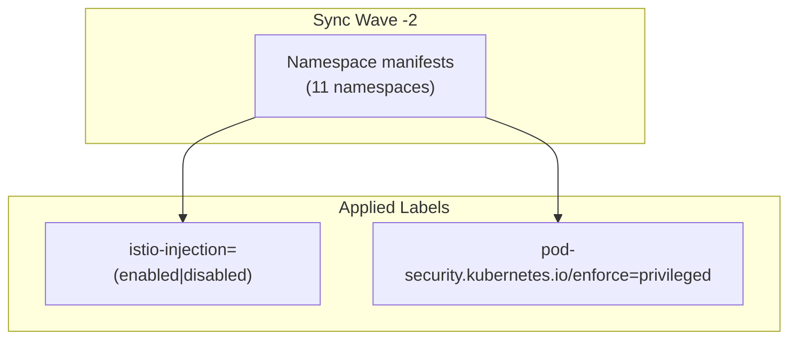

# Introduction

Istio Namespaces centralizes the **platform namespace definitions** with Istio injection labels and Pod Security Admission (PSA) exceptions. This component runs at sync wave `-2` to ensure all namespaces exist with proper labels before the Istio control plane or any workloads deploy.

For open/resolved issues, see [docs/component-issues/istio.md](../../../../../../docs/component-issues/istio.md).

---

## Architecture



**Purpose**:

1. Creates all platform namespaces before any other component
2. Applies `istio-injection` labels for the intended mesh posture (`enabled` for most namespaces; `disabled` for selected namespaces like `cnpg-system` and `cert-manager`)
3. Applies PSA labels:
   - `privileged` by default (until Istio CNI is adopted),
   - explicit exceptions can override (e.g., `cnpg-system` is kept out-of-mesh and enforces `restricted`).

---

## Subfolders

| File | Purpose |
|------|---------|
| `kustomization.yaml` | Bundles all namespace manifests |
| `argocd.yaml` | Namespace for Argo CD |
| `forgejo.yaml` | Namespace for Forgejo |
| `keycloak.yaml` | Namespace for Keycloak |
| `vault-system.yaml` | Namespace for Vault |
| `dns-system.yaml` | Namespace for PowerDNS |
| `cert-manager.yaml` | Namespace for cert-manager |
| `step-system.yaml` | Namespace for Step CA |
| `cnpg-system.yaml` | Namespace for CloudNativePG |
| `external-secrets.yaml` | Namespace for External Secrets |
| `platform-ops.yaml` | Namespace for platform operations |
| `patches/` | Optional patches for specific environments |

---

## Container Images / Artefacts

This component does **not** deploy any container images—it only creates Namespace resources.

| Artefact | Version | Notes |
|----------|---------|-------|
| Namespace manifests | N/A | Core Kubernetes resources |

---

## Dependencies

| Dependency | Purpose |
|------------|---------|
| None | This is one of the first components to sync |

---

## Communications With Other Services

### Kubernetes Service → Service Calls

None—this component only creates namespaces.

### External Dependencies (Vault, Keycloak, PowerDNS)

None.

### Mesh-level Concerns (DestinationRules, mTLS Exceptions)

- Most namespaces receive `istio-injection=enabled` label
- Some namespaces are intentionally out-of-mesh (`istio-injection=disabled`) and are explicitly onboarded later

---

## Initialization / Hydration

1. **Argo CD syncs at wave -2**: Before all other components
2. **Namespaces created**: With injection + PSA labels
3. **No further initialization**: Ready for workloads

---

## Argo CD / Sync Order

| Property | Value |
|----------|-------|
| Sync wave | `-2` |
| Pre/PostSync hooks | None |
| Sync dependencies | None—this syncs first |

---

## Operations (Toils, Runbooks)

### Check Namespace Labels

```bash
kubectl get ns --show-labels | grep istio-injection
```

### Verify Specific Namespace

```bash
kubectl get ns argocd -o yaml | grep -A5 labels
```

### Add New Mesh Namespace

1. Create new YAML file in this directory
2. Include labels:
   ```yaml
   labels:
     istio-injection: enabled
     pod-security.kubernetes.io/enforce: privileged
     pod-security.kubernetes.io/audit: privileged
     pod-security.kubernetes.io/warn: privileged
   ```
3. Add to `kustomization.yaml` resources
4. Sync via Argo CD

---

## Customisation Knobs

| Knob | Location | Default |
|------|----------|---------|
| Injection label | Each namespace YAML | `istio-injection=(enabled|disabled)` |
| PSA enforcement | Each namespace YAML | `privileged` |
| Namespace list | `kustomization.yaml` | 11 platform namespaces |

---

## Oddities / Quirks

1. **PSA privileged required**: Istio's `istio-init` container requires `NET_ADMIN/NET_RAW` for iptables programming. Without PSA exception, pod admission fails.

2. **Centralised declaration**: All platform namespaces are defined here rather than using `CreateNamespace=true` in each Argo app. This prevents race conditions.

3. **Batch job contract**: Any Job/CronJob in these namespaces must include `sidecar.istio.io/nativeSidecar: "true"` annotation for clean termination.

4. **No kube-system**: `kube-system` is deliberately excluded—its pods are not mesh-injected.

---

## TLS, Access & Credentials

| Concern | Details |
|---------|---------|
| TLS | N/A—namespaces don't handle TLS |
| Credentials | None |

---

## Dev → Prod

| Aspect | Dev (overlays/dev) | Prod (overlays/prod) |
|--------|------------|----------------|
| Namespaces | Same set | Same set |
| Labels | Same | Same |

No environment-specific changes—namespace configuration is identical across environments.

---

## Smoke Jobs / Test Coverage

### Current State

| Job | Status |
|-----|--------|
| Label verification | ✅ `Job/istio-namespaces-smoke` (PostSync hook; `tests/`) |

---

## HA Posture

### Analysis

| Aspect | Status | Details |
|--------|--------|---------|
| Component | ⚪ N/A | Namespace resources only (stored in etcd) |

**Conclusion**: This component has no runtime HA concerns. Durability relies on etcd HA.

---

## Security

### Current Controls

| Layer | Control | Status |
|-------|---------|--------|
| **PSA** | `privileged` enforcement | ⚠️ **Exception** managed here |
| **Isolation** | Namespaces created | ✅ Standard isolation |
| **Labels** | Injection enabled | ✅ Ensures mesh security features |

### Security Analysis

**PSA Privileged Exception**:
- **Why**: Istio's init container (`istio-init`) needs `NET_ADMIN` and `NET_RAW` capabilities to program iptables for traffic interception.
- **Risk**: Allows any pod in these namespaces to theoretically request privileged capabilities if not restricted by other means (e.g., OPA Gatekeeper or bespoke Policy).
- **Mitigation**: This is standard for sidecar-based meshes. Ambient mesh (future) removes this requirement.

---

## Backup and Restore

### Current State

| Aspect | Status |
|--------|--------|
| Persistent data | **None** |
| Configuration | GitOps-managed |

**No backup mechanism needed.** Re-applying the manifests restores the namespaces and labels.
