# Introduction

MetalLB provides a **LoadBalancer implementation** for bare-metal clusters (OrbStack, Proxmox/Talos) that don't run on cloud providers. It allocates stable IPs to Services of `type: LoadBalancer`, allowing traffic to enter the cluster without `kubectl port-forward`.

This component manages the **configuration** (IPAddressPools, advertisements) that drives the MetalLB controller.

The installation itself is handled via Helm in a separate Argo app (`Application/networking-metallb`), but the Helm chart is **vendored in-repo** so GitOps does not need to fetch public Helm repos at runtime:
- `platform/gitops/components/networking/metallb/helm/charts/metallb-0.15.2/metallb`

For open/resolved issues, see [docs/component-issues/metallb.md](../../../../../docs/component-issues/metallb.md).

---

## Architecture

```mermaid
flowchart TB
    subgraph metallb-system["Namespace: metallb-system"]
        CTRL["Controller<br/>(Deployment)"]
        SPK["Speaker<br/>(DaemonSet)"]
        POOL["IPAddressPool<br/>(CRD)"]
        L2["L2Advertisement<br/>(CRD)"]
    end

    SERVICE["Service<br/>type: LoadBalancer"]

    CTRL -->|watches| SERVICE
    CTRL -->|allocates IP from| POOL
    SPK -->|announces IP via ARP| L2
```



**Components**:
- **Controller**: Watches Services and assigns IPs from the configured pool.
- **Speaker**: Runs on every node; uses ARP (L2 mode) to announce the assigned IP to the local network.
- **Configuration**: Defined in this directory (`IPAddressPool`, `L2Advertisement`).

---

## Subfolders

| File | Purpose |
|------|---------|
| `ipaddresspool.yaml` | Defines the IP ranges and L2 advertisement settings |
| `kustomization.yaml` | Bundles the resources |
| `overlays/prod/` | Production IP pools (split ranges + specific PowerDNS IP) |

---

## Container Images / Artefacts

This component configures MetalLB. The runtime images are installed by the `networking-metallb` Argo app (Helm chart).

| Artefact | Version | Source |
|----------|---------|--------|
| MetalLB Chart | `0.15.2` | Vendored chart in `components/networking/metallb/helm/charts/metallb-0.15.2/metallb` |
| Controller Image | `v0.15.2` | `quay.io/metallb/controller` |
| Speaker Image | `v0.15.2` | `quay.io/metallb/speaker` |

---

## Dependencies

| Dependency | Purpose |
|------------|---------|
| `networking-metallb` app | Must be installed (sync wave -2) before config is applied. |
| Host Network | Layer 2 connectivity required for ARP/NDP advertisements. |

---

## Communications With Other Services

### Kubernetes Service → Service Calls

- **Controller ↔ Speaker**: Uses Memberlist protocol (TCP/UDP 7946) for cluster coordination.
- **Speaker ↔ Host**: Sends ARP/NDP packets to announce IPs.

### External Dependencies (Vault, Keycloak, PowerDNS)

- **PowerDNS**: Configures `198.51.100.65` explicitly in the `proxmox-talos` overlay, which PowerDNS then binds to.

### Mesh-level Concerns

- **No Mesh**: MetalLB operates at Layer 2/3. It does not participate in Istio directly, but provides the entry IPs for the Istio Ingress Gateway.

---

## Initialization / Hydration

1. **Helm Install (Wave -2)**: Controller and Speaker pods start.
2. **Config Apply (Wave -1)**: `IPAddressPool` and `L2Advertisement` are created.
3. **Allocation**: Controller sees unassigned LoadBalancer Services (like Istio Ingress) and assigns IPs from the pool.
4. **Announcement**: Speaker begins answering ARP requests for those IPs.

---

## Argo CD / Sync Order

| Application | Sync Wave | Notes |
|-------------|-----------|-------|
| `networking-metallb` (Helm) | `-2` | Installs CRDs and binaries. |
| `networking-metallb-config` (This) | `-1` | Applies IP pools. Must wait for CRDs. |

**Server-Side Apply**: Enabled for this component because MetalLB controllers actively manage status fields on the CRDs, which would otherwise cause Argo sync drift.

---

## Operations (Toils, Runbooks)

### Check IP Allocation

```bash
kubectl get svc -A | grep LoadBalancer
```

### Debug Advertisements

```bash
# Check if speakers are running
kubectl -n metallb-system get ds metallb-speaker

# Check speaker logs for ARP announcements
kubectl -n metallb-system logs -l app.kubernetes.io/component=speaker --tail=50
```

### Validate Config

```bash
kubectl -n metallb-system get ipaddresspool
kubectl -n metallb-system get l2advertisement
```

---

## Customisation Knobs

| Knob | Location | Default |
|------|----------|---------|
| IP Range (Dev) | `ipaddresspool.yaml` | `203.0.113.240-250` |
| IP Range (Prod) | `overlays/prod/ipaddresspool.yaml` | `198.51.100.x` split ranges |
| Controller Replicas | Helm Chart (App) | `2` |
| Log Level | Helm Chart (App) | `info` |

---

## Oddities / Quirks

1. **Split Pools**: The Prod overlay splits the pool (`61-64`, `66-100`) to reserve `.65` specifically for PowerDNS. This ensures PowerDNS gets a deterministic IP.
2. **OrbStack Networking**: The Dev IP range (`203.0.113.x`) matches the default OrbStack bridge. If OrbStack changes this subnet, LoadBalancers will break.
3. **App Separation**: Using two Argo apps (one for Helm, one for Config) allows distinct sync waves and cleaner GitOps management of the config separate from the vendor chart.

---

## TLS, Access & Credentials

| Concern | Details |
|---------|---------|
| TLS | **None**. MetalLB is L2/L3 only. |
| Access | No web UI. Management via CRDs. |
| Credentials | None. |

---

## Dev → Prod

| Aspect | Dev (overlays/dev) | Prod (overlays/prod) |
|--------|------------|----------------|
| IP Pool | `203.0.113.240-250` | `198.51.100.61-64`, `66-100` |
| Specific IPs | None | `198.51.100.65` (PowerDNS) |

**Promotion**: The `overlays/prod/` kustomization replaces the pool definition entirely to target the physical network capabilities.

---

## Smoke Jobs / Test Coverage

### Current State

| Check | Status | Implementation |
|------|--------|----------------|
| Memberlist secret present | ✅ | `Job/metallb-memberlist-secret` (PostSync hook; `tests/`) |
| Ingress VIP assigned + in pool | ✅ | `Job/metallb-smoke` (PostSync hook; `tests/`) |
| Pool↔node subnet drift detection | ✅ | `CronJob/metallb-pool-drift-guard` (scheduled; `tests/`) |

### Notes

- `Job/metallb-smoke` asserts an ingress Service has a VIP (prefers `istio-system/svc/public-gateway-istio`, falls back to `istio-system/svc/istio-ingressgateway`) and that the VIP is within the configured `IPAddressPool` ranges.
- `CronJob/metallb-pool-drift-guard` is intended to catch OrbStack/kind subnet drift early (dev runs more frequently; prod is patched to hourly).
  - Runs as `ServiceAccount/metallb-pool-drift-guard` (not `metallb-memberlist`) with a dedicated `ClusterRole` that can `get/list/watch` `nodes` to compute node `InternalIP` prefix(es).
  - Evidence for the drift guard hardening:.

---

## HA Posture

### Analysis

| Mode | Status | Details |
|------|--------|---------|
| **L2 (Current)** | ⚠️ Limited | Active/Standby per Service. Single node bottlenecks traffic. Slow failover (seconds/minutes depending on ARP cache). |
| **BGP (Future)** | ✅ High | Active/Active (ECMP). Fast failover. Requires router support. |

**Runtime HA**:
- **Controller**: 2 replicas (Active/Standby via leader election).
- **Speaker**: DaemonSet (runs on all nodes).

**Conclusion**: L2 mode provides basic availability but is not true HA for high throughput or sub-second failover.

---

## Security

### Current Controls

| Layer | Control | Status |
|-------|---------|--------|
| **Network** | ARP/NDP | ⚠️ Spoofable (L2 nature) |
| **Control Plane** | Memberlist | ✅ Encrypted (Secret ensured by PostSync job) |
| **RBAC** | Controller | ✅ Scoped to resources |

### Security Analysis

1. **ARP Spoofing**: In L2 mode, speakers "lie" about owning IPs. A malicious pod on the host network could steal traffic.
2. **Memberlist Encryption**: Speakers communicate via gossip (7946/tcp+udp). If `memberlist` secret is not configured, this traffic is plaintext.
   - **Mitigation**: `Job/metallb-memberlist-secret` creates `Secret/metallb-system/memberlist` when missing and restarts MetalLB workloads to pick it up.
   - *Check*: `kubectl -n metallb-system get secret memberlist`

---

## Backup and Restore

### Current State

| Aspect | Status |
|--------|--------|
| Persistent data | **None** |
| Configuration | GitOps (Pools/Advertisements) |

**No backup mechanism needed.** Re-applying `networking-metallb-config` restores the addressing scheme.
