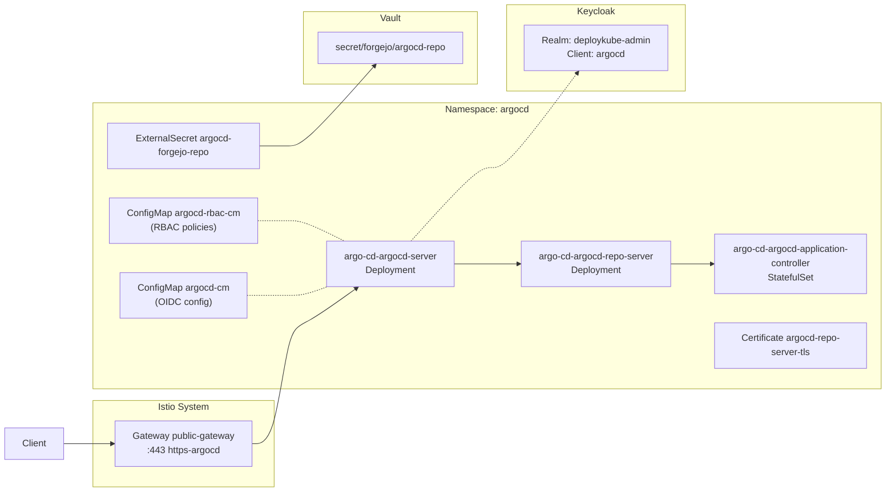

# Introduction

This component manages the **post-installation configuration** of Argo CD, including:
- External ingress exposure via Istio Gateway (HTTPRoute)
- OIDC/SSO integration with Keycloak
- Repository-scoped credentials for Forgejo access
- TLS certificate provisioning for the repo-server

The core Argo CD Helm release is deployed during **bootstrap Stage 1** (see `bootstrap/mac-orbstack/argocd/values-bootstrap.yaml`). This component adds the GitOps-managed configuration layers.

For open/resolved issues, see [docs/component-issues/argocd.md](../../../../../docs/component-issues/argocd.md).

---

## Architecture



- **HTTPRoute** routes the Argo CD hostname from the deployment config (`ConfigMap/argocd/deploykube-deployment-config`) through `public-gateway` listener `https-argocd`.
- **OIDC config Job** (PostSync wave 3.5) patches `argocd-cm` with Keycloak issuer, client config, and RBAC policies.
- **Secrets preflight Job** (PostSync wave 3.45) fails fast when required secret keys are not yet projected.
- **HTTPS switch Job** (PostSync wave 2) ensures TLS termination settings are correct for Gateway-based ingress.
- **ExternalSecrets** project Forgejo repository credentials into Argo CD secret format for both the platform mirror repo and any explicitly platform-managed tenant repos that Argo must read.
- **Certificate** issues TLS cert for repo-server internal comms via Step CA.
- **DestinationRule** disables Istio mTLS to `kubernetes.default.svc` (Argo CD must talk directly to the API server).

---

## Subfolders

| Path | Description |
|------|-------------|
| `config/base/` | Environment-neutral Argo CD config base (repo secret, repo-server Certificate, kube-apiserver DestinationRule, smoke job) |
| `config/overlays/<deploymentId>/` | Deployment overlay (OIDC Job + UI extensions); consumes `deploykube-deployment-config` |
| `ingress/base/` | Environment-neutral Argo CD ingress base (HTTPRoute + HTTPS switch Job) |
| `ingress/overlays/<deploymentId>/` | Deployment overlay (wires ingress base for a deployment; consumes `deploykube-deployment-config`) |

---

## Container Images / Artefacts

| Artefact | Version | Registry |
|----------|---------|----------|
| Argo CD Helm chart | `9.1.0` default (`ARGO_CHART_VERSION`) | `https://argoproj.github.io/argo-helm` |
| Dex (Stage 1 bootstrap) | `v2.44.0` | `registry.example.internal/dexidp/dex` |
| UI extensions runtime | `nginxinc/nginx-unprivileged:1.27-alpine@sha256:65e3e85dbaed8ba248841d9d58a899b6197106c23cb0ff1a132b7bfe0547e4c0` | Docker Hub |
| Bootstrap tools (Jobs) | `1.4` | `registry.example.internal/deploykube/bootstrap-tools@sha256:e7be47a69e3a11bc58c857f2d690a71246ada91ac3a60bdfb0a547f091f6485a` |

> [!NOTE]
> Stage 1 installs Argo CD with an explicit chart pin via `ARGO_CHART_VERSION` in:
> - `shared/scripts/bootstrap-mac-orbstack-stage1.sh`
> - `shared/scripts/bootstrap-proxmox-talos-stage1.sh`
>
> Override via environment if needed and capture evidence for upgrade/rollback.

---

## Dependencies

| Dependency | Purpose |
|------------|---------|
| Istio + Gateway API | Ingress via `public-gateway` and mesh mTLS |
| Keycloak | OIDC provider for SSO (`deploykube-admin` realm, `argocd` client) |
| Vault + ESO | Secrets projection (`ClusterSecretStore/vault-core`) for Forgejo credentials |
| Step CA / cert-manager | TLS certificate for repo-server (`ClusterIssuer/step-ca`) |
| Forgejo | Git repository backend for the root app (`platform/cluster-config`) |
| `secrets-keycloak` component | Projects `argocd-secret` (OIDC client secret) and `argocd-oidc-ca` (CA root) |

---

## Communications With Other Services

### Kubernetes Service → Service Calls

| Caller | Target | Port | Protocol | Purpose |
|--------|--------|------|----------|---------|
| OIDC config Job | `argocd-cm` / `argocd-rbac-cm` ConfigMaps | — | Kubernetes API | Patch OIDC configuration |
| Argo CD server | `kubernetes.default.svc.cluster.local` | 443 | HTTPS | API server communication |
| Argo CD repo-server | Forgejo (`forgejo-https.forgejo.svc.cluster.local`) | 443 | HTTPS | Git operations |

### External Dependencies (Vault, Keycloak, PowerDNS)

- **Vault**: Forgejo repository credentials at `secret/forgejo/argocd-repo` (`username`, `password`) projected by `ExternalSecret` resources.
- **Keycloak**: OIDC issuer hostname is read from the deployment config; the OIDC client secret is projected from `secrets-keycloak`.
- **PowerDNS + ExternalDNS**: HTTPRoute hostname resolved to Istio ingress LB IP.

### Mesh-level Concerns (DestinationRules, mTLS Exceptions)

- **DestinationRule** `kubernetes-apiserver-no-mtls`: Disables Istio mTLS for traffic from argocd namespace to `kubernetes.default.svc.cluster.local` (Argo CD uses its own ServiceAccount token auth).
- OIDC config Job runs with Istio native sidecar lifecycle handling (`sidecar.istio.io/nativeSidecar: "true"` + helper trap) to avoid hook pods hanging on sidecar shutdown.
- HTTPS switch Job runs with `sidecar.istio.io/inject: "false"` because it only patches in-cluster resources (`HTTPRoute`, `ConfigMap`, server `Deployment`) and does not need mesh egress.

---

## Initialization / Hydration

1. **Bootstrap Stage 1** installs the Argo CD Helm release with secure internal defaults (`server.insecure=false`), CRDs, and admin policy.
2. **HTTPRoute** created; HTTPS switch Job (PostSync) patches `argocd-cm` URL and `argocd-cmd-params-cm`, enforces `server.insecure=false`, and removes any `--insecure` server arg.
3. **ExternalSecrets** sync Forgejo repository credentials from Vault into repository-scoped Argo secrets.
4. **Certificate** `argocd-repo-server-tls` issued by Step CA for repo-server internal TLS.
5. **Secrets preflight Job** (PostSync wave 3.45) blocks until required secret keys are present:
   - `Secret/repo-forgejo-platform` (`username`, `password`)
   - `Secret/repo-forgejo-tenant-factorio-apps-factorio` (`username`, `password`) when the opt-in Factorio tenant app is enabled
   - `Secret/argocd-secret` (`oidc.clientSecret`)
   - `Secret/argocd-oidc-ca` (`ca.crt`)
6. **OIDC config Job** (PostSync wave 3.5):
   - Waits for Keycloak bootstrap app to be `Healthy/Synced`
   - Waits for `argocd-secret` OIDC client secret and `argocd-oidc-ca` CA certificate
   - Patches `argocd-cm` with full OIDC configuration (issuer, client, scopes, rootCA)
   - Patches `argocd-rbac-cm` with role policies and group mappings
   - Restarts server, repo-server, appset controller, and application controller
   - Writes idempotence marker `ConfigMap/argocd-oidc-config-state` (`configVersion`, `configSha256`, `lastAppliedAt`)

Secrets to pre-populate in Vault before first sync:

| Vault Path | Keys |
|------------|------|
| `secret/forgejo/argocd-repo` | `username`, `password` (Forgejo service account for Git access) |
| `secret/keycloak/argocd-client` | `clientSecret` (projected by `secrets-keycloak` component) |

---

## Argo CD / Sync Order

| Property | Value |
|----------|-------|
| Sync wave (ingress) | `2` (HTTPS switch Job) |
| Sync wave (config) | `3.4` (repo-server Certificate), `3.45` (secrets preflight), `3.5` (OIDC config Job) |
| Pre/PostSync hooks | `argocd.argoproj.io/hook: PostSync` on HTTPS switch, secrets preflight, and OIDC config Jobs |
| Hook delete policy | HTTPS switch + OIDC config: `HookSucceeded,BeforeHookCreation` |
| TTL after finished | 3600s (OIDC config Job) |
| Idempotence markers | `ConfigMap/argocd-https-switch-state`, `ConfigMap/argocd-oidc-config-state` |
| Sync dependencies | Keycloak bootstrap app must be `Healthy/Synced` before OIDC Job runs; required Vault/ESO secrets must pass preflight first |

---

## Operations (Toils, Runbooks)

Derive the Argo CD hostname from the in-cluster deployment config:

```bash
ARGOCD_HOST="$(kubectl -n argocd get configmap deploykube-deployment-config \
  -o jsonpath='{.data.deployment-config\\.yaml}' | yq -r '.spec.dns.hostnames.argocd')"
```

### Smoke Test (healthz endpoint)

```bash
curl --cacert shared/certs/deploykube-root-ca.crt \
  "https://${ARGOCD_HOST}/healthz"
# Expected: OK
```

### CLI Login (Keycloak SSO)

```bash
argocd login "${ARGOCD_HOST}" \
  --sso --grpc-web \
  --server-crt shared/certs/deploykube-root-ca.crt
```

### Non-interactive Token Flow (automation)

Use the canonical toil: `docs/toils/argocd-cli-noninteractive.md`.
This avoids token-flow drift and keeps all browserless examples in one place.

### Check OIDC Configuration

```bash
kubectl -n argocd get configmap argocd-cm -o yaml | grep -A10 'oidc.config'
kubectl -n argocd logs job/argocd-oidc-config
```

### PostSync Failure / Rollback (OIDC + HTTPS switch)

1. Pause app auto-sync (`docs/toils/argocd-interactive-troubleshooting.md`) to stop repeated hook retries while debugging.
2. Inspect hook status and logs:
   - `kubectl -n argocd get jobs,pods | rg 'argocd-(oidc-config|https-switch)'`
   - `kubectl -n argocd logs job/argocd-oidc-config`
   - `kubectl -n argocd logs job/argocd-https-switch`
3. If a hook changed config but behavior regressed, restore the desired Git state (script/manifests) and re-sync `platform-argocd-config`.
4. Verify recovery gates:
   - `kubectl -n argocd get application platform-argocd-config -o jsonpath='{.status.sync.status} {.status.health.status}{"\n"}'`
   - smoke hook passes (`job/argocd-smoke`), and `/healthz` returns an HTTP success/redirect status (`2xx/3xx`).

### Related Guides

- See `docs/toils/argocd-cli-noninteractive.md` for full token flow.
- See `docs/toils/argocd-interactive-troubleshooting.md` for pausing auto-sync during debugging.

---

## Customisation Knobs

| Knob | Location | Default |
|------|----------|---------|
| Hostname | `ConfigMap/argocd/deploykube-deployment-config` (`.spec.dns.hostnames.argocd`) | per-deployment |
| Keycloak hostname | `ConfigMap/argocd/deploykube-deployment-config` (`.spec.dns.hostnames.keycloak`) | per-deployment |
| Keycloak realm | `config/overlays/<deploymentId>/job-oidc-config.yaml` `KEYCLOAK_REALM` env | `deploykube-admin` |
| OIDC client ID | `config/overlays/<deploymentId>/scripts/configure-oidc.sh` `OIDC_CLIENT_ID` | `argocd` |
| RBAC policies | `config/overlays/<deploymentId>/scripts/configure-oidc.sh` `policy_csv` | Platform admin, operator, auditor roles |
| Admin account | Stage 1 values + OIDC Job enforce `admin.enabled=false` | Disabled in all deployments |
| Anti-affinity-safe rollout strategy | `bootstrap/shared/argocd/values-resources.yaml` (`global.deploymentStrategy`, `redis-ha.haproxy.deploymentStrategy`) | `RollingUpdate` with `maxSurge: 0`, `maxUnavailable: 1` |

---

## Oddities / Quirks

1. **Gateway + server TLS posture**: TLS is terminated at the Istio Gateway for external ingress, and Argo CD server is kept in secure mode (`server.insecure=false`) for in-cluster hops.
2. **DestinationRule for API server**: Argo CD must bypass Istio mTLS when talking to the Kubernetes API server; otherwise, ServiceAccount token auth fails.
3. **Hook sidecar posture differs by job**: OIDC uses native sidecar lifecycle handling, while HTTPS switch explicitly disables injection for a small in-namespace patch-only operation.
4. **No `--namespace` flag in CLI**: The `argocd` CLI doesn't support `-n`; use `--server` with the external hostname instead of port-forwarding.
5. **OIDC Job waits for Keycloak**: The script polls until `platform-keycloak-bootstrap` Application is `Healthy/Synced` before attempting to configure OIDC.
6. **UI extensions mesh dependency**: `argocd-ui-extensions` is Istio-injected; keep egress allowlisted for DNS (`kube-dns`) and Istio control-plane (`istiod`) or pods can wedge at `1/2` (sidecar not ready).

---

## TLS, Access & Credentials

| Concern | Details |
|---------|---------|
| External TLS | Terminated at `Gateway/public-gateway`; cert issued by Step CA via cert-manager |
| Internal TLS (repo-server) | `Certificate/argocd-repo-server-tls` issued by Step CA |
| Auth (Web UI) | Keycloak OIDC SSO; groups mapped to Argo CD roles |
| Auth (CLI) | SSO via `--sso` flag, or automation token via `argocd-token.sh` script |
| Auth (API server) | ServiceAccount token mounted by Argo CD controller pods |
| Local admin account | Disabled (`admin.enabled=false`) |
| Step CA root | Trust `shared/certs/deploykube-root-ca.crt` on clients outside the cluster |

---

## Dev → Prod

| Aspect | `mac-orbstack` | `proxmox-talos` |
|--------|---------------|----------------|
| Hostname | from deployment config | from deployment config |
| Keycloak host | from deployment config | from deployment config |
| Admin account | Disabled | Disabled |
| Vault paths | Same (`secret/forgejo/argocd-repo`) – each cluster has its own Vault | Same |

**Promotion**: Create a new `DeploymentConfig` and a matching `components/platform/argocd/{config,ingress}/overlays/<deploymentId>`; `platform-apps` selects Argo CD overlays by `deploymentId`.

---

## Smoke Jobs / Test Coverage

### Current State

An automated PostSync smoke Job exists and runs as part of the `platform-argocd-config` Argo `Application`:

- Manifest: `config/base/tests/job-argocd-smoke.yaml`
- Hook: `PostSync` (sync-wave `4`)
- Cleanup: `HookSucceeded,BeforeHookCreation` (re-runs on every sync)

It proves:
1. Argo CD server Deployment is Available.
2. External access path works (Gateway `/healthz`, avoiding LB hairpin by connecting directly to `public-gateway-istio.istio-system.svc.cluster.local` with SNI to the deployment-configured hostname).
3. `argocd-cm` contains a non-empty `oidc.config`.
4. Forgejo repo secret `repo-forgejo-platform` exists.
5. Root `Application/platform-apps` is `Synced` and `Healthy`.

### How to Run / Re-run

Re-sync the Argo app:

```bash
argocd app sync platform-argocd-config \
  --grpc-web \
  --server "${ARGOCD_HOST}" \
  --server-crt shared/certs/deploykube-root-ca.crt
```

If you need a GitOps-driven re-run without touching the Job spec (e.g. Argo uses `ApplyOutOfSyncOnly=true`), bump the trigger ConfigMap and let Argo reconcile:

- `config/base/tests/configmap-smoke-trigger.yaml` → update `data.runId` to a new value and commit (prod: seed Forgejo after commit).

---

## HA Posture

### Current State

| Aspect | Status |
|--------|--------|
| `mac-orbstack` Stage 1 | Single-instance bootstrap defaults (dev-focused) |
| `proxmox-talos` Stage 1 | HA-hardened defaults (server/repo/appset replicas `2`, PDBs + topology spread enabled, redis-ha enabled) |
| Application controller | `1` replica by default (leader-based control loop) |
| `argocd-ui-extensions` | `2` replicas + PDB + preferred anti-affinity/topology spread |

### Analysis

Stage 1 posture is intentionally profile-dependent:
- `mac-orbstack`: fast dev bootstrap, lower HA.
- `proxmox-talos`: prod-like defaults in `shared/scripts/bootstrap-proxmox-talos-stage1.sh`.

Key knobs for proxmox Stage 1:
- `ARGOCD_SERVER_REPLICAS`, `ARGOCD_REPOSERVER_REPLICAS`, `ARGOCD_APPSET_REPLICAS`
- `ARGOCD_ENABLE_REDIS_HA`, `ARGOCD_ENABLE_PDBS`, `ARGOCD_ENABLE_TOPOLOGY_SPREAD`

> [!IMPORTANT]
> Any HA posture change must ship with evidence (for example node-drain disruption drill + app health checks).

### `argocd-ui-extensions` Sizing Contract

`argocd-ui-extensions` serves static JS and has intentionally fixed sizing (no HPA/VPA today):

| Deployment | Requests | Limits | Rationale |
|------------|----------|--------|-----------|
| base | `cpu: 15m`, `memory: 32Mi` | `memory: 128Mi` | Static asset serving only (`/extensions.js`) |
| proxmox overlay | `memory: 64Mi` request | inherited limit `128Mi` | More headroom for prod-like churn and upgrade windows |

Current contract: keep this workload fixed-size unless observed evidence shows sustained resource pressure; if scaling policy changes, update this section and add evidence.

---

## Security

### Current Controls

| Layer | Control | Status |
|-------|---------|--------|
| Transport (external) | TLS at Istio Gateway (Step CA cert) | ✅ Implemented |
| Transport (repo-server) | TLS via `argocd-repo-server-tls` Certificate | ✅ Implemented |
| Auth (Web UI) | Keycloak OIDC SSO | ✅ Implemented |
| Auth (API/CLI) | OIDC tokens via `argocd-token.sh` | ✅ Implemented |
| Auth (local admin) | Local admin account disabled (`admin.enabled=false`) | ✅ Implemented |
| RBAC | Platform roles in `argocd-rbac-cm`; tenant roles in `AppProject.spec.roles[].groups` | ✅ Implemented |
| Secrets storage | Vault + ESO; never committed plaintext | ✅ Implemented |
| DestinationRule | mTLS bypass for kube-apiserver | ✅ Intentional |
| NetworkPolicy | Server ingress restricted to `public-gateway` pods + core workload egress allowlists/default-deny + ui-extensions ingress + ui-extensions egress allowlist (DNS + Istio control-plane) | ✅ Implemented |
| CiliumNetworkPolicy | Core Argo egress to kube-apiserver entities | ✅ Implemented |
| Pod Security | Explicit securityContext on config Jobs + `argocd-ui-extensions`; core chart workloads still rely on chart defaults | ⚠️ Partial |

### Gaps

1. **kube-apiserver mTLS exception remains a deliberate carve-out**: this component still uses `DestinationRule/kubernetes-apiserver-no-mtls` and relies on compensating controls (Kubernetes SA auth, scoped Job RBAC, and ingress restrictions).

### Recommendations

- Keep server ingress restricted to `public-gateway` pods; avoid broad same-namespace ingress unless explicitly required.
- Keep the core egress allowlists current as dependencies evolve (kube-apiserver, Forgejo, Keycloak, DNS, Istio control-plane).
- Audit Helm chart security contexts (`runAsNonRoot`, `readOnlyRootFilesystem`).
- Consider enabling `configs.params.server.disable.auth` → ensure it's `false` (default).

> [!NOTE]
> Security hardening is tracked in `docs/component-issues/argocd.md`.

---

## Backup and Restore

### RPO / RTO Contract

Argo CD state posture follows the deployment backup contract in `DeploymentConfig.spec.backup.rpo`:

- **Source of truth**: `platform/gitops/deployments/<deploymentId>/config.yaml` (`spec.backup.rpo.*`).
- **Enforcement/operations plane**: backup-system schedules + restore tooling (`scripts/ops/restore-from-backup.sh`) are expected to meet that contract for the deployment.
- **Argo-specific stance**: Argo itself is control-plane metadata and is rebuilt from Git + tier-0 restore prerequisites.

### What Is Covered

| Surface | Coverage |
|---------|----------|
| Argo Applications / AppProjects / ConfigMaps | Reconstructed from GitOps (`platform-apps` fan-out + component manifests) |
| Repo credentials / OIDC secrets | Reprojected from Vault via ESO after tier-0 restore |
| OIDC/RBAC runtime patches | Reapplied by PostSync Jobs (`argocd-https-switch`, `argocd-oidc-config`) |
| Redis/cache/history | Treated as reconstructible/ephemeral |

### Exclusions / Dependencies

- **Velero is not the primary mechanism here**; this component relies on the backup-system + tier-0 restore flow.
- **Forgejo Git state must be restorable** for deterministic Argo rebuild, because `platform-apps` reconciles from Forgejo.
- Current Forgejo off-cluster backup/restore hardening is tracked separately in `docs/component-issues/forgejo.md`; until those items are fully closed, Argo DR confidence is bounded by that dependency.

### Verified Restore Path (Current)

1. Rebuild cluster substrate (Stage 0) and bootstrap control plane (Stage 1) in restore-safe mode.
2. Restore tier-0 services from a selected backup set (`scripts/ops/restore-from-backup.sh`), including Vault and platform Postgres where configured.
3. Re-enable GitOps reconciliation and let `platform-apps` recreate Argo-managed state from Forgejo.
4. Verify Argo recovery:
   - `kubectl -n argocd get application platform-apps -o jsonpath='{.status.sync.status} {.status.health.status}{"\n"}'`
   - `kubectl -n argocd get jobs | rg 'argocd-(https-switch|secrets-preflight|oidc-config|smoke)'`
   - Gateway `/healthz` returns `2xx/3xx`.
