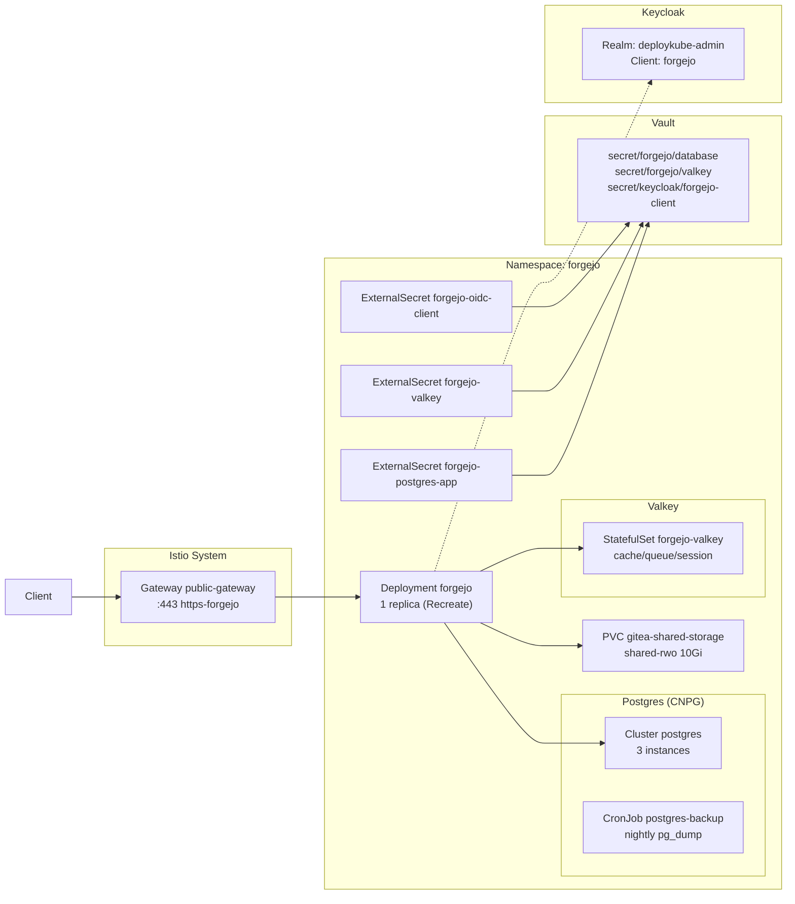

# Introduction

Forgejo is the in-cluster Git service hosting the `platform/cluster-config` repository that Argo CD syncs from. It provides code hosting, OIDC-based authentication via Keycloak, and team/organization sync with Keycloak groups.

This component manages the **post-bootstrap configuration** of Forgejo, including:
- External ingress exposure via Istio Gateway (HTTPRoute)
- Database migration from bootstrap SQLite to CloudNativePG (Postgres)
- Cache/queue/session backend switch to Valkey
- OIDC integration with Keycloak

The core Forgejo Helm release is deployed during **bootstrap Stage 1** with SQLite/LevelDB defaults. This component then transitions it to production-ready backends.

For open/resolved issues, see [docs/component-issues/forgejo.md](../../../../../docs/component-issues/forgejo.md).

---

## Architecture



---

## Subfolders

| Path | Description |
|------|-------------|
| `ingress/` | HTTPRoute + HTTPS switch Job (wave 3) for Gateway exposure |
| `ingress/overlays/prod/` | Prod overlay with `forgejo.prod.internal.example.com` hostname |
| `jobs/` | Migration/config Jobs: cache-switch, db-seed, db-switch, oidc-config |
| `jobs-overlays/` | Environment-specific job overlays |
| `overlays/dev/` | Dev overlay with reduced memory for Postgres |
| `postgres/` | CNPG cluster overlay with backup CronJob, ExternalSecrets |
| `valkey/` | Valkey cache overlay referencing shared base |

---

## Container Images / Artefacts

| Artefact | Version | Registry |
|----------|---------|----------|
| Forgejo | `13.0.2-rootless` | `code.forgejo.org/forgejo/forgejo:13.0.2-rootless` |
| Bootstrap tools (Jobs) | `1.3` | `registry.example.internal/deploykube/bootstrap-tools:1.4` |
| CloudNativePG (operator-managed) | (chart default) | `registry.example.internal/cloudnative-pg/postgresql` |
| Valkey | (base chart default) | Referenced from `data/valkey/base` |

---

## Dependencies

| Dependency | Purpose |
|------------|---------|
| Istio + Gateway API | Ingress via `public-gateway` mTLS at gateway |
| Keycloak | OIDC provider for SSO (`deploykube-admin` realm, `forgejo` client) |
| Vault + ESO | Secrets projection (`ClusterSecretStore/vault-core`) for database, cache, OIDC credentials |
| Step CA / cert-manager | TLS certificate for HTTPRoute (`ClusterIssuer/step-ca`) |
| CloudNativePG Operator | Deploys and manages Postgres cluster |
| `shared-rwo` StorageClass | Shared PVC for Forgejo data (LevelDB queues in bootstrap mode) |
| `istio-native-exit` ConfigMap | Enables Istio-injected Jobs to complete cleanly |

---

## Communications With Other Services

### Kubernetes Service → Service Calls

| Caller | Target | Port | Protocol | Purpose |
|--------|--------|------|----------|---------|
| Forgejo | `postgres-rw.forgejo.svc` | 5432 | PostgreSQL | Database (after migration) |
| Forgejo | `forgejo-valkey.forgejo.svc` | 6379 | Redis | Cache/queue/session |
| Argo CD | `forgejo-http.forgejo.svc` | 3000 | HTTP | Git operations |
| Keycloak groups | Forgejo API | 3000 | HTTP | Team sync CronJob |

### External Dependencies (Vault, Keycloak, PowerDNS)

- **Vault**: Database credentials at `secret/forgejo/database`, Valkey password at `secret/forgejo/valkey`, OIDC credentials at `secret/keycloak/forgejo-client`.
- **Keycloak**: OIDC issuer at `https://keycloak.<env>.internal.example.com/realms/deploykube-admin`.
- **PowerDNS + ExternalDNS**: HTTPRoute hostname resolved to Istio ingress LB IP.

### Mesh-level Concerns (DestinationRules, mTLS Exceptions)

- Jobs run with `sidecar.istio.io/nativeSidecar: 'true'` and use `istio-native-exit.sh` helper to signal sidecar exit.
- Postgres backup CronJob uses `holdApplicationUntilProxyStarts: true` to avoid connection refused during Envoy startup.

---

## Initialization / Hydration

1. **Bootstrap Stage 1** installs Forgejo Helm release with SQLite + LevelDB (single-writer, `Recreate` strategy).
2. **HTTPRoute** created; HTTPS switch Job (wave 3) patches `forgejo-inline-config` for public HTTPS URL.
3. **CNPG Postgres cluster** deploys via `postgres/` manifests; ExternalSecrets project credentials from Vault.
4. **Valkey StatefulSet** deploys via `valkey/` manifests.
5. **Migration Jobs** (PostSync hooks):
   - `forgejo-db-seed` (wave 4): Dumps SQLite → imports into CNPG.
   - `forgejo-db-switch` (wave 5): Repoints Forgejo to Postgres DSN.
   - `forgejo-cache-switch` (wave 6): Switches queue/cache/session to Valkey.
   - `forgejo-oidc-config` (wave 7): Configures Keycloak OIDC authentication.
6. **Stage 1 seed script** (`shared/scripts/forgejo-seed-repo.sh`) pushes `platform/gitops/` snapshot to Forgejo.

Secrets to pre-populate in Vault before first sync:

| Vault Path | Keys |
|------------|------|
| `secret/forgejo/database` | `appPassword`, `superuserPassword` |
| `secret/forgejo/valkey` | `password` |
| `secret/keycloak/forgejo-client` | `key` (client ID), `secret` (client secret) |

---

## Argo CD / Sync Order

| Property | Value |
|----------|-------|
| Sync wave (ingress) | `2` (HTTPRoute), `3` (HTTPS switch Job) |
| Sync wave (postgres) | `3` (CNPG cluster) |
| Sync wave (valkey) | `3` (StatefulSet) |
| Sync wave (jobs) | `4-7` (db-seed → db-switch → cache-switch → oidc-config) |
| Pre/PostSync hooks | `argocd.argoproj.io/hook: PostSync` on all migration Jobs |
| Hook delete policy | `HookSucceeded,BeforeHookCreation` |
| Sync dependencies | Certificates + Gateway must exist; Keycloak bootstrap must be `Healthy/Synced` before OIDC Job |

---

## Operations (Toils, Runbooks)

### Smoke Test

```bash
# Health check via Gateway
curl --cacert shared/certs/deploykube-root-ca.crt \
  https://forgejo.dev.internal.example.com/api/v1/version

# Verify HTTPS cutover sentinel
kubectl -n forgejo get configmap forgejo-https-switch-complete
```

### Check Migration Status

```bash
# Verify Jobs completed
kubectl -n forgejo get jobs

# Check database backend
kubectl -n forgejo exec deploy/forgejo -- cat /data/gitea/conf/app.ini | grep -A5 '\[database\]'
```

### Emergency Job Unstick (Istio sidecar hanging)

```bash
# Tell Envoy to exit
kubectl -n forgejo exec pod/<pod> -c istio-proxy -- \
  curl -fsS -XPOST http://127.0.0.1:15020/quitquitquit

# Remove Argo finalizer if needed
kubectl -n forgejo patch job/<job> --type=json \
  -p='[{"op":"remove","path":"/metadata/finalizers"}]'
```

### Related Guides

- See `jobs/README.md` for detailed Job behavior and troubleshooting.
- See `postgres/README.md` for CNPG cluster management.
- See `docs/toils/forgejo-seeding.md` for repo seeding / force-push.

---

## Customisation Knobs

| Knob | Location | Default |
|------|----------|---------|
| Hostname | `ingress/httproute.yaml` `.spec.hostnames` | `forgejo.dev.internal.example.com` |
| Postgres instances | `postgres/patch-cluster.yaml` | 3 |
| Postgres memory | `overlays/dev/` | Reduced for dev |
| Storage size | `bootstrap/.../values-bootstrap.yaml` | 10Gi |
| Backup schedule | `postgres/patch-cronjob.yaml` | Nightly |

---

## Oddities / Quirks

1. **Recreate strategy**: Bootstrap uses `Recreate` because LevelDB queues on the PVC cannot be opened concurrently; `RollingUpdate` wedges on lock contention.
2. **HTTPS switch patches inline secret**: The Job patches `forgejo-inline-config` Secret (Helm-managed) to redirect to the public HTTPS URL; this is a necessary workaround until the Helm release is GitOps-managed.
3. **OIDC CA trust chain**: `forgejo-oidc-ca` must match the Step CA that signed Keycloak's ingress cert; mismatches cause `x509: certificate signed by unknown authority`.
4. **Jobs must trap Istio exit first**: Early exits (e.g., sentinel exists) must still call `deploykube_istio_quit_sidecar` or the Job hangs.
5. **Argo hook finalizer**: Stuck Jobs cannot be deleted manually until Argo removes the finalizer; use the emergency unstick procedure.

---

## TLS, Access & Credentials

| Concern | Details |
|---------|---------|
| External TLS | Terminated at `Gateway/public-gateway`; cert issued by Step CA |
| Internal (Postgres) | CNPG manages internal TLS; Forgejo connects via `sslmode` (per DSN) |
| Internal (Valkey) | Plaintext within mesh (mTLS at Istio layer) |
| Auth (Web UI) | Keycloak OIDC SSO + local admin account |
| Auth (Git) | HTTP Basic Auth over HTTPS (no SSH enabled) |
| Step CA root | Trust `shared/certs/deploykube-root-ca.crt` on clients outside the cluster |

---

## Dev → Prod

| Aspect | Dev (overlays/dev) | Prod (`overlays/prod/`) |
|--------|------------|----------------------------------|
| Hostname | `forgejo.dev.internal.example.com` | `forgejo.prod.internal.example.com` |
| Keycloak host | `keycloak.dev.internal.example.com` | `keycloak.prod.internal.example.com` |
| Postgres memory | Reduced (lowmem overlay) | Full (3× instances) |
| Valkey topology | Low-mem overlay (1 replica, `emptyDir`) | PVC-backed (3 replicas, `shared-rwo`) |
| Vault paths | Same – each cluster has its own Vault | Same |

**Promotion**: Switch Argo app source path from base to overlay; verify HTTPRoute hostname, OIDC discovery URL, and ESO sync.

---

## Smoke Jobs / Test Coverage

### Current State

An automated PostSync smoke Job exists and runs as part of the `platform-forgejo-jobs` Argo `Application`:

- Manifest: `jobs/tests/job-forgejo-smoke.yaml`
- Hook: `PostSync` (sync-wave `13`)
- Cleanup: `HookSucceeded,BeforeHookCreation` (re-runs on every sync)

It proves:
1. In-cluster Forgejo service has endpoints.
2. External access path works (Gateway `/api/v1/version`, avoiding LB hairpin by connecting directly to `public-gateway-istio.istio-system.svc.cluster.local` with SNI to `forgejo.<env>.internal...`).
3. CNPG cluster `postgres` has condition `Ready=True`.
4. Admin API can read `platform/cluster-config`.
5. OIDC wiring is validated by the `shared-rbac-secrets` smoke (Keycloak token accepted by Forgejo APIs).

### How to Run / Re-run

Re-sync the Argo app:

```bash
argocd app sync platform-forgejo-jobs \
  --grpc-web \
  --server argocd.dev.internal.example.com \
  --server-crt shared/certs/deploykube-root-ca.crt
```

If you need a GitOps-driven re-run without touching the Job spec (e.g. Argo uses `ApplyOutOfSyncOnly=true`), bump the trigger ConfigMap and let Argo reconcile:

- `jobs/tests/configmap-smoke-trigger.yaml` → update `data.runId` to a new value and commit (prod: seed Forgejo after commit).

---

## HA Posture

### Current State

| Component | Aspect | Status |
|-----------|--------|--------|
| **Forgejo** | Replicas | **2** (prod default; post-migration `RollingUpdate`; bootstrap installs 1 with `Recreate`) |
| **Forgejo** | PodDisruptionBudget | **Enabled** (`minAvailable: 1`) |
| **Forgejo** | HA mode | **Enabled** after Postgres+Valkey switch (bootstrap uses LevelDB/SQLite single-writer constraints) |
| **CNPG Postgres** | Instances | **3** (HA with automatic failover) |
| **CNPG Postgres** | Anti-affinity | **preferred** (spread across nodes) |
| **CNPG Postgres** | PodMonitor | **Enabled** (if CRDs exist) |
| **Valkey** | Replicas | **3** primary + sentinel (base chart) |
| **Valkey** | PDB | **Enabled** (`minAvailable: 2` for valkey + sentinel) |

### Analysis

**Postgres**: Fully HA with 3 instances, automatic failover, and anti-affinity. CNPG handles leader election and read replicas.

**Valkey**: HA-capable (sentinel mode) with PDBs that prevent voluntary eviction from dropping below quorum.

**Forgejo**: Bootstrap installs Forgejo in single-replica `Recreate` mode (to avoid LevelDB locks). After the DB/cache cutover Jobs run, the Deployment is switched back to `RollingUpdate` and can run with multiple replicas.

### Recommendation

| Tier | Action |
|------|--------|
| Dev | Single replica acceptable |
| Prod | Keep Forgejo on Postgres+Valkey (`RollingUpdate`) and ensure replicas > 1; keep PDBs enabled |

> [!IMPORTANT]
> Forgejo HA (replicas > 1) and PDB configuration are tracked in `docs/component-issues/forgejo.md`.

---

## Security

### Current Controls

| Layer | Control | Status |
|-------|---------|--------|
| Transport (external) | TLS at Istio Gateway (Step CA cert) | ✅ Implemented |
| Transport (internal Postgres) | CNPG-managed TLS | ✅ Implemented |
| Transport (internal Valkey) | Istio mTLS | ✅ Implemented |
| Auth (Web UI) | Keycloak OIDC SSO | ✅ Implemented |
| Auth (admin) | Local admin account (bootstrap) | ✅ Implemented |
| Auth (Git) | HTTP Basic Auth over HTTPS | ✅ Implemented |
| Secrets storage | Vault + ESO; never committed plaintext | ✅ Implemented |
| OIDC CA trust | Step CA root mirrored via `keycloak-oidc-ca-sync` | ✅ Implemented |
| Pod Security (Forgejo) | `rootless: true` + uid 1000 | ✅ Implemented |
| Pod Security (CNPG) | Operator-managed | ✅ Implemented |
| NetworkPolicy | `NetworkPolicy/forgejo-ingress` + `NetworkPolicy/forgejo-egress` | ✅ Implemented |

### Gaps

1. **NetworkPolicy scope**: Forgejo egress is allowlisted for core dependencies (DNS/Istio/Postgres/Valkey). Any future external dependencies must be added explicitly.

2. **SSH disabled**: Git access is HTTP-only, which is secure but may limit advanced workflows.

3. **Admin password management**: Bootstrap admin account exists; ensure password rotation is documented for production.

### Recommendations

- Implement `NetworkPolicy` allowing ingress only from `istio-system`, `argocd`, and specific consumer namespaces.
- Consider enabling SSH access with key management via OIDC groups.

> [!NOTE]
> NetworkPolicy implementation is tracked in `docs/component-issues/forgejo.md`.

---

## Operations

### Admin password rotation (production)

Forgejo has a local bootstrap admin account (used for API automation and bootstrap flows). The sources of truth are:
- `Secret/forgejo-admin` in the `forgejo` namespace (username + password)
- Vault mirror: `secret/forgejo/admin` (synced by `Job/forgejo-admin-vault-sync`)

Rotation procedure (kubectl-only):

1. Update the Kubernetes secret password:
   ```bash
   kubectl -n forgejo patch secret forgejo-admin --type=merge -p '{"stringData":{"password":"<NEW_PASSWORD>"}}'
   ```

2. Sync the Forgejo database password to match the secret:
   ```bash
   u="$(kubectl -n forgejo get secret forgejo-admin -o jsonpath='{.data.username}' | base64 -d)"
   p="$(kubectl -n forgejo get secret forgejo-admin -o jsonpath='{.data.password}' | base64 -d)"
   kubectl -n forgejo exec deploy/forgejo -- forgejo admin user change-password --username "$u" --password "$p" --must-change-password=false
   ```

3. Sync the rotated credentials into Vault:
   ```bash
   kubectl -n forgejo create job --from=job/forgejo-admin-vault-sync forgejo-admin-vault-sync-manual-$(date +%s)
   ```

## Backup and Restore

### Current State

| Component | Backup Method | Schedule | Retention | Location |
|-----------|--------------|----------|-----------|----------|
| **Postgres (CNPG)** | database-only `pg_dump` CronJob (encrypted-at-rest) | Nightly (in base) | Manual cleanup | `/backups/` PVC (`postgres-backup-v2`, `*.sql.gz.age`) |
| **Forgejo data** | PVC on `shared-rwo` | Not backed up | N/A | NFS (host-level snapshots possible) |
| **Valkey** | RDB persistence | Per Valkey config | N/A | PVC (`forgejo-valkey-data`) |

### Analysis

**Postgres backup** is implemented via the `postgres-backup` CronJob:
- Uses database-only `pg_dump` with superuser credentials.
- Writes to a dedicated PVC with atomic `mv` to prevent partial dumps.
- Uses Istio native sidecar pattern with `holdApplicationUntilProxyStarts` and `istio-native-exit.sh`.
- **Gap**: PVC-based backup is a stop-gap; should migrate to CNPG barman object store backup.

**Forgejo data** (git repos, LFS):
- Stored on `gitea-shared-storage` (PVC).
- Not explicitly backed up; relies on NFS/ZFS snapshots at host level.
- After migration, primary data is in Postgres; repo data is in PVC.

### Proposed Backup Strategy

| Component | Method | Frequency | Retention | Status |
|-----------|--------|-----------|-----------|--------|
| Postgres | CNPG barman to S3/Garage | Continuous WAL + daily base | 7 days | **Not implemented** |
| Postgres (current) | database-only pg_dump to PVC | Nightly | Manual | ✅ Implemented |
| Forgejo PVC | NFS/ZFS snapshot | Daily | 7 days | Host-level |
| Valkey | RDB persistence | Per config | N/A | ✅ Implemented |

### Restore Procedure

**Postgres (current pg_dump approach)**:

1. Identify the backup file:
   ```bash
   kubectl -n forgejo exec -it deploy/forgejo -- ls -la /backups/
   ```

2. Scale down Forgejo:
   ```bash
   kubectl -n forgejo scale deploy/forgejo --replicas=0
   ```

3. Restore the database:
   ```bash
   # Decrypt key is out-of-band: decrypt on the operator machine and stream into psql.
   age -d -i "$AGE_KEY_FILE" /path/to/YYYYMMDDTHHMMSSZ-dump.sql.gz.age | gunzip | \
     kubectl -n forgejo exec -i postgres-0 -- psql -U postgres
   ```

4. Scale up Forgejo:
   ```bash
   kubectl -n forgejo scale deploy/forgejo --replicas=1
   ```

**Full disaster recovery** (cluster rebuild):

1. Run bootstrap Stage 1 → Forgejo + CNPG deploy.
2. Migration Jobs run (db-seed, db-switch, cache-switch, oidc-config).
3. For data recovery: restore PVC from NFS/ZFS snapshot, then run Postgres restore.

> [!IMPORTANT]
> CNPG barman object store backup is tracked in `docs/component-issues/forgejo.md`.
