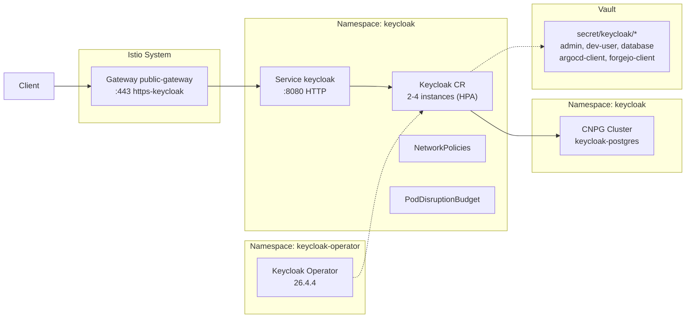

# Introduction

Keycloak is the platform's identity and access management (IAM) service, providing OIDC-based SSO for all user-facing applications (Argo CD, Forgejo, Grafana, Vault). It runs as an HPA-controlled Keycloak cluster (min 2 instances) with a CNPG Postgres backend.

This component groups:
- **Keycloak Operator** (CRDs + Deployment)
- **Keycloak workload** (CR with HA, anti-affinity, Istio mesh)
- **Realm templates** (deploykube-admin, deploykube-apps)
- **Ingress** (HTTPRoute via Istio Gateway)
- **Bootstrap Job** (realm import, OIDC client sync to Vault)
- **IAM Sync Jobs** (hybrid redirect toggling + LDAP sync mode trigger)
- **SCIM Bridge** (optional, disabled-by-default app)

The Postgres backend lives in `components/data/postgres/keycloak/`, and ESO secrets live in `components/secrets/external-secrets/keycloak/`.

For open/resolved issues, see [docs/component-issues/keycloak.md](../../../../../docs/component-issues/keycloak.md).

---

## Architecture



---

## Subfolders

| Path | Wave | Description |
|------|------|-------------|
| `operator/` | 0.5 | Upstream Keycloak Operator bundle (CRDs + Deployment) in `keycloak-operator` namespace |
| `base/` | 2 | Keycloak CR (HPA-controlled), Service, NetworkPolicies, PDB |
| `base/overlays/<deploymentId>/` | — | Deployment-specific patches (hostname, sizing, etc.) |
| `realms/` | 2.5 | Realm templates (deploykube-admin, deploykube-apps) + variable-map |
| `realms/overlays/<deploymentId>/` | — | Deployment wrappers around `base/` (kept for overlay contract compatibility) |
| `ingress/` | 3 | HTTPRoute, DestinationRule, Certificate for Gateway exposure |
| `ingress/overlays/<deploymentId>/` | — | Deployment-specific patches (hostname) |
| `bootstrap-job/` | 3 (PostSync) | Job that renders realms, reconciles IAM mode, and syncs OIDC secrets to Vault |
| `iam-sync/` | 3.2 | CronJob that applies hybrid IAM fail-open/failback switching based on upstream health |
| `scim-bridge/` | 3.25 | Optional SCIM v2 bridge (disabled by default) for upstream provisioning into Keycloak |

---

## Container Images / Artefacts

| Artefact | Version | Registry |
|----------|---------|----------|
| Keycloak Operator | `26.4.4` | Vendored bundle in `operator/operator-bundle.yaml` |
| Keycloak (CR-managed) | (Operator default) | `quay.io/keycloak/keycloak` |
| Bootstrap tools (Job) | `1.4` | `registry.example.internal/deploykube/bootstrap-tools:1.4` |
| SCIM bridge | `0.1.0` | `registry.example.internal/deploykube/scim-bridge:0.1.0` |
| CloudNativePG (Postgres) | (CNPG default) | `registry.example.internal/cloudnative-pg/postgresql:16.3` |

---

## Dependencies

| Dependency | Purpose |
|------------|---------|
| Keycloak Operator | Manages Keycloak CRs (deployed by `keycloak-operator` app) |
| CNPG + Postgres cluster | Database backend (`data/postgres/keycloak/`) |
| Istio + Gateway API | Ingress via `public-gateway` with mTLS mesh |
| Step CA / cert-manager | TLS certificate for ingress (`ClusterIssuer/step-ca`) |
| Vault + ESO | Secrets projection for admin, database, OIDC clients |
| `istio-native-exit` ConfigMap | Enables bootstrap, IAM sync, and LDAP sync Jobs to complete cleanly |

---

## Communications With Other Services

### Kubernetes Service → Service Calls

| Caller | Target | Port | Protocol | Purpose |
|--------|--------|------|----------|---------|
| Argo CD | Keycloak | 8080 | HTTP (via mesh) | OIDC authentication |
| Forgejo | Keycloak | 8080 | HTTP (via mesh) | OIDC authentication |
| Grafana | Keycloak | 8080 | HTTP (via mesh) | OIDC authentication |
| Vault | Keycloak | 8080 | HTTP (via mesh) | JWT auth validation |
| Bootstrap Job | Keycloak | 8080 | HTTP | Realm import, user sync |
| Keycloak | Postgres | 5432 | PostgreSQL | Database (excluded from mesh) |

### External Dependencies (Vault, PowerDNS)

- **Vault**: Stores admin credentials (`secret/keycloak/admin`), database credentials (`secret/keycloak/database`), OIDC client secrets (`secret/keycloak/argocd-client`, `forgejo-client`, etc.), and dev-user credentials.
- **PowerDNS + ExternalDNS**: HTTPRoute hostname resolved to Istio ingress LB IP.

### Mesh-level Concerns (DestinationRules, mTLS Exceptions)

- **Istio sidecar injection**: Enabled via namespace label and pod annotation.
- **Port 5432 excluded**: `traffic.sidecar.istio.io/excludeOutboundPorts: "5432"` on Keycloak pods because CNPG pods run without sidecars.
- **DestinationRule** `keycloak`: Defined in `ingress/destinationrule.yaml` for traffic policy.
- Bootstrap Job uses `sidecar.istio.io/nativeSidecar: "true"` with `istio-native-exit.sh` helper.

---

## Initialization / Hydration

1. **Keycloak Operator** deploys (wave 0.5) with CRDs and Deployment.
2. **CNPG Postgres cluster** deploys (wave 1) in `keycloak` namespace.
3. **ESO projections** (wave 1.5) sync secrets from Vault: `keycloak-admin`, `keycloak-db`, OIDC client secrets.
4. **Keycloak CR** deploys (wave 2): baseline 2 instances; HPA scales 2–4 based on CPU; connects to Postgres.
5. **Realm templates** applied (wave 2.5) as ConfigMaps.
6. **Ingress** (wave 3): HTTPRoute, DestinationRule, Certificate.
7. **Bootstrap Job** (PostSync wave 3):
   - Authenticates to Vault via Kubernetes auth (`keycloak-bootstrap` role).
   - Renders realm templates with variables from Vault.
   - Runs `keycloak-config-cli` to import realms.
   - Reconciles multitenancy tenant groups from the platform tenant registry (`ConfigMap/keycloak/deploykube-tenant-registry`).
   - Syncs OIDC client secrets back to Vault for consumers (Argo CD, Forgejo, Kiali, Hubble oauth2-proxy, Grafana).
   - Forces developer + automation bot user credentials to match Vault.
8. **IAM sync CronJobs**:
   - `keycloak-iam-sync` toggles upstream redirect preference per realm in hybrid mode.
   - `keycloak-ldap-sync` triggers LDAP full sync when `spec.iam.upstream.ldap.operationMode=sync`.

Secrets to pre-populate in Vault before first sync:

| Vault Path | Keys |
|------------|------|
| `secret/keycloak/admin` | `username`, `password` |
| `secret/keycloak/database` | `username`, `password`, `host`, `database` |
| `secret/keycloak/dev-user` | `username`, `password` |
| `secret/keycloak/argocd-client` | `clientSecret` |
| `secret/keycloak/forgejo-client` | `clientSecret` |
| `secret/keycloak/kiali-client` | `clientSecret` |
| `secret/keycloak/hubble-client` | `clientSecret` |
| `secret/keycloak/vault-client` | `clientSecret` |
| `secret/keycloak/argocd-automation-user` | `username`, `password` |
| `secret/keycloak/vault-automation-user` | `username`, `password` |

---

## Argo CD / Sync Order

| Property | Value |
|----------|-------|
| Sync wave (operator) | `0.5` |
| Sync wave (base) | `2` |
| Sync wave (realms) | `2.5` |
| Sync wave (ingress) | `3` |
| Sync wave (bootstrap-job) | `3` (PostSync hook, weight 10) |
| Pre/PostSync hooks | `argocd.argoproj.io/hook: PostSync` on bootstrap Job |
| Hook delete policy | `HookSucceeded,BeforeHookCreation` |
| TTL after finished | 3600s |
| Sync dependencies | Vault + ESO must be healthy; CNPG cluster must be Ready |

---

## Operations (Toils, Runbooks)

### Tenant Groups (Multitenancy)

Tenant groups are platform-created (Git-driven) and live in the `deploykube-admin` realm. They are derived from:
- Git source: `platform/gitops/apps/tenants/base/tenant-registry.yaml`
- In-cluster source: `ConfigMap/keycloak/deploykube-tenant-registry`

Naming contract (must not drift):
- Org:
  - `dk-tenant-<orgId>-admins`
  - `dk-tenant-<orgId>-viewers`
- Project:
  - `dk-tenant-<orgId>-project-<projectId>-admins`
  - `dk-tenant-<orgId>-project-<projectId>-developers`
  - `dk-tenant-<orgId>-project-<projectId>-viewers`

### Smoke Test

```bash
# Check Keycloak pods
kubectl -n keycloak get pods -l app.kubernetes.io/name=keycloak

# Check runtime endpoints via Gateway (Keycloak management `/health/*` is not exposed here)
curl --cacert shared/certs/deploykube-root-ca.crt \
  https://keycloak.dev.internal.example.com/realms/deploykube-admin

# OIDC discovery responds
curl --cacert shared/certs/deploykube-root-ca.crt \
  https://keycloak.dev.internal.example.com/realms/deploykube-admin/.well-known/openid-configuration | jq.issuer
```

### Check Bootstrap Job

```bash
kubectl -n keycloak logs job/keycloak-bootstrap
kubectl -n keycloak get configmap keycloak-bootstrap-status -o yaml
```

### IAM Handover

```bash
# Audit handover readiness (all configured IAM realms)
shared/scripts/keycloak-iam-handover.sh audit

# Provision first human IAM owner across IAM realms
IAM_OWNER_USERNAME=alice \
IAM_OWNER_EMAIL=alice@example.com \
IAM_OWNER_TEMP_PASSWORD='change-me-now' \
shared/scripts/keycloak-iam-handover.sh provision-owner
```

### Check Smoke Job (runtime)

```bash
# This is an Argo PostSync hook with TTL; it may not exist long after a sync.
kubectl -n keycloak get job -l deploykube.gitops/job=keycloak-smoke
kubectl -n keycloak logs job/keycloak-smoke || true
```

### Admin Console Access

```bash
# Open in browser (trust Step CA root)
open https://keycloak.dev.internal.example.com/admin/master/console/
# Login with Vault-stored admin credentials
```

### Related Guides

- See `docs/design/keycloak-gitops-design.md` for detailed architecture.
- See `docs/toils/vault-cli-noninteractive.md` for automation token flow.
- See `docs/toils/vault-cli-oidc-login.md` for human Vault CLI login via OIDC.

---

## Customisation Knobs

| Knob | Location | Default |
|------|----------|---------|
| Hostname | `base/overlays/<deploymentId>/patch-*.yaml` `.spec.hostname.*` | Deployment-specific |
| Instances (baseline) | `base/keycloak.yaml` `.spec.instances` | 2 |
| HPA min/max | `base/hpa.yaml` | min=2, max=4 |
| HPA CPU threshold | `base/hpa.yaml` | `averageValue: 200m` |
| Memory | `base/keycloak.yaml` `.spec.resources` | 1Gi request, 2Gi limit |
| Database host | `base/keycloak.yaml` `.spec.db.host` | `keycloak-postgres-rw.keycloak.svc.cluster.local` |
| Realm templates | `realms/base/templates/*.yaml` | `deploykube-admin`, `deploykube-apps` |
| Variable map | `realms/base/variable-map.yaml` | Maps placeholders to Vault/literal values |

---

## Oddities / Quirks

1. **Port 5432 mesh exclusion**: CNPG pods run without Istio sidecars, so Keycloak pods must exclude outbound port 5432 from sidecar interception; otherwise, `ISTIO_MUTUAL` causes connection refused.
2. **Operator namespace separation**: The Keycloak Operator runs in `keycloak-operator` namespace while the Keycloak workload runs in `keycloak` namespace.
3. **Bootstrap Job renders templates**: Realm JSON templates contain placeholders that are replaced at runtime using the variable-map and Vault-fetched secrets.
4. **keycloak-config-cli**: The bootstrap Job uses keycloak-config-cli (not kcadm.sh) for idempotent realm imports.
5. **Ingress disabled in CR**: The Keycloak CR has `ingress.enabled: false` because routing is handled by the Gateway API HTTPRoute.
6. **Automation user profile**: Password grant requires `firstName`/`lastName`/`email` fields and empty `requiredActions`; the bootstrap Job forces these.
7. **Realm template YAML safety**: Realm templates are rendered via `envsubst`; all `${...}` substitutions must be YAML-quoted so values containing `:` (or similar) don’t break the YAML parser (see `realms/base/templates/deploykube-admin.yaml` and `realms/base/templates/deploykube-apps.yaml`).
8. **Vault CLI OIDC redirects**: The `vault-cli` client includes local redirect URIs (`http://127.0.0.1:8400/*`, `http://localhost:8400/*`) so `vault login -method=oidc` can use a local callback listener.

---

## TLS, Access & Credentials

| Concern | Details |
|---------|---------|
| External TLS | Terminated at `Gateway/public-gateway`; cert issued by Step CA |
| Internal TLS | Istio mTLS within mesh; Postgres excluded |
| Auth (Admin console) | Username/password from `secret/keycloak/admin` |
| Auth (Realm users) | OIDC flows, password grant for automation |
| OIDC clients | `argocd`, `forgejo`, `kiali`, `hubble`, `grafana`, `vault-cli` (includes local redirect URIs for Vault CLI OIDC login) |
| Step CA root | Trust `shared/certs/deploykube-root-ca.crt` on clients outside the cluster |

---

## Dev → Prod

| Aspect | Dev (`mac-orbstack*`) | Prod (`proxmox-talos`) |
|--------|------------------------|------------------------|
| Hostname | `keycloak.dev.internal.example.com` | `keycloak.prod.internal.example.com` |
| Keycloak instances | HPA min=2, max=4 | HPA min=2, max=4 (tune if needed) |
| Keycloak resources | Base defaults; can be lowered for local dev | Proxmox overlay tunes requests/limits |
| Postgres (CNPG) | Lowmem overlay uses 1 instance | HA default is 3 instances |
| Vault paths | Same logical paths; each cluster has its own Vault | Same |

---

## Smoke Jobs / Test Coverage

### Current State

Keycloak ships two GitOps-managed verification paths:

- **Bootstrap hook Job** (`keycloak-bootstrap`): config/realm reconciliation (idempotent via `keycloak-bootstrap-status` ConfigMap).
- **Smoke hook Job** (`keycloak-smoke`): runtime checks that must stay green on every Argo sync.

The smoke Job is implemented in the Keycloak bootstrap-job overlays:
- `platform/gitops/components/platform/keycloak/bootstrap-job/overlays/mac-orbstack/job-smoke.yaml`
- `platform/gitops/components/platform/keycloak/bootstrap-job/overlays/mac-orbstack-single/job-smoke.yaml`
- `platform/gitops/components/platform/keycloak/bootstrap-job/overlays/proxmox-talos/job-smoke.yaml`

### Smoke Job Coverage

Runtime checks (in-cluster, via `keycloak.keycloak.svc`):
- `master`, `deploykube-admin`, and `deploykube-apps` realms respond
- OIDC discovery responds for `deploykube-admin`

### Test Coverage Summary

| Test | Type | Status |
|------|------|--------|
| Realm endpoints respond (master/admin/apps) | Health | Implemented |
| OIDC discovery endpoint | Functional | Implemented |
| HA failover (pod kill → recovery) | HA | Not implemented |
| OIDC login flow (end-to-end) | Integration | Not implemented |

---

## HA Posture

### Current Implementation

| Component | HA Status | Details |
|-----------|-----------|---------|
| **Keycloak** | ✅ HA | HPA min 2 (default 2); scales 2–4; Infinispan cache (ISPN); zone anti-affinity |
| **PodDisruptionBudget** | ✅ Configured | `maxUnavailable: 1` |
| **Anti-affinity** | ✅ Soft | `preferredDuringSchedulingIgnoredDuringExecution` by zone |
| **Postgres (CNPG)** | ✅/⚠️ | HA in prod (3 instances); dev lowmem overlay may reduce instances |

### HA Features

1. **Keycloak CR + HPA**: baseline `spec.instances: 2`; HPA scales Keycloak between 2–4 instances based on CPU.
2. **PDB**: Allows one voluntary disruption while keeping at least one pod available (`maxUnavailable: 1`).
3. **Anti-affinity**: Pods spread across zones via `topology.kubernetes.io/zone` (soft preference).
4. **Postgres**: CNPG cluster uses HA defaults in prod; dev overlays may trade HA for lower resource usage.

### Gaps

- **Anti-affinity is soft**: During resource pressure, pods may colocate on the same node.
- **No HA validation tests**: No automated test verifies failover behavior.

### Recommendations

1. Consider upgrading to `requiredDuringSchedulingIgnoredDuringExecution` for production clusters with multiple zones.
2. Implement HA validation smoke test (kill one pod, verify sessions persist).

---

## Security

### Current Controls

| Control | Status | Details |
|---------|--------|---------|
| **External TLS** | ✅ | Gateway terminates TLS with Step CA certificate |
| **Internal mTLS** | ✅ | Istio mesh with sidecar injection |
| **NetworkPolicies** | ✅ | Default-deny with explicit allow rules |
| **Secrets** | ✅ | Vault + ESO; no plaintext secrets in Git |
| **OIDC clients** | ✅ | Client secrets stored in Vault, synced by bootstrap Job |
| **Admin credentials** | ✅ | Stored in Vault, projected via ESO |

### NetworkPolicy Summary

| Policy | Effect |
|--------|--------|
| `keycloak-default-deny` | Blocks all ingress/egress by default |
| `keycloak-allow-ingress` | Allows from `istio-system`, `vault-system`, `monitoring` on ports 8080/8443 |
| `keycloak-allow-egress` | Allows to Postgres (5432), DNS (53), Istio control plane (15012/15017), peer Keycloak pods |
| `keycloak-upstream-egress-managed` | DeploymentConfig-driven upstream egress allowlist (`spec.iam.upstream.egress.allowedCidrs/ports`) |

### Gaps

1. **Ingress NetworkPolicy missing `argocd`**: Argo CD calls Keycloak for OIDC, but `argocd` namespace is not in the allow list (may work via Istio mTLS bypass or ingress through Gateway).
2. **Ingress NetworkPolicy missing `forgejo`/`grafana`**: Same as above for other OIDC consumers.
3. **No rate limiting**: No Gateway-level rate limiting on authentication endpoints.

### Recommendations

1. Verify OIDC consumers access Keycloak via Gateway (external) or add namespace selectors to NetworkPolicy.
2. Consider adding rate limiting filters on authentication endpoints to prevent brute-force attacks.
3. Keep upstream `allowedCidrs` explicit (no `0.0.0.0/0`) and review with security owners for each deployment.
4. Implement password rotation documentation for admin and dev-user credentials.

---

## Backup and Restore

### Current Implementation

**Postgres Backup (Primary)**

The Keycloak database is backed up via a database-only `pg_dump` CronJob defined in `components/data/postgres/keycloak/`:
- Schedule: Nightly
- Output: PVC-based storage
- Istio: Uses `istio-native-exit.sh` for clean Job completion
- Port exclusion: `traffic.sidecar.istio.io/excludeOutboundPorts: "5432"`

Backups are encrypted-at-rest (`age`) and stored as `*.sql.gz.age` alongside a `LATEST.json` marker (see `docs/guides/backups-and-dr.md`).

**Configuration State (Reconstructible)**

- Realm templates: Stored in Git (`realms/templates/`)
- OIDC clients: Defined in realm templates, secrets synced to Vault
- Users: Bootstrap Job reconciles dev-user plus Argo/Vault automation bot users; other users are platform-managed

### Restore Procedure

1. **Restore Postgres from backup**:
   ```bash
   # Pause autoscaling (HPA would immediately scale back up).
   # Recommended: pause Argo auto-sync for platform-keycloak-base first.
   kubectl -n keycloak delete hpa keycloak

   # Scale down Keycloak
   kubectl -n keycloak scale keycloak keycloak --replicas=0

   # Decrypt key is out-of-band: decrypt on the operator machine and stream into psql.
   age -d -i "$AGE_KEY_FILE" /path/to/YYYYMMDDTHHMMSSZ-dump.sql.gz.age | gunzip | \
     kubectl -n keycloak exec -i keycloak-postgres-0 -- psql -U postgres

   # Scale up Keycloak (baseline) and let Argo recreate the HPA on next sync.
   kubectl -n keycloak scale keycloak keycloak --replicas=2
   ```

2. **Full disaster recovery** (no backup available):
   ```bash
   # 1. Delete keycloak namespace resources
   kubectl delete keycloak keycloak -n keycloak

   # 2. Delete CNPG cluster to reset
   kubectl delete cluster keycloak-postgres -n keycloak

   # 3. Resync from Argo CD
   argocd app sync platform-keycloak --prune

   # 4. Realm templates + users are rehydrated by bootstrap Job
   ```

### Gaps

1. **PVC-based backup is stop-gap**: Should migrate to CNPG barman object store backup for point-in-time recovery.
2. **No restoration test**: No automated verification that backups can be restored.
3. **User data**: Only dev-user and automation bot users are reconstructible; manually created users in Keycloak are lost without Postgres backup.

### Recommendations

1. Migrate to CNPG barman backup with S3/MinIO target.
2. Add restore validation Job that runs weekly to verify backup integrity.
3. Document user provisioning strategy (should all users be managed via realm templates?).
