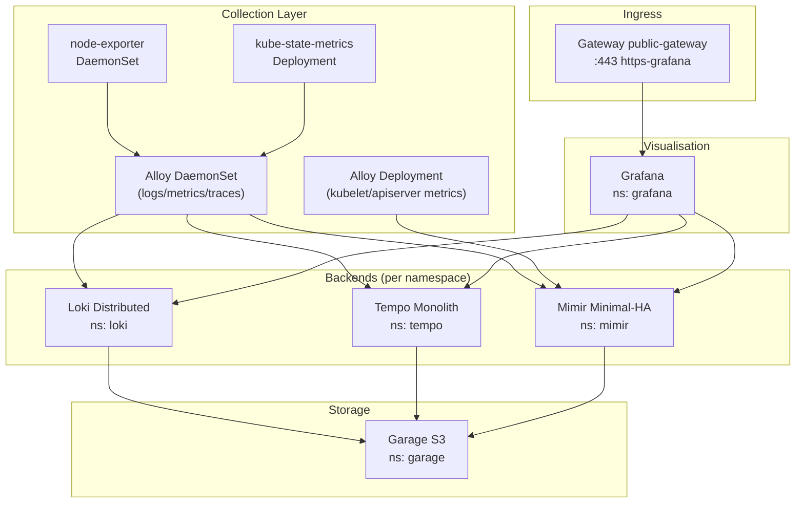

# Introduction

The Observability stack provides a multi-tenant **LGTM** (Loki, Grafana, Tempo, Mimir) platform for logs, metrics, and distributed traces. Components are deployed as separate Argo applications with sync waves to ensure dependencies (storage, secrets) are healthy before backends spin up.

Key capabilities:
- **Logs**: Loki (distributed mode) with Garage S3 storage
- **Traces**: Tempo (monolith) with OTLP ingestion
- **Metrics**: Mimir (minimal-HA) with Alertmanager + Ruler
- **Visualisation**: Grafana with OIDC SSO, datasource correlation (trace↔logs↔metrics)
- **Collection**: Alloy DaemonSet for logs/metrics/traces with tenant header injection

Design docs:
- [observability-lgtm-design.md](../../../../../docs/design/observability-lgtm-design.md)
- [observability-lgtm-log-ingestion.md](../../../../../docs/design/observability-lgtm-log-ingestion.md)
- [observability-lgtm-troubleshooting-alerting.md](../../../../../docs/design/observability-lgtm-troubleshooting-alerting.md)

For open/resolved issues, see [docs/component-issues/observability.md](../../../../../docs/component-issues/observability.md).

---

## Architecture



---

## Subfolders

| Path | Wave | Description |
|------|------|-------------|
| `namespaces/` | 0.5 | Namespaces (`observability`, `loki`, `tempo`, `mimir`, `grafana`) with mesh labels, NetworkPolicies, DestinationRules |
| `secrets/` | 1 | ExternalSecrets for S3 buckets, Grafana admin/OIDC, CA bundle |
| `metrics/` | 1.4 | kube-state-metrics + node-exporter for cluster metrics |
| `alloy/` | 1.5 | Grafana Alloy DaemonSet for logs/metrics/traces |
| `alloy-metrics/` | 1.5 | Dedicated Alloy Deployment for kubelet/apiserver scraping |
| `loki/` | 2 | Loki (distributed) Helm chart with Garage S3 storage |
| `tempo/` | 2.5 | Tempo (monolith) Helm chart with OTLP ingestion |
| `mimir/` | 2.5 | Mimir Helm chart with Alertmanager + Ruler, GitOps-managed alert rules |
| `grafana/` | 3 | Grafana Helm chart with OIDC, datasource correlation, dashboards |
| `ingress/` | 3.1 | HTTPRoute, Certificate, AuthorizationPolicy for Grafana |
| `smoke-tests/` | 4 | Continuous assurance CronJobs (LGTM write/read, ring/memberlist health, metrics scrape presence) |
| `tests/` | 4 | Argo `PostSync` hook Jobs (wave-4 sync-gate) for basic log/trace/metric write+read |

Overlays exist in:
- `loki/overlays/<deploymentId>/` (deployment-specific values / sizing)
- `mimir/overlays/<deploymentId>/` (deployment-specific values / sizing; consumes shared `mimir/base/rules/`)
- `grafana/overlays/<deploymentId>/` (deployment-specific values like hostname / OIDC)

---

## Container Images / Artefacts

| Artefact | Version | Registry / Location |
|----------|---------|---------------------|
| Loki Helm chart | `6.46.0` (distributed) | `https://grafana.github.io/helm-charts` |
| Tempo Helm chart | `1.24.0` | `https://grafana.github.io/helm-charts` |
| Mimir Helm chart | `6.0.5` | `https://grafana.github.io/helm-charts` |
| Grafana Helm chart | `10.1.4` | `https://grafana.github.io/helm-charts` |
| Alloy Helm chart | `1.4.0` | `https://grafana.github.io/helm-charts` |
| kube-state-metrics Helm chart | `7.0.0` | `https://prometheus-community.github.io/helm-charts` |
| node-exporter Helm chart | `4.49.2` | `https://prometheus-community.github.io/helm-charts` |
| metrics-server Helm chart | `3.12.2` | `https://kubernetes-sigs.github.io/metrics-server` |
| Bootstrap tools (smokes) | `1.4` | `registry.example.internal/deploykube/bootstrap-tools:1.4` |
| telemetrygen (traces) | `v0.143.0` | `registry.example.internal/open-telemetry/opentelemetry-collector-contrib/telemetrygen:v0.143.0` |

---

## Dependencies

| Dependency | Purpose |
|------------|---------|
| Garage (S3) | Object storage for Loki, Tempo, Mimir |
| Vault + ESO | Secrets projection for S3 creds, Grafana admin/OIDC |
| Keycloak | OIDC authentication for Grafana |
| Istio + Gateway API | Ingress via `public-gateway`; mTLS mesh |
| Step CA / cert-manager | TLS certificate for Grafana HTTPRoute |
| `istio-native-exit` ConfigMap | Enables smoke Jobs to complete cleanly |

---

## Security / Tenancy Notes

- **Backend APIs (Loki/Tempo/Mimir)** are treated as **mesh-internal** by default. Tenant separation relies primarily on `NetworkPolicy` boundaries plus `X-Scope-OrgID` tenancy headers, not on per-request auth.
- Optional Gateway API + Istio `AuthorizationPolicy` stubs for backend API exposure live in `platform/gitops/components/platform/observability/ingress-backends` and are **disabled by default** (not referenced by `platform-apps`).

---

## Communications With Other Services

### Kubernetes Service → Service Calls

| Caller | Target | Port | Protocol | Purpose |
|--------|--------|------|----------|---------|
| Alloy | `loki-gateway.loki.svc` | 80/8080 | HTTP | Log push |
| Alloy | `tempo.tempo.svc` | 4318 | OTLP/HTTP | Trace push |
| Alloy | `mimir-distributor.mimir.svc` | 8080 | Prometheus remote_write | Metric push |
| Grafana | `loki-gateway.loki.svc` | 80 | HTTP | Log queries |
| Grafana | `tempo.tempo.svc` | 3100 | HTTP | Trace queries |
| Grafana | `mimir-querier.mimir.svc` | 8080 | HTTP | Metric queries |
| Loki/Tempo/Mimir | `garage.garage.svc` | 3900 | HTTP | S3 API |
| Smoke Jobs | Backend services | various | HTTP/OTLP | Functional tests |

### External Dependencies (Vault, Keycloak, PowerDNS)

- **Vault**: Stores S3 credentials (`secret/garage/s3`), Grafana admin (`secret/observability/grafana/admin`), Grafana OIDC (`secret/observability/grafana/oidc`).
- **Keycloak**: Grafana uses OIDC client `grafana` in realm `deploykube-admin`.
- **PowerDNS + ExternalDNS**: Grafana hostname resolved to Istio ingress LB IP.

### Mesh-level Concerns (DestinationRules, mTLS Exceptions)

- **NetworkPolicies**: Default-deny per namespace with explicit allow rules for cross-namespace traffic (Alloy→backends, Grafana→backends, ingress→Grafana).
- **CiliumNetworkPolicy**: `observability` namespace can egress to kube-apiserver (for metrics scraping).
- **DestinationRule** `kube-apiserver`: mTLS disabled for kube-apiserver calls from `observability`.
- Istio sidecars injected in all namespaces; smoke Jobs use `istio-native-exit.sh` helper.

---

## Initialization / Hydration

1. **Namespaces** created (wave 0.5) with mesh labels and NetworkPolicies.
2. **ExternalSecrets** sync (wave 1): S3 creds → target namespaces, Grafana admin/OIDC.
3. **Metrics exporters** deploy (wave 1.4): kube-state-metrics, node-exporter.
4. **Alloy** deploys (wave 1.5): DaemonSet + dedicated Deployment start scraping/pushing.
5. **Backends** deploy (wave 2-2.5): Loki, Tempo, Mimir connect to Garage S3.
6. **Grafana** deploys (wave 3): OIDC configured, datasources provisioned with correlation.
7. **Ingress** (wave 3.1): HTTPRoute, Certificate, AuthorizationPolicy.
8. **Smoke tests** (wave 4):
   - `tests/`: Argo `PostSync` hook Jobs for log/trace/metric write+read
   - `smoke-tests/`: scheduled CronJobs for continuous assurance + staleness/failure alerting

Secrets to pre-populate in Vault:

| Vault Path | Keys |
|------------|------|
| `secret/garage/s3` | `S3_ACCESS_KEY`, `S3_SECRET_KEY`, `S3_REGION`, `S3_ENDPOINT`, bucket names |
| `secret/observability/grafana/admin` | `GF_SECURITY_ADMIN_PASSWORD` |
| `secret/observability/grafana/oidc` | `GF_AUTH_GENERIC_OAUTH_CLIENT_ID`, `GF_AUTH_GENERIC_OAUTH_CLIENT_SECRET`, URLs |

---

## Argo CD / Sync Order

The observability stack is split into multiple Argo applications:

| Application | Path | Sync Wave |
|-------------|------|-----------|
| `platform-observability-namespaces` | `namespaces/` | 0.5 |
| `platform-observability-secrets` | `secrets/` | 1 |
| `platform-observability-metrics` | `metrics/` | 1.4 |
| `platform-observability-alloy` | `alloy/` | 1.5 |
| `platform-observability-alloy-metrics` | `alloy-metrics/` | 1.5 |
| `platform-observability-loki` | `loki/` | 2 |
| `platform-observability-tempo` | `tempo/` | 2.5 |
| `platform-observability-mimir` | `mimir/` | 2.5 |
| `platform-observability-grafana` | `grafana/` | 3 |
| `platform-observability-ingress` | `ingress/` | 3.1 |
| `platform-observability-smoke-tests` | `smoke-tests/` | 4 |
| `platform-observability-tests` | `tests/` | 4 |

**Sync dependencies**: Garage + ESO must be healthy before secrets sync; namespaces before all others.

---

## Operations (Toils, Runbooks)

### Smoke Tests

```bash
# Continuous assurance (recommended): run a one-off Job from the CronJobs
kubectl -n observability create job --from=cronjob/observability-log-smoke smoke-manual-$(date +%s)
kubectl -n observability create job --from=cronjob/observability-metric-smoke smoke-manual-$(date +%s)
kubectl -n observability create job --from=cronjob/observability-trace-smoke smoke-manual-$(date +%s)

# Sync-gate (Argo hook Jobs): re-run by resyncing `platform-observability-tests`,
# or apply the bundle manually for a dev-loop:
kubectl apply -k platform/gitops/components/platform/observability/tests
```

Alert triage:
- `docs/runbooks/observability-smoke-alerts.md`
- `docs/runbooks/resource-contract-runtime-alerts.md`
- `docs/runbooks/security-scanning-ci-alerts.md`

### Check Argo Health

```bash
kubectl -n argocd get applications | grep observability
```

### Grafana Access

```bash
# Via browser (trust Step CA root)
open https://grafana.dev.internal.example.com

# Check datasources
kubectl -n grafana get configmap grafana -o yaml | grep datasources
```

### Related Guides

- [Troubleshooting + Alerting design](../../../../../docs/design/observability-lgtm-troubleshooting-alerting.md)
- See component-issues for detailed evidence history.

---

## Customisation Knobs

| Knob | Location | Default |
|------|----------|---------|
| Loki replicas | `loki/values.yaml` | ingester: 3, querier: 2, distributor: 1 |
| Loki retention | `DeploymentConfig.spec.observability.loki.limits.retentionPeriod` (rendered into `loki/overlays/<deploymentId>/values.yaml`) | mac: `24h`, proxmox: `168h` |
| Mimir replicas | `mimir/overlays/<deploymentId>/values.yaml` | various |
| Mimir alert rules | `mimir/base/rules/*.yaml` | Kubernetes + LGTM health |
| Tempo rate limits | `tempo/values.yaml` `.tempo.overrides` | rate_limit_bytes: 2000000 |
| Grafana hostname | `grafana/overlays/*/values.yaml` | env-specific |
| Grafana dashboards | `grafana/dashboards/` | cluster-overview |
| CI security-scanning alerts | `mimir/base/rules/configmap-security-scanning-ci.yaml` | platform-core freshness/failure |

---

## Oddities / Quirks

1. **Alloy remote_write bypasses gateways**: Due to DNS timeouts in Mimir gateway, Alloy writes directly to `mimir-distributor` and Grafana queries `mimir-querier` directly.
2. **Loki ingester anti-affinity**: Required pod anti-affinity can block scheduling on small clusters; use the `dev` overlay to reduce replicas.
3. **Tempo rate limits**: Default `overrides: null` causes `0 bytes/s` ingestion; must explicitly configure `rate_limit_bytes`.
4. **Grafana datasource UIDs**: Use `deleteDatasources` in values to avoid UID drift on redeploy.
5. **node-exporter hostNetwork**: Disabled to work with NetworkPolicies (scrapes via pod network).
6. **Dedicated alloy-metrics**: Single-writer Deployment for kubelet/apiserver to avoid `out-of-order samples` from DaemonSet replicas.

---

## TLS, Access & Credentials

| Concern | Details |
|---------|---------|
| External TLS | Terminated at `Gateway/public-gateway`; cert issued by Step CA |
| Internal TLS | Istio mTLS within mesh |
| Auth (Grafana Web) | Keycloak OIDC (`grafana` client in `deploykube-admin` realm) |
| Auth (Grafana Admin) | `admin` user with password from Vault |
| Auth (Backends) | `X-Scope-OrgID` header for multi-tenancy (no per-user auth) |
| Step CA root | Trust `shared/certs/deploykube-root-ca.crt` for external access |

---

## Dev → Prod

| Aspect | Dev (mac overlays) | HA/Prod (proxmox-talos overlay) |
|--------|---------------------|--------------------------------|
| Grafana hostname | `grafana.dev.internal.example.com` | `grafana.prod.internal.example.com` |
| Keycloak OIDC | `keycloak.dev.int` | `keycloak.prod.int` |
| Loki ingester replicas | 3 (lowmem: 2) | 3 |
| Mimir resources | default | increased |
| Vault paths | Same – each cluster has its own Vault | Same |

**Promotion**: Switch Argo app source paths to overlays; verify Grafana OIDC redirects to correct Keycloak, ExternalSecrets sync, and backends connect to Garage.

---

## Smoke Jobs / Test Coverage

### Current Implementation ✅

Three smoke Jobs exist in `tests/` (sync wave 4):

| Job | Target | Functional Checks |
|-----|--------|-------------------|
| `observability-log-smoke` | Loki | Push log → query back → verify content → delete (best-effort) |
| `observability-trace-smoke` | Tempo | Send OTLP span via telemetrygen → query back → verify trace ID |
| `observability-metric-smoke` | Mimir | Push metric via remote_write → query back → verify value |

**Job characteristics**:
- Use unique `runid` and tenant (`smoke-<timestamp>`) per execution
- Retry logic with configurable attempts and sleep intervals
- `X-Scope-OrgID` header for multi-tenancy
- Istio sidecar disabled (`sidecar.istio.io/inject: "false"`) to simplify Job completion

### Test Coverage Summary

| Test | Type | Status |
|------|------|--------|
| Loki push/query round-trip | Functional | ✅ Implemented |
| Tempo OTLP ingest/query | Functional | ✅ Implemented |
| Mimir remote_write/query | Functional | ✅ Implemented |
| Grafana OIDC login | Integration | ❌ Not automated |
| Grafana datasource health | Integration | ❌ Not automated |
| HA failover (pod kill → recovery) | HA | ❌ Not implemented |
| External Grafana reachability | Connectivity | ❌ Not automated |

### Proposed Additions

1. **Grafana smoke Job**: Verify external reachability via Gateway (`curl https://grafana.<env>.internal.example.com/api/health`), check datasource provisioning.
2. **Alert firing test**: Trigger a test alert, verify Alertmanager receives it.

---

## HA Posture

### Current Implementation

| Component | Replicas | HA Status | Details |
|-----------|----------|-----------|---------|
| **Loki ingester** | 3 | ✅ HA | Required anti-affinity by hostname |
| **Loki querier** | 2 | ✅ HA | Stateless |
| **Loki gateway** | 1 | ⚠️ SPOF | Single replica |
| **Loki compactor** | 1 | ⚠️ SPOF | Singleton by design |
| **Tempo** | 1 | ❌ Not HA | Monolith mode (single StatefulSet) |
| **Mimir distributor** | 3 | ✅ HA | Stateless |
| **Mimir ingester** | 3 | ✅ HA | Ring-based replication |
| **Mimir querier** | 2 | ✅ HA | Stateless |
| **Mimir gateway** | 2 | ✅ HA | Load balanced |
| **Grafana** | 1 | ❌ Not HA | Single replica |
| **Alloy** | DaemonSet | ✅ HA | One per node |
| **Alloy-metrics** | 1 | ⚠️ SPOF | Single writer to avoid out-of-order samples |

### PodDisruptionBudgets

| Component | PDB | Status |
|-----------|-----|--------|
| Loki | Not configured | ❌ Gap |
| Tempo | Not configured | ❌ Gap |
| Mimir | Not configured | ❌ Gap |
| Grafana | Not configured | ❌ Gap |
| Alloy-metrics | Configured (`enabled: true`) | ✅ Implemented |

### Gaps

1. **Tempo not HA**: Monolith mode is single-replica by design; production requires distributed mode or traffic draining.
2. **Grafana single replica**: No PDB or anti-affinity.
3. **Loki/Mimir/Grafana missing PDBs**: Voluntary disruptions can take down critical components.

### Recommendations

1. Add PDBs for Loki ingester, Mimir ingester, Mimir distributor, Grafana.
2. Consider Tempo distributed mode for production (with explicit HA requirements).
3. Scale Grafana to 2 replicas with session affinity or external session store.

---

## Security

### Current Controls ✅

| Layer | Control | Status |
|-------|---------|--------|
| **Transport (external)** | TLS at Istio Gateway (Step CA) | ✅ Implemented |
| **Transport (mesh)** | Istio mTLS | ✅ Implemented |
| **NetworkPolicies** | Default-deny + explicit allows | ✅ Comprehensive (632 lines) |
| **CiliumNetworkPolicy** | Kube-apiserver egress for metrics | ✅ Implemented |
| **Auth (Grafana)** | Keycloak OIDC | ✅ Implemented |
| **Auth (Backends)** | `X-Scope-OrgID` multi-tenancy | ✅ Implemented |
| **Secrets** | Vault + ESO; no plaintext | ✅ Implemented |
| **AuthorizationPolicy** | Grafana ingress restricted to gateway identity | ✅ Implemented |

### NetworkPolicy Coverage

| Namespace | Default Deny | Egress Baseline | Intra-ns | Cross-ns Ingress |
|-----------|--------------|-----------------|----------|------------------|
| `observability` | ✅ | ✅ (DNS, backends, Istio) | ✅ | ✅ (self) |
| `loki` | ✅ | ✅ (DNS, Garage, Istio) | ✅ | ✅ (gateway from observability/grafana) |
| `tempo` | ✅ | ✅ (DNS, Garage, Istio) | ✅ | ✅ (OTLP from observability, query from grafana) |
| `mimir` | ✅ | ✅ (DNS, Garage, Istio) | ✅ | ✅ (distributor/querier/gateway from observability/grafana) |
| `grafana` | ✅ | ✅ (DNS, Istio, backends, Keycloak) | ✅ | ✅ (from istio-system gateway) |

### Gaps

1. **Backend APIs unauthenticated**: Loki/Tempo/Mimir rely on `X-Scope-OrgID` header without verification; any pod in allowed namespaces can impersonate any tenant.
2. **No rate limiting on backends**: Alloy or misbehaving pods can overwhelm ingestion.
3. **Smoke Jobs disable sidecar**: Trade-off for Job completion simplicity; reduces observability.

### Recommendations

1. Document tenant isolation model (NetworkPolicy-based, not auth-based).
2. Consider adding ingestion rate limits at Mimir/Loki level.
3. Migrate smoke Jobs to native sidecar pattern for consistency.

---

## Backup and Restore

### Current State

| Component | Data | Backup Status |
|-----------|------|---------------|
| **Loki** | Logs in Garage S3 | ❌ No backup (ephemeral) |
| **Tempo** | Traces in Garage S3 | ❌ No backup (ephemeral) |
| **Mimir** | Metrics in Garage S3 | ❌ No backup (ephemeral) |
| **Mimir Ruler** | Alert rules in S3 | ❌ No backup (GitOps-reconstructible) |
| **Grafana** | Dashboards | ✅ GitOps-managed (`grafana/dashboards/`) |
| **Grafana** | Datasources | ✅ GitOps-managed (`values.yaml`) |
| **Grafana** | User sessions | ❌ No persistence (SQLite in-pod) |

### Analysis

The observability stack is **ephemeral by design**:
- Logs/traces/metrics are stored in Garage S3, which itself relies on host-level snapshots (ZFS on Proxmox).
- Retention policies apply (Loki 14 days, Tempo/Mimir configurable).
- Configuration (dashboards, datasources, alert rules) is fully GitOps-managed and reconstructible.

### Disaster Recovery

1. **Garage S3 lost**: LGTM data is lost; re-ingest from sources. Alert rules and dashboards are restored via GitOps.
2. **Grafana pod lost**: Redeploys with GitOps-managed config; user sessions lost but recoverable via OIDC.
3. **Full cluster rebuild**: Resync all observability Argo apps; data re-ingests from running workloads.

### Recommendations

1. Document that observability data is ephemeral and does not require independent backup.
2. Ensure Garage backup strategy covers critical retention windows.
3. Consider persisting Grafana SQLite to PVC if user preferences/annotations become important.
