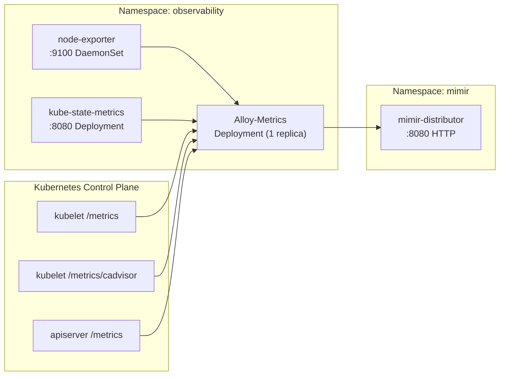

# Introduction

Grafana Alloy (Metrics) is a **single-replica Deployment** for cluster metrics collection and `remote_write` into Mimir. It runs in the `observability` namespace alongside the main Alloy DaemonSet.

**Why a separate Deployment?**
- The log/trace agent (`alloy`) runs as a DaemonSet for node-local log file access.
- Scraping cluster-wide exporters (node-exporter, kube-state-metrics, kubelet, cadvisor, apiserver) from every DaemonSet replica causes duplicate writes and triggers Mimir `out-of-order samples` rejections.

This component keeps metrics as **one writer per timeseries** while the `alloy` DaemonSet continues to handle logs + traces.

> [!NOTE]
> For logs and traces collection, see the companion [alloy](../alloy/README.md) component.

In addition to scraping cluster exporters, `alloy-metrics` also runs **embedded blackbox probes** (via `prometheus.exporter.blackbox`) for VIP reachability/latency when the `vip-probes` overlay is installed.

For open/resolved issues, see the parent [docs/component-issues/observability.md](../../../../../../docs/component-issues/observability.md).

---

## Architecture



**Flow**:
1. Alloy-metrics discovers pods/nodes via `discovery.kubernetes`
2. Scrapes node-exporter (`observability/prometheus-node-exporter:9100`) and kube-state-metrics (`observability/kube-state-metrics:8080`)
3. Scrapes kubelet/cadvisor via apiserver proxy (`kubernetes.default.svc:443/api/v1/nodes/<node>/proxy/metrics[/cadvisor]`)
4. Scrapes kube-apiserver directly (`kubernetes.default.svc:443/metrics`)
5. Remote-writes all metrics to `mimir-distributor.mimir.svc:8080` with `X-Scope-OrgID: platform`

---

## Subfolders

This component has no subfolders—all configuration is in the base directory.

| File | Purpose |
|------|---------|
| `kustomization.yaml` | Helm chart reference (alloy 1.4.0) with sync wave 1.45 |
| `values.yaml` | Deployment config, Alloy river config (discovery, scrapes, remote_write) |

---

## Container Images / Artefacts

| Artefact | Version | Registry / Location |
|----------|---------|---------------------|
| Alloy Helm chart | `1.4.0` | `https://grafana.github.io/helm-charts` |
| Alloy container | (chart default) | `docker.io/grafana/alloy` |

---

## Dependencies

| Dependency | Purpose |
|------------|---------|
| Mimir (distributor) | Metrics push target (`mimir-distributor.mimir.svc.cluster.local:8080`) |
| node-exporter | Exports node-level metrics (from `components/platform/observability/metrics`) |
| kube-state-metrics | Exports Kubernetes resource metrics (from `components/platform/observability/metrics`) |
| Kubernetes API | Pod/node discovery, apiserver proxy for kubelet/cadvisor, apiserver metrics |
| Observability namespace | Must exist with `istio-injection: enabled` |
| NetworkPolicies | Must allow egress to kube-apiserver (`CiliumNetworkPolicy`) and Mimir distributor |

---

## Communications With Other Services

### Kubernetes Service → Service Calls

| Caller | Target | Port | Protocol | Purpose |
|--------|--------|------|----------|---------|
| Alloy-metrics | `mimir-distributor.mimir.svc` | 8080 | HTTP | Metrics remote_write (`/api/v1/push`) |
| Alloy-metrics | node-exporter pods | 9100 | HTTP | Scrape node metrics |
| Alloy-metrics | kube-state-metrics pods | 8080 | HTTP | Scrape Kubernetes resource metrics |
| Alloy-metrics | `kubernetes.default.svc` | 443 | HTTPS | Pod/node discovery, apiserver proxy, apiserver metrics |
| Alloy-metrics | VIPs (PowerDNS + public gateway) | 53/443 | UDP/TCP/HTTPS | Synthetic probes (`job="vip-probes"`) for VIP reachability/latency |

### External Dependencies (Vault, Keycloak, PowerDNS)

None. Alloy-metrics does not require secrets from Vault or authentication via Keycloak.

### Mesh-level Concerns (DestinationRules, mTLS Exceptions)

- **Istio sidecar injected**: Runs with mesh
- **Outbound port exclusions**: `443,6443` excluded from Envoy redirection for Kubernetes API stability (via `traffic.sidecar.istio.io/excludeOutboundPorts` annotation)
- **DestinationRule** `kube-apiserver`: mTLS disabled for kube-apiserver calls from `observability` namespace
- **CiliumNetworkPolicy**: Required for egress to kube-apiserver endpoints (node IPs)

---

## Initialization / Hydration

1. **Observability namespace** created (wave 0.5) with `istio-injection: enabled`
2. **CiliumNetworkPolicy** allows egress to kube-apiserver
3. **metrics exporters** deploy (wave 1.4): node-exporter, kube-state-metrics
4. **Alloy-metrics Deployment** deploys (wave 1.45) with single replica
5. **Discovery** starts immediately—pods and nodes enumerated
6. **Scraping** begins—metrics collected every 30s
7. **Remote-write** pushes to Mimir distributor with tenant `platform`

No secrets or pre-population required.

---

## Argo CD / Sync Order

| Property | Value |
|----------|-------|
| Sync wave | `1.45` |
| Pre/PostSync hooks | None |
| Sync dependencies | `observability` namespace + NetworkPolicies (wave 0.5); metrics exporters (wave 1.4); Mimir (wave 2.5) should be healthy for data flow |

---

## Operations (Toils, Runbooks)

### Check Alloy-Metrics Deployment

```bash
kubectl -n observability get pods -l app.kubernetes.io/name=alloy-metrics -o wide
kubectl -n observability logs deploy/alloy-metrics -c alloy --tail=100
```

### Debug Missing Metrics

1. Confirm Alloy-metrics pod is running: `kubectl -n observability get pods -l app.kubernetes.io/name=alloy-metrics`
2. Check Alloy errors: `kubectl -n observability logs deploy/alloy-metrics -c alloy --tail=200 | grep -E "(error|remote_write|mimir)"`
3. Verify targets are scraped: search for `prometheus.scrape` job logs
4. Validate NetworkPolicy: `kubectl -n observability get networkpolicy` and `kubectl -n observability get ciliumnetworkpolicy`
5. Query Mimir directly:
   ```bash
   kubectl -n observability run curl-debug --rm -it --image=curlimages/curl:8.6.0 --restart=Never -- \
     curl -s "http://mimir-querier.mimir.svc.cluster.local:8080/prometheus/api/v1/query?query=up" \
       -H "X-Scope-OrgID: platform"
   ```

### Related Guides

- [observability-lgtm-design.md](../../../../../../docs/design/observability-lgtm-design.md)

---

## Customisation Knobs

| Knob | Location | Default |
|------|----------|---------|
| Resource requests | `values.yaml` `.alloy.resources` | `100m/200Mi` req, `500m/600Mi` limits |
| Replicas | `values.yaml` `.controller.replicas` | `1` (single writer) |
| Scrape interval | `values.yaml` (prometheus.scrape) | `30s` |
| Tenant ID | `values.yaml` (prometheus.remote_write headers) | `platform` |
| Cluster label | `values.yaml` (external_labels) | `deploykube` |
| Mimir endpoint | `values.yaml` (prometheus.remote_write url) | `http://mimir-distributor.mimir.svc.cluster.local:8080/api/v1/push` |

---

## Oddities / Quirks

1. **Single writer design**: Intentionally runs as 1 replica to avoid `out-of-order samples` errors in Mimir. For HA metric ingestion, would need Alloy clustering + Mimir HA-dedup.
2. **Kubernetes API port exclusion**: Ports 443/6443 excluded from Istio redirection for stable discovery under STRICT mTLS.
3. **Apiserver proxy scraping**: kubelet/cadvisor are scraped via the apiserver proxy (`/api/v1/nodes/<node>/proxy/metrics`) to avoid node IP allowlists under deny-by-default NetworkPolicies.
4. **Bypasses Mimir gateway**: Writes directly to `mimir-distributor` to avoid DNS proxy flaps in nginx gateway.
5. **ServiceMonitor enabled**: Alloy exposes `/metrics` for self-monitoring (meta-metrics).

---

## TLS, Access & Credentials

| Concern | Details |
|---------|---------|
| Transport (Mimir) | HTTP within Istio mesh (mTLS) |
| Transport (kube-apiserver) | HTTPS with service account token + CA bundle |
| Transport (exporters) | HTTP within Istio mesh (mTLS) |
| Auth (Mimir) | `X-Scope-OrgID: platform` header |
| Credentials | None from Vault—uses in-cluster service account for apiserver auth |

---

## Dev → Prod

| Aspect | Dev (overlays/dev) | Prod (overlays/prod) |
|--------|------------|----------------|
| Replicas | `1` | `1` (or `2` with Alloy clustering + Mimir HA-dedup) |
| Resource limits | `500m/600Mi` | `1/2Gi` (tune per workload volume) |
| Scrape interval | `30s` | `30s` (or `15s` for higher resolution) |

**Promotion**: Create overlay with increased resources if needed. For HA metric ingestion:
1. Increase replicas to 2
2. Enable Alloy clustering
3. Configure Mimir HA-dedup to handle duplicate remote_write streams

---

## Smoke Jobs / Test Coverage

### Current State ✅

Alloy-metrics is covered by:

| Job / CronJob | Coverage |
|-----|----------|
| `observability-metric-smoke` | Pushes metric → queries Mimir → verifies round-trip |
| `alloy-metrics-scrape-smoke` | Queries Mimir for core scraped targets (up + representative series) with expected labels (`cluster=deploykube`, `tenant=platform`) |

The dedicated CronJob lives under `platform/gitops/components/platform/observability/smoke-tests` and is intended as continuous assurance.

Manual trigger:

```bash
kubectl -n observability create job --from=cronjob/alloy-metrics-scrape-smoke smoke-manual-$(date +%s)
```

---

## HA Posture

### Current Implementation

| Aspect | Status | Details |
|--------|--------|---------|
| Deployment type | ⚠️ Single replica | Intentional—avoids out-of-order samples in Mimir |
| PodDisruptionBudget | ✅ Configured | `maxUnavailable: 1` |
| Anti-affinity | ❌ Not applicable | Single replica |
| Rolling update | ✅ Default | `minReadySeconds: 5` |

### Analysis

Alloy-metrics is an **intentional SPOF** by design:
- Running multiple replicas would cause each to scrape the same targets
- Mimir would receive duplicate writes with identical timestamps
- Result: `out-of-order samples` errors and metric loss

**Mitigation options for production HA**:
1. **Alloy clustering**: Enable Alloy's built-in clustering with hash-based target distribution
2. **Mimir HA-dedup**: Configure Mimir to deduplicate identical samples from multiple writers
3. **Active/passive**: Use a leader election sidecar (e.g., `k8s-leader-elector`) with standby replica

### Gaps

1. **Single replica = brief metric gap during pod restarts** (rolling update, node failure)
2. **No HA story implemented** for production—tracked as open item

---

## Security

### Current Controls ✅

| Layer | Control | Status |
|-------|---------|--------|
| **Transport (Mimir)** | Istio mTLS mesh | ✅ Implemented |
| **Transport (exporters)** | Istio mTLS mesh | ✅ Implemented |
| **Transport (kube-apiserver)** | HTTPS with SA token | ✅ Implemented |
| **NetworkPolicies** | Default-deny + explicit allows | ✅ Comprehensive |
| **CiliumNetworkPolicy** | Kube-apiserver egress | ✅ Implemented |
| **Istio port exclusion** | 443/6443 for apiserver | ✅ Implemented |
| **Credentials** | No Vault secrets | ✅ N/A |
| **RBAC** | ServiceAccount with `nodes/proxy` | ✅ Chart-managed |

### NetworkPolicy Coverage

| Policy | Namespace | Purpose |
|--------|-----------|--------|
| `default-deny-ingress` | observability | Block all ingress by default |
| `default-egress-baseline` | observability | Allow DNS, kube-apiserver, Mimir distributor, Istio control plane |
| `observability-allow-self` | observability | Allow intra-namespace (alloy ↔ exporters) |
| `mimir-allow-distributor-from-observability` | mimir | Allow remote_write from observability |
| `observability-allow-kube-apiserver` | observability | CiliumNetworkPolicy for apiserver egress |

### Gaps

1. **No authentication on Mimir push**: Relies on `X-Scope-OrgID` header without verification. Any pod in `observability` namespace can push to any tenant.
2. **No rate limiting**: Misbehaving alloy-metrics could overwhelm Mimir (mitigated by single replica).

### Recommendations

1. Document tenant isolation model as NetworkPolicy-based (done in this README).
2. Consider adding Mimir ingestion rate limits if multi-tenant production use expands.

---

## Backup and Restore

### Current State

| Aspect | Status |
|--------|--------|
| Persistent data | **None** |
| Configuration | GitOps-managed (Helm values) |
| Scraped metrics | Stored in Mimir (Garage S3) |

### Analysis

Alloy-metrics is **fully stateless**:
- No local persistent storage
- Configuration is GitOps-managed and reconstructible from Helm values
- Metrics are pushed to Mimir immediately; no local buffering beyond memory

### Disaster Recovery

1. **Pod lost**: Deployment recreates automatically; brief metric gap (~1 scrape interval)
2. **Full cluster rebuild**: Alloy-metrics redeploys via Argo sync; resumes scraping immediately
3. **Mimir data lost**: Historical metrics lost; alloy-metrics repopulates from current scrape targets

**No backup mechanism needed.**
