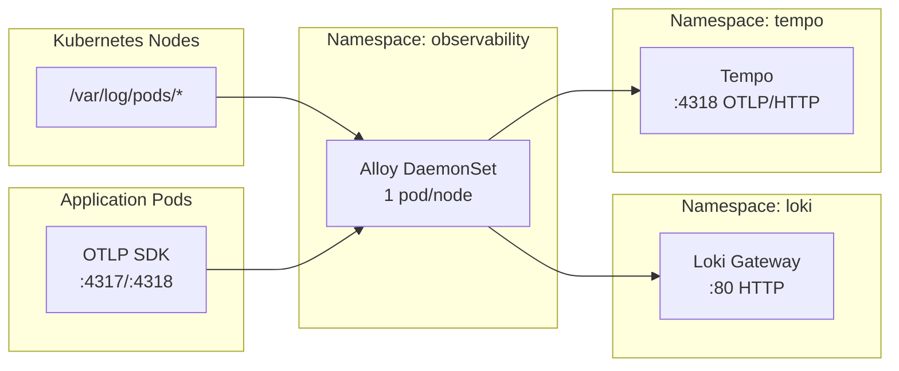

# Introduction

Grafana Alloy is the **cluster-wide telemetry collection agent** deployed as a DaemonSet for log and trace ingestion. It runs one pod per node in the `observability` namespace, tails container logs from `/var/log/pods/`, and forwards OTLP traces to Tempo.

**Key responsibilities**:
- **Logs**: Discover pods via Kubernetes API, tail logs, push to Loki with `X-Scope-OrgID` tenant headers
- **Traces**: Receive OTLP via gRPC/HTTP, batch, forward to Tempo

> [!NOTE]
> Metrics scraping is handled by a dedicated `alloy-metrics` Deployment to maintain a single writer per timeseries and avoid Mimir out-of-order rejections.

Design docs:
- [observability-lgtm-log-ingestion.md](../../../../../../docs/design/observability-lgtm-log-ingestion.md)

For open/resolved issues, see the parent [docs/component-issues/observability.md](../../../../../../docs/component-issues/observability.md).

---

## Architecture



**Flow**:
1. Alloy discovers pods via `discovery.kubernetes`
2. Tails logs from `/var/log/pods/` with relabeling for low-cardinality labels
3. Pushes to Loki gateway with static tenant `platform`
4. Receives OTLP traces (gRPC 4317, HTTP 4318) and forwards to Tempo

---

## Subfolders

This component has no subfolders—all configuration is in the base directory.

| File | Purpose |
|------|---------|
| `kustomization.yaml` | Helm chart reference (alloy 1.4.0) with sync wave 1.5 |
| `values.yaml` | DaemonSet config, Alloy config (discovery, loki, otelcol) |

---

## Container Images / Artefacts

| Artefact | Version | Registry / Location |
|----------|---------|---------------------|
| Alloy Helm chart | `1.4.0` | `https://grafana.github.io/helm-charts` |
| Alloy container | (chart default) | `docker.io/grafana/alloy` |

---

## Dependencies

| Dependency | Purpose |
|------------|---------|
| Loki (gateway) | Log push target (`loki-gateway.loki.svc.cluster.local`) |
| Tempo | Trace forward target (`tempo.tempo.svc.cluster.local:4318`) |
| Kubernetes API | Pod/node discovery for relabeling |
| Observability namespace | Must exist with `istio-injection: enabled` |
| NetworkPolicies | Must allow egress to Loki/Tempo/kube-apiserver |

---

## Communications With Other Services

### Kubernetes Service → Service Calls

| Caller | Target | Port | Protocol | Purpose |
|--------|--------|------|----------|---------|
| Alloy | `loki-gateway.loki.svc` | 80 | HTTP | Log push (`/loki/api/v1/push`) |
| Alloy | `tempo.tempo.svc` | 4318 | OTLP/HTTP | Trace forward |
| Alloy | Kubernetes API | 443/6443 | HTTPS | Pod/node discovery |
| Application pods | Alloy | 4317 | OTLP/gRPC | Trace ingest |
| Application pods | Alloy | 4318 | OTLP/HTTP | Trace ingest |

### External Dependencies (Vault, Keycloak, PowerDNS)

None. Alloy does not require secrets from Vault or authentication via Keycloak.

### Mesh-level Concerns (DestinationRules, mTLS Exceptions)

- **Istio sidecar injected**: Runs with mesh
- **Outbound port exclusions**: `443,6443` excluded from Envoy redirection for Kubernetes API stability
- **Inbound capture**: All ports included via `traffic.sidecar.istio.io/includeInboundPorts: "*"` for OTLP receivers

---

## Initialization / Hydration

1. **Observability namespace** created (wave 0.5) with `istio-injection: enabled`
2. **NetworkPolicies** allow egress to Loki/Tempo/kube-apiserver
3. **Alloy DaemonSet** deploys (wave 1.5) with one pod per node
4. **Discovery** starts immediately—pods and nodes enumerated
5. **Log collection** begins—tails `/var/log/pods/` and pushes to Loki
6. **Trace receiver** listens on 4317/4318 for OTLP

No secrets or pre-population required.

---

## Argo CD / Sync Order

| Property | Value |
|----------|-------|
| Sync wave | `1.5` |
| Pre/PostSync hooks | None |
| Sync dependencies | `observability` namespace + NetworkPolicies (wave 0.5); Loki/Tempo apps (wave 2/2.5) should be healthy for data flow |

---

## Operations (Toils, Runbooks)

### Check Alloy DaemonSet

```bash
kubectl -n observability get pods -l app.kubernetes.io/name=alloy -o wide
kubectl -n observability logs ds/alloy -c alloy --tail=100
```

### Debug Missing Logs

1. Confirm pod produces logs: `kubectl -n <ns> logs <pod> -c <container> --tail=50`
2. Confirm Alloy runs on node: `kubectl -n observability get pods -l app.kubernetes.io/name=alloy -o wide`
3. Check Alloy errors: `kubectl -n observability logs ds/alloy -c alloy --tail=200 | grep -E "(error|loki|push)"`
4. Validate NetworkPolicy: `kubectl -n observability get networkpolicy`
5. Query Loki directly:
   ```bash
   kubectl -n observability run curl-debug --rm -it --image=curlimages/curl:8.6.0 --restart=Never -- \
     curl -s -G "http://loki-gateway.loki.svc.cluster.local/loki/api/v1/labels" \
       -H "X-Scope-OrgID: platform"
   ```

### Related Guides

- [observability-lgtm-log-ingestion.md](../../../../../../docs/design/observability-lgtm-log-ingestion.md)

---

## Customisation Knobs

| Knob | Location | Default |
|------|----------|---------|
| Resource requests | `values.yaml` `.alloy.resources` | `100m/200Mi` req, `500m/600Mi` limits |
| Tolerations | `values.yaml` `.controller.tolerations` | control-plane, master |
| Tenant ID | `values.yaml` `.alloy.configMap.content` | `platform` |
| Loki endpoint | `values.yaml` (loki.write) | `http://loki-gateway.loki.svc.cluster.local/loki/api/v1/push` |
| Tempo endpoint | `values.yaml` (otelcol.exporter.otlphttp) | `http://tempo.tempo.svc.cluster.local:4318` |
| OTLP receiver ports | `values.yaml` (otelcol.receiver.otlp) | gRPC 4317, HTTP 4318 |

---

## Oddities / Quirks

1. **Metrics excluded**: Alloy DaemonSet does NOT scrape metrics—handled by `alloy-metrics` Deployment to avoid out-of-order samples from multiple writers.
2. **Kubernetes API port exclusion**: Ports 443/6443 excluded from Istio redirection for stable discovery under STRICT mTLS.
3. **Static tenant**: All logs go to tenant `platform`; namespace-based tenant routing is metadata-only (labels), not actual Loki multi-tenancy yet.
4. **Control-plane tolerations**: DaemonSet tolerates control-plane taints to collect logs from system pods.

---

## TLS, Access & Credentials

| Concern | Details |
|---------|---------|
| Transport (log push) | HTTP within Istio mesh (mTLS) |
| Transport (trace receive) | HTTP/gRPC within Istio mesh (mTLS) |
| Auth (Loki) | `X-Scope-OrgID: platform` header |
| Auth (Tempo) | `X-Scope-OrgID: platform` header |
| Credentials | None—no Vault secrets required |

---

## Dev → Prod

| Aspect | Dev (overlays/dev) | Prod (overlays/prod) |
|--------|------------|----------------|
| Resource limits | `500m/600Mi` | `1/2Gi` (tune per node count) |
| Tolerations | Control-plane only | + dedicated workload taints |
| Log retention | 3 days (Loki) | 14+ days |

**Promotion**: Create overlay with increased resources, add tolerations for prod taints, point prod app-of-apps to overlay.

---

## Smoke Jobs / Test Coverage

### Current State

Alloy is covered by the parent observability smoke tests:

| Job | Coverage |
|-----|----------|
| `observability-log-smoke` | Pushes log → queries Loki → verifies Alloy→Loki pipeline |
| `observability-trace-smoke` | Sends OTLP trace → queries Tempo → verifies Alloy→Tempo pipeline |

**Alloy-specific health checks**:
- DaemonSet pod health via `kubectl -n observability get pods -l app.kubernetes.io/name=alloy`
- Alloy logs for errors: `kubectl -n observability logs ds/alloy -c alloy --tail=100 | grep -i error`
- ServiceMonitor exposes `/metrics` for Prometheus scraping

### Proposed Additions

1. **Alloy liveness probe validation**: Verify `/ready` endpoint returns 200
2. **OTLP receiver test**: Send test span directly to Alloy pod, verify receipt in Tempo

---

## HA Posture

### Current Implementation ✅

| Aspect | Status | Details |
|--------|--------|---------|
| Deployment type | ✅ DaemonSet | One pod per node—inherently HA |
| Node coverage | ✅ Full | Tolerates control-plane taints |
| Rolling update | ✅ Configured | `maxUnavailable: 1` |
| PodDisruptionBudget | ❌ Not configured | DaemonSets rarely need PDB |

### Analysis

Alloy is **inherently HA** as a DaemonSet:
- Each node has its own collector; node failure only affects that node's logs
- Rolling updates ensure at most 1 pod unavailable during upgrades
- Control-plane tolerations ensure system logs are collected

**No gaps identified**—DaemonSet pattern provides node-level HA by design.

---

## Security

### Current Controls ✅

| Layer | Control | Status |
|-------|---------|--------|
| **Transport (Loki)** | Istio mTLS mesh | ✅ Implemented |
| **Transport (Tempo)** | Istio mTLS mesh | ✅ Implemented |
| **Transport (OTLP)** | Istio mTLS mesh | ✅ Implemented |
| **API port exclusion** | 443/6443 excluded from Envoy | ✅ Implemented |
| **NetworkPolicies** | Covered by `observability` namespace policies | ✅ Implemented |
| **Credentials** | None required | ✅ N/A |
| **Tenant isolation** | `X-Scope-OrgID` header | ✅ Static `platform` |

### Gaps

1. **No authentication on OTLP receiver**: Any pod in the mesh can send traces to Alloy (mitigated by NetworkPolicy).
2. **Tenant is static**: All logs/traces go to `platform`; no per-namespace tenant routing implemented.

### Recommendations

1. NetworkPolicies already restrict OTLP sender access—document this as the isolation mechanism.
2. Consider namespace-based tenant routing if multi-tenancy is required.

---

## Backup and Restore

### Current State

| Aspect | Status |
|--------|--------|
| Persistent data | **None** |
| Configuration | GitOps-managed (Helm values) |
| Collected logs | Stored in Loki (Garage S3) |
| Collected traces | Stored in Tempo (Garage S3) |

### Analysis

Alloy is **fully stateless**:
- No local persistent storage
- Configuration is GitOps-managed and reconstructible from Helm values
- Telemetry data is forwarded to backends (Loki/Tempo) immediately

### Disaster Recovery

1. **Pod lost**: DaemonSet recreates automatically; brief log gap on that node
2. **Full cluster rebuild**: Alloy redeploys via Argo sync; resumes collection immediately

**No backup mechanism needed.**
