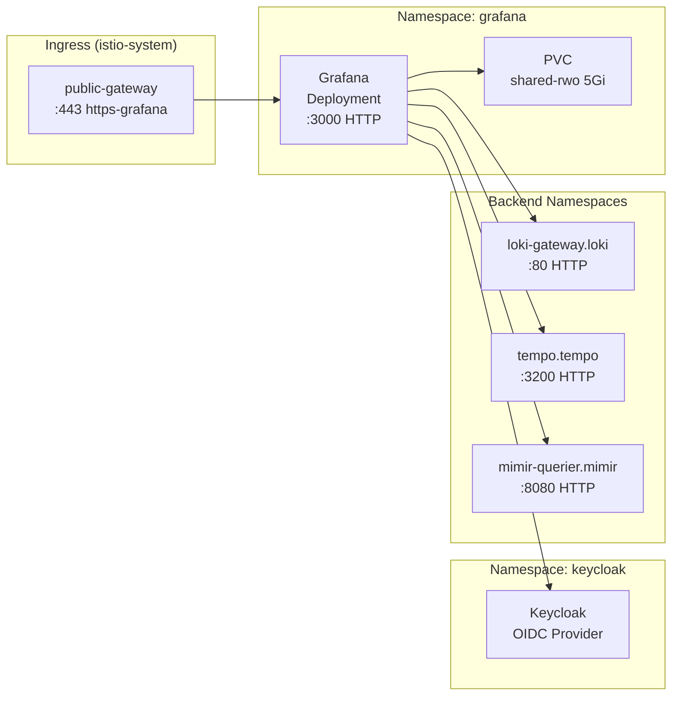

# Introduction

Grafana is the **visualisation and alerting platform** for the observability stack, providing a unified interface for querying logs (Loki), traces (Tempo), and metrics (Mimir). It runs as a single-replica Deployment in the `grafana` namespace with PVC-backed storage.

**Key capabilities**:
- **Datasource correlation**: Seamless pivoting between signals (trace→logs, logs→trace, metrics→trace)
- **OIDC authentication**: Keycloak SSO with role mapping from groups
- **GitOps dashboards**: ConfigMap-provisioned dashboards for platform health
- **Unified alerting**: Mimir-backed alerting with Grafana UI

External access is provided via Gateway API (`components/platform/observability/ingress`) using the shared `istio-system/public-gateway` listener `https-grafana` and TLS Secret `grafana-tls` issued by `components/certificates/ingress`.

Design docs:
- [observability-lgtm-design.md](../../../../../../docs/design/observability-lgtm-design.md)
- [observability-lgtm-troubleshooting-alerting.md](../../../../../../docs/design/observability-lgtm-troubleshooting-alerting.md)

For open/resolved issues, see the parent [docs/component-issues/observability.md](../../../../../../docs/component-issues/observability.md).

---

## Architecture



**Flow**:
1. User accesses `https://grafana.<env>.internal.example.com`
2. Istio Gateway terminates TLS, routes to Grafana Service
3. Grafana redirects to Keycloak for OIDC authentication
4. After login, Grafana queries backends via in-cluster Services
5. Datasources use `X-Scope-OrgID: platform` header for multi-tenancy

---

## Subfolders

| Path | Purpose |
|------|---------|
| `base/` | Shared dashboards + smoke tests |
| `charts/` | Vendored Grafana chart (avoid outbound egress) |
| `overlays/<deploymentId>/` | Deployment-specific values (hostname, OIDC/Vault wiring, persistence sizing) |

| File | Purpose |
|------|---------|
| `kustomization.yaml` | Helm chart reference (grafana 10.1.4) with sync wave 3 |
| `values.yaml` | Chart values: OIDC, datasources, persistence, dashboards |

---

## Dashboards

- `istio-proxy-sizing` ("Istio Proxy Sizing"): observed `istio-proxy` usage quantiles plus per-pod requests and (optional) limits (shown in separate tables; limits may be empty).

---

## Container Images / Artefacts

| Artefact | Version | Registry / Location |
|----------|---------|---------------------|
| Grafana Helm chart | `10.1.4` | `https://grafana.github.io/helm-charts` |
| Grafana container | (chart default) | `docker.io/grafana/grafana` |

---

## Dependencies

| Dependency | Purpose |
|------------|---------|
| Loki (gateway) | Log query target (`loki-gateway.loki.svc.cluster.local`) |
| Tempo | Trace query target (`tempo.tempo.svc.cluster.local:3200`) |
| Mimir (querier) | Metrics query target (`mimir-querier.mimir.svc.cluster.local:8080`) |
| Keycloak | OIDC authentication provider |
| Vault + ESO | Secrets for admin password (`grafana-admin`) and OIDC (`grafana-oidc`) |
| `shared-rwo` StorageClass | PVC for Grafana SQLite DB and session data |
| Gateway API (public-gateway) | External access via HTTPRoute |
| Step CA / cert-manager | TLS certificate for `grafana-tls` |
| Grafana namespace | Must exist with `istio-injection: enabled` |

---

## Communications With Other Services

### Kubernetes Service → Service Calls

| Caller | Target | Port | Protocol | Purpose |
|--------|--------|------|----------|---------|
| Grafana | `loki-gateway.loki.svc` | 80 | HTTP | Log queries |
| Grafana | `tempo.tempo.svc` | 3200 | HTTP | Trace queries |
| Grafana | `mimir-querier.mimir.svc` | 8080 | HTTP | Metrics queries (PromQL) |
| Grafana | `keycloak.keycloak.svc` | 8080 | HTTP | OIDC token exchange/userinfo |
| Istio Gateway | Grafana Service | 3000 | HTTP | External traffic ingress |

### External Dependencies (Vault, Keycloak, PowerDNS)

- **Vault**: Stores admin password (`secret/observability/grafana/admin`) and OIDC credentials (`secret/observability/grafana/oidc`)
- **Keycloak**: OIDC client `grafana` in realm `deploykube-admin`; auth/token/userinfo URLs
- **PowerDNS + ExternalDNS**: Grafana hostname resolved to Istio ingress LB IP

### Mesh-level Concerns (DestinationRules, mTLS Exceptions)

- **Istio sidecar injected**: Runs with mesh
- **AuthorizationPolicy**: Restricts ingress to gateway workload identity (`cluster.local/ns/istio-system/sa/public-gateway-istio`)
- **NetworkPolicies**: Allow egress to Loki/Tempo/Mimir/Keycloak; allow ingress from `istio-system`

---

## Initialization / Hydration

1. **Grafana namespace** created (wave 0.5) with `istio-injection: enabled`
2. **ExternalSecrets** sync (wave 1): `grafana-admin` + `grafana-oidc` from Vault
3. **Grafana Deployment** deploys (wave 3)
4. **PVC** provisioned on first start (5Gi, `shared-rwo`)
5. **Datasources** provisioned on startup (Loki/Tempo/Mimir with correlation)
6. **Dashboards** mounted from ConfigMaps into `/var/lib/grafana/dashboards/platform/`
7. **HTTPRoute** (wave 3.1) registers with gateway for external access

Secrets to pre-populate in Vault:

| Vault Path | Keys |
|------------|------|
| `secret/observability/grafana/admin` | `admin-user`, `admin-password` |
| `secret/observability/grafana/oidc` | `GF_AUTH_GENERIC_OAUTH_CLIENT_ID`, `GF_AUTH_GENERIC_OAUTH_CLIENT_SECRET`, `GF_AUTH_GENERIC_OAUTH_AUTH_URL` |

---

## Argo CD / Sync Order

| Property | Value |
|----------|-------|
| Sync wave | `3` |
| Pre/PostSync hooks | None |
| Sync dependencies | Observability namespace (wave 0.5); ExternalSecrets (wave 1); Loki/Tempo/Mimir (wave 2-2.5) for datasource health; ingress (wave 3.1) for external access |

---

## Operations (Toils, Runbooks)

### Check Grafana Health

```bash
kubectl -n grafana get pods -l app.kubernetes.io/name=grafana -o wide
kubectl -n grafana logs deploy/grafana --tail=100
```

### Datasource Connection Errors

Check that pods can reach backend services:
```bash
kubectl -n grafana exec -it deploy/grafana -- \
  wget -qO- http://loki-gateway.loki.svc.cluster.local/-/ready

kubectl -n grafana exec -it deploy/grafana -- \
  wget -qO- http://tempo.tempo.svc.cluster.local:3200/ready

kubectl -n grafana exec -it deploy/grafana -- \
  wget -qO- http://mimir-querier.mimir.svc.cluster.local:8080/ready
```

### Dashboards Not Appearing

1. Check ConfigMap exists: `kubectl -n grafana get cm grafana-dashboards-platform`
2. Verify mount: `kubectl -n grafana exec -it deploy/grafana -- ls /var/lib/grafana/dashboards/platform/`
3. Check Grafana logs: `kubectl -n grafana logs deploy/grafana | grep -i dashboard`

### Related Guides

- [observability-lgtm-troubleshooting-alerting.md](../../../../../../docs/design/observability-lgtm-troubleshooting-alerting.md)
- [rbac-architecture.md](../../../../../../docs/design/rbac-architecture.md)

---

## Customisation Knobs

| Knob | Location | Default |
|------|----------|---------|
| Hostname/domain | `values.yaml` `grafana.ini.server.domain` | `grafana.dev.internal.example.com` |
| OIDC provider | `values.yaml` `env.GF_AUTH_GENERIC_OAUTH_*` | Keycloak in-cluster |
| Datasource tenant | `values.yaml` `datasources.*.secureJsonData.httpHeaderValue1` | `platform` |
| PVC size | `values.yaml` `persistence.size` | `5Gi` |
| Storage class | `values.yaml` `persistence.storageClassName` | `shared-rwo` |
| Dashboard folder | `values.yaml` `dashboardProviders` | `Platform` |
| Auto-login | `values.yaml` `grafana.ini.auth.oauth_auto_login` | `true` |

---

## Oddities / Quirks

1. **Datasource UID stability**: Grafana provisioning can fail if datasource UIDs drift. We use `deleteDatasources:` in values to force-recreate on each sync.
2. **Mimir querier direct**: Grafana queries `mimir-querier` directly (not gateway) due to DNS timeout issues in the nginx gateway.
3. **OIDC token/userinfo in-cluster**: Browser redirects use public Keycloak URL, but token exchange uses in-cluster Service to avoid LB hairpin.
4. **Recreate strategy**: Uses `deploymentStrategy: Recreate` since PVC is RWO (only one pod can mount).
5. **Local login disabled**: `disable_login_form: true` forces all auth through OIDC.

---

## TLS, Access & Credentials

| Concern | Details |
|---------|---------|
| External TLS | Terminated at `Gateway/public-gateway`; cert issued by Step CA (`grafana-tls`) |
| Internal transport | HTTP within Istio mesh (mTLS) |
| Auth (Web) | Keycloak OIDC (`grafana` client in `deploykube-admin` realm) |
| Auth (Admin) | `admin` user with password from Vault (`secret/observability/grafana/admin`) |
| Auth (Backends) | `X-Scope-OrgID: platform` header; no per-user auth |
| Role mapping | Keycloak groups `dk-platform-admins` → Admin, `dk-platform-operators`/`dk-security-ops` → Editor, `dk-auditors` → Viewer |
| Step CA root | Trust `shared/certs/deploykube-root-ca.crt` for external access |

---

## Dev → Prod

| Aspect | Dev (mac overlays) | HA/Prod (proxmox-talos overlay) |
|--------|---------------------|--------------------------------|
| Hostname | `grafana.dev.internal.example.com` | `grafana.prod.internal.example.com` |
| OIDC auth URL | Points to dev Keycloak (via Vault) | Points to prod Keycloak (via Vault) |
| Vault seed | Dev Vault seed | Proxmox Vault seed |

**Promotion**:
1. Switch Argo app source to `overlays/proxmox-talos`
2. Ensure Keycloak client redirect URIs include the prod hostname
3. Verify OIDC login works and datasources connect

---

## Datasource Correlation

Datasources are configured for seamless signal pivoting:

| Datasource | Type | UID | Correlation Features |
|------------|------|-----|---------------------|
| `loki-platform` | Loki | `lokiplatform` | Derived fields extract `trace_id` → links to Tempo |
| `tempo-platform` | Tempo | `tempoplatform` | Trace-to-logs (Loki), Trace-to-metrics (Mimir), Service map, Node graph |
| `mimir-prometheus` | Prometheus | `mimirprometheus` | Exemplar navigation → links to Tempo traces |

### Trace → Logs
From a trace in Tempo, click "Logs for this span" to query Loki with matching labels.

### Logs → Trace
In Loki log lines, `trace_id` is extracted as a derived field. Click the trace ID to open in Tempo.

### Metrics → Trace
In PromQL panels with exemplars enabled, click on exemplar dots to view corresponding traces.

---

## Dashboard Provisioning

Dashboards are provisioned as ConfigMaps under `dashboards/`:

```
grafana/dashboards/
├── kustomization.yaml
└── configmap-platform-dashboards.yaml  # Cluster overview + core metrics + VIP probes + LGTM health
```

**Adding new dashboards**:
1. Export dashboard JSON from Grafana (or create from scratch)
2. Add to `configmap-platform-dashboards.yaml` under `data:`
3. Ensure datasource UIDs match (`lokiplatform`, `tempoplatform`, `mimirprometheus`)
4. Commit and sync via Argo CD
5. Dashboard appears in the "Platform" folder

**Dashboard conventions**:
- Use `editable: false` for GitOps-managed dashboards
- Include required tags: `platform`, `<component>`
- Reference datasources by UID, not by name

---

## Smoke Jobs / Test Coverage

### Current State

Grafana includes two scheduled smoke CronJobs (GitOps-managed):

- `CronJob/grafana-datasource-smoke`: validates in-cluster health (`/api/health` with admin creds), datasource provisioning, and key dashboards.
- `CronJob/grafana-external-reachability-smoke`: validates external reachability via the Gateway + DNS + TLS verification (no `-k`).

OIDC login is not validated non-interactively (browserless) by these CronJobs.

Manual triggering:

```bash
kubectl -n grafana create job --from=cronjob/grafana-datasource-smoke smoke-manual-$(date +%s)
kubectl -n grafana create job --from=cronjob/grafana-external-reachability-smoke smoke-manual-$(date +%s)
```

### External Reachability

| Environment | Hostname | Test Method |
|-------------|----------|-------------|
| Dev | `https://grafana.dev.internal.example.com` | Browser / curl with Step CA root |
| Prod | `https://grafana.prod.internal.example.com` | Browser / curl with Step CA root |

Manual test:
```bash
curl -sSI --cacert platform/gitops/components/platform/observability/grafana/smoke-tests/ca.crt \
  https://grafana.dev.internal.example.com/api/health
# Expected: HTTP/2 200 + JSON body
```

### Implementation Notes

The external reachability smoke selects the first hostname that resolves from:

- `grafana.dev.internal.example.com`
- `grafana.prod.internal.example.com`

The probe:
- Runs with `sidecar.istio.io/inject: "false"` to avoid mesh egress/mTLS affecting the probe path.
- Uses `curl --connect-to` to connect to the in-cluster ingress `Service` (prefers `public-gateway-istio`, falls back to `istio-ingressgateway`) while keeping the public hostname for SNI/Host.
- Relies on the Grafana namespace egress baseline to allow TCP/443 to `istio-system` for the probe.

TLS verification uses the CA bundle in `platform/gitops/components/platform/observability/grafana/smoke-tests/ca.crt`.

If the probe fails:
- `no candidate grafana.<env>.internal.* hostname resolved`: DNS/ExternalDNS/ingress may be down.
- `no gateway Service resolved`: Istio gateway deployment/Services are missing or renamed.
- TLS errors: `grafana-probe-root-ca` (or the referenced CA bundle) is missing/outdated.

---

## HA Posture

### Current Implementation

| Aspect | Status | Details |
|--------|--------|---------|
| Deployment type | ❌ Single replica | `deploymentStrategy: Recreate` |
| PodDisruptionBudget | ✅ Configured | Enabled in `grafana/overlays/{dev,prod}/values.yaml` (`minAvailable: 1`) |
| Anti-affinity | ❌ Not applicable | Single replica |
| Session persistence | ⚠️ SQLite in PVC | Not shared across replicas |

### Analysis

Grafana is a **single point of failure** by design:
- Uses RWO PVC (`shared-rwo`) which cannot be mounted by multiple pods
- SQLite database stores user sessions, preferences, and annotations
- `Recreate` strategy ensures no concurrent access to PVC

**Why single replica?**
- Grafana OSS doesn't support shared SQLite or session clustering without external DB
- HA would require PostgreSQL/MySQL backend + sticky sessions or external redis

### Gaps

1. **Single replica = downtime during restarts** (rolling updates, node failure)
2. **No HA story** for production

### Production HA Options

1. **External database**: Configure PostgreSQL backend (`GF_DATABASE_*`) for shared state
2. **Sticky sessions**: Use Istio session affinity if multiple replicas
3. **PDB**: Keep `minAvailable: 1` to block voluntary eviction during maintenance (already enabled)

---

## Security

### Current Controls ✅

| Layer | Control | Status |
|-------|---------|--------|
| **External TLS** | Step CA cert at Istio Gateway | ✅ Implemented |
| **Internal transport** | Istio mTLS mesh | ✅ Implemented |
| **Authentication** | Keycloak OIDC (local login disabled) | ✅ Implemented |
| **Authorization (L7)** | Istio AuthorizationPolicy | ✅ Implemented |
| **NetworkPolicies** | Default-deny + explicit allows | ✅ Comprehensive |
| **Secrets** | Vault + ESO (no plaintext) | ✅ Implemented |
| **Role mapping** | Keycloak groups → Grafana roles | ✅ Implemented |
| **Admin account** | Secret from Vault | ✅ Implemented |

### Istio AuthorizationPolicy

```yaml
# authorizationpolicy-grafana.yaml
spec:
  selector:
    matchLabels:
      app.kubernetes.io/name: grafana
  action: ALLOW
  rules:
    - from:
        - source:
            principals:
              - cluster.local/ns/istio-system/sa/public-gateway-istio
      to:
        - operation:
            ports: ["3000"]
      when:
        - key: request.headers[host]
          values:
            - grafana.dev.internal.example.com
```

### NetworkPolicy Coverage (grafana namespace)

| Policy | Purpose |
|--------|---------|
| `default-deny-ingress` | Block all ingress by default |
| `default-egress-baseline` | Allow DNS, Istio control plane, Loki/Tempo/Mimir, Keycloak |
| `grafana-allow-self` | Allow intra-namespace communication |
| `grafana-allow-self-egress` | Allow egress within namespace |
| `grafana-allow-ingressgateway` | Allow ingress from `istio-system` on ports 80/3000 |

### Gaps

1. **AuthorizationPolicy host mismatch for prod**: `authorizationpolicy-grafana.yaml` hardcodes `grafana.dev.internal.example.com`; prod overlay must override.
2. **No rate limiting**: High request volume could impact Grafana performance.
3. **Admin API exposed**: `/api/*` endpoints are accessible after OIDC login (mitigated by RBAC roles).

### Recommendations

1. Create prod overlay for AuthorizationPolicy with `grafana.prod.internal.example.com` host.
2. Consider Grafana RBAC fine-tuning for sensitive API endpoints.

---

## Backup and Restore

### Current State

| Aspect | Status |
|--------|--------|
| Persistent data | PVC 5Gi (`shared-rwo`) – SQLite DB, user preferences, annotations |
| Dashboards | ✅ GitOps-managed (ConfigMaps) – fully reconstructible |
| Datasources | ✅ GitOps-managed (values.yaml) – fully reconstructible |
| Alert rules | ⚠️ Mimir-backed (reconstruct via Mimir) |
| User preferences | ❌ PVC-only – not backed up |
| Annotations | ❌ PVC-only – not backed up |

### Analysis

Grafana has **mixed persistence**:
- **Reconstructible via GitOps**: Dashboards, datasources, OIDC config
- **Stored in PVC only**: User sessions, preferences, manual annotations, in-app alert definitions

### Disaster Recovery

1. **Pod lost**: Deployment recreates; PVC preserved; users re-login via OIDC
2. **PVC lost**: Dashboards/datasources reconstruct from GitOps; user preferences lost
3. **Cluster rebuild**: Full GitOps redeploy; user preferences/annotations lost

### Backup Strategy (Not Implemented)

For full recovery, backup the Grafana PVC periodically:

```bash
# Proposed: Velero PVC backup or host-level snapshot
velero backup create grafana-backup \
  --include-namespaces grafana \
  --include-resources pvc,pv
```

### Restore Plan

1. **From Velero backup**: Restore PVC, restart Grafana pod
2. **GitOps-only restore**: Argo sync restores deployment; dashboards/datasources recreate; user data lost

> [!NOTE]
> PVC backup for Grafana is **not yet implemented**. Tracked in [docs/component-issues/observability.md](../../../../../../docs/component-issues/observability.md).
