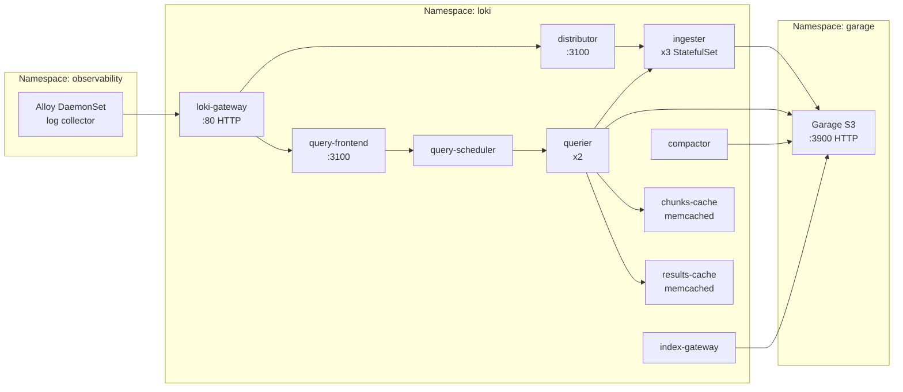

# Introduction

Loki is the **distributed log aggregation backend** for the observability stack, providing multi-tenant log storage, indexing, and query capabilities. It runs in the `loki` namespace in Distributed mode with separate components for ingestion, querying, and compaction.

**Key capabilities**:
- **Multi-tenancy**: `X-Scope-OrgID` header-based tenant isolation
- **S3 storage**: Chunks and indexes stored in Garage S3
- **Distributed mode**: Separate ingester, querier, distributor, compactor, gateway
- **Memcached caching**: Chunks and results caching for query performance

Design docs:
- [observability-lgtm-design.md](../../../../../../docs/design/observability-lgtm-design.md)
- [observability-lgtm-log-ingestion.md](../../../../../../docs/design/observability-lgtm-log-ingestion.md)

For open/resolved issues, see the parent [docs/component-issues/observability.md](../../../../../../docs/component-issues/observability.md).

---

## Architecture



**Flow**:
1. Alloy pushes logs to `loki-gateway` with `X-Scope-OrgID` header
2. Gateway routes to distributor for writes, query-frontend for reads
3. Distributor shards logs to ingesters (ring-based)
4. Ingesters write chunks to Garage S3
5. Queries go through query-frontend → query-scheduler → querier → ingesters/S3
6. Compactor runs index compaction against S3

---

## Subfolders

| Path | Purpose |
|------|---------|
| `base/` | Shared resources (Istio policy) |
| `charts/` | Vendored Loki chart (avoid outbound egress) |
| `overlays/<deploymentId>/` | Deployment-specific values / sizing |

| File | Purpose |
|------|---------|
| `kustomization.yaml` | Helm chart reference (loki 6.46.0) with sync wave 2, memcached patches |
| `values.yaml` | Distributed mode config, S3 storage, replicas, limits |

Notes:
- Argo CD runs Kustomize with load restrictions, so `patches[].path` files must live in (or under) the overlay directory; the memcached patches are inlined in each overlay `kustomization.yaml` for Argo compatibility.

---

## Container Images / Artefacts

| Artefact | Version | Registry / Location |
|----------|---------|---------------------|
| Loki Helm chart | `6.46.0` | `https://grafana.github.io/helm-charts` |
| Loki container | (chart default, ~3.5.x) | `docker.io/grafana/loki` |
| Memcached | (chart default) | `docker.io/memcached` |

---

## Dependencies

| Dependency | Purpose |
|------------|---------|
| Garage (S3) | Object storage for chunks and indexes (`garage.garage.svc:3900`) |
| Vault + ESO | S3 credentials via ExternalSecret (`loki-s3` secret) |
| Loki namespace | Must exist with `istio-injection: enabled` |
| NetworkPolicies | Must allow egress to Garage; ingress from Alloy and Grafana |

---

## Communications With Other Services

### Kubernetes Service → Service Calls

| Caller | Target | Port | Protocol | Purpose |
|--------|--------|------|----------|---------|
| Alloy | `loki-gateway.loki.svc` | 80/8080 | HTTP | Log push (`/loki/api/v1/push`) |
| Grafana | `loki-gateway.loki.svc` | 80 | HTTP | Log queries |
| Loki components | `garage.garage.svc` | 3900 | HTTP | S3 storage |
| Loki components | Internal ring (gRPC) | 9095 | gRPC | Ingester ring communication |

### External Dependencies (Vault, Keycloak, PowerDNS)

- **Vault**: Stores S3 credentials at `secret/garage/s3` (projected as `loki-s3` secret)
- **Keycloak**: Not directly used; authentication is header-based (`X-Scope-OrgID`)
- **PowerDNS**: Not directly used

### Mesh-level Concerns (DestinationRules, mTLS Exceptions)

- **Istio sidecar injected**: All Loki pods run with mesh
- **NetworkPolicies**: Default-deny with explicit allows for Alloy, Grafana, intra-namespace, Garage
- **No external ingress**: Gateway/HTTPRoute not yet configured (internal mesh only)

---

## Initialization / Hydration

1. **Loki namespace** created (wave 0.5) with `istio-injection: enabled` and NetworkPolicies
2. **ExternalSecrets** sync (wave 1): `loki-s3` secret from Vault `secret/garage/s3`
3. **Loki Helm release** deploys (wave 2):
   - Gateway, distributor, query-frontend, query-scheduler deploy as Deployments
   - Ingesters deploy as StatefulSets (ring-based)
   - Memcached caches deploy as StatefulSets
   - Compactor and index-gateway deploy
4. **Ring stabilization**: Ingesters join ring, become ready for writes
5. **S3 connection**: Components verify connectivity to Garage

Secrets to pre-populate in Vault:

| Vault Path | Keys |
|------------|------|
| `secret/garage/s3` | `AWS_ACCESS_KEY_ID`, `AWS_SECRET_ACCESS_KEY`, `S3_REGION`, `S3_ENDPOINT` |

---

## Argo CD / Sync Order

| Property | Value |
|----------|-------|
| Sync wave | `2` |
| Pre/PostSync hooks | None |
| Sync dependencies | Loki namespace + NetworkPolicies (wave 0.5); ExternalSecrets (wave 1); Garage (wave 1.0/1.5) |

---

## Operations (Toils, Runbooks)

### Check Loki Health

```bash
kubectl -n loki get pods
kubectl -n loki logs deploy/loki-gateway --tail=100
```

### Ingester Pending Issues

If `loki-ingester-*` pods are `Pending` with `didn't match pod anti-affinity rules`:
- **Dev**: Use `dev` overlay with `ingester.replicas=1`
- **Prod**: Ensure at least 3 schedulable nodes for Loki (not tainted `NoSchedule`)

### Ring Status

```bash
kubectl -n loki exec -it loki-ingester-0 -- wget -qO- http://localhost:3100/ring
```

### Query Test

```bash
kubectl -n loki run curl-debug --rm -it --image=curlimages/curl:8.6.0 --restart=Never -- \
  curl -s "http://loki-gateway.loki.svc.cluster.local/loki/api/v1/labels" \
    -H "X-Scope-OrgID: platform"
```

### Related Guides

- [observability-lgtm-log-ingestion.md](../../../../../../docs/design/observability-lgtm-log-ingestion.md)

---

## Customisation Knobs

| Knob | Location | Default (base) | Default (lowmem) |
|------|----------|----------------|------------------|
| Ingester replicas | `values.yaml` `ingester.replicas` | `3` | `1` |
| Querier replicas | `values.yaml` `querier.replicas` | `2` | `1` |
| Gateway replicas | `values.yaml` `gateway.replicas` | `1` | `1` |
| Retention period | `DeploymentConfig.spec.observability.loki.limits.retentionPeriod` (rendered into `values.yaml` `loki.limits_config.retention_period`) | `168h` (7d) | `24h` (1d) |
| Ingestion rate | `values.yaml` `loki.limits_config.ingestion_rate_mb` | `10` | `10` |
| S3 endpoint | `values.yaml` `loki.storage.s3.endpoint` (and `loki.storage_config.aws.endpoint`) | `garage.garage.svc:3900` | same |
| Chunks cache memory | `kustomization.yaml` patch | `256Mi` | N/A |
| Results cache memory | `kustomization.yaml` patch | `256Mi` | N/A |

---

## Oddities / Quirks

1. **Required pod anti-affinity**: Chart enforces required `podAntiAffinity` for ingesters across `kubernetes.io/hostname`; on small clusters (< 3 schedulable nodes), ingesters stay `Pending`.
2. **Memcached patches**: Base kustomization patches memcached to 256Mi (reduced from chart default) to fit dev clusters.
3. **Replication factor 1**: Set for dev simplicity; production should increase for durability.
4. **Zone-aware replication disabled**: `zoneAwareReplication.enabled: false` for simplicity.
5. **No external ingress**: Gateway/HTTPRoute not configured; access is mesh-internal only.
6. **Structured metadata disabled**: `allow_structured_metadata: false` to avoid index bloat.

---

## TLS, Access & Credentials

| Concern | Details |
|---------|---------|
| Internal transport | HTTP within Istio mesh (mTLS) |
| S3 transport | HTTP to Garage (in-cluster, `insecure: true`) |
| Auth (API) | `X-Scope-OrgID` header for multi-tenancy |
| Credentials | S3 creds from Vault via ESO (`loki-s3` secret) |
| External access | Not configured (mesh-internal only) |

---

## Dev → Prod

| Aspect | Dev (mac overlays) | HA/Prod (proxmox-talos overlay) |
|--------|---------------------|--------------------------------|
| Ingester replicas | Reduced for dev | `3+` (match schedulable nodes) |
| Querier replicas | Reduced for dev | `2+` |
| Replication factor | `1` | `2+` (for durability) |
| Retention | 1 day | 7 days |
| Anti-affinity | Required | Required + topology spread |

**Promotion**:
1. Ensure at least 3 schedulable nodes for Loki
2. Switch Argo app source to `overlays/proxmox-talos`
3. Verify all ingesters `Running` and ring stable
4. Verify write/query paths via Grafana with tenant headers

---

## Smoke Jobs / Test Coverage

### Current Implementation ✅

Loki is covered by the parent observability smoke test:

| Job | Coverage |
|-----|----------|
| `observability-log-smoke` | Push log → query back → verify content → delete (best-effort) |

**Test details**:
- Pushes a log line with unique `runid` and ephemeral tenant (`smoke-<timestamp>`)
- Queries back via `/loki/api/v1/query_range` with tenant header
- Verifies log content matches
- Attempts deletion (best-effort, compactor retention may lag)
- Uses retry logic (20 attempts × 3s sleep)

### Test Coverage Summary

| Test | Type | Status |
|------|------|--------|
| Log push/query round-trip | Functional | ✅ Implemented |
| Multi-tenant isolation | Functional | ✅ Covered (ephemeral tenant) |
| Log deletion | Functional | ⚠️ Best-effort (no hard verification) |
| Ring health check | Health | ❌ Not automated |
| Ingester failover | HA | ❌ Not automated |
| S3 connectivity | Dependency | ❌ Not explicit (covered indirectly) |

### Proposed Additions

1. **Ring health check**: Verify all ingesters are in ring and ACTIVE
2. **Gateway readiness**: Check `/ready` endpoint returns 200
3. **Labels API**: Verify `/loki/api/v1/labels` returns without error

---

## HA Posture

### Current Implementation

| Component | Replicas | HA Status | Details |
|-----------|----------|-----------|---------|
| **Ingester** | 3 (base), 1 (lowmem) | ✅ HA (base) | Required pod anti-affinity across hostname |
| **Querier** | 2 (base), 1 (lowmem) | ✅ HA (base) | `maxUnavailable: 1` |
| **Distributor** | 1 | ⚠️ SPOF | Stateless but single replica |
| **Gateway** | 1 | ⚠️ SPOF | Nginx-based, single replica |
| **Query-frontend** | 1 | ⚠️ SPOF | Stateless |
| **Query-scheduler** | 1 | ⚠️ SPOF | Stateless |
| **Compactor** | 1 | ⚠️ SPOF | Singleton by design |
| **Index-gateway** | 1 | ⚠️ SPOF | Stateless |
| **Chunks-cache** | 1 | ⚠️ SPOF | Memcached StatefulSet |
| **Results-cache** | 1 | ⚠️ SPOF | Memcached StatefulSet |

### PodDisruptionBudgets

| Component | PDB | Status |
|-----------|-----|--------|
| Ingester | Not configured | ❌ Gap |
| Querier | Not configured | ❌ Gap |
| Others | Not configured | ❌ Gap |

### Analysis

**Strengths**:
- Ingesters use required pod anti-affinity for node spread
- Ring-based replication provides write path resilience (when `replication_factor > 1`)
- Queriers can be scaled horizontally

**Weaknesses**:
- Gateway is single point of failure for all traffic
- `replication_factor: 1` means no redundancy in ingested chunks
- No PDBs configured for any component

### Gaps

1. **Gateway SPOF**: Scale gateway to 2+ replicas for production
2. **Replication factor 1**: Increase to 2+ for production durability
3. **No PDBs**: Add for ingester, querier, gateway

---

## Security

### Current Controls ✅

| Layer | Control | Status |
|-------|---------|--------|
| **Internal transport** | Istio mTLS mesh | ✅ Implemented |
| **S3 transport** | HTTP to Garage (in-cluster) | ⚠️ Insecure (acceptable in-cluster) |
| **Multi-tenancy** | `X-Scope-OrgID` header | ✅ Implemented (`auth_enabled: true`) |
| **NetworkPolicies** | Default-deny + explicit allows | ✅ Comprehensive |
| **Secrets** | Vault + ESO (no plaintext) | ✅ Implemented |
| **External access** | Not configured | ✅ N/A (mesh-internal) |

### NetworkPolicy Coverage (loki namespace)

| Policy | Purpose |
|--------|---------|
| `default-deny-ingress` | Block all ingress by default |
| `default-egress-baseline` | Allow DNS, Garage S3, Istio control plane |
| `loki-allow-self` | Allow intra-namespace communication (ring/gRPC) |
| `loki-allow-self-egress` | Allow egress within namespace |
| `loki-allow-gateway-from-observability-and-grafana` | Allow gateway ingress from Alloy/Grafana |

### Gaps

1. **Tenant header not verified**: Any pod in allowed namespaces can push to any tenant by setting `X-Scope-OrgID`
2. **No rate limiting per tenant**: Misbehaving clients could overwhelm ingestion

### Recommendations

1. Document tenant isolation model as NetworkPolicy-based
2. Consider Loki gateway authentication plugin for external exposure

---

## Backup and Restore

### Current State

| Aspect | Status |
|--------|--------|
| Log data | Stored in Garage S3 (`loki` bucket) |
| Index data | Stored in Garage S3 (boltdb-shipper) |
| Configuration | GitOps-managed (Helm values) |
| Retention | DeploymentConfig-driven (`spec.observability.loki.limits.retentionPeriod`) |

### Analysis

Loki is **stateless except for S3 storage**:
- All log chunks and indexes are in Garage S3
- Ingesters hold recent data in memory but flush to S3
- Configuration is fully GitOps-managed and reconstructible

### Disaster Recovery

| Scenario | Impact | Recovery |
|----------|--------|----------|
| Pod lost | None | Ring rebalances; queries continue |
| Ingester lost with unflushed data | Brief log loss (~minutes) | New ingester joins ring |
| S3 data lost | **All logs lost** | No recovery without Garage backup |
| Cluster rebuild | None if S3 intact | GitOps redeploy; connects to existing S3 data |

### Backup Strategy

Loki backup depends on **Garage S3 backup**:
- Garage uses ZFS snapshots on Proxmox (host-level)
- No independent Loki backup mechanism needed

### Restore Plan

1. **From Garage backup**: Restore `loki` bucket in Garage
2. **Redeploy Loki**: Argo sync recreates all components
3. **Ring stabilizes**: Ingesters discover existing data in S3
4. **Verify**: Query historical logs via Grafana

> [!NOTE]
> Loki log retention is controlled by `limits_config.retention_period` and is sourced from `DeploymentConfig.spec.observability.loki.limits.retentionPeriod` (rendered into the per-deployment overlay values). Data beyond retention is automatically compacted and deleted.
