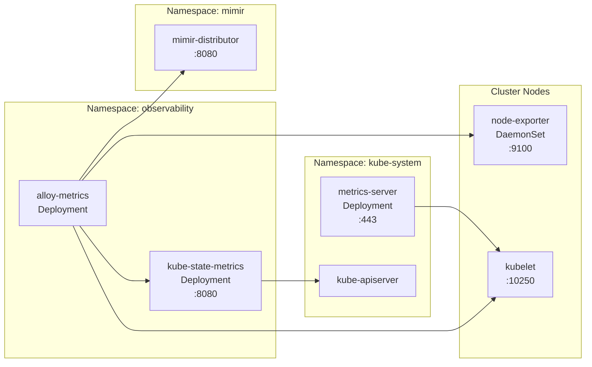

# Introduction

The **metrics** component installs three standard Kubernetes metrics exporters:
- **kube-state-metrics**: Exposes Kubernetes object state (pods, deployments, nodes, etc.)
- **prometheus-node-exporter**: Exposes node-level CPU/memory/disk/network metrics (DaemonSet)
- **metrics-server**: Provides resource metrics API for `kubectl top` and HPA/VPA

These exporters are scraped by the platform `alloy-metrics` Deployment and remote-written into `Mimir` for tenant `platform`. The metrics power the **Cluster Overview** Grafana dashboard.

For open/resolved issues, see the parent [docs/component-issues/observability.md](../../../../../../docs/component-issues/observability.md).

---

## Architecture



**Flow**:
1. node-exporter runs on each node, exposing host metrics on `:9100`
2. kube-state-metrics queries Kubernetes API for object state, exposes on `:8080`
3. metrics-server queries kubelets for resource metrics, powers `kubectl top`
4. alloy-metrics scrapes all exporters + kubelets and remote-writes to Mimir

---

## Subfolders

No subfolders. All configuration is in the component root.

| File | Purpose |
|------|---------|
| `kustomization.yaml` | Three Helm chart references with sync wave 1.4 |
| `values-kube-state-metrics.yaml` | kube-state-metrics config with Istio port exclusion |
| `values-node-exporter.yaml` | node-exporter config with service port 9100 |
| `values-metrics-server.yaml` | metrics-server config for Talos (kubelet-insecure-tls) |

---

## Container Images / Artefacts

| Artefact | Version | Registry / Location |
|----------|---------|---------------------|
| kube-state-metrics Helm chart | `7.0.0` | `https://prometheus-community.github.io/helm-charts` |
| prometheus-node-exporter Helm chart | `4.49.2` | `https://prometheus-community.github.io/helm-charts` |
| metrics-server Helm chart | `3.12.2` | `https://kubernetes-sigs.github.io/metrics-server` |

---

## Dependencies

| Dependency | Purpose |
|------------|---------|
| Kubernetes API | Required by kube-state-metrics for object queries |
| Kubelets | Required by metrics-server for resource metrics |
| Observability namespace | kube-state-metrics + node-exporter deploy here |
| CiliumNetworkPolicy | Egress to kube-apiserver (ports 443/6443) |
| Alloy-metrics | Scrapes all exporters |

---

## Communications With Other Services

### Kubernetes Service → Service Calls

| Caller | Target | Port | Protocol | Purpose |
|--------|--------|------|----------|---------|
| kube-state-metrics | kube-apiserver | 443/6443 | HTTPS | Query Kubernetes objects |
| metrics-server | kubelets | 10250 | HTTPS | Query resource metrics |
| alloy-metrics | kube-state-metrics | 8080 | HTTP | Scrape Kubernetes object metrics |
| alloy-metrics | node-exporter | 9100 | HTTP | Scrape node metrics |
| kubectl/HPA/VPA | metrics-server | 443 | HTTPS | Resource queries via metrics API |

### External Dependencies (Vault, Keycloak, PowerDNS)

None required. All exporters are stateless and don't need secrets.

### Mesh-level Concerns (DestinationRules, mTLS Exceptions)

- **kube-state-metrics**: Istio port exclusion `443,6443` for kube-apiserver access
- **metrics-server**: Istio sidecar disabled (`sidecar.istio.io/inject: "false"`) for direct kubelet access
- **node-exporter**: Standard mesh (HTTP scrapes via alloy-metrics)

---

## Initialization / Hydration

1. **Observability namespace** exists (wave 0.5) with `istio-injection: enabled`
2. **NetworkPolicies** applied (wave 0.75) including CiliumNetworkPolicy for kube-apiserver
3. **Metrics exporters** deploy (wave 1.4):
   - kube-state-metrics as Deployment in `observability`
   - node-exporter as DaemonSet in `observability`
   - metrics-server as Deployment in `kube-system`
4. **Exporters become ready**: kube-state-metrics may take 60s+ on constrained clusters

No secrets required. RBAC is chart-managed.

---

## Argo CD / Sync Order

| Property | Value |
|----------|-------|
| Sync wave | `1.4` |
| Pre/PostSync hooks | None |
| Sync dependencies | Observability namespace + NetworkPolicies (wave 0.5/0.75) |

---

## Operations (Toils, Runbooks)

### Verify Exporters Running

```bash
kubectl -n observability get pods -l app.kubernetes.io/name=kube-state-metrics
kubectl -n observability get pods -l app.kubernetes.io/name=prometheus-node-exporter
kubectl -n kube-system get pods -l app.kubernetes.io/name=metrics-server
```

### Verify NetworkPolicy for kube-apiserver

```bash
kubectl -n observability get ciliumnetworkpolicy observability-allow-kube-apiserver
```

### Verify Metrics in Mimir

```bash
kubectl -n grafana exec deploy/grafana -c grafana -- sh -lc \
  'curl -sS -H "X-Scope-OrgID: platform" \
  "http://mimir-querier.mimir.svc.cluster.local:8080/prometheus/api/v1/query?query=up"'
```

### Test kubectl top (metrics-server)

```bash
kubectl top nodes
kubectl top pods -A
```

---

## Customisation Knobs

| Knob | Location | Default |
|------|----------|---------|
| kube-state-metrics resources | `values-kube-state-metrics.yaml` | 50m/128Mi req, 200m/256Mi limit |
| node-exporter resources | `values-node-exporter.yaml` | 30m/64Mi req, 200m/128Mi limit |
| metrics-server resources | `values-metrics-server.yaml` | 50m/64Mi req, 200m/128Mi limit |
| kube-state-metrics startup probe | `values-kube-state-metrics.yaml` | 60 failures × 5s period |
| node-exporter service port | `values-node-exporter.yaml` | `9100` |
| metrics-server kubelet args | `values-metrics-server.yaml` | `--kubelet-insecure-tls` |

---

## Oddities / Quirks

1. **Istio port exclusion for kube-state-metrics**: Added `traffic.sidecar.istio.io/excludeOutboundPorts: "443,6443"` because Envoy can interfere with in-cluster TLS to kube-apiserver.
2. **Istio sidecar disabled for metrics-server**: metrics-server must talk directly to kubelets; sidecar would break kubelet mTLS.
3. **Talos kubelet-insecure-tls**: Talos kubelets use self-signed certs; metrics-server needs `--kubelet-insecure-tls` flag.
4. **Long startup probe for kube-state-metrics**: On constrained dev clusters, kube-state-metrics can take 60s+ to initialize collectors.
5. **ServiceMonitors disabled**: Prometheus operator CRDs not required; alloy-metrics uses native Kubernetes discovery.
6. **node-exporter hostNetwork/hostPID disabled**: More secure default; sufficient for most metrics.

---

## TLS, Access & Credentials

| Concern | Details |
|---------|---------|
| Internal transport | HTTP within Istio mesh (mTLS for most, port exclusions documented) |
| kube-apiserver access | HTTPS with ServiceAccount token (kube-state-metrics) |
| kubelet access | HTTPS with insecure-tls flag (metrics-server) |
| Credentials | None required; RBAC via chart-managed ServiceAccounts |
| External access | None (mesh-internal only) |

---

## Dev → Prod

| Aspect | Dev | Prod |
|--------|-----|------|
| kube-state-metrics replicas | 1 | Consider 2 for HA |
| node-exporter | DaemonSet (all nodes) | DaemonSet (all nodes) |
| metrics-server replicas | 1 | Consider 2 for HA |
| Resource limits | Minimal | Increase based on cluster size |
| Scrape filtering | None | Add relabelling in Alloy for cardinality control |

---

## Smoke Jobs / Test Coverage

### Current State

The metrics exporters are **indirectly covered** by the `observability-metric-smoke` job:
- alloy-metrics scrapes these exporters
- `observability-metric-smoke` verifies Mimir ingestion works
- If exporters are down, alloy-metrics would fail to scrape → no metrics in Mimir

### Test Coverage Summary

| Exporter | Test | Status |
|----------|------|--------|
| kube-state-metrics | `up{job="kube-state-metrics"}` in Mimir | ⚠️ Indirect (via alloy-metrics) |
| node-exporter | `up{job="node-exporter"}` in Mimir | ⚠️ Indirect (via alloy-metrics) |
| metrics-server | `kubectl top nodes` works | ❌ Not automated |

### Proposed Additions

1. **Exporter health check**: Query Mimir for `up{job="kube-state-metrics"}` and `up{job="node-exporter"}` > 0
2. **metrics-server readiness**: Automated `kubectl top nodes` verification
3. **Cardinality check**: Verify metric count is within expected bounds

> [!NOTE]
> The alloy-metrics smoke job tracks testing for scraped metrics. See [alloy-metrics/README.md](../alloy-metrics/README.md) for proposed smoke job covering exporter targets.

---

## HA Posture

### Current Implementation

| Component | Type | Replicas | HA Status |
|-----------|------|----------|-----------|
| **node-exporter** | DaemonSet | 1 per node | ✅ Inherent HA |
| **kube-state-metrics** | Deployment | 1 | ⚠️ SPOF |
| **metrics-server** | Deployment | 1 | ⚠️ SPOF |

### Analysis

**node-exporter**: Inherently HA as a DaemonSet—runs on every node, node loss doesn't affect other nodes.

**kube-state-metrics**: Single Deployment replica. If it fails:
- Historical metrics preserved in Mimir
- Brief gap in Kubernetes object metrics (~pod restart time)
- No critical system dependency (Grafana dashboards degrade gracefully)

**metrics-server**: Single replica. If it fails:
- `kubectl top` commands fail
- HPA/VPA cannot make scaling decisions
- More critical SPOF if autoscaling is relied upon

### Gaps

1. **kube-state-metrics SPOF**: Minor impact (dashboards only)
2. **metrics-server SPOF**: Moderate impact if HPA/VPA used
3. **No PDBs**: Not critical for single-replica stateless exporters

---

## Security

### Current Controls ✅

| Layer | Control | Status |
|-------|---------|--------|
| **Internal transport** | Istio mTLS mesh | ✅ (kube-state-metrics, node-exporter) |
| **Istio exceptions** | Port exclusion for kube-apiserver | ✅ kube-state-metrics |
| **Istio exceptions** | Sidecar disabled | ✅ metrics-server |
| **Secrets** | None required | ✅ N/A |
| **RBAC** | Chart-managed ServiceAccounts | ✅ kube-state-metrics, metrics-server |
| **NetworkPolicies** | Observability baseline | ⚠️ No exporter-specific policies |
| **External access** | None | ✅ Mesh-internal only |

### Analysis

All exporters are **read-only collectors**:
- No sensitive data stored
- No authentication/secrets required
- Standard Kubernetes RBAC for API access

**metrics-server** runs in `kube-system` without Istio sidecar:
- Direct kubelet access required
- Uses ServiceAccount token for kubelet auth
- `--kubelet-insecure-tls` for Talos (self-signed kubelet certs)

### Gaps

1. **No exporter-specific NetworkPolicies**: Rely on observability namespace baseline
2. **kubelet-insecure-tls**: Acceptable for Talos but worth documenting

---

## Backup and Restore

### Current State

| Aspect | Status |
|--------|--------|
| Configuration | GitOps-managed (Helm values) |
| Persistent data | **None** |
| Scraped metrics | Stored in Mimir (not here) |

### Analysis

All exporters are **fully stateless**:
- No PVCs or local storage
- Configuration is GitOps-managed
- Scraped metrics are stored in Mimir

### Disaster Recovery

| Scenario | Impact | Recovery |
|----------|--------|----------|
| Pod lost | Brief metric gap | Deployment/DaemonSet recreates |
| Cluster rebuild | None | GitOps redeploy |

**No backup mechanism needed.**

