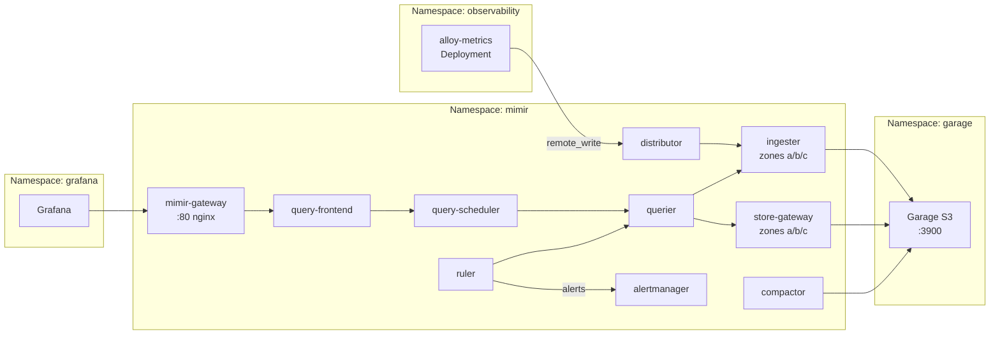

# Introduction

Mimir is the **distributed metrics storage and alerting backend** for the observability stack, providing scalable long-term metric storage, multi-tenancy, and Prometheus-compatible query/write APIs. It runs in the `mimir` namespace with full alerting capabilities (Ruler + Alertmanager).

**Key capabilities**:
- **Multi-tenancy**: `X-Scope-OrgID` header-based tenant isolation
- **S3 storage**: Blocks and indexes stored in Garage S3 (`garage-metrics` bucket)
- **Distributed mode**: Separate ingester, querier, distributor, compactor, store-gateway, query-frontend
- **Alerting**: Ruler evaluates PromQL rules, Alertmanager handles routing/notifications
- **Zone-aware replication**: Ingesters and store-gateways spread across zones

Design docs:
- [observability-lgtm-design.md](../../../../../../docs/design/observability-lgtm-design.md)
- [observability-lgtm-troubleshooting-alerting.md](../../../../../../docs/design/observability-lgtm-troubleshooting-alerting.md)

For open/resolved issues, see the parent [docs/component-issues/observability.md](../../../../../../docs/component-issues/observability.md).

---

## Architecture



**Flow**:
1. alloy-metrics pushes metrics to distributor via remote_write
2. Distributor shards metrics to ingesters (zone-aware ring)
3. Ingesters write blocks to Garage S3
4. Grafana queries via gateway → query-frontend → querier → ingesters/store-gateways
5. Ruler evaluates PromQL alert rules at 1m intervals
6. Alertmanager receives fired alerts and routes to receivers

---

## Subfolders

| Path | Purpose |
|------|---------|
| `base/` | Shared resources (Istio policy, rules, VPA, patch files) |
| `charts/` | Vendored `mimir-distributed` chart (avoid outbound egress) |
| `overlays/<deploymentId>/` | Deployment-specific deltas (`mac-orbstack`, `mac-orbstack-single`, `proxmox-talos`) |

| File | Purpose |
|------|---------|
| `kustomization.yaml` | Convenience wrapper for local renders (Argo should use `overlays/<deploymentId>`) |

**Explicit exception (kustomize-helm security):** `helmCharts.valuesFile` and `patchesStrategicMerge` are restricted by Argo CD/kustomize security to files within the overlay directory. As a result, each `overlays/<deploymentId>` is intentionally self-contained for Helm values and resource patches (some duplication is expected).

---

## Container Images / Artefacts

| Artefact | Version | Registry / Location |
|----------|---------|---------------------|
| mimir-distributed Helm chart | `6.0.5` | `https://grafana.github.io/helm-charts` |
| Mimir container | (chart default, ~3.0.1) | `docker.io/grafana/mimir` |

---

## Dependencies

| Dependency | Purpose |
|------------|---------|
| Garage (S3) | Object storage for blocks and indexes (`garage.garage.svc:3900`) |
| Vault + ESO | S3 credentials via ExternalSecret (`mimir-s3` secret) |
| Mimir namespace | Must exist with `istio-injection: enabled` |
| NetworkPolicies | Ingress from observability (alloy-metrics), grafana; egress to Garage |
| alloy-metrics | Metrics writer (remote_write) |

---

## Communications With Other Services

### Kubernetes Service → Service Calls

| Caller | Target | Port | Protocol | Purpose |
|--------|--------|------|----------|---------|
| alloy-metrics | `mimir-distributor.mimir.svc` | 8080 | HTTP | remote_write metrics |
| Grafana | `mimir-gateway.mimir.svc` | 80 | HTTP | PromQL queries |
| Grafana | `mimir-querier.mimir.svc` | 8080 | HTTP | Direct querier (bypass gateway) |
| Mimir components | `garage.garage.svc` | 3900 | HTTP | S3 storage |
| Ruler | `mimir-alertmanager.mimir.svc` | 8080 | HTTP | Alert routing (`/alertmanager`) |
| Components | `mimir-gossip-ring.mimir.svc` | 7946 | TCP | Memberlist gossip |

### External Dependencies (Vault, Keycloak, PowerDNS)

- **Vault**: Stores S3 credentials at `secret/garage/s3` (projected as `mimir-s3` secret)
- **Keycloak**: Not directly used; authentication is header-based (`X-Scope-OrgID`)
- **PowerDNS**: Not directly used

### Mesh-level Concerns (DestinationRules, mTLS Exceptions)

- **Istio sidecar injected**: All Mimir pods run with mesh
- **NetworkPolicies**: Default-deny with explicit allows for observability, grafana, intra-namespace, Garage
- **Gateway nginx + STRICT mTLS**: The Mimir gateway uses runtime DNS resolution (`proxy_pass http://$upstream`) and must remain compatible with Envoy outbound cluster matching:
  - `gateway.nginx.config.resolver: 10.96.0.10` (NGINX resolver requires DNS server IPs, not a hostname).
  - `gateway.nginx.config.httpSnippet/serverSnippet` normalizes upstream `Host` (avoid trailing-dot `*.cluster.local.:8080` which makes Envoy fall back to `PassthroughCluster` and triggers STRICT mTLS resets).
  - `DestinationRule` `ISTIO_MUTUAL` for core Mimir Services to force in-mesh mTLS origination.
- **No external ingress**: Gateway/HTTPRoute not yet configured (internal mesh only)

---

## Initialization / Hydration

1. **Mimir namespace** created (wave 0.5) with `istio-injection: enabled` and NetworkPolicies
2. **ExternalSecrets** sync (wave 1): `mimir-s3` secret from Vault `secret/garage/s3`
3. **Mimir Helm release** deploys (wave 2.5):
   - Ingesters deploy as StatefulSets (zone-aware, 3 zones)
   - Store-gateways deploy as StatefulSets (zone-aware)
   - Distributor, querier, query-frontend, query-scheduler as Deployments
   - Alertmanager, Ruler as Deployments
   - Gateway (nginx) as Deployment
4. **Ring stabilization**: Components join memberlist gossip ring
5. **Alerting rules**: `Job/mimir-rules-sync` runs as an Argo PostSync hook and uploads rule groups from mounted `mimir-rules-*` ConfigMaps to the Ruler config API (`/prometheus/config/v1/rules/*`) for tenant `platform`.
6. **Alertmanager storage**: Alertmanager uses filesystem storage; `alertmanager.data_dir` must not overlap the `alertmanager_storage.filesystem.dir` (otherwise it can fail to initialize).
7. **Workload sizing**: VPA (Vertical Pod Autoscaler) adjusts CPU/memory *requests* over time based on observed usage (see `components/platform/ops/vertical-pod-autoscaler`).

Secrets to pre-populate in Vault:

| Vault Path | Keys |
|------------|------|
| `secret/garage/s3` | `AWS_ACCESS_KEY_ID`, `AWS_SECRET_ACCESS_KEY`, `S3_REGION`, `S3_ENDPOINT` |

---

## Argo CD / Sync Order

| Property | Value |
|----------|-------|
| Sync wave | `2.5` |
| Pre/PostSync hooks | `Job/mimir-rules-sync` (PostSync, wave `4`) uploads rule groups to the Ruler config API |
| Sync dependencies | Mimir namespace + NetworkPolicies (wave 0.5); ExternalSecrets (wave 1); Garage (wave 1.0/1.5) |

---

## Operations (Toils, Runbooks)

### Workload sizing (requests)

Mimir `Deployment`/`StatefulSet` manifests set a safe baseline, while VPA keeps requests converging toward real usage.

Quick checks:
```bash
kubectl -n mimir get vpa
kubectl -n mimir describe vpa mimir-ingester
```

### Pods CrashLoop with S3 Forbidden

Symptom: `mimir-{ingester,store-gateway,compactor,querier}` crash with `Forbidden: No such key`.

Fix:
```bash
# Re-sync Vault config and Garage
argocd app sync secrets-vault-config storage-garage platform-observability-mimir

# Restart Mimir pods to pick up refreshed secrets
kubectl -n mimir delete pod -l app.kubernetes.io/instance=mimir
```

### Ruler Not Evaluating Rules

```bash
# Check the last sync hook job (rules upload)
kubectl -n mimir get job -l deploykube.gitops/job=mimir-rules-sync
kubectl -n mimir logs job/mimir-rules-sync

# List loaded rules
kubectl -n mimir exec -it deploy/mimir-ruler -- \
  curl -s 'http://localhost:8080/prometheus/api/v1/rules' -H 'X-Scope-OrgID: platform'

# Check ruler logs
kubectl -n mimir logs deploy/mimir-ruler | grep -i rule
```

### Alertmanager Status / API

```bash
kubectl -n mimir port-forward svc/mimir-alertmanager 19093:8080
curl -sS -H 'X-Scope-OrgID: platform' http://127.0.0.1:19093/alertmanager/api/v2/status | jq.
curl -sS -H 'X-Scope-OrgID: platform' http://127.0.0.1:19093/alertmanager/api/v2/alerts | jq.
```

### Series Limit Exceeded

Symptom: Grafana empty, Alloy logs show `err-mimir-max-series-per-user`.

Fix: Raise `limits.max_global_series_per_user` in the selected overlay values (`overlays/<deploymentId>/values.yaml`) and restart ingesters.

### Related Guides

- [observability-lgtm-troubleshooting-alerting.md](../../../../../../docs/design/observability-lgtm-troubleshooting-alerting.md)

---

## Customisation Knobs

| Knob | Location | Default |
|------|----------|---------|
| Max series per user | `overlays/<deploymentId>/values.yaml` (`limits.max_global_series_per_user`) | `500000` |
| Ingestion rate | `overlays/<deploymentId>/values.yaml` (`limits.ingestion_rate`) | `250000` |
| Retention period | `overlays/<deploymentId>/values.yaml` (`limits.compactor_blocks_retention_period`) | `720h` (30d) |
| Ruler poll interval | `overlays/<deploymentId>/values.yaml` (`ruler.poll_interval`) | `30s` |
| Rule evaluation | `overlays/<deploymentId>/values.yaml` (`ruler.evaluation_interval`) | `1m` |
| S3 endpoint | `overlays/<deploymentId>/values.yaml` (`blocks_storage.s3.endpoint`) | `garage.garage.svc:3900` |
| Alertmanager replicas | `overlays/<deploymentId>/values.yaml` (`alertmanager.replicas`) | `1` |
| Ruler replicas | `overlays/<deploymentId>/values.yaml` (`ruler.replicas`) | `1` |

---

## Oddities / Quirks

1. **Config duplication**: `mimir.config` can appear duplicated in the rendered output; this is a quirk of the upstream chart templating.
2. **Env var expansion**: S3 credentials use `${AWS_ACCESS_KEY_ID}` env var expansion in config.
3. **Zone-aware replication**: HA/prod enables zone-aware ingesters and store-gateways; the dev profile disables zone awareness to reduce resource needs.
4. **OnDelete update strategy**: StatefulSets use `OnDelete`, requiring manual pod deletion for config changes.
5. **Watchdog suppression**: Alertmanager routes Watchdog alerts to `null` receiver (deadman noise suppression).
6. **Direct querier access**: Grafana uses `mimir-querier` directly (bypasses gateway) to avoid DNS timeout issues.

---

## TLS, Access & Credentials

| Concern | Details |
|---------|---------|
| Internal transport | HTTP within Istio mesh (mTLS) |
| S3 transport | HTTP to Garage (in-cluster, `insecure: true`) |
| Auth (API) | `X-Scope-OrgID` header for multi-tenancy |
| Credentials | S3 creds from Vault via ESO (`mimir-s3` secret) |
| Alert notifications | Webhook endpoints from Vault via ESO (`mimir-alertmanager-notifications` secret) |
| External access | Not configured (mesh-internal only) |

---

## Dev → Prod

| Aspect | Dev (mac overlays) | HA/Prod (proxmox-talos overlay) |
|--------|------------|----------------|
| Ingester zones | Disabled (single-zone) | 3 (scale replicas per zone) |
| Series limit | 500000 | Increase based on cardinality |
| Retention | 30 days | 90+ days |
| Alert thresholds | Dev-tuned | Review for prod workloads |
| Notification channels | Optional/local | Vault-backed webhook receivers (`platform-ops`, `backup-system-platform-ops`) |

**Promotion**:
1. Switch Argo app source to prod overlay
2. Provision alerting secrets in prod Vault
3. Verify `mimir-alertmanager-notifications` secret and Alertmanager routing contract
4. Verify `platform-observability-mimir` is `Synced/Healthy`
5. Run smoke jobs and record outputs

---

## Alert Rules (GitOps Workflow)

Alert rules are managed as ConfigMaps under `base/rules/`:

```
mimir/base/rules/
├── kustomization.yaml
├── configmap-kubernetes-pods.yaml    # Pod health alerts
└── configmap-lgtm-health.yaml        # LGTM stack self-monitoring
```

**Adding new rules**:
1. Create ConfigMap with `mimir.grafana.com/rules: "true"` label
2. Follow label conventions from `docs/design/observability-lgtm-troubleshooting-alerting.md`:
   - Required: `severity`, `team`, `environment`, `cluster`, `runbook_url`
3. Add to `base/rules/kustomization.yaml` and sync via Argo CD

---

## Alertmanager Configuration

Alertmanager uses a fallback config in the Mimir Helm values (`overlays/<deploymentId>/values.yaml`):
- **Default receiver**: `platform-ops` (webhook receiver URL from Vault/ESO)
- **Routing**: Groups by `[team, service, severity, cluster]`
- **Backup override**: `service=backup-system` routes to `backup-system-platform-ops` with 15m repeat interval
- **Inhibition**: Critical alerts suppress matching warnings
- **Watchdog**: Always-firing alert routed to `null` to verify pipeline health

---

## Smoke Jobs / Test Coverage

### Current Implementation ✅

Mimir is covered by the parent observability smoke test:

| Job | Coverage |
|-----|----------|
| `observability-metric-smoke` | Push metric via Prom agent → query back via querier → delete tenant |

**Test details**:
- Spins up ephemeral Prometheus agent with unique `runid`
- Pushes `prometheus_build_info` metric to `mimir-distributor` with ephemeral tenant
- Queries back via `mimir-querier` with tenant header
- Retries up to 12 × 10s for data to appear
- Cleans up via `/compactor/delete_tenant` API

### Test Coverage Summary

| Test | Type | Status |
|------|------|--------|
| Metric push round-trip | Functional | ✅ Implemented |
| Multi-tenant isolation | Functional | ✅ Covered (ephemeral tenant) |
| Tenant deletion | Functional | ✅ Covered |
| Ring health check | Health | ❌ Not automated |
| Alertmanager firing | Functional | ❌ Not automated |
| Ruler rule evaluation | Functional | ❌ Not automated |
| S3 connectivity | Dependency | ⚠️ Indirect (fails if S3 down) |

### Proposed Additions

1. **Ring health check**: Query `/memberlist` or `/ring` endpoints for healthy members
2. **Alertmanager smoke**: Verify Watchdog alert is firing
3. **Ruler smoke**: Verify rules are loaded via `/prometheus/api/v1/rules`

---

## HA Posture

### Current Implementation

| Component | Replicas | HA Status | Details |
|-----------|----------|-----------|---------|
| **Ingester zone-a** | 1 | ⚠️ SPOF per zone | Zone-aware replication |
| **Ingester zone-b** | 1 | ⚠️ SPOF per zone | Zone-aware replication |
| **Ingester zone-c** | 1 | ⚠️ SPOF per zone | Zone-aware replication |
| **Store-gateway zone-a/b/c** | 1 each | ⚠️ SPOF per zone | Zone-aware |
| **Distributor** | 1 | ⚠️ SPOF | Stateless |
| **Querier** | 1 | ⚠️ SPOF | Stateless |
| **Query-frontend** | 1 | ⚠️ SPOF | Stateless |
| **Query-scheduler** | 1 | ⚠️ SPOF | Stateless |
| **Compactor** | 1 | ⚠️ SPOF | Singleton by design |
| **Gateway** | 1 | ⚠️ SPOF | nginx |
| **Alertmanager** | 1 | ⚠️ SPOF | Alert routing |
| **Ruler** | 1 | ⚠️ SPOF | Rule evaluation |

### Zone-Aware Replication

Mimir is configured for zone-aware replication:
- Ingesters spread across zones a/b/c
- Store-gateways spread across zones a/b/c
- However, with 1 replica per zone, each zone is a SPOF

### PodDisruptionBudgets

| Component | PDB | Status |
|-----------|-----|--------|
| All components | Not configured | ❌ Gap |

### Analysis

**Strengths**:
- Zone-aware architecture ready for scaling
- Memberlist gossip for automatic ring management
- Stateless components can be scaled horizontally

**Weaknesses**:
- Single replica per zone = no redundancy within zones
- No PDBs = voluntary disruptions can cause outages
- Critical path components (distributor, querier) are SPOFs

### Gaps

1. **Scale ingesters per zone**: Increase to 2+ per zone for production
2. **Scale stateless components**: Distributor, querier, query-frontend to 2+
3. **Add PDBs**: For ingester, store-gateway, distributor, querier
4. **Alertmanager HA**: Scale to 3 replicas with gossip for production alerts

---

## Security

### Current Controls ✅

| Layer | Control | Status |
|-------|---------|--------|
| **Internal transport** | Istio mTLS mesh | ✅ Implemented |
| **S3 transport** | HTTP to Garage (in-cluster) | ⚠️ Insecure (acceptable) |
| **Multi-tenancy** | `X-Scope-OrgID` header | ✅ Implemented |
| **NetworkPolicies** | Default-deny + explicit allows | ✅ Comprehensive |
| **Secrets** | Vault + ESO (no plaintext) | ✅ Implemented |
| **RBAC** | Chart-managed ServiceAccounts | ✅ Implemented |
| **External access** | Not configured | ✅ N/A (mesh-internal) |
| **Alertmanager API** | Internal only | ✅ No external access |

### NetworkPolicy Coverage (mimir namespace)

| Policy | Purpose |
|--------|---------|
| `default-deny-ingress` | Block all ingress by default |
| `default-egress-baseline` | Allow DNS, Garage S3, Istio control plane |
| `mimir-allow-self` | Allow intra-namespace (ring gossip, gRPC) |
| `mimir-allow-distributor-from-observability` | Allow remote_write from alloy-metrics |
| `mimir-allow-querier-from-grafana-and-observability` | Allow query access |

### Gaps

1. **Tenant header not verified**: Any pod in allowed namespaces can push to any tenant
2. **No rate limiting per tenant**: Cardinality bombs could exhaust series limits

### Recommendations

1. Document tenant isolation as NetworkPolicy-based
2. Monitor `max_global_series_per_user` per tenant

---

## Backup and Restore

### Current State

| Aspect | Status |
|--------|--------|
| Metric blocks | Stored in Garage S3 (`garage-metrics` bucket) |
| Alert rules | GitOps-managed (ConfigMaps under `rules/`) |
| Alertmanager state | ⚠️ In-memory + S3 (no dedicated backup) |
| Configuration | GitOps-managed (Helm values) |
| Retention | 30 days (`compactor_blocks_retention_period: 720h`) |

### Analysis

Mimir is **stateless except for S3 storage**:
- All metric blocks are in Garage S3
- Alert rules are GitOps-managed ConfigMaps (reconstructible)
- Ingesters hold recent data in memory but flush to S3
- Alertmanager silences/inhibitions stored in-memory

### Disaster Recovery

| Scenario | Impact | Recovery |
|----------|--------|----------|
| Pod lost | None | Ring rebalances; queries continue |
| Ingester lost with unflushed data | Brief metric loss (~minutes) | New ingester joins ring |
| S3 data lost | **All metrics lost** | No recovery without Garage backup |
| Cluster rebuild | None if S3 intact | GitOps redeploy; connects to existing S3 data |
| Alertmanager lost | Silences/inhibitions lost | Pod restarts; re-add silences if needed |

### Backup Strategy

Mimir backup depends on **Garage S3 backup**:
- Garage uses ZFS snapshots on Proxmox (host-level)
- No independent Mimir backup mechanism needed
- Alert rules are version-controlled in Git

### Restore Plan

1. **From Garage backup**: Restore `garage-metrics` bucket in Garage
2. **Redeploy Mimir**: Argo sync recreates all components
3. **Ring stabilizes**: Store-gateways discover existing blocks in S3
4. **Verify**: Query historical metrics via Grafana

> [!NOTE]
> Mimir metric retention is controlled by `limits.compactor_blocks_retention_period` (30 days default). Data beyond retention is automatically deleted by compactor.
