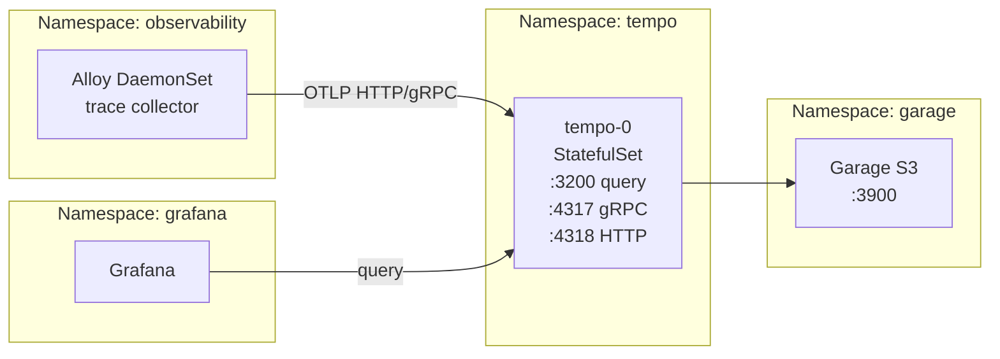

# Introduction

Tempo is the **distributed tracing backend** for the observability stack, providing trace storage, indexing, and query capabilities. It runs in the `tempo` namespace in monolithic (single-binary) mode with S3 storage for trace blocks.

**Key capabilities**:
- **Multi-tenancy**: `X-Scope-OrgID` header-based tenant isolation
- **S3 storage**: Trace blocks stored in Garage S3 (`garage-traces` bucket)
- **OTLP receivers**: HTTP (`:4318`) and gRPC (`:4317`) for trace ingestion
- **Query API**: HTTP `:3200` for Grafana and trace-linked queries

Design docs:
- [observability-lgtm-design.md](../../../../../../docs/design/observability-lgtm-design.md)

For open/resolved issues, see the parent [docs/component-issues/observability.md](../../../../../../docs/component-issues/observability.md).

---

## Architecture



**Flow**:
1. Alloy pushes traces to Tempo via OTLP (HTTP `:4318` or gRPC `:4317`)
2. Tempo writes trace blocks to Garage S3
3. Grafana queries traces via HTTP `:3200`
4. Tempo retrieves blocks from S3 for query results

---

## Subfolders

| Path | Purpose |
|------|---------|
| `charts/tempo/` | Vendored Helm chart (no outbound internet needed from ArgoCD) |

| File | Purpose |
|------|---------|
| `kustomization.yaml` | Helm chart reference (tempo 1.24.0) with sync wave 2.5 |
| `values.yaml` | Monolithic mode config, S3 storage, OTLP receivers |

---

## Container Images / Artefacts

| Artefact | Version | Registry / Location |
|----------|---------|---------------------|
| Tempo Helm chart | `1.24.0` (vendored) | `charts/tempo/` (vendored locally) |
| Tempo container | (chart default, ~2.9.x) | `docker.io/grafana/tempo` |

> [!NOTE]
> Chart is vendored under `charts/` to avoid requiring outbound internet access from the Istio-injected `argocd` namespace.

---

## Dependencies

| Dependency | Purpose |
|------------|---------|
| Garage (S3) | Object storage for trace blocks (`garage.garage.svc:3900`) |
| Vault + ESO | S3 credentials via ExternalSecret (`tempo-s3` secret) |
| Tempo namespace | Must exist with `istio-injection: enabled` |
| NetworkPolicies | Egress to Garage; ingress from Alloy and Grafana |

---

## Communications With Other Services

### Kubernetes Service → Service Calls

| Caller | Target | Port | Protocol | Purpose |
|--------|--------|------|----------|---------|
| Alloy | `tempo.tempo.svc` | 4318 | HTTP OTLP | Trace push |
| Alloy | `tempo.tempo.svc` | 4317 | gRPC OTLP | Trace push (alternative) |
| Grafana | `tempo.tempo.svc` | 3200 | HTTP | Trace queries |
| Tempo | `garage.garage.svc` | 3900 | HTTP | S3 storage |

### External Dependencies (Vault, Keycloak, PowerDNS)

- **Vault**: Stores S3 credentials at `secret/garage/s3` (projected as `tempo-s3` secret)
- **Keycloak**: Not directly used; authentication is header-based (`X-Scope-OrgID`)
- **PowerDNS**: Not directly used

### Mesh-level Concerns (DestinationRules, mTLS Exceptions)

- **Istio sidecar injected**: Tempo pods run with mesh
- **NetworkPolicies**: Default-deny with explicit allows for observability (Alloy), grafana, Garage
- **No external ingress**: Gateway/HTTPRoute not yet configured (internal mesh only)

---

## Initialization / Hydration

1. **Tempo namespace** created (wave 0.5) with `istio-injection: enabled` and NetworkPolicies
2. **ExternalSecrets** sync (wave 1): `tempo-s3` secret from Vault `secret/garage/s3`
3. **Tempo Helm release** deploys (wave 2.5):
   - Tempo StatefulSet (single-binary monolithic mode)
   - Service exposing query (`:3200`) and OTLP (`:4317`, `:4318`)
4. **S3 connection**: Tempo verifies connectivity to Garage

Secrets to pre-populate in Vault:

| Vault Path | Keys |
|------------|------|
| `secret/garage/s3` | `AWS_ACCESS_KEY_ID`, `AWS_SECRET_ACCESS_KEY` |

---

## Argo CD / Sync Order

| Property | Value |
|----------|-------|
| Sync wave | `2.5` |
| Pre/PostSync hooks | None |
| Sync dependencies | Tempo namespace + NetworkPolicies (wave 0.5); ExternalSecrets (wave 1); Garage (wave 1.0/1.5) |

---

## Operations (Toils, Runbooks)

### CrashLoop with S3 Errors

```bash
kubectl -n tempo logs tempo-0 -c tempo --previous | grep -E "ListObjects|S3|optional-store"
```

### Verify Garage Reachability

```bash
kubectl -n tempo get networkpolicy default-egress-baseline -o yaml | grep -E "garage|3900"
```

### Verify Credentials Projected

```bash
kubectl -n tempo get secret tempo-s3 -o yaml | grep -E "AWS_ACCESS_KEY_ID|AWS_SECRET_ACCESS_KEY"
```

### Test Trace Query

```bash
kubectl -n tempo exec -it tempo-0 -- wget -qO- 'http://localhost:3200/api/search?q={}'
```

---

## Customisation Knobs

| Knob | Location | Default |
|------|----------|---------|
| Multi-tenancy | `values.yaml` `tempo.multitenancyEnabled` | `true` |
| Ingestion rate limit | `values.yaml` `tempo.overrides.defaults.ingestion.rate_limit_bytes` | `15000000` |
| Ingestion burst size | `values.yaml` `tempo.overrides.defaults.ingestion.burst_size_bytes` | `20000000` |
| S3 bucket | `values.yaml` `tempo.storage.trace.s3.bucket` | `garage-traces` |
| S3 endpoint | `values.yaml` `tempo.storage.trace.s3.endpoint` | `garage.garage.svc:3900` |
| OTLP HTTP port | `values.yaml` `tempo.receivers.otlp.protocols.http.endpoint` | `0.0.0.0:4318` |
| OTLP gRPC port | `values.yaml` `tempo.receivers.otlp.protocols.grpc.endpoint` | `0.0.0.0:4317` |
| Query frontend shards | `values.yaml` `queryFrontend.queryShards` | `2` |

---

## Oddities / Quirks

1. **Vendored chart**: Chart is vendored under `charts/` because ArgoCD repo-server is Istio-injected with restricted egress.
2. **Ingester replicas ignored**: `ingester.replicas: 2` in values.yaml has no effect in monolithic mode (single-binary).
3. **Probes disabled**: `livenessProbe: null` and `readinessProbe: null` for dev stability.
4. **S3 insecure**: Uses HTTP to Garage (in-cluster, acceptable).
5. **No gateway**: External Gateway/HTTPRoute not configured; access is mesh-internal only.
6. **Metrics generator disabled**: `metricsGenerator.enabled: false` (RED metrics from traces not needed).

---

## TLS, Access & Credentials

| Concern | Details |
|---------|---------|
| Internal transport | HTTP within Istio mesh (mTLS) |
| S3 transport | HTTP to Garage (in-cluster, `insecure: true`) |
| Auth (API) | `X-Scope-OrgID` header for multi-tenancy |
| Credentials | S3 creds from Vault via ESO (`tempo-s3` secret) |
| External access | Not configured (mesh-internal only) |

---

## Dev → Prod

| Aspect | Dev (current) | Prod (recommended) |
|--------|---------------|-------------------|
| Deployment mode | Monolithic (single-binary) | Distributed or multi-replica |
| Replicas | 1 (effective) | 2+ with anti-affinity |
| PDBs | None | Add for zero-downtime |
| Gateway | None | HTTPRoute + AuthZ |
| Ingestion limits | 15MB/s rate, 20MB burst | Tune per workload |
| S3 TLS | HTTP (insecure) | Consider mTLS if required |

**Promotion**:
1. Deploy Tempo distributed mode (or proven multi-replica topology)
2. Add PDBs, anti-affinity, and topology spread
3. Add Gateway/HTTPRoute with tenant/auth enforcement
4. Tune ingestion limits for production workloads
5. Document and validate upgrade procedure with trace write/read smoke test

---

## Smoke Jobs / Test Coverage

### Current Implementation ✅

Tempo is covered by the parent observability smoke test:

| Job | Coverage |
|-----|----------|
| `observability-trace-smoke` | Push trace via telemetrygen → query back via search API → delete tenant |

**Test details**:
- Uses `telemetrygen` to push 1 trace via OTLP HTTP to `tempo.tempo.svc:4318`
- Ephemeral tenant (`smoke-<pod-name>`) for isolation
- Queries back via `/api/search` with `runid` tag
- Retries up to 25 × 3s for trace to appear
- Cleans up via `/compactor/delete_tenant` API (best-effort)

### Test Coverage Summary

| Test | Type | Status |
|------|------|--------|
| Trace push round-trip | Functional | ✅ Implemented |
| Multi-tenant isolation | Functional | ✅ Covered (ephemeral tenant) |
| Tenant deletion | Functional | ✅ Covered (best-effort) |
| OTLP gRPC receiver | Functional | ❌ Not tested (HTTP only) |
| S3 connectivity | Dependency | ⚠️ Indirect (fails if S3 down) |
| Health endpoint | Health | ❌ Not automated |

### Proposed Additions

1. **Health endpoint check**: Verify `/ready` returns 200
2. **OTLP gRPC test**: Push trace via gRPC endpoint (`:4317`)

---

## HA Posture

### Current Implementation

| Component | Type | Replicas | HA Status |
|-----------|------|----------|-----------|
| **Tempo** | StatefulSet | 1 | ❌ SPOF |

### Analysis

Tempo is deployed in **monolithic mode** (single-binary):
- Single StatefulSet pod (`tempo-0`)
- `ingester.replicas: 2` in values.yaml has **no effect** in monolithic mode
- Node drain or pod failure = tracing downtime

### PodDisruptionBudgets

| Component | PDB | Status |
|-----------|-----|--------|
| Tempo | Not configured | ❌ Gap |

### Gaps

1. **Single replica SPOF**: No redundancy for trace ingestion/query
2. **No PDB**: Voluntary disruptions cause immediate downtime
3. **Monolithic mode**: Cannot scale read/write paths independently

### Production HA Options

1. **Tempo distributed mode**: Separate ingester, querier, compactor
2. **Multi-replica monolithic**: 2+ replicas with ingester ring (Tempo 2.x)
3. **Anti-affinity + PDB**: Spread across nodes, protect from disruptions

---

## Security

### Current Controls ✅

| Layer | Control | Status |
|-------|---------|--------|
| **Internal transport** | Istio mTLS mesh | ✅ Implemented |
| **S3 transport** | HTTP to Garage (in-cluster) | ⚠️ Insecure (acceptable) |
| **Multi-tenancy** | `X-Scope-OrgID` header | ✅ Implemented |
| **NetworkPolicies** | Default-deny + explicit allows | ✅ Comprehensive |
| **Secrets** | Vault + ESO (no plaintext) | ✅ Implemented |
| **External access** | Not configured | ✅ N/A (mesh-internal) |

### NetworkPolicy Coverage (tempo namespace)

| Policy | Purpose |
|--------|---------|
| `default-deny-ingress` | Block all ingress by default |
| `default-egress-baseline` | Allow DNS, Garage S3 (TCP/3900), Istio |
| `tempo-allow-from-observability` | Allow OTLP ingestion from Alloy |
| `tempo-allow-from-grafana` | Allow query access from Grafana |

### Gaps

1. **Tenant header not verified**: Any pod in allowed namespaces can push to any tenant
2. **No rate limiting per tenant**: Ingestion limits apply per-instance, not enforced at network level

### Recommendations

1. Document tenant isolation as NetworkPolicy-based
2. Consider Gateway + OIDC for production external access

---

## Backup and Restore

### Current State

| Aspect | Status |
|--------|--------|
| Trace blocks | Stored in Garage S3 (`garage-traces` bucket) |
| Configuration | GitOps-managed (Helm values) |
| In-memory data | ⚠️ Recent traces in ingester WAL (not persisted) |
| Retention | Configurable (default varies by Tempo config) |

### Analysis

Tempo is **stateless except for S3 storage**:
- All trace blocks are in Garage S3
- Ingester WAL holds recent traces before flush (lost on crash)
- Configuration is fully GitOps-managed and reconstructible

### Disaster Recovery

| Scenario | Impact | Recovery |
|----------|--------|----------|
| Pod lost | Brief trace loss (~WAL unflushed) | StatefulSet recreates |
| S3 data lost | **All traces lost** | No recovery without Garage backup |
| Cluster rebuild | None if S3 intact | GitOps redeploy; connects to existing S3 data |

### Backup Strategy

Tempo backup depends on **Garage S3 backup**:
- Garage uses ZFS snapshots on Proxmox (host-level)
- No independent Tempo backup mechanism needed

### Restore Plan

1. **From Garage backup**: Restore `garage-traces` bucket in Garage
2. **Redeploy Tempo**: Argo sync recreates Tempo StatefulSet
3. **Verify**: Query historical traces via Grafana

> [!NOTE]
> Recent traces in the ingester WAL (not yet flushed to S3) are lost on pod crash. Flush interval is configurable in Tempo config.

