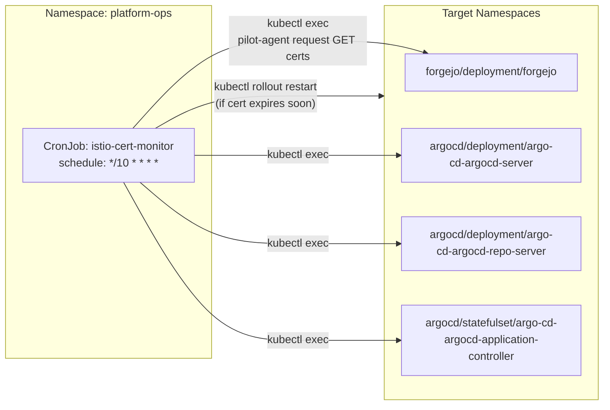

# Introduction

Platform Ops provides operational automation that keeps the platform healthy without relying on host scripts. Everything here is Kubernetes-native and GitOps-managed (Argo applies these manifests from `platform/gitops/`).

**Primary Components**

- `istio-cert-monitor`: proactive Istio workload cert expiry restarts
- `vertical-pod-autoscaler`: automatic CPU/memory request right-sizing (VPA)

A CronJob that proactively detects expiring Istio workload certificates (per-pod `istio-proxy` identity cert) and performs a controlled `rollout restart` of selected workloads before expiry. This prevents "surprise outages" when a pod's cert expires and mTLS handshakes begin failing.

For open/resolved issues, see [docs/component-issues/platform-ops.md](../../../../../docs/component-issues/platform-ops.md).

---

## Architecture



**Flow**:
1. CronJob runs every 10 minutes
2. For each target in `targets.json`, finds a Running pod with `istio-proxy` container
3. Execs into the pod: `kubectl exec … -c istio-proxy -- pilot-agent request GET certs`
4. Parses certificate chain(s) and extracts earliest `notAfter`
5. If remaining lifetime < `THRESHOLD_SECONDS`, performs `kubectl rollout restart`
6. Annotates the workload with restart timestamp for cooldown tracking

---

## Subfolders

| Subfolder | Purpose |
|-----------|---------|
| `istio-cert-monitor/` | CronJob, RBAC, Python monitor script, targets config |
| `vertical-pod-autoscaler/` | VPA CRDs + controller deployments (recommender/updater/admission) |

### istio-cert-monitor/

| File | Purpose |
|------|---------|
| `kustomization.yaml` | Namespace, resources, ConfigMapGenerator for scripts/config |
| `cronjob.yaml` | CronJob spec (every 10 min), ServiceAccount |
| `rbac.yaml` | ClusterRole/ClusterRoleBinding for `pods/exec`, patch deployments/statefulsets/daemonsets |
| `monitor.py` | Python script that parses cert expiry and triggers restarts |
| `run.sh` | Entrypoint: sets up kubeconfig from SA token, runs monitor.py |
| `targets.json` | JSON array of workloads to monitor (namespace/kind/name) |

---

## Container Images / Artefacts

| Artefact | Version | Registry / Location |
|----------|---------|---------------------|
| bootstrap-tools | `1.3` | `registry.example.internal/deploykube/bootstrap-tools:1.4` |

The `bootstrap-tools` image includes `kubectl`, `openssl`, and `python3`—all dependencies of this component.

---

## Dependencies

| Dependency | Purpose |
|------------|---------|
| Kubernetes API | Pod listing, exec, rollout restart, annotations |
| Target workloads | Must have `istio-proxy` sidecar containers |
| `platform-ops` namespace | Must exist (created by namespace layer) |

---

## Communications With Other Services

### Kubernetes Service → Service Calls

| Caller | Target | Port | Protocol | Purpose |
|--------|--------|------|----------|---------|
| istio-cert-monitor | `kubernetes.default.svc` | 443 | HTTPS | API calls (get pods, exec, patch) |

### External Dependencies (Vault, Keycloak, PowerDNS)

None. This component operates purely via the Kubernetes API.

### Mesh-level Concerns (DestinationRules, mTLS Exceptions)

- **Istio sidecar disabled**: The CronJob explicitly sets `sidecar.istio.io/inject: "false"` on both the CronJob metadata and pod template.
- **Rationale**: The job needs reliable access to the Kubernetes API server and does not make service-to-service calls that benefit from mTLS policy. In Istio-injected batch pods, the sidecar can remain alive after the main container exits, preventing Job completion.

---

## Initialization / Hydration

1. `platform-ops` namespace created (by namespace layer)
2. CronJob deploys with RBAC
3. Job runs on schedule (or on-demand via `kubectl create job --from=cronjob/...`)
4. No secrets or pre-population required

**First-run behaviour**: The monitor will skip restarts if no certs are close to expiry. Enable `DRY_RUN=true` initially to validate parsing.

---

## Argo CD / Sync Order

| Property | Value |
|----------|-------|
| Sync wave | None explicitly set (uses default) |
| Pre/PostSync hooks | None |
| Sync dependencies | Target workloads (Forgejo, ArgoCD) must be running; otherwise CronJob logs errors but continues |

> [!NOTE]
> No explicit sync wave annotation is present. The component can deploy whenever the `platform-ops` namespace exists.

---

## vertical-pod-autoscaler/

Installs Kubernetes Vertical Pod Autoscaler (VPA) into `kube-system` so selected workloads can automatically converge CPU/memory **requests** toward observed usage (reduce waste, reduce starvation).

---

## Operations (Toils, Runbooks)

### Run On-Demand

```bash
kubectl -n platform-ops create job --from=cronjob/istio-cert-monitor istio-cert-monitor-manual
kubectl -n platform-ops logs -l job-name=istio-cert-monitor-manual --all-containers=true --tail=200
```

### Verify Restart Occurred

```bash
kubectl -n forgejo get deployment/forgejo -o jsonpath='{.metadata.annotations.deploykube\.dev/istio-cert-monitor-last-restart}{"\n"}'
```

### Debug Parsing Failures

1. Check CronJob logs for `ERROR` lines
2. Validate `pilot-agent request GET certs` output manually:
   ```bash
   kubectl -n forgejo exec deploy/forgejo -c istio-proxy -- pilot-agent request GET certs
   ```
3. Ensure target pods have `istio-proxy` container running

### Related Guides

None yet. Consider adding a runbook for Istio cert lifecycle once observability alerting is in place.

---

## Customisation Knobs

| Knob | Location | Default |
|------|----------|---------|
| Schedule | `cronjob.yaml` `.spec.schedule` | `*/10 * * * *` (every 10 min) |
| Threshold (seconds before expiry to restart) | `cronjob.yaml` env `THRESHOLD_SECONDS` | `7200` (2 hours) |
| Cooldown (minimum seconds between restarts) | `cronjob.yaml` env `COOLDOWN_SECONDS` | `3600` (1 hour) |
| Dry run mode | `cronjob.yaml` env `DRY_RUN` | `false` |
| Target workloads | `targets.json` | Forgejo + ArgoCD (4 workloads) |
| Proxy container name | `targets.json` per-entry `proxyContainer` | `istio-proxy` |

---

## Oddities / Quirks

1. **Istio injection disabled intentionally**: Unlike most workloads, this CronJob disables Istio sidecar injection to ensure reliable Job completion. See "Mesh-level Concerns" for rationale.

2. **ClusterRole scope**: Uses a ClusterRole/ClusterRoleBinding to allow `pods/exec` and `patch` across any namespace. This is intentional—the monitor needs to reach target workloads in multiple namespaces. Track RBAC tightening in [docs/component-issues/platform-ops.md](../../../../../docs/component-issues/platform-ops.md).

3. **Python script for cert parsing**: The `monitor.py` script handles multiple cert chain formats returned by `pilot-agent`, extracting both RFC3339 `validTo` fields and raw PEM certificates via `openssl x509`.

4. **Annotation-based cooldown**: Restart timestamps are stored as annotations (`darksite.cloud/istio-cert-monitor-last-restart`) on the target workload, not in persistent storage. This means cooldowns reset on full cluster rebuild.

---

## TLS, Access & Credentials

| Concern | Details |
|---------|---------|
| Transport (API) | HTTPS with service account token + CA bundle |
| Credentials | Uses in-cluster service account (`istio-cert-monitor`) |
| External secrets | None—no Vault integration required |

---

## Dev → Prod

| Aspect | Dev (overlays/dev) | Prod (overlays/prod) |
|--------|------------|----------------|
| Targets | Forgejo + ArgoCD | Add Keycloak, Vault, other critical workloads |
| DRY_RUN | `true` (recommended for validation) | `false` |
| Schedule | `*/10 * * * *` | Consider `*/5 * * * *` for tighter monitoring |
| Threshold | `7200` (2 hours) | Tune based on cert lifetime (e.g., `3600` for 1h buffer) |

**Promotion**: Create overlay with updated `targets.json` and environment variables. Add alerting on "restart executed" events once observability is in place.

---

## Smoke Jobs / Test Coverage

### Current State

The `istio-cert-monitor` CronJob runs every 10 minutes and logs its actions. There is **no dedicated smoke job** that validates the monitor is working correctly.

**Manual smoke test** (documented in Operations):
```bash
kubectl -n platform-ops create job --from=cronjob/istio-cert-monitor istio-cert-monitor-manual
kubectl -n platform-ops logs -l job-name=istio-cert-monitor-manual --all-containers=true --tail=200
```

### Proposed Smoke Job

A dedicated smoke job should validate:

1. **Job runs successfully**: Creates job from CronJob, exits 0
2. **Correct parsing**: Logs show cert expiry dates extracted (not `ERROR` lines)
3. **Target connectivity**: Can exec into at least one target pod
4. **RBAC is sufficient**: No permission errors in logs

```yaml
# Proposed: job-istio-cert-monitor-smoke.yaml
apiVersion: batch/v1
kind: Job
metadata:
  name: istio-cert-monitor-smoke
  namespace: platform-ops
  annotations:
    argocd.argoproj.io/hook: PostSync
    argocd.argoproj.io/hook-delete-policy: BeforeHookCreation
spec:
  backoffLimit: 1
  activeDeadlineSeconds: 120
  template:
    metadata:
      annotations:
        sidecar.istio.io/inject: "false"
    spec:
      restartPolicy: Never
      serviceAccountName: istio-cert-monitor
      containers:
        - name: smoke
          image: registry.example.internal/deploykube/bootstrap-tools:1.4
          command:
            - /bin/bash
            - -c
            - |
              set -euo pipefail
              echo "Smoke test: running cert monitor in DRY_RUN mode..."
              export DRY_RUN=true
              export TARGETS_PATH=/config/targets.json
              /scripts/run.sh 2>&1 | tee /tmp/output.log
              
              # Validate no fatal errors
              if grep -q "FATAL:" /tmp/output.log; then
                echo "FAIL: Fatal error detected"
                exit 1
              fi
              
              # Validate at least one target was checked (no 100% errors)
              if grep -q "earliest cert remaining=" /tmp/output.log; then
                echo "PASS: At least one target cert parsed successfully"
              else
                echo "WARN: No targets successfully checked (may be expected if no targets running)"
              fi
              
              echo "Smoke test complete"
          volumeMounts:
            - name: scripts
              mountPath: /scripts
              readOnly: true
            - name: config
              mountPath: /config
              readOnly: true
      volumes:
        - name: scripts
          configMap:
            name: istio-cert-monitor-scripts
            defaultMode: 0555
        - name: config
          configMap:
            name: istio-cert-monitor-config
            defaultMode: 0444
```

> [!NOTE]
> The dedicated smoke job is **not yet implemented**. Tracked in [docs/component-issues/platform-ops.md](../../../../../docs/component-issues/platform-ops.md).

---

## HA Posture

### Current Implementation

| Aspect | Status | Details |
|--------|--------|---------|
| Deployment type | ✅ CronJob | Single instance per run |
| Concurrency policy | ✅ Forbid | Prevents overlapping runs |
| PodDisruptionBudget | ❌ N/A | Not applicable to CronJobs |
| Idempotent | ✅ Yes | Safe to re-run; cooldown prevents thrashing |

### Analysis

The `istio-cert-monitor` is intentionally **not HA** and does not need to be:

1. **Periodic execution**: Runs every 10 minutes; missing one run has no impact if certs have 2+ hours remaining (threshold)
2. **Idempotent**: Re-running produces the same result; no state corruption risk
3. **Cooldown guard**: Prevents restart storms if the monitor runs repeatedly in quick succession
4. **No persistent state**: All data is ephemeral; restart annotations live on target workloads

**Failure modes**:
- Job pod fails → retries on next schedule (10 min later)
- Node down during run → same, next schedule recovers
- API server unreachable → logged as error, retries on next schedule

### Verdict

**Acceptable single-instance design.** No HA enhancements needed.

---

## Security

### Current Controls ✅

| Layer | Control | Status |
|-------|---------|--------|
| **Transport (API)** | HTTPS with SA token + CA | ✅ Implemented |
| **Istio mesh** | Sidecar disabled | ✅ Intentional (see Oddities) |
| **RBAC** | Dedicated ServiceAccount | ✅ Implemented |
| **Image** | Pinned tag (`bootstrap-tools:1.4`) | ✅ Implemented |
| **Read-only mounts** | Scripts/config as read-only | ✅ Implemented |

### RBAC Scope

The `istio-cert-monitor` ClusterRole grants:

| Permission | Scope | Risk |
|------------|-------|------|
| `pods` get/list/watch | Cluster-wide | Low—read-only |
| `pods/exec` create | Cluster-wide | **Medium**—can exec into any pod with `istio-proxy` |
| `deployments/statefulsets/daemonsets` patch | Cluster-wide | **Medium**—can rollout restart any workload |

### Gaps

1. **Broad `pods/exec` and `patch` scope**: The monitor can exec into any pod and restart any workload cluster-wide. While the script only targets workloads in `targets.json`, a compromised image could abuse these permissions.

2. **No resource quota enforcement**: The CronJob has no resource requests/limits set.

### Recommendations

1. **Tighten RBAC** (tracked in component-issues): Replace ClusterRole with per-namespace Roles for only the monitored namespaces.
2. **Add resource limits**: Set `resources.requests` and `resources.limits` on the container.
3. **Consider image digest pinning**: Use `@sha256:...` instead of `:1.3` tag for supply-chain assurance.

---

## Backup and Restore

### Current State

| Aspect | Status |
|--------|--------|
| Persistent data | **None** |
| Configuration | GitOps-managed (Kustomize + ConfigMaps) |
| Restart annotations | Stored on target workloads, not in this component |

### Analysis

The `istio-cert-monitor` is **fully stateless**:

- No PersistentVolumeClaims
- Configuration is reconstructed from Git on every Argo sync
- Restart annotations are stored on the target workloads (Forgejo, ArgoCD, etc.), not in this component's namespace

### Disaster Recovery

1. **Pod lost**: CronJob recreates on next schedule
2. **Full cluster rebuild**: Component redeploys via Argo sync; no data to restore
3. **ConfigMap deleted**: Kustomize regenerates from Git

**No backup mechanism needed.**
