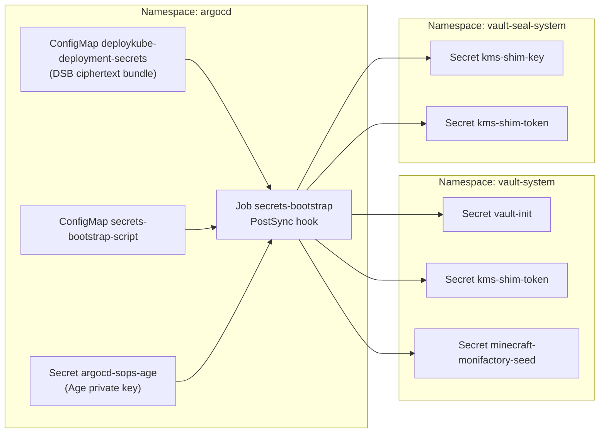

# Introduction

Secrets Bootstrap is a **utility component** that bridges SOPS-encrypted secrets from Git into the cluster. It runs as an Argo PostSync hook at sync wave `-6`—the earliest in the platform—to ensure Vault and other components have their required secrets before they start.

This component is **not a service**; it's a one-shot Job that decrypts and applies secrets using the shared Age key.

For open/resolved issues, see [docs/component-issues/secrets-bootstrap.md](../../../../../docs/component-issues/secrets-bootstrap.md) (if created).

---

## Architecture



- **Job** (`secrets-bootstrap`): Runs in `argocd` namespace as a PostSync hook.
- **SOPS files**: Published by the Deployment Secrets Bundle (DSB) into `argocd/deploykube-deployment-secrets` as ciphertext files.
- **Age key**: Loaded from `argocd-sops-age` Secret (seeded by Stage 0/1).
- **Target namespaces**: `vault-system` always; plus `vault-seal-system` when `spec.secrets.rootOfTrust.mode=inCluster`.

---

## Subfolders

| Path | Purpose |
|------|---------|
| `scripts/` | `bootstrap.sh` that decrypts and applies secrets. |

---

## Container Images / Artefacts

| Artefact | Version | Registry |
|----------|---------|----------|
| Bootstrap Tools (Job base) | `1.3` | `registry.example.internal/deploykube/bootstrap-tools:1.4` |
| SOPS | Bundled in `bootstrap-tools` | n/a |

---

## Dependencies

| Dependency | Purpose |
|------------|---------|
| `argocd-sops-age` Secret | Age private key for SOPS decryption (seeded by Stage 0/1). |
| Target namespaces | `vault-system` always; plus `vault-seal-system` when `spec.secrets.rootOfTrust.mode=inCluster` (Job waits up to 150s). |

---

## Argo CD / Sync Order

| Property | Value |
|----------|-------|
| App `secrets-bootstrap` sync wave | `-6` (earliest) |
| Hook type | `PostSync` on Job |
| Hook delete policy | `BeforeHookCreation,HookSucceeded` |

This app syncs before all Vault apps (waves -5 to 1.5) to ensure secrets are in place.

---

## Secrets Managed

| File | Target Namespace | Secret Name |
|------|------------------|-------------|
| `deployments/<deploymentId>/secrets/vault-init.secret.sops.yaml` | `vault-system` | `vault-init` |
| `deployments/<deploymentId>/secrets/kms-shim-key.secret.sops.yaml` | `vault-seal-system` | `kms-shim-key` (mode=`inCluster`) |
| `deployments/<deploymentId>/secrets/kms-shim-token.vault-seal-system.secret.sops.yaml` | `vault-seal-system` | `kms-shim-token` (mode=`inCluster`) |
| `deployments/<deploymentId>/secrets/kms-shim-token.vault-system.secret.sops.yaml` | `vault-system` | `kms-shim-token` |
| `deployments/<deploymentId>/secrets/minecraft-monifactory-seed.secret.sops.yaml` | `vault-system` | `minecraft-monifactory-seed` (optional) |

---

## Operations (Toils, Runbooks)

### Updating DSB secrets

The bootstrap Job mounts the ciphertext bundle from `argocd/deploykube-deployment-secrets`, which is generated from:
- `platform/gitops/deployments/<deploymentId>/secrets/*.secret.sops.yaml`
- `platform/gitops/deployments/<deploymentId>/kustomization.yaml`

Workflow:
1. Edit the deployment-scoped secret under `platform/gitops/deployments/<deploymentId>/secrets/`.
2. Keep the bundle file list in sync:
   ```bash./scripts/deployments/bundle-sync.sh --deployment-id <deploymentId>
   ```
3. Run repo lint:
   ```bash./tests/scripts/validate-deployment-secrets-bundle.sh
   ```
4. Commit, reseed Forgejo, and sync Argo.

Guardrails:
- The Job refuses to apply placeholder Secrets (`metadata.labels.darksite.cloud/placeholder=true`).

### Manual Resync

```bash
kubectl -n argocd delete job secrets-bootstrap
kubectl -n argocd patch application secrets-bootstrap \
  --type merge -p '{"operation":{"sync":{"prune":true}}}'
```

---

## Oddities / Quirks

1. **Runs in argocd namespace**: The Job lives in `argocd` (not target namespaces) because it needs the Age key from `argocd-sops-age`.
2. **Waits for namespaces**: The script waits up to 150s for `vault-system` and (when needed) `vault-seal-system` to exist (created by later apps, but namespace creation is fast).
3. **Fallback for unencrypted files**: If SOPS metadata is missing, the script applies the file as plaintext (for migration/debugging).
4. **No Istio sidecar**: Job has `sidecar.istio.io/inject: "false"` because it's a short-lived utility.

---

## TLS, Access & Credentials

| Concern | Details |
|---------|---------|
| Age key | `argocd-sops-age` Secret; seeded by Stage 0/1 from the operator’s Age identities file (see `docs/guides/sops-age-on-macos.md`). |
| RBAC | ServiceAccount `secrets-bootstrap` with ClusterRole to create secrets in any namespace. |
| Network | No network dependencies (local kubectl apply). |

---

## Sections Not Applicable

The following chapters from the master template do not apply to this utility component:

- **Communications With Other Services**: No service-to-service calls.
- **Initialization / Hydration**: This *is* the hydration mechanism for other components.
- **Customisation Knobs**: No configurable parameters beyond adding secrets.
- **Dev → Prod**: Same behavior in all environments.
- **Smoke Jobs / Test Coverage**: Job success = secrets exist; no additional verification needed.
- **HA Posture**: One-shot Job; HA not applicable.
- **Security**: RBAC-controlled; Age key is the trust anchor.
- **Backup and Restore**: Secrets are in Git (SOPS-encrypted); restore = resync.
