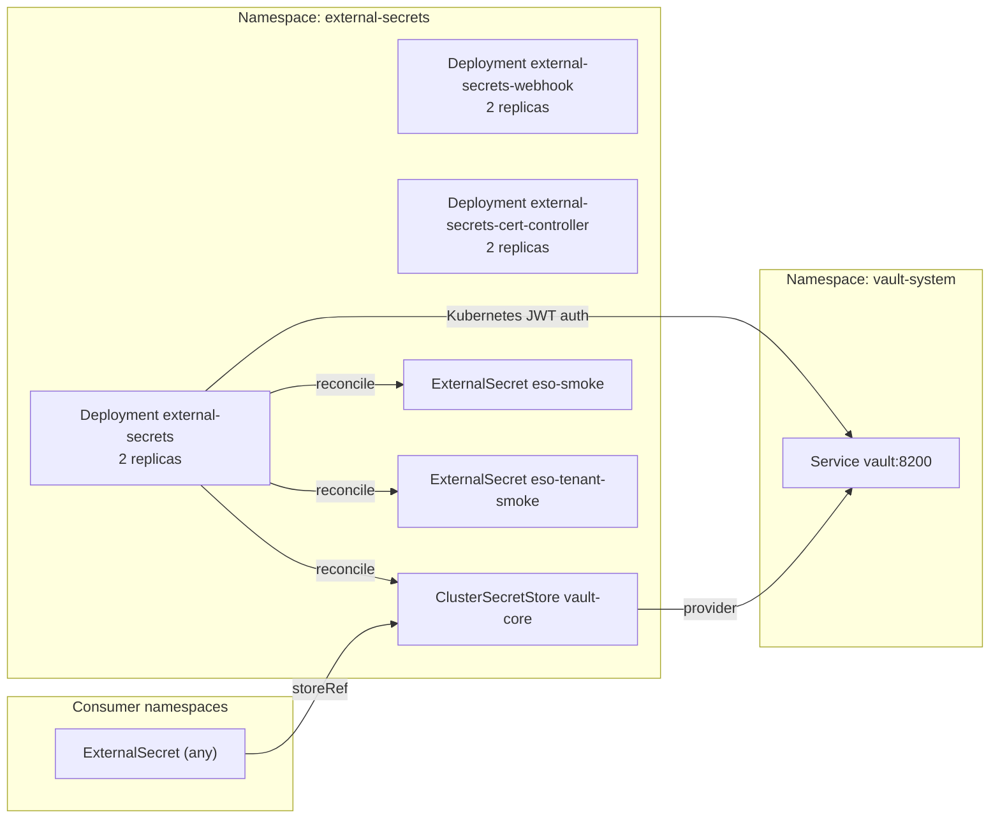

# Introduction

External Secrets Operator (ESO) synchronizes secrets from HashiCorp Vault into Kubernetes. It provides the `ClusterSecretStore/vault-core` abstraction that all other components reference when they need credentials projected from Vault.

ESO runs with **2 replicas** (controller, webhook, cert-controller) for lightweight HA in dev; production can scale further via values overrides.

For open/resolved issues, see [docs/component-issues/external-secrets.md](../../../../../docs/component-issues/external-secrets.md).

---

## Architecture



- **Controller** reconciles `ExternalSecret` and `ClusterSecretStore` CRs.
- **Webhook** validates/mutates ESO CRs.
- **Cert-Controller** issues internal certs for webhook TLS (relies on cert-manager CRDs).
- **ClusterSecretStore `vault-core`** authenticates to Vault via Kubernetes JWT (`kubernetes` auth method, role `external-secrets`).

---

## Subfolders

| Path | Purpose |
|------|---------|
| `helm/` | Kustomize-wrapped Helm chart (`external-secrets/external-secrets` v1.0.0) with static values. |
| `config/` | `ClusterSecretStore/vault-core`, the scoped-store smoke fixture `ClusterSecretStore/vault-tenant-smoke-project-demo`, and PostSync smoke tests (`config/tests/`). Runtime tenant-specific stores such as `vault-tenant-<orgId>-cloud-dns` are controller-created, not statically committed here. |
| `keycloak/` | Keycloak-related `ExternalSecret` resources that fan Vault material into `keycloak`, `argocd`, and `forgejo` namespaces. |

---

## Container Images / Artefacts

| Artefact | Version | Registry |
|----------|---------|----------|
| External Secrets Operator chart | `1.0.0` | `https://charts.external-secrets.io` |
| ESO controller image | `v1.0.0` (chart default) | `registry.example.internal/external-secrets/external-secrets` |

---

## Dependencies

| Dependency | Purpose |
|------------|---------|
| Vault (`vault-system`) | Secret backend; must be initialized and have the `external-secrets` role/policy created by `vault-configure` job. |
| cert-manager | ESO webhook TLS certificates. |
| Forgejo + ArgoCD | GitOps source for manifests. |

---

## Communications With Other Services

### Kubernetes Service → Service Calls

| Caller | Target | Port | Protocol | Purpose |
|--------|--------|------|----------|---------|
| ESO controller | `vault.vault-system.svc.cluster.local` | 8200 | HTTP | Vault KV reads |
| ESO webhook | K8s API Server | 443 | HTTPS | Admission webhooks |

### External Dependencies (Vault, Keycloak, PowerDNS)

- **Vault**: ESO authenticates via the Kubernetes auth method; role `external-secrets` must exist with policy granting read on `secret/*`.  
  Vault role is created by the `vault-configure` job (see `secrets/vault/config`).

### Mesh-level Concerns (DestinationRules, mTLS Exceptions)

- In DeployKube, the `external-secrets` namespace is **Istio-injected** (platform default), so ESO → Vault/OpenBao traffic remains HTTP at the application layer but is protected by **mesh mTLS**.
- Internal HTTPS for Vault/OpenBao is still a hardening follow-up: once an internal HTTPS endpoint + CA bundle exists, update the `ClusterSecretStore` `server` field and add the CA to the store spec.

---

## Initialization / Hydration

1. **Namespace** `external-secrets` created by Argo with `CreateNamespace=true`.
2. **Helm chart** installs CRDs, controller, webhook, cert-controller.
3. **ClusterSecretStore** `vault-core` is applied (sync wave `1.1`); controller begins reconciling `ExternalSecret` resources.
4. **Smoke tests**:
   - `ExternalSecret/eso-smoke` syncs `secret/bootstrap.message` into `external-secrets/eso-smoke`.
   - `ExternalSecret/eso-tenant-smoke` syncs the scoped-store fixture key into `external-secrets/eso-tenant-smoke`.
   - `Job/eso-smoke` (PostSync hook) asserts the stores are Ready and the Secrets contain the expected values.

Prerequisites before first sync:

| Requirement | Owner |
|-------------|-------|
| Vault initialized and unsealed | `secrets/vault` |
| Vault `kubernetes` auth enabled, role `external-secrets` created | `vault-configure` job |
| `secret/bootstrap` seeded in Vault | `vault-init` job |

---

## Argo CD / Sync Order

| Property | Value |
|----------|-------|
| App `secrets-external-secrets` sync wave | `1` |
| App `secrets-external-secrets-config` sync wave | `1.1` |
| Pre/PostSync hooks | None |
| Sync dependencies | Vault apps (`secrets-vault`, `secrets-vault-config`) must be healthy first. |

The helm app (`wave 1`) installs CRDs and controller; the config app (`wave 1.1`) applies the `ClusterSecretStore` once the controller is ready.

---

## Operations (Toils, Runbooks)

### Sync / Upgrade

```bash
kubectl -n argocd patch application secrets-external-secrets \
  --type merge -p '{"operation":{"sync":{"prune":true}}}'
```

### Verify ClusterSecretStore Health

```bash
kubectl get clustersecretstore vault-core -o jsonpath='{.status.conditions[*].message}'
```

### Verify Smoke Secret

```bash
kubectl -n external-secrets get secret eso-smoke -o jsonpath='{.data.message}' | base64 -d
kubectl -n external-secrets get secret eso-tenant-smoke -o jsonpath='{.data.message}' | base64 -d
```

### Credential Rotation

No ESO-specific credentials to rotate; Vault auth uses Kubernetes JWT bound to the `external-secrets` ServiceAccount.

### Related Guides

- (No dedicated runbook yet; general ESO/Vault troubleshooting applies.)

---

## Customisation Knobs

| Knob | Location | Default |
|------|----------|---------|
| Controller replicas | `helm/values.yaml` → `replicaCount` | `2` |
| Webhook replicas | `helm/values.yaml` → `webhook.replicaCount` | `2` |
| Cert-controller replicas | `helm/values.yaml` → `certController.replicaCount` | `2` |
| Vault address | `config/clustersecretstore.yaml` → `spec.provider.vault.server` | `http://vault.vault-system.svc:8200` |
| Vault auth role | `config/clustersecretstore.yaml` → `spec.provider.vault.auth.kubernetes.role` | `external-secrets` |
| Refresh interval (per ExternalSecret) | Each `ExternalSecret` manifest | `1m` |

---

## Oddities / Quirks

1. **HTTP to Vault**: The `ClusterSecretStore` currently uses `http://` because Vault's internal listener is plain HTTP. Once Vault is configured with TLS, update the store and add `caBundle` or `caProvider`.
2. **Smoke tests live in `external-secrets`**: Smokes are platform-owned and run as part of the `secrets-external-secrets-config` app via a PostSync hook Job.
3. **Keycloak subfolder**: The `keycloak/` subfolder is **not** deployed by the ESO Argo apps; it is referenced by the Keycloak Argo app (`identity-keycloak-config`) at a later sync wave.

---

## TLS, Access & Credentials

| Concern | Details |
|---------|---------|
| ESO → Vault | HTTP (no TLS); upgrade planned once Vault exposes HTTPS internally. |
| Webhook TLS | Managed by cert-controller (self-signed or cert-manager integration). |
| Auth | Kubernetes JWT; ServiceAccount `external-secrets` in namespace `external-secrets`. |
| Vault role | `external-secrets` with read policy on `secret/*`. |

---

## Dev → Prod

| Aspect | mac-orbstack / mac-orbstack-single | proxmox-talos |
|--------|------------------------------------|--------------|
| Replicas | 2 / 2 / 2 | 2 / 2 / 2 |
| Vault address | `http://vault.vault-system.svc:8200` | `http://vault.vault-system.svc:8200` |
| Overlays | `overlays/mac-orbstack`, `overlays/mac-orbstack-single` (sets webhook `failurePolicy: Ignore`) | `overlays/proxmox-talos` (base-only) |

Promotion: keep the shared chart config in `helm/`; overlays should only patch environment-specific behavior.

---

## Smoke Jobs / Test Coverage

### Current State

`secrets-external-secrets-config` ships a PostSync smoke Job that proves ESO ↔ Vault wiring is functional:

- `ClusterSecretStore/vault-core` becomes Ready and can read `secret/bootstrap.message` (Secret `external-secrets/eso-smoke`).
- Scoped store smoke: `ClusterSecretStore/vault-tenant-smoke-project-demo` becomes Ready and can read only the reserved tenant fixture key (Secret `external-secrets/eso-tenant-smoke`).
- Negative scope smoke: the tenant-scoped store must not be able to read outside its tenant/project boundary (asserts a `permission denied` when trying to read `bootstrap`).

### Gaps

1. **No alerting on ExternalSecret failures**: Individual ExternalSecrets have `.status.conditions` but no Prometheus alerts are wired.

---

## HA Posture

### Current State

| Aspect | Status |
|--------|--------|
| Controller replicas | **2** (`helm/values.yaml` → `replicaCount`) |
| Webhook replicas | **2** (`helm/values.yaml` → `webhook.replicaCount`) |
| Cert-controller replicas | **2** (`helm/values.yaml` → `certController.replicaCount`) |
| Leader election | **Enabled** (`leaderElect: true`) |
| PodDisruptionBudget | ✅ Enabled (`minAvailable: 1`) |
| Anti-affinity | ✅ `podAntiAffinity` preferred across `kubernetes.io/hostname` |
| Topology spread | ❌ Not configured |

### Analysis

ESO is **stateless**—all state lives in CRDs and Vault. With 2 replicas + leader election, one leader reconciles while the other is a hot standby. PDBs + anti-affinity reduce the likelihood of simultaneous disruption for the controller/webhook/cert-controller deployments.

### Recommendations

1. Keep PDBs and anti-affinity enabled (especially in prod) to reduce disruption risk.
2. Consider adding `topologySpreadConstraints` if/when clusters become multi-zone.

---

## Security

### Current Controls

| Layer | Control | Status |
|-------|---------|--------|
| Transport (ESO → Vault) | HTTP inside cluster | ⚠️ No TLS (gap) |
| Transport (webhook) | TLS via cert-controller/cert-manager | ✅ Implemented |
| Auth (Vault) | Kubernetes JWT; role `external-secrets` | ✅ Implemented |
| RBAC | ClusterRole `external-secrets-controller` with broad secret read/write | ✅ Implemented |
| Pod security | Chart defaults include `runAsNonRoot` + `readOnlyRootFilesystem` | ✅ Implemented |
| NetworkPolicy | NetworkPolicy + CiliumNetworkPolicy egress/ingress allowlists | ✅ Implemented |

### Gaps

1. **HTTP to Vault**: Traffic between ESO and Vault is unencrypted. In a compromised-mesh scenario, secrets could be intercepted.
   - **Mitigation**: Update `ClusterSecretStore` to HTTPS once Vault exposes TLS internally; add `caBundle`.

### Recommendations

- Prioritize ES-001 (TLS to Vault) once Vault HTTPS is ready.
- Wire alerting for `ClusterSecretStore` / `ExternalSecret` failures (ES-002).

---

## Backup and Restore

### Analysis

ESO is **stateless**—it synchronizes secrets from Vault into Kubernetes. There is no ESO-specific data to back up:

- **ClusterSecretStore/ExternalSecret CRs**: Stored in etcd, restored via GitOps (Argo CD).
- **Generated Secrets**: Recreated on-demand by ESO from Vault source.

### Backup Strategy

| What | How | Frequency |
|------|-----|-----------|
| CRD definitions | GitOps (Argo CD) | Continuous |
| ClusterSecretStore/ExternalSecret manifests | Git repo | Continuous |
| Generated Secrets | Not backed up; regenerated from Vault | N/A |

### Restore Procedure

1. **Full cluster restore**: Argo CD re-applies ESO manifests; ESO CRDs are installed; ExternalSecrets reconcile and regenerate Secrets from Vault.
2. **ESO-only restore**: Delete and resync `secrets-external-secrets` and `secrets-external-secrets-config` Argo apps; Secrets regenerate automatically.

### Dependencies

- **Vault must be available** for ESO to regenerate secrets. Vault backup/restore is the critical path.
- If Vault is unavailable, existing Kubernetes Secrets persist until TTL/eviction but cannot be refreshed.

> [!NOTE]
> No ESO-specific backup mechanism is needed; focus backup efforts on Vault.
