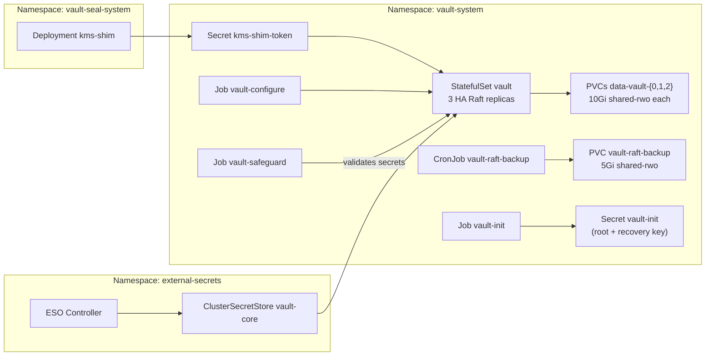

# Introduction

OpenBao (Core Cluster) is the platform's primary secrets store, providing centralized secrets management for all components. It runs a 3-replica HA Raft cluster with **auto-unseal via `kms-shim`** (in-cluster or external).

Selection is controlled by `DeploymentConfig.spec.secrets.rootOfTrust` (`mode=inCluster|external`). Vault reads the auto-unseal token from `Secret/vault-system/kms-shim-token` and (in external mode) the endpoint address from the same Secret.

Implementation note: we currently reuse the HashiCorp Vault Helm chart, but run the OpenBao server image.

All other secrets consumers (ESO, Step CA, Keycloak bootstrap, observability) read from this Vault via the `ClusterSecretStore/vault-core` abstraction.

This component also hosts the external high-assurance PKI mount used by `ClusterIssuer/vault-external` for platform ingress certificates. That path publishes CA Issuers, CRL, and OCSP endpoints from `pki-ext` while Step CA remains the simpler internal/private issuer path.

For open/resolved issues, see [docs/component-issues/vault.md](../../../../../docs/component-issues/vault.md).

---

## Architecture



- **StatefulSet** (`vault`): 3 replicas with Raft storage, transit seal configuration pointing at `kms-shim`, Kubernetes service registration.
- **Auto-unseal**: Patched entrypoint renders `__VAULT_SEAL_ADDR__` + `__VAULT_SEAL_TOKEN__` into the runtime config at startup using `Secret/vault-system/kms-shim-token`.
- **Bootstrap Job** (`vault-init`): Initializes Vault (`vault operator init`), stores root/recovery keys in `vault-init` Secret.
- **Configure Job** (`vault-configure`): Enables Kubernetes auth, creates ESO role/policy, seeds Step CA material, configures JWT auth for CLI automation.
- **Safeguard Job**: Pre-sync gate that fails if secrets are missing/stale.
- **Backup CronJob**: Daily Raft snapshots to backup PVC using root token.

---

## Subfolders

| Path | Purpose |
|------|---------|
| `helm/` | Kustomize-wrapped Helm chart with values, patches (entrypoint, StatefulSet). |
| `bootstrap/` | `vault-init` Job + RBAC to initialize Vault and store secrets. |
| `config/` | `vault-configure` Job, Raft backup CronJob, DestinationRule for K8s API, auth bindings. |
| `safeguard/` | Pre-sync validation Job that fails if secrets are missing or placeholders. |
| `ingress/` | HTTPRoute exposing Vault UI via Istio Gateway with Step CA TLS. |
| `base/` | Shared bases consumed by overlays (`base/helm`, `base/config`). |
| `overlays/mac-orbstack/` | Mac + OrbStack dev overlay (`helm/`, `config/`). |
| `overlays/mac-orbstack-single/` | Single-node Mac dev overlay (`helm/`, `config/`). |
| `overlays/proxmox-talos/` | Proxmox prod overlay (`helm/`, `config/`). |

---

## Container Images / Artefacts

| Artefact | Version | Registry |
|----------|---------|----------|
| Vault Helm chart | `0.31.0` | `https://helm.releases.hashicorp.com` |
| OpenBao image (server) | `2.1.0` | `registry.example.internal/openbao/openbao:2.1.0` |
| Busybox (init container) | `1.36` | `docker.io/library/busybox:1.36` |
| Bootstrap Tools (Jobs) | `1.3` | `registry.example.internal/deploykube/bootstrap-tools:1.4` |

---

## Dependencies

| Dependency | Purpose |
|------------|---------|
| `kms-shim-token` Secret | Auto-unseal token in `vault-system` (and also in `vault-seal-system` when mode=`inCluster`) |
| `secrets-bootstrap` | SOPS-decrypted `vault-init` Secret (wave -6) |
| `shared-rwo` StorageClass | Raft data PVCs + backup PVC |
| `istio-native-exit` ConfigMap | Backup CronJob Istio sidecar exit helper |

---

## Communications With Other Services

### Kubernetes Service → Service Calls

| Caller | Target | Port | Protocol | Purpose |
|--------|--------|------|----------|---------|
| Vault pods | `kms-shim.vault-seal-system.svc` | 8200 | HTTP | KMS shim auto-unseal |
| Vault pods | `kubernetes.default.svc` | 443 | HTTPS | Service registration, token review |
| ESO controller | `vault.vault-system.svc` | 8200 | HTTP | KV secret reads |
| cert-manager controller | `vault.vault-system.svc` | 8200 | HTTP | `ClusterIssuer/vault-external` signing requests |
| cert-manager Vault smoke | `vault.vault-system.svc` | 8200 | HTTP | CRL and OCSP validation against `pki-ext` |
| Backup CronJob | `vault.vault-system.svc` | 8200 | HTTP | Raft snapshot API |
| Configure Job | `vault.vault-system.svc` | 8200 | HTTP | Auth/policy setup |

### External Dependencies (Vault, Keycloak, PowerDNS)

- **Keycloak**: JWT auth mount (`jwt/`) configured with Keycloak OIDC discovery for CLI automation.
- **Step CA**: Configure Job seeds `secret/step-ca/*` material; separate job syncs Keycloak OIDC CA into Vault.

### Mesh-level Concerns (DestinationRules, mTLS Exceptions)

- **DestinationRule** `kubernetes-api`: Disables Istio mTLS for `kubernetes.default.svc.cluster.local` in `vault-system` so Vault can perform K8s auth token reviews.
- **DestinationRule** `kms-shim-istio-mtls`: Disables Istio mTLS for `kms-shim.vault-seal-system.svc.cluster.local` (kms-shim is intentionally out of mesh).
- Vault namespace is Istio-injected; backup CronJob uses native sidecar + `istio-native-exit.sh`.

---

## Initialization / Hydration

1. **SOPS Secrets** (wave -6): `secrets-bootstrap` app decrypts and applies `vault-init` Secret.
2. **Safeguard Job** (wave -1): Validates secrets exist and aren't placeholders.
3. **Helm StatefulSet** (wave 0): Deploys Vault pods; init container waits for the seal token (`kms-shim-token`).
4. **Bootstrap Job** (wave 1): `vault operator init` if uninitialized; stores root/recovery keys.
5. **Configure Job** (wave 1.5): Enables auth methods, creates policies/roles, seeds secrets.

Prerequisites:

| Requirement | Owner |
|-------------|-------|
| Seal provider reachable | `secrets-kms-shim` (mode=`inCluster`) or a deployment-managed external endpoint (mode=`external`) |
| Seal token present | `kms-shim-token` Secret |
| `vault-init` Secret pre-populated | `secrets-bootstrap` app |

---

## Argo CD / Sync Order

| App | Sync Wave | Purpose |
|-----|-----------|---------|
| `secrets-vault-safeguard` | `-1` | Pre-sync validation of secrets |
| `secrets-vault` | `0` | Helm chart (StatefulSet) |
| `secrets-vault-bootstrap` | `1` | Initialize Vault, store secrets |
| `secrets-vault-config` | `1.5` | Configure auth, policies, seed secrets (CronJob finishes JWT auth once Keycloak is Ready) |
| `secrets-vault-ingress` | `2` | HTTPRoute for Vault UI via Gateway |

Pre/PostSync hooks: None (separate Argo apps for ordering).

Sync dependencies:
- `secrets-kms-shim` (wave -5) must be Ready before core Vault.
- `secrets-bootstrap` (wave -6) must apply SOPS secrets.
- ESO config (wave 1.1) syncs after Vault is configured.

---

## Operations (Toils, Runbooks)

### Seed Init Secrets (Fresh Cluster)

```bash
shared/scripts/init-vault-secrets.sh --age-key-file ~/.config/sops/age/keys.txt
# Use --wipe-core-data for clean rebuild
```

### Re-init Core Vault (After PVC Wipe)

```bash
kubectl apply -k components/secrets/vault/bootstrap
kubectl apply -k components/secrets/vault/config
```

### Manual Sync

```bash
kubectl -n argocd patch application secrets-vault \
  --type merge -p '{"operation":{"sync":{"prune":true}}}'
```

### Human Vault CLI login (OIDC)

See: `docs/toils/vault-cli-oidc-login.md`.

### Related Guides

- [shared/scripts/init-vault-secrets.sh](../../../../../../shared/scripts/init-vault-secrets.sh) — canonical bootstrap helper
- [shared/scripts/vault-token.sh](../../../../../../shared/scripts/vault-token.sh) — CLI automation token helper
- [docs/toils/vault-cli-oidc-login.md](../../../../../../docs/toils/vault-cli-oidc-login.md) — human Vault CLI login via OIDC (Keycloak)

---

## Customisation Knobs

| Knob | Location | Default |
|------|----------|---------|
| Replicas | `helm/values.yaml` → `server.ha.replicas` | `3` |
| Storage size | `helm/values.yaml` → `server.dataStorage.size` | `10Gi` |
| Backup schedule | `config/backup.yaml` → `spec.schedule` | `0 2 * * *` (02:00 daily) |
| Backup PVC size | `config/backup.yaml` → PVC spec | `5Gi` |
| Grafana OIDC URL override | `config/overlays/` → env-specific | Varies |

---

## Oddities / Quirks

1. **Seal token selection**: Helm mounts `kms-shim-token`; patched entrypoint uses it to render the transit seal config at startup.
2. **PVC retention policy**: `whenDeleted: Delete` auto-cleans PVCs on StatefulSet deletion.
3. **Kubernetes API mTLS exception**: DestinationRule disables mTLS for `kubernetes.default.svc` so Vault can perform token reviews from Istio-injected pods.
4. **SSA drift**: Expect `OutOfSync` after sync due to server-side apply; cosmetic, tracked in component-issues.
6. **Keycloak JWKS/discovery wait**: `vault-configure` only waits for the JWKS URL when a Keycloak pod is Ready; clean bootstraps skip the wait and the `vault-jwt-config` / `vault-oidc-config` CronJobs converge auth once Keycloak is reachable.
7. **OIDC config drift**: `vault-oidc-config` stores `configSha256` in `ConfigMap/vault-oidc-config-complete` so updates are re-applied (not “one-and-done”).
   - Redirect URIs must be explicit (`allowed_redirect_uris`); wildcards are rejected by Vault.

---

## TLS, Access & Credentials

| Concern | Details |
|---------|---------|
| External TLS | Gateway + Step CA TLS for the UI; API remains internal HTTP |
| Internal TLS | HTTP (`tls_disable = 1`); Istio mTLS for mesh traffic |
| External PKI | `pki-ext` issues platform ingress certs via `ClusterIssuer/vault-external` and publishes CA Issuers, CRL, and OCSP URLs |
| Root token | Stored in `vault-init` Secret; used by backup CronJob and configure Job |
| Recovery key | Stored in `vault-init` Secret (auto-unseal means recovery, not unseal) |
| Seal token | `kms-shim-token` |
| JWT auth | Keycloak OIDC for CLI automation (`vault-cli` client, `vault-automation` group) |
| OIDC auth (humans) | Keycloak OIDC for Vault UI/CLI human login (auth mount `oidc/`, role `default`) |
| Platform authZ (humans) | `CronJob/vault-platform-rbac-config` reconciles platform policies + OIDC group aliases for `dk-platform-admins`, `dk-platform-operators`, `dk-security-ops`, `dk-auditors`, and `dk-iam-admins` |
| Tenant authZ (humans) | `CronJob/vault-tenant-rbac-config` reconciles tenant-scoped policies + OIDC group aliases for `dk-tenant-*` groups from the tenant registry (see `docs/design/multitenancy-secrets-and-vault.md`) |
| Tenant authZ (ESO) | `CronJob/vault-tenant-eso-config` reconciles per-project policies and Kubernetes auth roles (`k8s-tenant-<orgId>-project-<projectId>-eso`) for scoped `ClusterSecretStore/vault-tenant-<orgId>-project-<projectId>` |
| Tenant authZ (Cloud DNS) | `CronJob/vault-tenant-dns-rfc2136-config` also reconciles tenant-scoped Vault policies and Kubernetes auth roles (`k8s-tenant-<orgId>-cloud-dns-eso`) for `ClusterSecretStore/vault-tenant-<orgId>-cloud-dns`, limited to `secret/tenants/<orgId>/sys/dns/rfc2136` |
| Tenant authZ (tenant backups) | `CronJob/vault-tenant-backup-provisioner-role` reconciles per-project policies and Kubernetes auth roles (`k8s-tenant-<orgId>-project-<projectId>-garage-backup-provisioner`) for the platform backup provisioner (`CronJob/garage-tenant-backup-provisioner`) to write `secret/tenants/<orgId>/projects/<projectId>/sys/backup` |

---

## Dev → Prod

| Aspect | mac-orbstack (`overlays/mac-orbstack/helm`) | mac-orbstack-single (`overlays/mac-orbstack-single/helm`) | proxmox-talos (`overlays/proxmox-talos/helm`) |
|--------|-------------------------------------------|----------------------------------------------------------|----------------------------------------------|
| Replicas | 2 | 1 | 3 |
| Storage | `10Gi` | `10Gi` | `10Gi` |
| Overlays | `mac-orbstack/` | `mac-orbstack-single/` | `proxmox-talos/` |

Promotion: Keep shared manifests in `helm/` + `config/`; overlays should only patch env-specific settings.

---

## Smoke Jobs / Test Coverage

### Current State

| Check | Status |
|-------|--------|
| Safeguard Job (`vault-safeguard`) | ✅ Validates required bootstrap secrets exist |
| Bootstrap Job (`vault-init`) | ✅ Initializes and stores root/recovery keys |
| Configure Job (`vault-configure`) | ✅ Sets up auth, policies, seeds secrets |
| Dedicated smoke Job (`openbao-smoke`) | ✅ PostSync health + Raft + KV read (`config/tests`) |

The `openbao-smoke` Job runs as a PostSync hook of the `secrets-vault-config` app (sync wave `2`) and checks:
- `/v1/sys/health` (initialized + unsealed),
- `/v1/sys/storage/raft/configuration` (>= `MIN_VOTERS`),
- KV read of `secret/bootstrap` (`/v1/secret/data/bootstrap`).

Proxmox overlay sets `MIN_VOTERS=3` (`overlays/proxmox-talos/config`).

---

## HA Posture

### Current State

| Aspect | Status |
|--------|--------|
| Replicas | **3** (Raft quorum: 2) |
| Raft storage | ✅ Integrated Raft with `retry_join` |
| Auto-unseal | ✅ KMS shim (`kms-shim`) |
| Leader election | ✅ Automatic via Raft |
| PodDisruptionBudget | ✅ Enabled (`maxUnavailable: 1`) |
| Anti-affinity | ✅ `podAntiAffinity` required across `kubernetes.io/hostname` |
| Topology spread | ❌ Not configured |

### Analysis

With 3 replicas and Raft, Vault can tolerate **1 node failure** while maintaining quorum. Auto-unseal ensures restarted pods come back without manual intervention (kms-shim).

**Gaps:**
1. **No topology spread**: no explicit zone/weight spread constraints.
2. **Seal provider availability**: if the configured seal provider is unavailable during a cold start, new pods cannot unseal.

### Failover Behavior

| Scenario | Behavior |
|----------|----------|
| 1 pod restart | Automatic unseal via configured seal provider; quorum maintained |
| 2 pod failures | Cluster loses quorum; read-only or unavailable |
| Seal provider unavailable | Running pods continue; cold-started pods cannot unseal |
| Leader failure | Automatic re-election (seconds) |

### Recommendations

1. Keep the PDB at `maxUnavailable: 1` to preserve Raft quorum under voluntary disruptions.
2. Treat the seal provider as part of the control plane; avoid maintenance that causes cold starts while it is unavailable.
3. Consider adding `topologySpreadConstraints` if/when clusters become multi-zone.

---

## Security

### Current Controls

| Layer | Control | Status |
|-------|---------|--------|
| Transport (internal) | HTTP (`tls_disable = 1`) | ⚠️ No TLS |
| Transport (external) | Gateway + Step CA TLS | ✅ Implemented (UI only) |
| Mesh mTLS | Istio-injected namespace | ✅ Implemented |
| K8s API exception | DestinationRule disables mTLS to `kubernetes.default.svc` | ✅ Implemented |
| Auth (K8s) | Kubernetes auth method; role per consumer | ✅ Implemented |
| Auth (JWT) | Keycloak-backed for CLI automation | ✅ Implemented |
| Auth (OIDC humans) | Keycloak-backed for Vault UI/CLI human login | ✅ Implemented |
| Secrets storage | Root/recovery in SOPS-encrypted secret | ✅ Implemented |
| NetworkPolicy | Chart NetworkPolicy (`server.networkPolicy.enabled`) | ✅ Implemented |
| Pod security | Hardened chart `securityContext` | ✅ Implemented |

### Gaps

1. **No internal TLS**: OpenBao-to-seal-provider (kms-shim) and OpenBao-to-Raft traffic is HTTP. Istio mTLS covers pod-to-pod, but listener is unencrypted.
   - **Mitigation**: Enable TLS listener with Step CA cert (requires Helm values + secret mount).
2. **Root token in Secret**: Decrypted `vault-init` Secret is in-cluster.
   - **Mitigation**: Acceptable risk for bootstrap; restrict access via RBAC.

### Recommendations

- Add TLS listener once Step CA + cert-manager Jobs are stable.
- Minimize root-token use where feasible (scoped periodic tokens for automation, tighter RBAC, and evidence for access-plane changes).
- Keep the Vault ingress `NetworkPolicy` allowlist minimal; add explicit selectors for new in-cluster consumers (e.g., Garage provisioner jobs). See `platform/gitops/components/secrets/vault/helm/values.yaml`.

---

## Backup and Restore

### Current Implementation

| Aspect | Status |
|--------|--------|
| Raft snapshot CronJob | ✅ `vault-raft-backup` (base: daily at 02:00; prod overlay: hourly, offset from `:00`) |
| Backup PVC | ✅ `vault-raft-backup` (dev: `shared-rwo`; prod: NFS-backed static PV via `storage/backup-system`) |
| Snapshot format | Encrypted Vault raft snapshot `.snap.age` (ciphertext; plaintext is a tar containing `meta.json` + `state.bin`) |
| Retention | CronJob keeps 1 successful + 1 failed history |
| Off-cluster backup | ✅ Prod (Synology NFS via static PV); ❌ Dev (disabled by default) |
| Init secret backup | ❌ In-cluster only (Git has SOPS version) |
| Restore procedure | Manual |

> [!IMPORTANT]
> The backup PVC is annotated with `argocd.argoproj.io/sync-options: Prune=false` to avoid accidental PVC re-creation during refactors (prod uses a static NFS PV with `Retain`; deleting/recreating the PVC can leave the PV in `Released` with a stale `claimRef.uid`, which then blocks binding and can stall downstream Vault-dependent apps).

> [!NOTE]
> In the `mac-orbstack-single` profile, `shared-rwo` uses `WaitForFirstConsumer`. `Job/vault-raft-backup-warmup` mounts the backup PVC once (in the same early Argo sync-wave) so the PV binds during bootstrap and Argo does not stall before creating later Vault config resources.
>
> During **clean bootstrap** (`init-vault-secrets.sh --wipe-core-data --reinit-core`), the core wipe also removes `vault-raft-backup`. The init script now auto-detects a re-created `Pending` backup PVC and runs a one-shot warmup job (`vault-raft-backup-warmup-manual-*`) before continuing, so clean bootstraps do not deadlock on `secrets-vault-config`.

### Backup Verification

The CronJob uses the Istio native sidecar pattern and fetches the raft snapshot via the Vault HTTP API (`/v1/sys/storage/raft/snapshot`) because `vault operator raft snapshot save` is currently failing in this deployment. Snapshots are timestamped in `/backup/vault-core-YYYYMMDD-HHMMSS.snap.age`.

**To verify backups exist:**
```bash
kubectl -n vault-system exec -it $(kubectl -n vault-system get pods -l app.kubernetes.io/name=vault -o jsonpath='{.items[0].metadata.name}') -- ls -la /backup/
```

### Restore Procedure

#### Scenario A: Single Pod Recovery
Raft auto-recovers; pod joins cluster and syncs from leader.

#### Scenario B: Full Cluster Recovery (from snapshot)

1. **Scale down StatefulSet**:
   ```bash
   kubectl -n vault-system scale statefulset vault --replicas=0
   ```

2. **Identify and decrypt the latest snapshot** (decrypt key is out-of-band):
   ```bash
   SNAP="$(kubectl -n vault-system exec -it vault-raft-backup-pod -- ls -t /backup/ | head -1 | tr -d '\r')"
   kubectl -n vault-system cp vault-raft-backup-pod:/backup/"${SNAP}"./vault-core.snap.age
   age -d -i "$AGE_KEY_FILE" -o./vault-core.snap./vault-core.snap.age
   ```

3. **Restore to leader pod** (after scaling up to 1):
   ```bash
   kubectl -n vault-system scale statefulset vault --replicas=1
   kubectl -n vault-system wait --for=condition=ready pod/vault-0 --timeout=120s
   kubectl -n vault-system cp./vault-core.snap vault-0:/tmp/vault-core.snap
   kubectl -n vault-system exec -it vault-0 -- vault operator raft snapshot restore /tmp/vault-core.snap
   ```

4. **Scale to full replicas**:
   ```bash
   kubectl -n vault-system scale statefulset vault --replicas=3
   ```

5. **Verify**:
   ```bash
   kubectl -n vault-system exec -it vault-0 -- vault status
   kubectl -n vault-system exec -it vault-0 -- vault operator raft list-peers
   ```

### Gaps

1. **No off-cluster backup**: If cluster/NFS is lost, snapshots are lost.
   - **Mitigation**: Add CronJob or sidecar to sync snapshots to Garage/S3.
2. **No automated restore test**: No validation that snapshots are restorable.
   - **Mitigation**: Periodic restore-to-staging test.
3. **Init secret not backed up off-cluster**: SOPS version in Git; decrypted version only in-cluster.
   - **Mitigation**: Store second copy in secure location (1Password, HSM).

> [!IMPORTANT]
> Backup/restore gaps tracked in `docs/component-issues/vault.md`.
