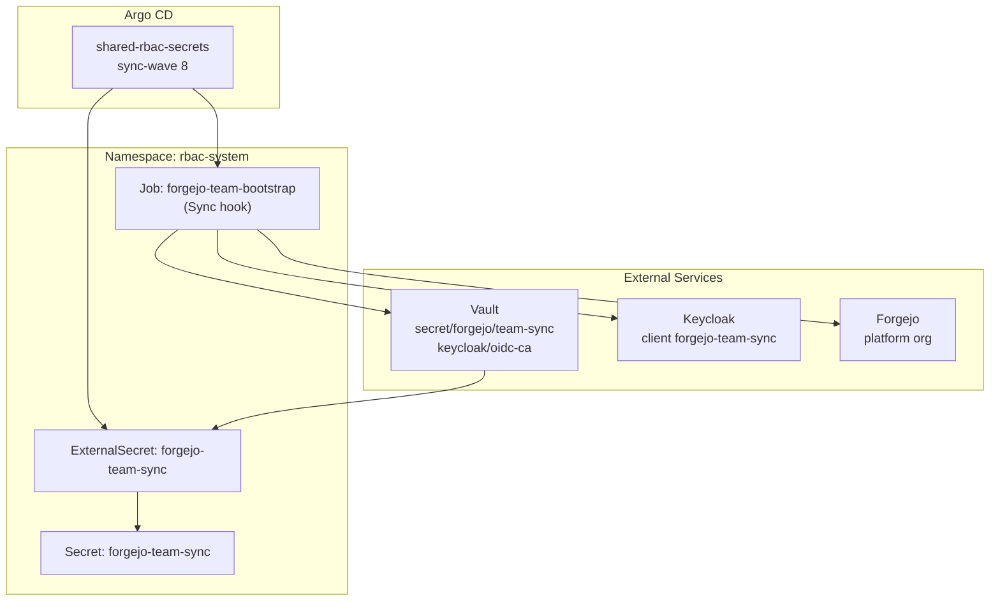

# Introduction

The `shared/rbac-secrets` component owns the secret bootstrap and ExternalSecret wiring for Forgejo team sync:

- `ExternalSecret/forgejo-team-sync` to project Vault credentials + Keycloak CA into `rbac-system`.
- `Job/forgejo-team-bootstrap` (Argo Sync hook) to mint/reconcile the Forgejo PAT and Keycloak client secret and write them back to Vault.

It is split into a dedicated Argo app so it can sync **after** External Secrets Operator is healthy and Step CA bootstrap has published the Keycloak OIDC trust bundle into Vault (avoids bootstrap deadlocks on both mac-orbstack and proxmox).

For open/resolved issues, see [docs/component-issues/shared-rbac-secrets.md](../../../../docs/component-issues/shared-rbac-secrets.md).

---

## Architecture



---

## Subfolders

| Path | Description |
|------|-------------|
| `base/` | ExternalSecret + bootstrap Job manifests |
| `base/forgejo-team-bootstrap/` | Argo Sync hook Job and script for credential reconcile |
| `overlays/mac-orbstack/` | Dev Keycloak URL patch for bootstrap job |
| `overlays/mac-orbstack-single/` | Single-node dev Keycloak URL patch for bootstrap job |
| `overlays/proxmox-talos/` | Prod Keycloak URL patch for bootstrap job |

---

## Container Images / Artefacts

| Artefact | Version | Registry |
|----------|---------|----------|
| Bootstrap tools | `1.4` | `registry.example.internal/deploykube/bootstrap-tools:1.4` |

No Helm charts; all manifests are raw Kustomize resources.

---

## Dependencies

| Dependency | Purpose |
|------------|---------|
| External Secrets Operator | Reconciles `ExternalSecret/forgejo-team-sync` into a Secret |
| Vault | Source of `secret/forgejo/team-sync` and `keycloak/oidc-ca` |
| Keycloak | Creates/reads `forgejo-team-sync` client credentials |
| Forgejo | Creates/validates bot user + PAT |
| Istio | Job uses native sidecar exit helper |

---

## Communications With Other Services

### Kubernetes Service → Service Calls

| Caller | Target | Port | Protocol | Purpose |
|--------|--------|------|----------|---------|
| forgejo-team-bootstrap | `forgejo-https.forgejo.svc.cluster.local` | 443 | HTTPS | Mint PAT, manage bot user |
| forgejo-team-bootstrap | `vault.vault-system.svc` | 8200 | HTTP | Write credentials to Vault |

### External Dependencies (Vault, Keycloak, PowerDNS)

- **Vault**: Kubernetes auth role `forgejo-team-sync` used by the bootstrap job.
- **Keycloak**: Admin credentials from `keycloak-admin-credentials` secret; uses external hostname for TLS and in-cluster connect host for routing.
- **Step CA**: CA bundle sourced from `keycloak/oidc-ca` in Vault and projected into `forgejo-team-sync` Secret.

### Mesh-level Concerns (DestinationRules, mTLS Exceptions)

- Namespace `rbac-system` has `istio-injection: enabled`.
- Bootstrap Job uses `sidecar.istio.io/nativeSidecar: "true"` and `istio-native-exit.sh` to terminate Envoy.
- No DestinationRules or PeerAuthentication overrides; uses mesh defaults (STRICT mTLS).

---

## Initialization / Hydration

1. **ExternalSecret** projects `secret/forgejo/team-sync` and `keycloak/oidc-ca` into `Secret/forgejo-team-sync` in `rbac-system`.
2. **Bootstrap Job** runs as an Argo Sync hook to:
   - Ensure `forgejo-bot` exists and is owner of the `platform` org.
   - Ensure Keycloak client `forgejo-team-sync` exists with service-account credentials.
   - Write credentials to Vault `secret/forgejo/team-sync`.
   - Reconcile Kubernetes `Secret/forgejo-team-sync` with the same data.

The job waits for the CA bundle to appear (up to 5 minutes) so TLS against Keycloak is valid.

---

## Argo CD / Sync Order

| Property | Value |
|----------|-------|
| Argo app name | `shared-rbac-secrets` |
| Sync wave | `8` |
| Pre/PostSync hooks | `argocd.argoproj.io/hook: Sync` on `Job/forgejo-team-bootstrap` |
| Hook delete policy | `HookSucceeded,BeforeHookCreation` |
| Sync dependencies | External Secrets Operator + Vault + Step CA bootstrap (OIDC trust published) + Forgejo + Keycloak must be Healthy first |

---

## Operations (Toils, Runbooks)

### Force Bootstrap Re-run

Set `FORGEJO_TEAM_BOOTSTRAP_FORCE=true` on the Job or delete `ConfigMap/forgejo-team-bootstrap-status` and re-sync the app:

```bash
kubectl -n rbac-system delete configmap forgejo-team-bootstrap-status
argocd app sync shared-rbac-secrets
```

### Credential Rotation

- `FORGEJO_TEAM_BOOTSTRAP_ROTATE_FORGEJO_TOKEN=true`: mint a new Forgejo PAT and prune old tokens.
- `FORGEJO_TEAM_BOOTSTRAP_ROTATE_KEYCLOAK_SECRET=true`: rotate the Keycloak client secret and reconcile it back to Vault/Kubernetes.

### Related Guides

- Bootstrap job details: `platform/gitops/components/shared/rbac-secrets/base/forgejo-team-bootstrap/README.md`

---

## Customisation Knobs

| Knob | Location | Default |
|------|----------|---------|
| Forgejo org | `FORGEJO_ORG` env in bootstrap Job | `platform` |
| Keycloak realm | `KEYCLOAK_REALM` env | `deploykube-admin` |
| Force re-run | `FORGEJO_TEAM_BOOTSTRAP_FORCE` | `false` |
| Rotate Forgejo token | `FORGEJO_TEAM_BOOTSTRAP_ROTATE_FORGEJO_TOKEN` | `false` |
| Rotate Keycloak secret | `FORGEJO_TEAM_BOOTSTRAP_ROTATE_KEYCLOAK_SECRET` | `false` |
| Keycloak base URL | `KEYCLOAK_BASE_URL` env | deployment overlay patch |

---

## Oddities / Quirks

1. **CA wait loop**: the bootstrap Job waits for the Keycloak CA bundle to appear in `forgejo-team-sync` before proceeding.
2. **Connect-host pattern**: Keycloak requests use the external hostname for TLS but resolve to the in-cluster service.
3. **Idempotent by default**: the job reuses existing tokens/secrets unless explicit rotation flags are set.

---

## TLS, Access & Credentials

| Concern | Details |
|---------|---------|
| Keycloak TLS | CA bundle from Vault (`keycloak/oidc-ca.ca_crt`) projected into `forgejo-team-sync` Secret |
| Forgejo TLS | CA bundle loaded from `Secret/forgejo-repo-tls` (`tls.crt`) for HTTPS API calls |
| Vault auth | Kubernetes auth, role `forgejo-team-sync` |
| Forgejo admin | `forgejo-admin` secret (ExternalSecret from Forgejo component) |
| Keycloak admin | `keycloak-admin-credentials` secret |

---

## Dev → Prod

| Aspect | Dev (mac-orbstack) | Prod (proxmox-talos) |
|--------|-------------------|----------------------|
| Keycloak base URL | `https://keycloak.dev.internal.example.com:8443` | patched to `https://keycloak.prod.internal.example.com:8443` |

---

## Smoke Jobs / Test Coverage

The component includes a PostSync smoke gate:

- Manifest: `tests/job-rbac-secrets-smoke.yaml`
- Hook: `PostSync`
- Cleanup: `HookSucceeded,BeforeHookCreation` (re-runs on every sync)

It proves:
1. `ExternalSecret/forgejo-team-sync` is `Ready=True`.
2. `Secret/forgejo-team-sync` exists and the CA bundle is non-empty.
3. Keycloak client credentials can obtain an access token (client credentials grant).
4. Forgejo token can authenticate and read org teams for `${FORGEJO_ORG}`.

Re-run by syncing the Argo app:

```bash
argocd app sync shared-rbac-secrets \
  --grpc-web \
  --server argocd.dev.internal.example.com \
  --server-crt shared/certs/deploykube-root-ca.crt
```

If you need a GitOps-driven re-run without touching the Job spec (e.g. Argo uses `ApplyOutOfSyncOnly=true`), bump the trigger ConfigMap and let Argo reconcile:

- `tests/configmap-smoke-trigger.yaml` → update `data.runId` to a new value and commit (prod: seed Forgejo after commit).

---

## HA Posture

Not assessed in Pass 1.

---

## Security

Not assessed in Pass 1.

---

## Backup and Restore

Not assessed in Pass 1.
