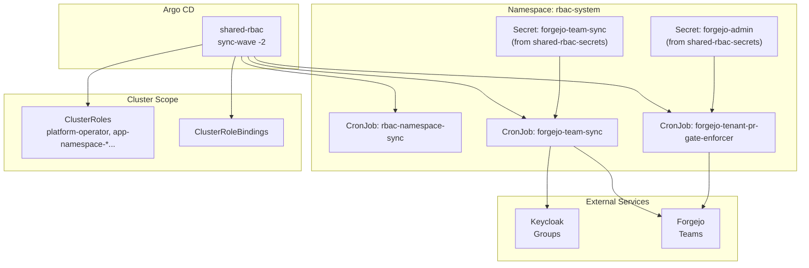

# Introduction

The `shared/rbac` component manages cluster-wide RBAC resources and the ongoing sync jobs that keep Kubernetes and Forgejo aligned with Keycloak groups:

- ClusterRoles/ClusterRoleBindings for platform and app personas.
- `rbac-namespace-sync` CronJob to apply RoleBindings to namespaces labeled with `darksite.cloud/rbac-profile` and the profile-specific labels (`darksite.cloud/rbac-team` for `app`; `darksite.cloud/tenant-id` + `darksite.cloud/project-id` for `tenant`).
  - Scale-safe reconcile: RoleBindings are hash-annotated and unchanged namespaces are skipped (steady-state avoids periodic writes).
- `forgejo-team-sync` CronJob to mirror Keycloak groups into Forgejo teams.
- `forgejo-tenant-pr-gate-enforcer` CronJob to enforce tenant repo PR gates via Forgejo protected branches (required status check `tenant-pr-gates`).

The credentials and ExternalSecret backing `forgejo-team-sync` live in the companion component **`shared/rbac-secrets`**, which is intentionally synced later to avoid ESO webhook ordering issues.

For open/resolved issues, see [docs/component-issues/shared-rbac.md](../../../../docs/component-issues/shared-rbac.md).

---

## Architecture



- `forgejo-team-sync` expects the `forgejo-team-sync` Secret (created by `shared/rbac-secrets`).
- `rbac-namespace-sync` is independent of Forgejo/Keycloak and only requires Kubernetes API access.

---

## Subfolders

| Path | Description |
|------|-------------|
| `base/` | Core manifests: namespace, ClusterRoles/Bindings, CronJobs |
| `base/forgejo-team-sync/` | CronJob + ConfigMap for Keycloak → Forgejo team mirroring |
| `base/forgejo-tenant-pr-gate-enforcer/` | CronJob + ConfigMap to enforce tenant PR gates via Forgejo protected branches |
| `base/namespace-sync/` | CronJob that applies RoleBindings to labeled namespaces |
| `overlays/mac-orbstack/` | Dev Keycloak URL patch for team sync |
| `overlays/mac-orbstack-single/` | Single-node dev Keycloak URL patch for team sync |
| `overlays/proxmox-talos/` | Prod Keycloak URL patch for team sync |

---

## Container Images / Artefacts

| Artefact | Version | Registry |
|----------|---------|----------|
| Bootstrap tools | `1.4` | `registry.example.internal/deploykube/bootstrap-tools:1.4` |

No Helm charts; all manifests are raw Kustomize resources.

---

## Dependencies

| Dependency | Purpose |
|------------|---------|
| `shared/rbac-secrets` | Provides the `forgejo-team-sync` Secret + CA bundle, and the `forgejo-admin` Secret via ESO |
| Keycloak | Source of truth for group membership |
| Forgejo | Target for team membership sync |
| Istio | mTLS for in-cluster Forgejo calls; native sidecar helper for CronJob |
| `istio-native-exit` ConfigMap | Ensures Istio-injected CronJobs can exit cleanly |

---

## Communications With Other Services

### Kubernetes Service → Service Calls

| Caller | Target | Port | Protocol | Purpose |
|--------|--------|------|----------|---------|
| forgejo-team-sync | `forgejo-https.forgejo.svc.cluster.local` | 443 | HTTPS | Forgejo API for team management |
| forgejo-tenant-pr-gate-enforcer | `forgejo-https.forgejo.svc.cluster.local` | 443 | HTTPS | Forgejo API for tenant repo branch protection |
| forgejo-team-sync | `keycloak.keycloak.svc.cluster.local` | 8443 (TLS) | HTTPS | Keycloak token + group APIs (via SNI override) |

### External Dependencies (Vault, Keycloak, PowerDNS)

- **Keycloak**: CronJob uses external hostname (`keycloak.<env>.internal.example.com:8443`) for TLS SAN matching and `KEYCLOAK_CONNECT_HOST` to resolve the in-cluster service.
- **Vault**: Not accessed directly here; Vault-backed secrets are injected by `shared/rbac-secrets`.

### Mesh-level Concerns (DestinationRules, mTLS Exceptions)

- Namespace `rbac-system` has `istio-injection: enabled`.
- `forgejo-team-sync` uses `sidecar.istio.io/nativeSidecar: "true"` and `holdApplicationUntilProxyStarts`.
- No DestinationRules or PeerAuthentication overrides; uses mesh defaults (STRICT mTLS).

---

## Initialization / Hydration

1. **Namespace** `rbac-system` is created (with `istio-injection: enabled`).
2. **ClusterRoles/Bindings** are applied for platform-wide RBAC.
3. **`forgejo-team-sync` CronJob** is deployed and will **skip** if required secrets are missing.
4. **`forgejo-tenant-pr-gate-enforcer` CronJob** is deployed and will **skip** if required inputs are missing (tenant registry + Forgejo admin secret).
5. **`rbac-namespace-sync` CronJob** begins reconciling RoleBindings for namespaces labeled with `darksite.cloud/rbac-profile`.

Forgejo-related syncs require secrets created by **`shared/rbac-secrets`** (ExternalSecrets backed by Vault).

---

## Argo CD / Sync Order

| Property | Value |
|----------|-------|
| Argo app name | `shared-rbac` |
| Sync wave | `-2` |
| Pre/PostSync hooks | None |
| Sync dependencies | `shared-rbac-secrets` should be Healthy before the team-sync CronJob can succeed |

---

## Operations (Toils, Runbooks)

### Manual Team Sync Test

```bash
kubectl -n rbac-system create job --from=cronjob/forgejo-team-sync forgejo-team-sync-manual
kubectl -n rbac-system logs -f job/forgejo-team-sync-manual
kubectl -n rbac-system get configmap forgejo-team-sync-status -o yaml
```

### Manual Tenant PR Gate Enforcer Run

```bash
kubectl -n rbac-system create job --from=cronjob/forgejo-tenant-pr-gate-enforcer forgejo-tenant-pr-gate-enforcer-manual
kubectl -n rbac-system logs -f job/forgejo-tenant-pr-gate-enforcer-manual
kubectl -n rbac-system get configmap forgejo-tenant-pr-gate-enforcer-status -o yaml
```

### Manual Namespace Sync

```bash
kubectl -n rbac-system create job --from=cronjob/rbac-namespace-sync rbac-namespace-sync-manual
kubectl -n rbac-system logs -f job/rbac-namespace-sync-manual
```

### Namespace RBAC sync mapping

`rbac-namespace-sync` renders RoleBindings from the namespace label contract:

- **Platform namespaces** (`darksite.cloud/rbac-profile=platform`)
  - Creates `RoleBinding/platform-operators` (ClusterRole `platform-operator`) for group `dk-platform-operators`.
  - Creates `RoleBinding/platform-auditors` (ClusterRole `auditor-readonly`) for group `dk-auditors`.
- **App namespaces** (`darksite.cloud/rbac-profile=app`, `darksite.cloud/rbac-team=<team>`)
  - Creates `RoleBinding/app-admins` (ClusterRole `app-namespace-admin`) for group `dk-app-<team>-maintainers`.
  - Creates `RoleBinding/app-editors` (ClusterRole `app-namespace-edit`) for group `dk-app-<team>-contributors`.
  - Creates `RoleBinding/app-viewers` (ClusterRole `app-namespace-view`) for group `dk-auditors`.
- **Tenant namespaces** (`darksite.cloud/rbac-profile=tenant`, `darksite.cloud/tenant-id=<orgId>`, `darksite.cloud/project-id=<projectId>`)
  - Creates `RoleBinding/tenant-admins` (ClusterRole `app-namespace-admin`) for groups:
    - `dk-tenant-<orgId>-admins`
    - `dk-tenant-<orgId>-project-<projectId>-admins`
  - Creates `RoleBinding/tenant-developers` (ClusterRole `app-namespace-edit`) for group `dk-tenant-<orgId>-project-<projectId>-developers`.
  - Creates `RoleBinding/tenant-viewers` (ClusterRole `app-namespace-view`) for groups:
    - `dk-tenant-<orgId>-viewers`
    - `dk-tenant-<orgId>-project-<projectId>-viewers`
  - Creates `RoleBinding/tenant-auditors` (ClusterRole `app-namespace-view`) for group `dk-auditors`.
  - Deletes legacy `RoleBinding/app-{admins,editors,viewers}` if present (drift cleanup from older versions).
- **Backup runner scoping**
  - Creates `RoleBinding/backup-pvc-restic-runner-target` (ClusterRole `backup-pvc-restic-runner-target`) for `ServiceAccount/backup-system/backup-pvc-restic-runner` in:
    - namespaces labeled `darksite.cloud/backup-scope=enabled`
    - platform allow-list namespaces `backup-system` and `step-system`
  - Removes that binding when a namespace is no longer backup-scoped or on the allow-list.

RoleBindings managed by this CronJob are annotated:
- `darksite.cloud/rbac-namespace-sync-managed=true`
- `darksite.cloud/rbac-namespace-sync-hash=<sha256>` (used to skip unchanged resources)

### Bootstrap / Credential Refresh

Forgejo/Keycloak credential bootstrap is owned by `shared/rbac-secrets`. See:
- `platform/gitops/components/shared/rbac-secrets/README.md`
- `platform/gitops/components/shared/rbac-secrets/base/forgejo-team-bootstrap/README.md`

---

## Customisation Knobs

| Knob | Location | Default |
|------|----------|---------|
| Forgejo org | `FORGEJO_ORG` env in forgejo-team-sync | `platform` |
| Keycloak realm | `KEYCLOAK_REALM` env | `deploykube-admin` |
| Team prefix | `TEAM_PREFIX` env | `app-` |
| Team sync schedule | `forgejo-team-sync/cronjob.yaml` | `57 * * * *` (hourly, offset from top-of-hour) |
| Namespace sync schedule | `namespace-sync/cronjob.yaml` | `*/15 * * * *` |
| Namespace labels | `darksite.cloud/rbac-profile` plus profile-specific keys (`darksite.cloud/rbac-team` for `app`, `darksite.cloud/tenant-id` + `darksite.cloud/project-id` for `tenant`) | required for sync |

---

## Oddities / Quirks

1. **Keycloak connect-host pattern**: the CronJob uses the external hostname for TLS SAN matching but resolves it to the in-cluster service via `KEYCLOAK_CONNECT_HOST`.
2. **Secret gating**: `forgejo-team-sync` skips work if the Vault-synced Secret is missing; this avoids hard failures during ESO outages.
3. **Namespace label requirements**: `rbac-namespace-sync` only renders human access RoleBindings for namespaces with `darksite.cloud/rbac-profile`; missing `darksite.cloud/rbac-team` for `app` profiles is logged and skipped.
   - For `tenant` profiles, missing `darksite.cloud/tenant-id` or `darksite.cloud/project-id` is logged and skipped.
   - Unknown `darksite.cloud/rbac-profile` values are logged and skipped (never treated as `app`).
   - Backup runner RoleBindings are reconciled separately from `darksite.cloud/backup-scope=enabled` and the static platform allow-list (`backup-system`, `step-system`).
4. **Scale-safe reconcile**: unchanged RoleBindings are skipped; on first run after upgrading to a hash-aware script, namespaces will reconcile once to add the hash annotations.

---

## TLS, Access & Credentials

| Concern | Details |
|---------|---------|
| Keycloak TLS | CA bundle provided via `forgejo-team-sync` Secret (from `shared/rbac-secrets`) mounted at `/etc/step-ca/ca.crt` |
| Forgejo API | HTTPS via `forgejo-https` service with CA validation from `Secret/forgejo-repo-tls` |
| Vault auth | Not used directly in this component |

---

## Dev → Prod

| Aspect | Dev (mac-orbstack) | Prod (proxmox-talos) |
|--------|-------------------|----------------------|
| Keycloak base URL | `https://keycloak.dev.internal.example.com:8443` | patched to `https://keycloak.prod.internal.example.com:8443` |
| Connect host | `keycloak.keycloak.svc.cluster.local` | same |

---

## Smoke Jobs / Test Coverage

The component includes a PostSync smoke gate:

- Manifest: `tests/job-rbac-smoke.yaml`
- Hook: `PostSync`
- Cleanup: `HookSucceeded,BeforeHookCreation` (re-runs on every sync)

It proves:
1. Expected `ClusterRole`s and `ClusterRoleBinding`s exist.
2. Expected CronJobs exist (`rbac-namespace-sync`, `forgejo-team-sync`).

Credential validity (Keycloak client token + Forgejo PAT) is validated by the companion `shared/rbac-secrets` smoke (`platform/gitops/components/shared/rbac-secrets/tests/`).

Re-run by syncing the Argo app:

```bash
argocd app sync shared-rbac \
  --grpc-web \
  --server argocd.dev.internal.example.com \
  --server-crt shared/certs/deploykube-root-ca.crt
```

---

## HA Posture

The CronJobs are single-run jobs on a schedule; availability depends on the underlying cluster control plane and node health. No additional HA constructs are defined here.

---

## Security

- ServiceAccount `forgejo-team-sync` is scoped to read the Secret and write its status ConfigMap.
- `rbac-namespace-sync` uses cluster-scoped RBAC to create RoleBindings in labeled namespaces; review scope periodically.
- Namespace `rbac-system` is **default-deny** for NetworkPolicy, with an explicit egress allowlist (DNS, Istio control-plane, Keycloak, Forgejo, kube-apiserver via Cilium entity policy).

---

## Backup and Restore

No direct data is stored by this component. ClusterRoles/Bindings and CronJobs are declarative and restored via GitOps. The `forgejo-team-sync` secret is restored by `shared/rbac-secrets` from Vault.
