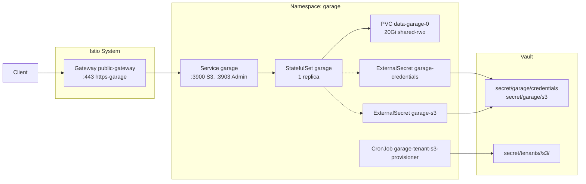

# Introduction

Garage provides a lightweight, in-cluster S3-compatible object storage endpoint for the LGTM observability stack during local/dev runs (OrbStack/kind) and is also deployed to Proxmox-Talos production. It mirrors the client contract planned for prod Ceph RGW: same env vars (`S3_ENDPOINT`, `S3_REGION`, `S3_ACCESS_KEY`, `S3_SECRET_KEY`, bucket names) so workloads can flip endpoints without manifest churn.

Single-node Garage (AGPL) runs with TLS terminated at the Istio public gateway.

For open/resolved issues, see [docs/component-issues/garage.md](../../../../../docs/component-issues/garage.md).

---

## Architecture



- **StatefulSet** (`garage`) with 1 replica, PVC `20Gi` on `shared-rwo`, resources `200m/512Mi` requests and `2Gi` memory limit (proxmox overlay may patch requests/sidecar tuning).
- **Config** rendered at startup via an init container from `ConfigMap/garage-config-template` + secrets projected by ESO (`db_engine=lmdb`, `lmdb_map_size=64G`).
- **Gateway exposure**: `HTTPRoute garage.<env>.internal.example.com` → `Gateway.public-gateway` listener `https-garage`; TLS cert issued by cert-manager via Step CA.
- **Bootstrap Job** (Argo PostSync hook) imports deterministic S3 keys, creates LGTM buckets, and grants read/write permissions.

---

## Subfolders

| Path | Description |
|------|-------------|
| `base/` | Shared manifests (namespace, StatefulSet, Service, ExternalSecrets, bootstrap Job, mesh policy) |
| `overlays/mac-orbstack/` | Dev overlay (OrbStack/kind): ingress hostname + dev-friendly defaults |
| `overlays/mac-orbstack-single/` | Dev overlay (single-node variant): ingress hostname + dev-friendly defaults |
| `overlays/proxmox-talos/` | Prod overlay (Proxmox/Talos): ingress hostname + prod-only patches (e.g. PSA labels, smoke cadence) |

---

## Container Images / Artefacts

| Artefact | Version | Registry |
|----------|---------|----------|
| Garage | `v2.1.0` | `docker.io/dxflrs/garage:v2.1.0` |
| Bootstrap tools (init/Job) | `1.4` | `registry.example.internal/deploykube/bootstrap-tools:1.4` |

---

## Dependencies

| Dependency | Purpose |
|------------|---------|
| `shared-rwo` StorageClass | Backing PVC for Garage data |
| Vault + ESO | Secret projection (`ClusterSecretStore/vault-core`) |
| Istio + Gateway API | Ingress via `public-gateway` and mTLS mesh |
| Step CA / cert-manager | TLS certificate for the HTTPRoute |
| `istio-native-exit` ConfigMap | Enables Istio-injected Jobs to complete cleanly |

---

## Communications With Other Services

### Kubernetes Service → Service Calls

| Caller | Target | Port | Protocol | Purpose |
|--------|--------|------|----------|---------|
| LGTM stack (Loki, Tempo, Mimir) | `garage.garage.svc.cluster.local` | 3900 | HTTP | S3 API for object storage |
| Allowlisted tenant workloads (Tier S) | `garage.garage.svc.cluster.local` | 3900 | HTTP | S3 API for tenant-facing buckets (explicit allowlist only) |
| Bootstrap Job | `garage-0.garage.garage.svc.cluster.local` | 3901 | RPC | Layout and key management |
| Bootstrap Job | `garage.garage.svc.cluster.local` | 3903 | HTTP | Admin API |
| Tenant S3 provisioner CronJob | `garage.garage.svc.cluster.local` | 3903 | HTTP | Provision per-tenant buckets + keys (admin API) |
| Tenant S3 provisioner CronJob | `vault-active.vault-system.svc.cluster.local` | 8200 | HTTP | Write tenant bucket credentials to Vault |

### External Dependencies (Vault, Keycloak, PowerDNS)

- **Vault**: Secrets at `secret/garage/credentials` and `secret/garage/s3` are projected by `ExternalSecret` resources via `ClusterSecretStore/vault-core`.
- **PowerDNS + ExternalDNS**: HTTPRoute hostname (`garage.<env>.internal.example.com`) is expected to resolve to the Istio ingress LB IP.

### Mesh-level Concerns (DestinationRules, mTLS Exceptions)

- **PeerAuthentication** `garage-mtls-permissive`: mTLS mode `PERMISSIVE` in the `garage` namespace (allows mesh and non-mesh clients).
- **DestinationRule** `garage-s3`: enforces `ISTIO_MUTUAL` TLS when calling `garage.garage.svc.cluster.local`.

---

## Initialization / Hydration

1. **Namespace** created with `istio-injection: enabled` and `observability.grafana.com/tenant: platform`.
2. **ExternalSecrets** sync `garage-credentials` and `garage-s3` from Vault.
3. **StatefulSet** starts; init container renders `garage.toml` from template + env secrets; validates `GARAGE_RPC_SECRET` is 64 hex chars.
4. **PostSync bootstrap Job** waits for Garage RPC, assigns single-node layout, imports deterministic S3 key (`lgtm-storage`), creates buckets (`lgtm-logs`, `lgtm-traces`, `lgtm-metrics`, `lgtm-backups`), and grants ACLs.
5. **Tenant S3 provisioner CronJob** (optional primitive; multitenancy M6) periodically:
   - reads tenant S3 intents from `ConfigMap/garage/*` with label `darksite.cloud/tenant-s3-intent=true`,
   - provisions per-tenant buckets + keys via the Garage admin API,
   - writes credentials to Vault under `secret/tenants/<orgId>/s3/<bucketName>`,
   - and (optionally) grants the platform mirror key read access.

Secrets to pre-populate in Vault before first sync:

| Vault Path | Keys |
|------------|------|
| `secret/garage/credentials` | `GARAGE_ADMIN_TOKEN`, `GARAGE_METRICS_TOKEN`, `GARAGE_RPC_SECRET` (64 hex chars) |
| `secret/garage/s3` | `S3_ACCESS_KEY` (GK + 24 hex), `S3_SECRET_KEY` (64 hex), `S3_REGION`, `S3_ENDPOINT`, `BUCKET_LOGS`, `BUCKET_TRACES`, `BUCKET_METRICS`, `BUCKET_BACKUPS` |

---

## Tenant-facing S3 (multitenancy M6)

Garage can optionally expose a **tenant-facing S3 primitive** (Tier S) while keeping the platform buckets and admin surfaces isolated.

Contract boundaries:
- tenant S3 is **explicitly allowlisted** (no broad “all tenants” allow),
- Garage admin/RPC endpoints remain **garage-internal only**,
- tenant credentials live under Vault `secret/tenants/<orgId>/s3/<bucketName>` and are projected into tenant namespaces via **platform-owned** ExternalSecrets (tenants cannot author ESO CRDs).

Repo surfaces (v1):
- Tenant intent objects (Git): `platform/gitops/tenants/<orgId>/projects/<projectId>/namespaces/<env>/configmap-garage-tenant-s3-intent-*.yaml` (ConfigMaps in `garage` namespace).
- Provisioner: `platform/gitops/components/storage/garage/base/cronjob-tenant-s3-provisioner.yaml`.
- Vault role/policy reconciler: `platform/gitops/components/secrets/vault/config/tenant-s3-provisioner-role.yaml`.
- Tenant projection: `platform/gitops/tenants/<orgId>/projects/<projectId>/namespaces/<env>/externalsecret-tenant-s3-*.yaml`.

Runbook: `docs/toils/tenant-s3-primitive.md`.

---

## Tenant backups (multitenancy M7)

Garage also participates in the tenant backup plane by provisioning per-tenant backup buckets + per-project restic credentials (platform-owned).

Contract boundaries:
- backup artifacts are separable per tenant org (`/backup/<deploymentId>/tenants/<orgId>/...`),
- tenant restic repos/passwords are scoped per project under Vault `secret/tenants/<orgId>/projects/<projectId>/sys/backup`,
- the platform mirror key gets **read-only** access to tenant backup buckets for off-cluster mirroring.

Repo surfaces (v1):
- Vault role/policy reconciler: `platform/gitops/components/secrets/vault/config/tenant-backup-provisioner-role.yaml`.
- Provisioner: `platform/gitops/components/storage/garage/base/cronjob-tenant-backup-provisioner.yaml`.
- Tenant projection (example): `platform/gitops/tenants/<orgId>/projects/<projectId>/namespaces/<env>/externalsecret-*-backup.yaml`.
- Backup-plane mirror: `platform/gitops/components/storage/backup-system/base/cronjob-s3-mirror.yaml`.

---

## Argo CD / Sync Order

| Property | Value |
|----------|-------|
| Sync wave | `1` (bootstrap Job) |
| Pre/PostSync hooks | `argocd.argoproj.io/hook: PostSync` on `Job/garage-bootstrap-http` |
| Hook delete policy | `HookSucceeded` (Job deleted on success; logs retained 10 min via TTL) |
| Sync dependencies | Storage classes and Vault/ESO must be healthy; LGTM consumers sync after this app |

---

## Operations (Toils, Runbooks)

### Smoke Test (inside cluster)

```bash
AWS_ACCESS_KEY_ID=$(kubectl -n garage get secret garage-s3 -o jsonpath='{.data.S3_ACCESS_KEY}' | base64 -d)
AWS_SECRET_ACCESS_KEY=$(kubectl -n garage get secret garage-s3 -o jsonpath='{.data.S3_SECRET_KEY}' | base64 -d)
AWS_DEFAULT_REGION=us-east-1 aws --endpoint-url https://garage.<env>.internal.example.com s3 ls
```

### Credential Rotation

1. Update Vault paths (`vault kv put secret/garage/credentials...` and `secret/garage/s3...`).
2. Force ESO sync or delete the ExternalSecret target secrets.
3. Restart the StatefulSet or delete the bootstrap Job pod to re-import keys and ACLs.

### Related Guides

- Tenant-facing S3 primitive (ordering + troubleshooting): `docs/toils/tenant-s3-primitive.md`
- Tenant backups (ordering + troubleshooting): `docs/toils/tenant-backups.md`

---

## Customisation Knobs

| Knob | Location | Default |
|------|----------|---------|
| Storage size | `statefulset.yaml` VCT | `20Gi` |
| Resource requests/limits | `statefulset.yaml` | `200m/256Mi` req, `500m/1Gi` limits |
| S3 region | Vault `secret/garage/s3.S3_REGION` | `us-east-1` |
| Bucket names | Vault `secret/garage/s3.BUCKET_*` | `lgtm-logs`, `lgtm-traces`, `lgtm-metrics`, `lgtm-backups` |
| Hostname | `httproute.yaml` `.spec.hostnames` | controller-owned (patched from DeploymentConfig; base is a placeholder) |

Validate cutover:

```bash./tests/scripts/validate-ingress-adjacent-controller-cutover.sh
```

---

## Oddities / Quirks

1. **Garage key format**: Access key must be `GK` + 24 hex chars; secret key must be 64 hex chars. The bootstrap job has fallback derivation logic for legacy AWS-style values, but Vault should store the native format.
2. **Istio Job completion**: The bootstrap Job uses the `istio-native-exit.sh` helper to call `quitquitquit` on exit so the Job can reach `Complete` instead of hanging on the sidecar.
3. **PeerAuthentication PERMISSIVE**: Required because clients outside the mesh (e.g., external CLI) may hit the gateway; internal traffic still uses mTLS via the DestinationRule.

---

## TLS, Access & Credentials

| Concern | Details |
|---------|---------|
| External TLS | Terminated at `Gateway/public-gateway`; cert issued by Step CA via cert-manager |
| Internal TLS | Istio mTLS (`ISTIO_MUTUAL` via DestinationRule) |
| Auth | S3 HMAC signature using `S3_ACCESS_KEY` / `S3_SECRET_KEY` |
| Admin API | Protected by `GARAGE_ADMIN_TOKEN` (not exposed externally) |
| Step CA root | Trust `shared/certs/deploykube-root-ca.crt` on clients outside the cluster |

---

## Dev → Prod

| Aspect | Dev (`overlays/mac-orbstack*`) | Prod (`overlays/proxmox-talos/`) |
|--------|------------|----------------------------------|
| Hostname | `garage.dev.internal.example.com` | `garage.prod.internal.example.com` |
| Vault paths | Same (`secret/garage/*`) – each cluster has its own Vault | Same |
| Replicas | 1 | 1 (single-node; HA not yet implemented) |

---

## Smoke Jobs / Test Coverage

### Automated smokes

- `CronJob/storage-smoke-s3-latency` (namespace: `garage`) runs inside the mesh (native sidecar pattern) and measures p50/p95/p99/max for `HEAD`/`GET`/`PUT`/`LIST` against `S3_ENDPOINT` (bucket: `BUCKET_BACKUPS`).
- Schedules: dev `*/10 * * * *`, prod `*/15 * * * *` (see `docs/design/storage-single-node.md` for locked v1 thresholds).

### Run manually

```bash
kubectl -n garage create job --from=cronjob/storage-smoke-s3-latency storage-smoke-s3-latency-manual
kubectl -n garage wait --for=condition=complete job/storage-smoke-s3-latency-manual --timeout=10m
kubectl -n garage logs job/storage-smoke-s3-latency-manual
```

---

## HA Posture

### Current State

| Aspect | Status |
|--------|--------|
| Replicas | **1** (single-node) |
| PodDisruptionBudget | **Not present** |
| Anti-affinity / Topology Spread | **Not configured** |
| Garage replication factor | `1` (set in `garage.toml.tpl`) |
| Failure domain | Single PVC on `shared-rwo`; node loss = data unavailable until restored |

### Analysis

Garage is explicitly deployed as a **dev/lightweight alternative** to Ceph RGW. Single-node is acceptable for dev but production workloads (Mimir, Loki, Tempo on Proxmox) require:

1. **Multi-node Garage cluster** with `replication_factor >= 2`.
2. **PDB** to ensure at least one replica during voluntary disruptions.
3. **Anti-affinity** to spread replicas across failure domains.

### Recommendation

For now, document that Garage is **non-HA** and LGTM data stored here is **ephemeral/reconstructible**. If Garage becomes production-critical, add PDB + anti-affinity and scale to 3 nodes with replication factor 2+.

---

## Security

### Current Controls

| Layer | Control | Status |
|-------|---------|--------|
| Transport (external) | TLS at Istio Gateway (Step CA cert) | ✅ Implemented |
| Transport (mesh) | Istio mTLS (`ISTIO_MUTUAL` DestinationRule) | ✅ Implemented |
| PeerAuthentication | `PERMISSIVE` (allows non-mesh clients via gateway) | ✅ Intentional |
| Auth (S3 API) | HMAC signature (`S3_ACCESS_KEY` / `S3_SECRET_KEY`) | ✅ Implemented |
| Auth (Admin API) | Bearer token (`GARAGE_ADMIN_TOKEN`) | ✅ Implemented; not exposed externally |
| Secrets storage | Vault + ESO; never committed plaintext | ✅ Implemented |
| Pod security | `runAsNonRoot: uid/gid 1000` | ✅ Implemented |
| NetworkPolicy | `NetworkPolicy/garage-ingress` restricts ingress by namespace and port (tenant S3 is identity-keyed allowlist; admin/RPC remain garage-internal) | ✅ Implemented |

### Gaps

1. **Secrets rotation procedure**: Documented but not automated; manual Vault update + ESO resync required.

### Recommendations

- Keep `NetworkPolicy/garage-ingress` allowlist tight:
  - S3 (`:3900`) allowed from `istio-system`, `observability`, `backup-system`, `garage`, and the LGTM namespaces (`loki`, `tempo`, `mimir`).
  - Tenant-facing S3 must be allowlisted per tenant identity (avoid a broad “all tenants” allow).
  - RPC (`:3901`) + admin (`:3903`) allowed only within `garage`.
- Consider read-only file system (`readOnlyRootFilesystem`) with emptyDir for config (already rendered to emptyDir).

---

## Backup and Restore

### Current State

| Aspect | Status |
|--------|--------|
| Garage metadata/PVC snapshot | **Not implemented** (no PV/PVC snapshot pipeline yet) |
| Garage data/PVC snapshot | **Not implemented** (no PV/PVC snapshot pipeline yet) |
| Velero inclusion | **Not assessed** |
| Bucket-level off-cluster copy | **Implemented** via `backup-system` S3 mirror tier (rclone sync to the backup target) |

### Analysis

Garage stores:

1. **Metadata** (`/var/lib/garage/meta/`): LMDB database (`db.lmdb/`) with bucket/key/layout info (historically SQLite, migrated to LMDB).
2. **Data** (`/var/lib/garage/data/`): Object blobs.

For a single-node deployment, the current v1 durability story is:
- **Object-level recovery** via the off-cluster mirror on the backup target.
- No restore of the internal Garage metadata DB; a fresh bootstrap re-creates buckets/keys, and objects are re-uploaded.

For future hardening, consider:

1. **Snapshot the PVC** via Velero or storage-layer snapshots (ZFS on Proxmox).
2. **Garage's native export** (`garage bucket export`) to a secondary location.
3. **Off-cluster replication** (future: Garage-to-Ceph gateway mirror).

### Proposed Backup Strategy

| Tier | Method | Frequency | Retention |
|------|--------|-----------|------------|
| Dev | Not required (best-effort) | — | — |
| Prod (v1) | `backup-system` S3 mirror to the backup target | Hourly | Backup target retention |
| Prod (future) | PV/PVC snapshot (Velero / storage snapshots) | Daily | 7 days |
| Prod (future) | Garage `bucket export` CronJob to external S3 | Weekly | 4 weeks |

### Restore Procedure (Manual)

1. **Recreate Garage**: ensure `storage-garage` is Synced Healthy and the bootstrap Job has created the expected buckets.
2. **Restore objects**: copy objects from the backup target mirror back into the Garage buckets (operator-run, e.g. via `rclone`).
3. **Verify**: run `CronJob/storage-smoke-s3-latency` and confirm LGTM components are Healthy.

> [!IMPORTANT]
> Backup/restore implementation is tracked in `docs/component-issues/garage.md`.
