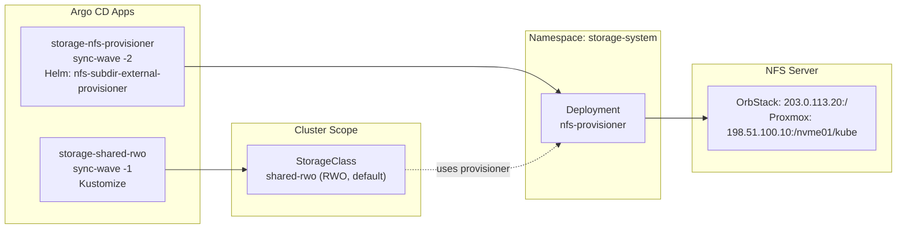

# Introduction

The `shared-rwo-storageclass` component defines the cluster-wide `shared-rwo` StorageClass for the **standard profiles** (NFS-backed). This StorageClass fronts the OrbStack-hosted (dev) or Proxmox-hosted (prod) NFS export managed by the `nfs-subdir-external-provisioner` Helm chart (installed by the separate `storage-nfs-provisioner` Argo CD app).

`shared-rwo` is marked as the **default** StorageClass for workloads requiring ReadWriteOnce semantics (CloudNativePG, single-writer PVCs).

In the single-node storage profile v1 (`mac-orbstack-single`), `shared-rwo` is intentionally backed by the node-local `local-path-provisioner` instead of NFS, and `storage-nfs-provisioner` is not installed (see `docs/design/storage-single-node.md`).

For open/resolved issues, see [docs/component-issues/shared-rwo-storageclass.md](../../../../docs/component-issues/shared-rwo-storageclass.md).

---

## Architecture



- **sync-wave `-2`**: `storage-nfs-provisioner` installs `nfs-subdir-external-provisioner` v4.0.18 Helm chart into `storage-system`, creating the provisioner Deployment (StorageClass creation is disabled via `storageClass.create=false`).
- **sync-wave `-1`**: `storage-shared-rwo` applies this Kustomize component, adding the `shared-rwo` StorageClass that references the same provisioner.
- **`shared-rwo`** is annotated `storageclass.kubernetes.io/is-default-class: "true"` so new PVCs land here unless a workload overrides `storageClassName`.
- Path isolation: each PVC receives its own subdirectory under `/export/rwo/${.PVC.namespace}-${.PVC.name}`.

---

## Default StorageClass Posture (Baseline Contract)

This component is the repo-truth for the **standard profiles** (NFS-backed) default PVC contract.

Invariants:
- Exactly one default StorageClass exists: **`shared-rwo`**.
- `reclaimPolicy: Retain` (PVC deletion does not delete data).

Current posture (standard profiles, NFS-backed):
- `volumeBindingMode: Immediate` (PVC provisions immediately).
- `allowVolumeExpansion: true`.

Single-node profile note:
- The single-node profile (`mac-orbstack-single`) uses `components/storage/local-path-provisioner` to provide `StorageClass/shared-rwo` with `volumeBindingMode: WaitForFirstConsumer` (different backend, different trade-offs). See `platform/gitops/components/storage/local-path-provisioner/README.md`.

---

## Subfolders

| Path | Description |
|------|-------------|
| `./` (base) | Single Kustomize layer applied to all environments |
| `./tests/` | Verification manifests (`shared-rwo-pvc`, writer, reader) used by Stage 0 bootstrap |

No overlays exist; environment-specific NFS server configuration is handled by patching the `storage-nfs-provisioner` Helm values.

---

## Container Images / Artefacts

This component contains only a StorageClass manifest (no pods). The provisioner is installed by the `storage-nfs-provisioner` app:

| Artefact | Version | Registry |
|----------|---------|----------|
| nfs-subdir-external-provisioner chart | `4.0.18` | `kubernetes-sigs.github.io/nfs-subdir-external-provisioner` |
| nfs-subdir-external-provisioner image | (chart default) | `registry.k8s.io/sig-storage/nfs-subdir-external-provisioner` |
| bootstrap-tools image (validation jobs) | `1.4` | `registry.example.internal/deploykube/bootstrap-tools` |

---

## Dependencies

| Dependency | Purpose |
|------------|---------|
| `storage-nfs-provisioner` Argo app | Provides the `nfs-provisioner` Deployment referenced by this StorageClass |
| NFS server | OrbStack container (`203.0.113.20`) or Proxmox host (`198.51.100.10:/nvme01/kube`) |
| Argo CD | Syncs both `storage-nfs-provisioner` and `storage-shared-rwo` apps with correct ordering |

---

## Communications With Other Services

### Kubernetes Service → Service Calls

None. This component installs a StorageClass and runs short-lived validation jobs; it does not create long-running Services.

### External Dependencies (Vault, Keycloak, PowerDNS)

None. The provisioner (in `storage-nfs-provisioner`) connects directly to the NFS server.

### Mesh-level Concerns (DestinationRules, mTLS Exceptions)

Not applicable. NFSv4.1 mounts bypass the service mesh; traffic flows directly between kubelet and the NFS server.

---

## Initialization / Hydration

1. **Stage 0 bootstrap** (host scripts) sets up the NFS export and demotes Kind's built-in `standard` StorageClass.
2. **Argo sync-wave `-2`**: `storage-nfs-provisioner` app installs the provisioner Deployment.
3. **Argo sync-wave `-1`**: `storage-shared-rwo` app applies this component's `shared-rwo` StorageClass via ServerSideApply.
4. **Argo PostSync**: `Job/shared-rwo-postsync-smoke` validates end-to-end PVC provisioning on the default StorageClass.
5. **Workloads** (wave 0+) can now request PVCs with `storageClassName: shared-rwo` or rely on the default.

No secrets or Vault paths are required.

---

## Argo CD / Sync Order

| Property | Value |
|----------|-------|
| Argo app name | `storage-shared-rwo` |
| Sync wave | `-1` |
| Pre/PostSync hooks | PostSync hook `Job/shared-rwo-postsync-smoke` |
| Sync options | `ServerSideApply=true`, `PrunePropagationPolicy=foreground` |
| Sync dependencies | `storage-nfs-provisioner` (wave `-2`) must be healthy first |

---

## Operations (Toils, Runbooks)

### Validation Commands

```bash
# Verify StorageClass exists and is default
kubectl get storageclass shared-rwo -o wide
kubectl get storageclass | grep default

# Test PVC provisioning
cat <<'EOF' | kubectl apply -f -
apiVersion: v1
kind: PersistentVolumeClaim
metadata:
  name: test-rwo
spec:
  accessModes: [ "ReadWriteOnce" ]
  resources:
    requests:
      storage: 1Gi
EOF
kubectl get pvc test-rwo -o jsonpath='{.spec.storageClassName}'
kubectl delete pvc test-rwo
```

### Troubleshooting

- Check provisioner logs: `kubectl -n storage-system logs deploy/nfs-provisioner-nfs-subdir-external-provisioner`
- Check PostSync hook logs: `kubectl -n storage-system logs job/shared-rwo-postsync-smoke --tail=200`
- Verify NFS connectivity from a test pod mounting a `shared-rwo` PVC.
- Ensure only one StorageClass has `is-default-class: "true"`.

### Teardown

Delete workloads that bind `shared-rwo` PVCs before pruning this app. The StorageClass uses `Retain`, so PVs/PVCs linger until manually cleaned up.

### Related Guides

- (No dedicated runbook yet; see Stage 0 bootstrap scripts for NFS setup.)

---

## Customisation Knobs

| Knob | Location | Default |
|------|----------|---------|
| Default class annotation | `storageclass-rwo.yaml` | `"true"` |
| Reclaim policy | `storageclass-rwo.yaml` | `Retain` |
| Volume binding mode | `storageclass-rwo.yaml` | `Immediate` |
| Path pattern | `storageclass-rwo.yaml` `.parameters.pathPattern` | `rwo/${.PVC.namespace}-${.PVC.name}` |
| Mount options | `storageclass-rwo.yaml` `.mountOptions` | NFSv4.1, rsize/wsize 1MB, hard, timeo 600 |
| NFS server address | `storage-nfs-provisioner` Helm values (patched per env) | `203.0.113.20` (OrbStack) / `198.51.100.10` (Proxmox) |

---

## Oddities / Quirks

1. **StorageClass is Git-managed**: The Helm chart (`storage-nfs-provisioner`) installs the provisioner but does not create a StorageClass; this component adds `shared-rwo`.
2. **Dynamic NFS IP (OrbStack)**: The NFS container IP (`203.0.113.20`) is assigned during bootstrap. If it changes, update the Helm values in `storage-nfs-provisioner`; this component will still reference a stale provisioner ID.
3. **`volumeBindingMode: Immediate` (standard profiles)**: PVCs bind before Pods schedule. This may allocate directories even when Pods fail scheduling; manual cleanup may be required.
4. **ServerSideApply**: Used to avoid annotation churn between Argo and kubectl.

---

## TLS, Access & Credentials

| Concern | Details |
|---------|---------|
| Wire encryption | None (NFSv4.1 without Kerberos/TLS) |
| Auth | Host-level NFS exports; no Kubernetes-level auth |
| Secrets | None required |

---

## Dev → Prod

| Aspect | Dev (OrbStack) | Prod (Proxmox) |
|--------|----------------|----------------|
| NFS server | `203.0.113.20:/` | `198.51.100.10:/nvme01/kube` |
| Config location | `storage-nfs-provisioner` Helm values (base) | `storage-nfs-provisioner` Helm values (patch) |
| StorageClass definition | Identical manifest | Identical manifest |

Promotion: The `shared-rwo` StorageClass manifest is environment-agnostic; only the `storage-nfs-provisioner` Helm values differ per environment.

---

## Smoke Jobs / Test Coverage

### Current State

Manual smoke tests are available in `./tests/` and are automatically executed during the Stage 0 bootstrap (`verify_shared_storage` function):

- `tests/shared-rwo-pvc.yaml`: Claims a `shared-rwo` volume.
- `tests/shared-rwo-writer.yaml`: Job that writes a success file to the volume.
- `tests/shared-rwo-reader.yaml`: Job that asserts the file exists.

These can be run manually: `kubectl apply -f tests/`

### PostSync Smoke Job (Sync Gate)

`Job/shared-rwo-postsync-smoke` runs as an Argo CD PostSync hook owned by the `storage-shared-rwo` app. It validates default PVC provisioning end-to-end and is compatible with both `volumeBindingMode: Immediate` and `WaitForFirstConsumer`:

- Creates a PVC **without** `storageClassName` and asserts it lands on `shared-rwo`.
- Runs a writer Job and a reader Job mounting that PVC.
- Prevents PV drift: patches the test PV reclaim policy to `Delete` and waits for PV deletion (because `shared-rwo` uses `Retain` by default).

This turns `storage-shared-rwo` into a sync gate for “default PVC provisioning works”.

> [!NOTE]
> This smoke Job is tracked in `docs/component-issues/shared-rwo-storageclass.md`.

### Data plane IO smoke (latency)

`CronJob/storage-smoke-shared-rwo-io` mounts a small `shared-rwo` PVC and runs a small fsync loop to catch “NFS is alive but slow/wedged” (or local disk degradation in single-node profiles) earlier than app failures.

---

## HA Posture

### Current State

| Aspect | Status |
|--------|--------|
| StorageClass | Cluster singleton; managed by Argo CD | ✅ N/A |
| Provisioner (`storage-nfs-provisioner`) | Single-replica Deployment | ⚠️ SPOF |
| NFS server | External host (OrbStack or Proxmox) | ⚠️ SPOF |
| ReclaimPolicy | `Retain` (data preserved on PVC delete) | ✅ |

### Analysis

This component is a **StorageClass manifest only**; HA depends on:

1. **Provisioner Deployment**: Single replica in `storage-system`. Kubernetes restarts it on failure. For prod, consider scaling to 2+ replicas with leader election.
2. **NFS server**: External SPOF. For OrbStack (dev), acceptable. For Proxmox (prod), the NFS export is on ZFS with snapshots; consider HA NFS via Proxmox clustering.

### Recommendation

- Track provisioner HA in `storage-nfs-provisioner` component (separate Helm app).
- Document NFS server HA expectations in infrastructure runbooks.

---

## Security

### Risk Posture (standard profiles)

`shared-rwo` in the standard profiles is intentionally **simple** (NFS-backed), and therefore comes with explicit trade-offs:

- **Single point of failure**: the NFS server (and its underlying storage) is a SPOF for all PVCs provisioned via `shared-rwo`.
- **Unencrypted-by-default**: NFS traffic is not encrypted on the wire by default; treat the storage network as trusted or add an encryption layer.
- **Not a hostile-tenancy boundary**: this is not intended to withstand a malicious tenant with arbitrary network egress; tenant reachability is handled as a separate guardrail (see `docs/design/multitenancy-storage.md`).

Mitigations (v1 posture):
- Keep the NFS server on a trusted/private network segment; restrict inbound access at the network layer.
- Prevent tenant namespaces from “opening egress” to backend endpoint IPs via `NetworkPolicy ipBlock` (Kyverno guardrail).

Exit ramp:
- Move the default PVC contract (`shared-rwo`) to an encrypted/replicated backend (Ceph RBD or similar) when multi-node HA storage is adopted.

### Current Controls

| Layer | Control | Status |
|-------|---------|--------|
| NFS transport | NFSv4.1 (unencrypted) | ⚠️ No TLS |
| NFS auth | Host-based export rules | ⚠️ Implicit trust |
| StorageClass RBAC | Default Kubernetes: any PVC-creating workload can use | ✅ Standard |
| Path isolation | `pathPattern: rwo/${.PVC.namespace}-${.PVC.name}` | ✅ Namespace-scoped |

### Gaps

1. **No NFS encryption**: Traffic between kubelet and NFS server is unencrypted. Mitigation: use NFS over WireGuard or enable Kerberos/TLS (not implemented).
2. **No access restriction**: Any workload can provision PVCs. This is standard Kubernetes behavior; restrict via `ResourceQuota` or admission policies if needed.

### Recommendations

- For production, evaluate NFS-over-WireGuard or switch to encrypted storage (Ceph RBD, Longhorn).
- Path isolation prevents cross-tenant data leakage within NFS.

---

## Backup and Restore

### Current State

| Aspect | Status |
|--------|--------|
| StorageClass manifest | GitOps-managed (Argo CD) | ✅ No backup needed |
| Provisioner state | Stateless Deployment | ✅ No backup needed |
| PVC data | Stored on NFS server | ⚠️ Depends on NFS backup |

### Analysis

The **StorageClass is declarative** and requires no backup. PVC data resides on the NFS server:

- **OrbStack (dev)**: NFS container uses ephemeral storage; no backup.
- **Proxmox (prod)**: NFS export on `/nvme01/kube` (ZFS). Backup via ZFS snapshots.

### Restore Procedure

**Manifest restore** (rare; Argo handles):
1. `argocd app sync storage-shared-rwo`

**PVC data restore** (from NFS backup):
1. Restore ZFS snapshot or rsync backup to `/nvme01/kube/rwo/<ns>-<name>/`.
2. PVCs and PVs retain references; data available immediately.

### Recommendation

- Track NFS/ZFS backup strategy in infrastructure docs.
- `reclaimPolicy: Retain` ensures PV directories persist even if PVCs are deleted.
